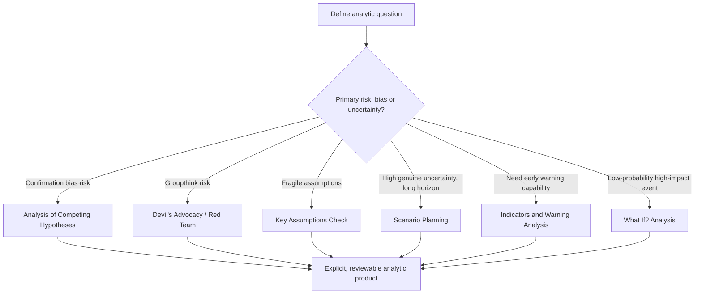

## Structured Analytic Techniques for Risk Assessment

### Conceptual Definition

Structured Analytic Techniques (SATs) are formalized procedures designed to make analytic reasoning explicit, systematic, and open to scrutiny, in contrast to unstructured intuitive judgment. Their primary purpose is to counteract well-documented cognitive biases—confirmation bias, anchoring, groupthink, mirror-imaging—that degrade the quality of expert judgment when reasoning proceeds informally. SATs originated largely within the U.S. intelligence community, formalized in tradecraft standards following intelligence failures such as the 2002 Iraq WMD assessment, and have since been adopted broadly across political risk, corporate intelligence, and strategic forecasting functions.

### Rationale and Theoretical Basis

**Key Points**

- SATs are grounded in behavioral decision theory, particularly the heuristics-and-biases research associated with Daniel Kahneman and Amos Tversky, which demonstrated that expert judgment is systematically subject to predictable errors.
- The core design principle is externalizing reasoning: converting an analyst's internal mental model into an explicit, inspectable structure (a matrix, list, or diagram) that can be challenged by others and revisited as new evidence arrives.

Unstructured analysis relies on an analyst's internal synthesis of evidence into a judgment, a process that is fast but opaque—neither the analyst nor a reviewer can easily identify which evidence drove the conclusion or whether alternative explanations were adequately considered. SATs trade some speed for transparency, reproducibility, and bias resistance.

### Analysis of Competing Hypotheses (ACH)

**Key Points**

- Developed by Richards Heuer at the CIA; the most widely taught and applied SAT in intelligence and risk analysis.
- Requires analysts to identify multiple rival hypotheses (not just the favored one) and systematically test each against available evidence.

**Procedure**

1. Identify all plausible hypotheses that could explain the situation, including ones the analyst does not currently favor
2. List all relevant evidence and arguments
3. Construct a matrix with hypotheses as columns and evidence items as rows, assessing whether each piece of evidence is consistent, inconsistent, or irrelevant to each hypothesis
4. Refine the matrix, removing evidence with no diagnostic value (evidence consistent with all hypotheses does not help discriminate between them)
5. Identify the hypothesis with the *least* inconsistent evidence, rather than the one with the *most* supporting evidence—this inversion is the technique's central insight, since evidence-seeking behavior naturally accumulates confirming evidence for a favored hypothesis while inconsistency is more diagnostic
6. Analyze sensitivity: identify which few pieces of evidence, if wrong, would most change the conclusion
7. Report conclusions with explicit indication of relative likelihood across hypotheses, not just the single "winning" one

**Example**

Assessing whether a foreign government's unusual troop movements indicate (H1) preparation for imminent invasion, (H2) a routine training exercise, or (H3) internal security deployment against domestic unrest, an analyst using ACH would list evidence such as logistics buildup patterns, public statements, historical precedent for each type of activity, and diplomatic signaling, then systematically score each piece against all three hypotheses rather than searching only for evidence confirming an initial hunch of invasion.

**Illustrative Matrix Structure**

| Evidence | H1: Invasion Prep | H2: Training Exercise | H3: Internal Security |
| --- | --- | --- | --- |
| Fuel/ammunition stockpiling | Consistent | Inconsistent | Consistent |
| Advance public announcement | Inconsistent | Consistent | Inconsistent |
| Border-adjacent deployment | Consistent | Inconsistent | Inconsistent |
| Reservist call-up scale | Consistent | Inconsistent | Consistent |

### Devil's Advocacy

**Key Points**

- Formally assigns one or more analysts to construct the strongest possible case against the prevailing or consensus judgment.
- Distinct from informal dissent in that it is a designated, expected role rather than an optional or socially costly individual choice.

By institutionalizing dissent as a formal role, Devil's Advocacy reduces the social cost typically associated with challenging a group's consensus view, since the assigned analyst is understood to be performing a structured function rather than expressing genuine personal disagreement. This is particularly valuable in hierarchical organizational cultures where junior analysts may otherwise hesitate to challenge senior judgment.

### Key Assumptions Check

**Key Points**

- Requires analysts to explicitly list the assumptions underlying a judgment before finalizing it, then individually assess each assumption's validity and the consequence if it proves false.
- Distinguishes between assumptions that are well-supported by evidence and those that are merely convenient, historically-based defaults that may no longer hold.

**Example**

A risk assessment forecasting continued political stability might rest on assumptions including "the ruling coalition remains internally cohesive," "the security forces remain loyal to the current government," and "no major economic shock occurs in the forecast window." A Key Assumptions Check would require the analyst to rate each assumption's current confidence level and flag which, if invalidated, would most undermine the overall stability forecast—directing subsequent monitoring effort toward the assumptions most load-bearing for the conclusion.

### Scenario Planning and Alternative Futures Analysis

**Key Points**

- Constructs multiple distinct, internally consistent future trajectories rather than a single point forecast, particularly suited to situations with high genuine uncertainty and limited historical precedent.
- Typically identifies two or more key uncertainties (critical driving variables whose future value is both highly uncertain and highly consequential) and builds a scenario matrix from their combinations.

**Procedure**

1. Identify the focal question and time horizon
2. Identify driving forces (both predetermined trends and genuine uncertainties)
3. Select the two most critical and most uncertain driving forces as scenario axes
4. Construct a 2x2 matrix (or similar structure) generating three to five distinct scenarios
5. Develop each scenario as an internally consistent narrative, not merely a label
6. Identify early indicators (signposts) that would suggest which scenario is materializing
7. Stress-test current strategy or assessment against all scenarios, not just the most likely one

**Example**

A scenario exercise on a country's political trajectory over a five-year horizon might use "degree of elite cohesion" and "trajectory of economic growth" as the two axes, generating scenarios such as "managed transition" (cohesive elites, growth), "authoritarian entrenchment" (cohesive elites, stagnation), "fragmented reform" (fractured elites, growth), and "state fragility" (fractured elites, stagnation)—each requiring a distinct narrative of how political and economic actors would behave.

### Illustrative Diagram: Scenario Matrix Structure

<svg xmlns="http://www.w3.org/2000/svg" viewBox="0 0 500 460">
\<style\>
.lbl { font-family: sans-serif; font-size: 13px; fill: #222; }
.title { font-family: sans-serif; font-size: 15px; fill: #111; font-weight: bold; }
.cell { font-family: sans-serif; font-size: 12px; fill: #333; }
.axis { stroke: #444; stroke-width: 1.5; }
\</style\>
<text x="20" y="24" class="title">Scenario Planning Matrix (svg_diagram)</text>
<line x1="90" y1="380" x2="440" y2="380" class="axis" />
<line x1="90" y1="380" x2="90" y2="60" class="axis" />
<text x="200" y="410" class="lbl">Economic Trajectory: Stagnation to Growth</text>
<text x="30" y="220" class="lbl" transform="rotate(-90 30,220)">Elite Cohesion: Low to High</text>
<line x1="265" y1="60" x2="265" y2="380" stroke="#ccc" stroke-dasharray="3,3" />
<line x1="90" y1="220" x2="440" y2="220" stroke="#ccc" stroke-dasharray="3,3" />
<rect x="90" y="60" width="175" height="160" fill="#f4dede" stroke="#c0392b" />
<text x="105" y="90" class="cell">Authoritarian</text>
<text x="105" y="106" class="cell">Entrenchment</text>
<rect x="265" y="60" width="175" height="160" fill="#dff0d8" stroke="#27ae60" />
<text x="280" y="90" class="cell">Managed</text>
<text x="280" y="106" class="cell">Transition</text>
<rect x="90" y="220" width="175" height="160" fill="#fbe5d6" stroke="#e67e22" />
<text x="105" y="250" class="cell">State</text>
<text x="105" y="266" class="cell">Fragility</text>
<rect x="265" y="220" width="175" height="160" fill="#d6eaf8" stroke="#2980b9" />
<text x="280" y="250" class="cell">Fragmented</text>
<text x="280" y="266" class="cell">Reform</text>
</svg>

### Red Team Analysis

**Key Points**

- Assigns a separate team (rather than an individual, distinguishing it from Devil's Advocacy) to independently assess a situation from an adversary's or competitor's perspective, or to challenge an existing plan's assumptions.
- Widely used in military and security planning, and increasingly in corporate and geopolitical risk contexts to stress-test strategic plans against how a rational adversary might respond.

Red teaming differs from Devil's Advocacy in scope and role: a red team typically constructs a complete alternative analytical product (e.g., "how would this adversary actually respond to our planned action") rather than simply critiquing the existing consensus.

### What If? Analysis

**Key Points**

- Assumes a specific significant event has already occurred and works backward to identify the plausible pathway that could have led to it, rather than forecasting forward from current conditions.
- Useful for surfacing low-probability, high-impact scenarios that forward-looking analysis might underweight because no single step in the causal chain appears highly likely in isolation.

**Example**

A "What If?" exercise might posit "assume a major currency crisis has occurred in Country X within 18 months" and work backward to identify the combination of triggering events (capital flight, a specific external shock, policy missteps) that could plausibly produce that outcome, surfacing warning indicators that a purely forward-looking probabilistic model might assign very low weight.

### Indicators and Warning Analysis (Indications and Warning / I&W)

**Key Points**

- Establishes in advance a specific, observable set of indicators associated with a hypothesized negative outcome (e.g., coup, civil conflict onset, currency crisis), enabling systematic monitoring rather than post-hoc pattern recognition after the event has begun.
- Distinguishes between indicators (observable, monitorable data points) and the underlying hypothesis they are meant to signal.

**Example**

An indications and warning framework for coup risk might specify indicators such as unusual troop movements near the capital, abrupt changes in senior military personnel, restrictions on communications infrastructure, and unscheduled meetings among key military and political figures—each individually monitorable and collectively providing an early-warning framework structured before a crisis unfolds, rather than assessed reactively.

### Argument Mapping and Structured Debate

**Key Points**

- Visually or textually decomposes an argument into its constituent claims, supporting evidence, and logical connections, making the structure of reasoning explicit and identifying weak links.
- Facilitates identification of where an argument rests on a single fragile piece of evidence versus multiple independent, mutually reinforcing sources.

### Illustrative Diagram: SAT Selection Logic

### Comparative Table

| Technique | Primary Bias Addressed | Output Form | Typical Use Case |
| --- | --- | --- | --- |
| Analysis of Competing Hypotheses | Confirmation bias, premature closure | Evidence-hypothesis matrix | Ambiguous situations with multiple plausible explanations |
| Devil's Advocacy | Groupthink | Formal dissenting case | Challenging strong internal consensus |
| Key Assumptions Check | Unexamined premises | Assumption list with confidence ratings | Validating the foundation of an existing judgment |
| Scenario Planning | Overconfidence in single forecast | Multiple narrative scenarios | Long-horizon, high-uncertainty forecasting |
| Red Team Analysis | Mirror-imaging, self-referential planning | Independent adversarial assessment | Stress-testing strategic plans |
| What If? Analysis | Underweighting low-probability events | Backward-constructed causal pathway | Surfacing tail-risk scenarios |
| Indicators and Warning | Reactive (post-hoc) analysis | Pre-defined monitorable indicator set | Early-warning systems for specific negative outcomes |

### Implementation Considerations

**Organizational Requirements**

SATs require institutional buy-in and time investment; they are generally more resource-intensive than unstructured judgment, and their value is highest for consequential, ambiguous, or high-stakes assessments rather than routine or low-stakes monitoring where the overhead may not be justified.

**Combining Multiple Techniques**

SATs are frequently used in combination rather than isolation—for instance, conducting a Key Assumptions Check before beginning an Analysis of Competing Hypotheses, or using Scenario Planning to generate hypotheses that are then evaluated via ACH-style evidence matrices.

**Limitations of SATs**

- SATs mitigate but do not eliminate cognitive bias; a poorly facilitated ACH exercise can still be dominated by a senior participant's framing of the hypothesis set
- Techniques requiring group participation (Devil's Advocacy, Red Teaming) depend on genuine organizational psychological safety; in practice, formally designated dissent can still be socially discounted if the underlying culture punishes challenge to leadership views
- SATs formalize process but do not substitute for underlying subject-matter expertise or quality evidence; a rigorous matrix built on poor-quality or incomplete evidence will still produce an unreliable conclusion
- Time and resource costs can be substantial, creating pressure to skip or abbreviate steps under operational time constraints, which can undermine the technique's intended rigor

[Inference: Empirical evidence on the degree to which SATs measurably improve forecasting accuracy, as opposed to primarily improving process transparency and defensibility, is more limited than the widespread institutional adoption of these techniques might suggest; much of the supporting literature emphasizes face validity and practitioner endorsement rather than large-scale controlled outcome studies.]

### Related Topics

- Qualitative versus quantitative risk assessment approaches
- Cognitive bias mitigation in intelligence analysis
- Forecasting tournaments and calibration (Good Judgment Project)
- Major political risk indices and their methodologies
- Intelligence tradecraft standards and analytic integrity
- Indicators and warning systems for coup and conflict onset
- Wargaming and simulation-based risk assessment