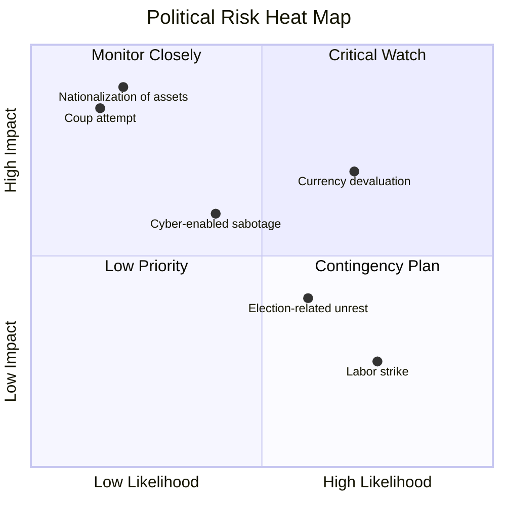

## Probabilistic Risk Scoring and Likelihood-Impact Matrices

### Overview

Probabilistic risk scoring is a quantitative-to-semi-quantitative methodology for converting subjective judgments about political and geopolitical events into comparable, ranked risk values. It combines a **likelihood** dimension (probability an event occurs within a defined time horizon) with an **impact** dimension (magnitude of consequence if it occurs) to produce a composite score usable for prioritization, resource allocation, and comparison across dissimilar risk types (e.g., comparing "coup risk in Country A" against "regulatory nationalization risk in Country B").

The core mathematical relationship underlying most frameworks is:

$$R = L \times I$$

where $R$ is the risk score, $L$ is likelihood (probability or ordinal proxy), and $I$ is impact (severity or ordinal proxy). More sophisticated variants introduce velocity, vulnerability, and detectability as multipliers or additive modifiers.

### Why Political Risk Requires Adapted Scoring

Standard enterprise risk management (ERM) likelihood-impact matrices assume actuarial-quality base rates (e.g., insurance claims data). Political risk analysis rarely has this luxury:

- **Sparse event history**: coups, sovereign defaults, and mass expropriations are low-frequency events, making frequentist probability estimation unreliable.
- **Non-stationarity**: political systems change regime type, leadership, and institutional strength over time, so historical base rates degrade in relevance.
- **Reflexivity**: publication of a risk score can itself alter investor and government behavior, feeding back into the likelihood of the event (e.g., capital flight accelerating a currency crisis).
- **Correlated risks**: political risks cluster (a contested election can simultaneously raise likelihoods of civil unrest, capital controls, and leadership succession crises), violating independence assumptions in naive scoring.

Because of this, most professional frameworks (Political Risk Services/PRS Group, Control Risks, Eurasia Group, Verisk Maplecroft, EIU) use **structured expert elicitation** calibrated against historical base rates rather than pure statistical modeling, producing what is sometimes called "quasi-quantitative" or "semi-quantitative" scoring.

### Likelihood Estimation Approaches

**1. Frequentist / Base-Rate Approach**

Likelihood is estimated from historical event frequency within a reference class.

$$P(E) = \frac{n_{events}}{n_{country\text{-}years}}$$

- **Key Points**
  - Works reasonably for higher-frequency events (currency devaluations, labor strikes, regulatory changes)
  - Fails for rare, high-impact events (coups, wars) due to small-sample noise
  - Reference class selection is itself a judgment call (which countries/periods are "comparable"?) — [Inference: reference class choice materially changes the resulting probability estimate, though the direction and magnitude depend on the specific dataset]

**2. Structured Expert Elicitation (Delphi-style)**

Analysts independently assign probabilities, discuss discrepancies, and iterate toward convergence.

- **Key Points**
  - Common in Eurasia Group and EIU-style outputs
  - Mitigates individual analyst bias through aggregation, but can suffer from groupthink or anchoring if facilitation is weak
  - Often expressed as ordinal bands (e.g., Low/Medium/High/Very High) rather than point probabilities, because analysts are more reliably calibrated on rank-order judgments than exact percentages

**3. Bayesian Updating**

Prior probability is revised as new evidence (intelligence reports, economic indicators, social media signals) arrives.

$$P(E \mid D) = \frac{P(D \mid E) \, P(E)}{P(D)}$$

- **Example**
  - Prior: 10% annual probability of capital controls in Country X (base rate for similar economies under IMF program stress)
  - New evidence $D$: central bank reserves drop 30% in one quarter
  - Likelihood ratio $P(D \mid E)/P(D \mid \neg E)$ estimated from historical reserve-depletion episodes preceding capital controls
  - Posterior probability updated upward, e.g., to 35–40%
  - [Inference: exact posterior values depend on the analyst's chosen likelihood ratios, which are rarely derived from large validated datasets in political risk practice]

**4. Prediction Markets and Forecasting Tournaments**

Aggregating crowd or superforecaster judgments (à la Good Judgment Project methodology) to generate calibrated probabilities for specific, well-defined, time-bound questions.

- **Key Points**
  - Requires questions to be resolvable and unambiguous ("Will Country X hold a national election before March 2027?" rather than "Will Country X be stable?")
  - Superforecaster-calibrated probabilities have demonstrated better Brier scores than average analyst judgment in published tournament results — [Unverified: specific comparative performance figures vary by study and should be checked against the original Good Judgment Project publications for the relevant time period]

### Impact Estimation Approaches

Impact is typically decomposed into sub-dimensions rather than scored as a single monolithic value:

| Impact Dimension | Description | Example Metric |
| --- | --- | --- |
| Financial | Direct monetary loss or value-at-risk | $ revenue at risk, asset impairment |
| Operational | Disruption to business continuity | Days of production halted |
| Reputational | Brand/stakeholder trust damage | Media sentiment shift, ESG rating change |
| Regulatory/Legal | Compliance or contractual exposure | Fines, license revocation risk |
| Personnel/Safety | Risk to staff or personnel | Duty-of-care incident count |
| Strategic | Long-term market access or positioning | Market exit probability |

Composite impact score is often a weighted sum:

$$I = \sum_{i=1}^{n} w_i \cdot s_i$$

where $w_i$ is the stakeholder-assigned weight for dimension $i$ and $s_i$ is the normalized severity score (commonly 1–5) for that dimension.

### The Likelihood-Impact Matrix

The matrix (also called a risk heat map) plots likelihood on one axis and impact on the other, dividing the space into risk tiers (typically Low, Medium, High, Critical/Extreme).

A standard 5x5 ordinal matrix, commonly used by Control Risks-style consultancies and internal corporate risk registers:

<svg xmlns="http://www.w3.org/2000/svg" viewBox="0 0 640 520" font-family="sans-serif">

<text x="320" y="24" text-anchor="middle" font-size="16" font-weight="bold">5x5 Likelihood-Impact Risk Matrix (svg_diagram)</text>

<text x="320" y="500" text-anchor="middle" font-size="13" font-weight="bold">Likelihood →</text>

<text x="20" y="260" text-anchor="middle" font-size="13" font-weight="bold" transform="rotate(-90 20 260)">Impact →</text>

<rect x="100" y="80" width="90" height="70" fill="#ffe08a" stroke="#333" />

<rect x="190" y="80" width="90" height="70" fill="#ffb347" stroke="#333" />

<rect x="280" y="80" width="90" height="70" fill="#ff6b6b" stroke="#333" />

<rect x="370" y="80" width="90" height="70" fill="#d63636" stroke="#333" />

<rect x="460" y="80" width="90" height="70" fill="#a30000" stroke="#333" />

<rect x="100" y="150" width="90" height="70" fill="#c8e6a0" stroke="#333" />

<rect x="190" y="150" width="90" height="70" fill="#ffe08a" stroke="#333" />

<rect x="280" y="150" width="90" height="70" fill="#ffb347" stroke="#333" />

<rect x="370" y="150" width="90" height="70" fill="#ff6b6b" stroke="#333" />

<rect x="460" y="150" width="90" height="70" fill="#d63636" stroke="#333" />

<rect x="100" y="220" width="90" height="70" fill="#9fd97e" stroke="#333" />

<rect x="190" y="220" width="90" height="70" fill="#c8e6a0" stroke="#333" />

<rect x="280" y="220" width="90" height="70" fill="#ffe08a" stroke="#333" />

<rect x="370" y="220" width="90" height="70" fill="#ffb347" stroke="#333" />

<rect x="460" y="220" width="90" height="70" fill="#ff6b6b" stroke="#333" />

<rect x="100" y="290" width="90" height="70" fill="#7bc96f" stroke="#333" />

<rect x="190" y="290" width="90" height="70" fill="#9fd97e" stroke="#333" />

<rect x="280" y="290" width="90" height="70" fill="#c8e6a0" stroke="#333" />

<rect x="370" y="290" width="90" height="70" fill="#ffe08a" stroke="#333" />

<rect x="460" y="290" width="90" height="70" fill="#ffb347" stroke="#333" />

<rect x="100" y="360" width="90" height="70" fill="#5cb85c" stroke="#333" />

<rect x="190" y="360" width="90" height="70" fill="#7bc96f" stroke="#333" />

<rect x="280" y="360" width="90" height="70" fill="#9fd97e" stroke="#333" />

<rect x="370" y="360" width="90" height="70" fill="#c8e6a0" stroke="#333" />

<rect x="460" y="360" width="90" height="70" fill="#ffe08a" stroke="#333" />

<text x="145" y="450" text-anchor="middle" font-size="11">Rare</text>

<text x="235" y="450" text-anchor="middle" font-size="11">Unlikely</text>

<text x="325" y="450" text-anchor="middle" font-size="11">Possible</text>

<text x="415" y="450" text-anchor="middle" font-size="11">Likely</text>

<text x="505" y="450" text-anchor="middle" font-size="11">Almost Certain</text>

<text x="90" y="400" text-anchor="end" font-size="11">Negligible</text>

<text x="90" y="330" text-anchor="end" font-size="11">Minor</text>

<text x="90" y="260" text-anchor="end" font-size="11">Moderate</text>

<text x="90" y="190" text-anchor="end" font-size="11">Major</text>

<text x="90" y="120" text-anchor="end" font-size="11">Severe</text>

<circle cx="235" cy="115" r="7" fill="black" />

<text x="245" y="112" font-size="11" font-weight="bold">Coup risk</text>

<circle cx="415" cy="185" r="7" fill="black" />

<text x="425" y="182" font-size="11" font-weight="bold">FX devaluation</text>

</svg>

### Scaling and Normalization Methods

**Ordinal (1–5) Scales**

Most consultancies avoid false precision by using ordinal bands rather than continuous probabilities. A common conversion table:

| Likelihood Band | Approximate Probability Range | Score |
| --- | --- | --- |
| Rare | <5% | 1 |
| Unlikely | 5–20% | 2 |
| Possible | 20–50% | 3 |
| Likely | 50–80% | 4 |
| Almost Certain | >80% | 5 |

- **Key Points**
  - Ordinal scales prevent misleading pseudo-precision (e.g., claiming "17.3% probability of coup") that the underlying evidence cannot actually support
  - The mapping between qualitative bands and probability ranges should be defined and published in the methodology to enable consistent analyst calibration — inconsistent internal definitions are a common source of inter-analyst disagreement

**Logarithmic Scaling for Impact**

Because political risk impacts can span orders of magnitude (a local strike vs. full nationalization), some frameworks use log-scaled severity:

$$s_i = \log_{10}\left(\frac{\text{loss}_i}{\text{loss}_{min}}\right)$$

This compresses extreme-tail impacts so a single catastrophic outlier does not dominate a linear composite score in a way that obscures moderate but frequent risks.

### Extended Multi-Factor Models

Beyond simple $L \times I$, several established frameworks add dimensions:

**Risk Priority Number (RPN)** — adapted from FMEA (Failure Mode and Effects Analysis):

$$RPN = L \times I \times D$$

where $D$ is **detectability** (inverse of how much early warning is available). Lower detectability increases RPN, reflecting that risks with fewer warning signs deserve higher priority even at identical $L \times I$.

**Velocity-Adjusted Risk Score**

$$R_v = L \times I \times V$$

where $V$ represents **risk velocity** — how quickly the risk could materialize and impact the organization once triggered. A slow-moving regulatory change and a fast-moving coup might have identical $L \times I$ but very different response-time requirements.

**Vulnerability-Weighted Score** (used in frameworks resembling the UNDRR/UNISDR disaster risk model, adapted for political risk):

$$R = L \times I \times Vu$$

where $Vu$ is organizational **vulnerability** or exposure — the same external event (e.g., capital controls) has different impact depending on the firm's hedging position, local partnerships, and supply chain concentration.

### Worked Example: Composite Scoring

**Example**

Scenario: Foreign direct investment in a mid-sized emerging market with upcoming contested elections.

1. Identify risk: "Post-election unrest disrupts port logistics for 4+ weeks"
2. Estimate likelihood via structured elicitation: analysts converge on "Possible" band → $L = 3$ (using 1–5 ordinal scale)
3. Estimate impact across dimensions:
   - Financial: 4 (significant revenue loss)
   - Operational: 5 (full logistics halt)
   - Reputational: 2 (limited external visibility)
   - Weighted impact: $I = 0.4(4) + 0.4(5) + 0.2(2) = 1.6 + 2.0 + 0.4 = 4.0$
4. Compute base score: $R = L \times I = 3 \times 4.0 = 12$ (on a 1–25 scale)
5. Apply velocity adjustment: unrest could materialize within days of election results (high velocity) → $V = 1.3$ multiplier
6. Final adjusted score: $R_v = 12 \times 1.3 = 15.6$ → falls into "High" tier on a defined 20-point threshold banding (e.g., 1–5 Low, 6–12 Medium, 13–19 High, 20–25 Critical)

**Output**

| Risk | L | I | Base R | Velocity Adj. | Final Score | Tier |
| --- | --- | --- | --- | --- | --- | --- |
| Post-election port disruption | 3 | 4.0 | 12 | ×1.3 | 15.6 | High |

### Calibration and Validation

A scoring framework is only as trustworthy as its calibration. Key validation practices:

- **Brier Score**: for frameworks that produce point probabilities on resolvable events, calibration is checked via

  $$BS = \frac{1}{N}\sum_{t=1}^{N}(f_t - o_t)^2$$

   where $f_t$ is forecast probability and $o_t$ is the binary outcome (1 or 0). Lower is better.
- **Calibration curves**: plotting forecast probability bins against observed event frequency; a well-calibrated model's curve tracks the 45-degree line.
- **Backtesting against historical crises**: applying the current methodology retroactively to known events (e.g., 2011 Arab Spring uprisings, 2022 Sri Lanka sovereign default) to check whether the framework would have flagged elevated risk in advance — [Inference: backtesting political risk models is inherently limited by small historical sample sizes and hindsight bias in scenario selection, so strong backtest performance should be interpreted cautiously]

### Common Pitfalls

- **False precision**: presenting ordinal judgment as if it were measured probability (e.g., "23.7% likelihood") lends unwarranted authority to what is fundamentally a structured guess
- **Anchoring bias**: initial analyst estimates unduly influencing group consensus in Delphi-style elicitation
- **Correlation blindness**: treating risks in a portfolio as independent when scoring, then aggregating scores additively — this understates true portfolio risk when underlying risks are correlated (e.g., regional contagion effects)
- **Static matrices in dynamic environments**: failing to re-score frequently enough as conditions evolve; political risk scores can become stale within weeks during fast-moving crises
- **Impact-likelihood conflation**: allowing severity of a risk to unconsciously inflate the likelihood estimate (a known cognitive bias sometimes called "affect heuristic")

### Software and Tooling Patterns

Organizations implementing this at scale typically build or license:

- **Risk registers** (structured databases) with fields for likelihood band, impact sub-scores, owner, review date, and mitigation status
- **Monte Carlo simulation layers** on top of ordinal scores to model portfolio-level risk distributions, sampling from probability distributions fitted to each ordinal band rather than using point estimates
- **Dashboard visualization** (heat maps, trend lines of score movement over time) — commonly built in BI tools (Power BI, Tableau) or custom web dashboards ingesting risk register data via API

**Related Topics**

- Scenario planning and alternative futures analysis in political risk
- Structured Analytic Techniques (SATs): Analysis of Competing Hypotheses (ACH)
- Country risk rating models (PRS Group ICRG, Moody's/S&P sovereign ratings methodology)
- Delphi method and structured expert elicitation techniques
- Monte Carlo simulation for portfolio-level political risk aggregation
- Early warning systems and leading indicators for political instability
- Black swan and tail-risk modeling in geopolitical contexts
- Superforecasting and calibration training (Good Judgment Project methodology)