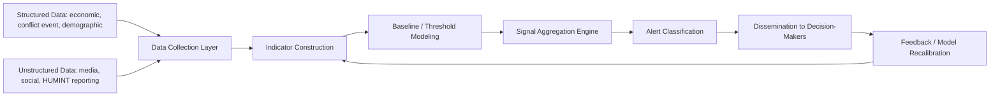
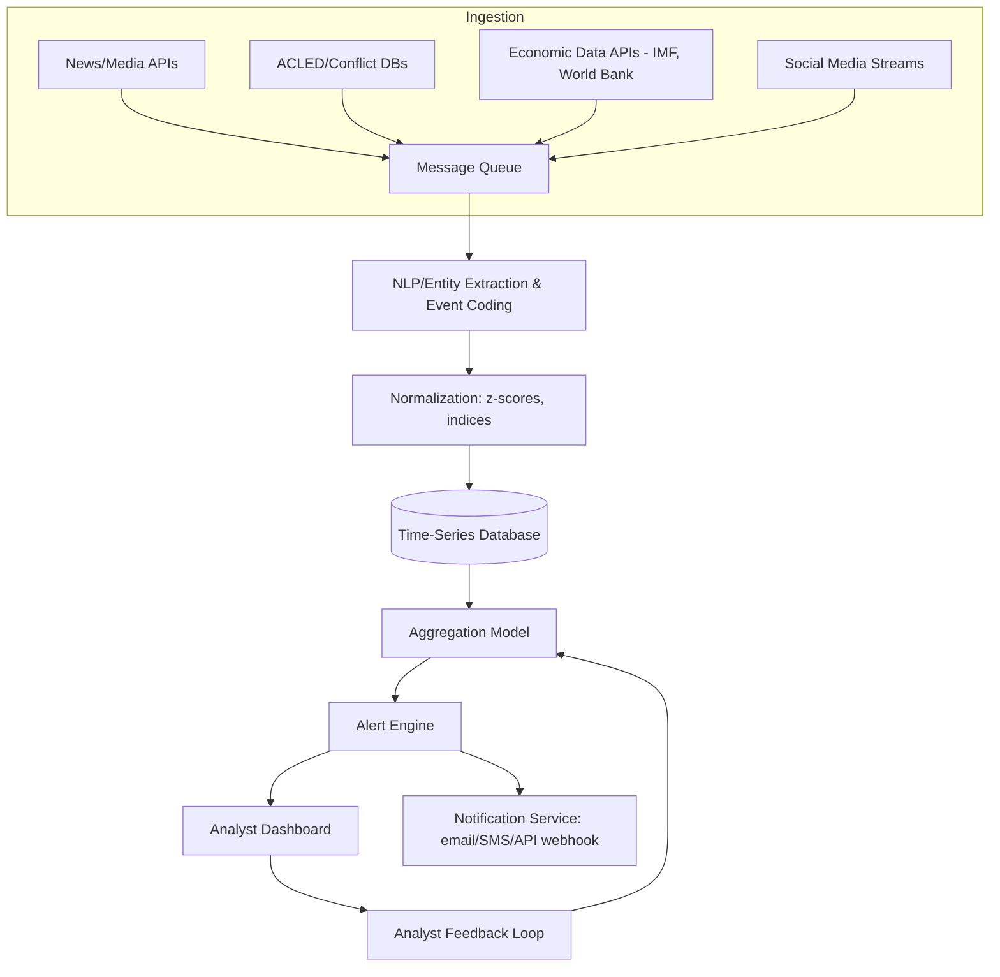

## Early Warning Systems and Indicator-Based Monitoring

### Overview

Early Warning Systems (EWS) for political risk are structured methodologies that continuously track measurable indicators to detect the emergence of instability, conflict, or systemic shocks before they fully materialize. Unlike point-in-time risk scoring, EWS are inherently temporal and iterative: they generate a running signal that updates as new data arrives, with the explicit goal of providing decision-makers enough lead time to act.

The foundational logic follows a signal-detection framework:

$$\text{Signal Strength} = f(\text{Indicator Deviation}, \text{Indicator Weight}, \text{Persistence})$$

An indicator's contribution to overall warning level depends on how far it has deviated from a baseline or threshold, how heavily that indicator is weighted in the model, and how long the deviation has persisted (transient spikes are typically discounted relative to sustained trends).

### Core Components of an EWS Architecture

Every operational EWS, whether academic (e.g., the Political Instability Task Force), institutional (e.g., UN, World Bank Fragility indices), or commercial (Verisk Maplecroft, Dragonfly, Sibylline), shares a common architectural pattern:

- **Key Points**
  - **Data Collection Layer**: ingests structured (economic indicators, election calendars, conflict event databases) and unstructured (news media, social media, field/HUMINT reporting) sources
  - **Indicator Construction**: raw data transformed into standardized, comparable metrics (e.g., converting raw protest counts into a normalized "unrest intensity index")
  - **Baseline/Threshold Modeling**: establishing what "normal" looks like per country/context so deviations are meaningful
  - **Signal Aggregation**: combining multiple indicators into a composite warning score
  - **Alert Classification**: converting aggregate scores into actionable categories (e.g., Green/Yellow/Orange/Red)
  - **Dissemination**: routing alerts to relevant stakeholders with appropriate urgency and format
  - **Feedback loop**: post-hoc accuracy review feeds back into indicator weighting and threshold calibration

### Categories of Leading Indicators

Political risk EWS typically organize indicators into thematic clusters. No single indicator is reliably predictive alone — the discipline relies on triangulating multiple weak signals.

**1. Economic Indicators**

- Inflation rate acceleration, particularly food/fuel price spikes
- Currency reserve depletion rate
- Sovereign bond spread widening (CDS spreads)
- Youth unemployment rate
- Fiscal deficit trajectory relative to GDP

**2. Political/Institutional Indicators**

- Executive approval rating trends
- Legislative gridlock frequency
- Judicial independence erosion (court packing, removal of judges)
- Irregular changes to electoral rules close to election dates
- Elite defection signals (senior officials or military figures publicly breaking with leadership)

**3. Social/Demographic Indicators**

- Protest frequency and geographic spread (tracked via datasets such as ACLED — Armed Conflict Location & Event Data)
- Ethnic/religious tension incidents
- Internal displacement and refugee flow trends
- Urban youth bulge combined with unemployment (structural demographic risk factor)

**4. Security Indicators**

- Security force defections or refusal-to-fire incidents
- Armed group recruitment upticks
- Border incident frequency
- Military spending anomalies relative to historical baseline

**5. Digital/Open-Source Indicators**

- Internet shutdown incidents (tracked by organizations like Access Now's #KeepItOn coalition)
- Social media sentiment volatility and coordinated inauthentic behavior detection
- Search trend anomalies (e.g., spikes in searches for currency exchange, emigration terms)
- Satellite-derived nighttime light data as a proxy for economic activity disruption

### Quantitative Model Types

**1. Logistic Regression / Statistical Models**

Predicts probability of a binary event (coup, civil war onset) using historical indicator data.

$$P(Y=1 \mid X) = \frac{1}{1 + e^{-(\beta_0 + \beta_1 X_1 + \dots + \beta_n X_n)}}$$

- Used historically in academic EWS such as the Political Instability Task Force's coup and state failure models
- **Key Points**
  - Requires substantial historical training data with labeled outcomes, which is scarce for rare events
  - Coefficients ($\beta$) are interpretable, aiding analyst trust and explainability
  - [Inference: performance on genuinely novel political configurations (e.g., a country type not represented in training data) is likely to degrade, though the degree varies by model and cannot be generalized without testing]

**2. Machine Learning Ensemble Models**

Random forests, gradient boosting (XGBoost), and similar ensemble methods are increasingly used for indicator-based forecasting where nonlinear interactions between indicators matter.

- **Key Points**
  - Can capture interaction effects (e.g., inflation only predictive of unrest when combined with low state legitimacy) that linear models miss
  - Reduced interpretability relative to logistic regression, though tools like SHAP (SHapley Additive exPlanations) values are commonly used to partially recover feature-importance explanations
  - Risk of overfitting to historical cases given the low base rate of major political events — cross-validation strategies must account for temporal and cross-country correlation structure, not naive random splitting

**3. Threshold/Trigger-Based Rule Systems**

Simpler, rules-based approach: an alert fires when an indicator crosses a predefined threshold, or when a combination of thresholds are crossed simultaneously.

$$\text{Alert} = \begin{cases} 1 & \text{if } \sum_i w_i \cdot \mathbb{1}[X_i > \tau_i] \geq \theta \\ 0 & \text{otherwise} \end{cases}$$

where $\tau_i$ is the threshold for indicator $i$, $w_i$ its weight, and $\theta$ the overall alert threshold.

- **Example**
  - Indicators: inflation > 15% ($w=0.3$), protest events > 10/month ($w=0.3$), currency depreciation > 20% YoY ($w=0.4$)
  - If inflation and currency depreciation both breach threshold: weighted sum = $0.3 + 0.4 = 0.7$
  - If overall alert threshold $\theta = 0.6$: alert fires (Yellow/Orange tier)
  - **Output**: System generates alert: "Elevated Economic Instability Signal — Country X — 2 of 3 indicators triggered"

**4. Bayesian Network Models**

Represent causal/conditional dependencies between indicators explicitly, allowing probability updates to propagate through the network as new evidence arrives.

- **Key Points**
  - Well-suited to political risk because it naturally encodes expert-informed causal structure (e.g., "currency crisis" node influences "unemployment" node influences "protest" node)
  - Requires significant upfront modeling effort to define the network structure and conditional probability tables
  - Used in some academic conflict-forecasting research and select commercial intelligence platforms

### Established Real-World EWS Examples

- **ACLED (Armed Conflict Location & Event Data Project)**: real-time conflict event data feeding into numerous downstream EWS and academic models; not itself a forecasting model but a foundational data layer
- **Political Instability Task Force (PITF)**, sponsored historically by the U.S. government: statistical models forecasting state failure, coups, and mass killing onset using structural and dynamic indicators
- **FEWS NET (Famine Early Warning Systems Network)**: USAID-funded system focused on food security crises, which frequently correlate with and precede political instability
- **Global Peace Index / Fragile States Index (Fund for Peace)**: composite indices aggregating dozens of indicators annually; lower temporal resolution (annual) makes them better suited to structural risk assessment than tactical early warning
- **ViEWS (Violence Early-Warning System)**, Uppsala University: machine-learning-based system producing monthly probabilistic forecasts of armed conflict at the country and subnational grid-cell level, published with documented methodology and made available for research use — [Unverified: specific current forecast accuracy metrics should be checked against ViEWS's latest published validation reports, as model versions and accuracy figures are updated periodically]

### Alert Classification and Dissemination Design

A well-designed EWS separates **detection** from **communication** — a highly sensitive model that floods analysts with false alarms erodes trust and leads to alert fatigue.

| Tier | Typical Trigger Condition | Recommended Action |
| --- | --- | --- |
| Green (Baseline) | All indicators within normal range | Routine monitoring |
| Yellow (Watch) | 1–2 indicators elevated, no persistence confirmed | Increase monitoring frequency, no distribution beyond core team |
| Orange (Warning) | Multiple indicators elevated with confirmed persistence (e.g., sustained over 2+ reporting cycles) | Notify relevant stakeholders, prepare contingency options |
| Red (Alert) | Composite signal exceeds critical threshold or a confirmed triggering event occurs | Immediate stakeholder notification, activate response/contingency plans |

- **Key Points**
  - Persistence requirements (requiring signal to hold over multiple cycles before escalating tier) are a standard technique to reduce false-positive alert fatigue
  - Alert fatigue is a well-documented failure mode in both political and other domains (e.g., cybersecurity SOC alerting) — over-sensitive systems cause genuine signals to be ignored by the human analysts downstream

### Signal Detection Theory Framework

EWS performance is formally evaluated using signal detection theory, distinguishing four outcomes:

|  | Event Occurred | Event Did Not Occur |
| --- | --- | --- |
| **Alert Issued** | True Positive (Hit) | False Positive (False Alarm) |
| **No Alert Issued** | False Negative (Miss) | True Negative (Correct Rejection) |

Key derived metrics:

$$\text{Sensitivity (Recall)} = \frac{TP}{TP + FN}$$

$$\text{Precision} = \frac{TP}{TP + FP}$$

$$\text{F1} = 2 \cdot \frac{\text{Precision} \times \text{Recall}}{\text{Precision} + \text{Recall}}$$

- **Key Points**
  - Political risk EWS design typically accepts a higher false-positive rate in exchange for higher sensitivity/recall, because the cost of a missed coup or conflict onset (false negative) is usually judged far greater than the cost of an unnecessary alert (false positive) — this is a deliberate policy choice embedded in threshold-setting, not an inherent property of the models themselves
  - The tradeoff is tunable via the Receiver Operating Characteristic (ROC) curve, selecting an operating threshold appropriate to the organization's risk tolerance

### Worked Example: Building an Indicator Dashboard

**Example**

Objective: Monitor pre-election risk in a hypothetical country over a 6-month window.

1. **Select indicators** (5 chosen for tractability):
   - Inflation rate (monthly, from central bank data)
   - Protest event count (weekly, from ACLED-style feed)
   - Opposition media restriction incidents (monthly, from press freedom monitors)
   - Currency black-market premium (weekly, from financial intelligence sources)
   - Security force redeployment announcements (event-based, from open-source reporting)
2. **Establish baselines**: use trailing 24-month average and standard deviation per indicator, per country, to normalize into z-scores:

   $$z_i = \frac{x_i - \mu_i}{\sigma_i}$$
3. **Set weights** via structured elicitation with subject-matter experts (e.g., inflation $w=0.15$, protests $w=0.25$, media restriction $w=0.20$, currency premium $w=0.20$, security redeployment $w=0.20$)
4. **Compute composite weekly score**:

   $$S = \sum_i w_i z_i$$
5. **Define escalation rule**: if $S > 1.5$ for two consecutive weeks → Orange tier; if $S > 2.5$ → Red tier

**Output**

| Week | Inflation z | Protest z | Media z | Currency z | Security z | Composite S | Tier |
| --- | --- | --- | --- | --- | --- | --- | --- |
| T-6 | 0.2 | 0.1 | 0.0 | 0.3 | 0.0 | 0.13 | Green |
| T-4 | 0.5 | 1.2 | 0.8 | 0.9 | 0.4 | 0.79 | Green |
| T-2 | 0.9 | 2.1 | 1.5 | 1.8 | 1.2 | 1.53 | Orange |
| T-0 (election week) | 1.1 | 3.2 | 2.0 | 2.4 | 2.5 | 2.29 | Orange→Red trending |

### Data Pipeline and Technical Implementation Pattern

A production-grade indicator monitoring pipeline typically follows this structure:

- **Key Points**
  - **NLP/Event Coding** stage is critical for unstructured sources: automated event-coding systems (e.g., approaches similar to those used by GDELT — the Global Database of Events, Language, and Tone) extract structured events (actor, action, target, location) from raw news text
  - **Time-series database** choice (e.g., InfluxDB, TimescaleDB) matters for handling irregular-interval political event data alongside regular-interval economic series
  - **Analyst feedback loop** is essential and frequently under-resourced in practice: without a mechanism for human analysts to flag false positives/negatives, model weights and thresholds cannot be recalibrated and will drift out of relevance as political context changes

### Limitations and Known Failure Modes

- **The "boiling frog" problem**: gradual, sustained deterioration can fail to trigger threshold-based alerts if no single reporting period shows a sharp deviation, even though cumulative change is severe
- **Indicator gaming**: once actors know which indicators are monitored, they may take actions to obscure signals (e.g., governments suppressing official inflation statistics)
- **Data lag**: many economic indicators are published with a 1–3 month lag, undermining "early" warning value precisely when conditions are moving fastest
- **Base rate neglect**: rare-event forecasting is inherently prone to poor precision even with reasonably good recall, because the overwhelming majority of country-months do not experience a crisis — this is a structural statistical constraint, not a fixable modeling flaw
- **Overreliance on quantifiable indicators**: some of the most predictive signals (elite cohesion, military loyalty, succession politics) are difficult to quantify and are often underweighted relative to easily measurable economic data simply because they are easier to encode numerically

### Related Topics

- **Next Steps**
  - Structured Analytic Techniques (SATs) and Analysis of Competing Hypotheses (ACH)
  - GDELT and automated event-coding methodologies for unstructured text
  - Bayesian networks for causal political risk modeling
  - Signal detection theory and ROC curve threshold optimization
  - Scenario planning as a complement to indicator-based monitoring
  - Open-source intelligence (OSINT) collection methods for political risk
  - Fragile States Index and Global Peace Index methodology deep-dive
  - Superforecasting and forecast calibration training programs