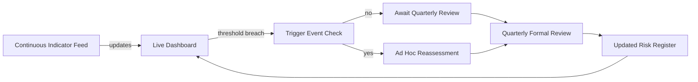
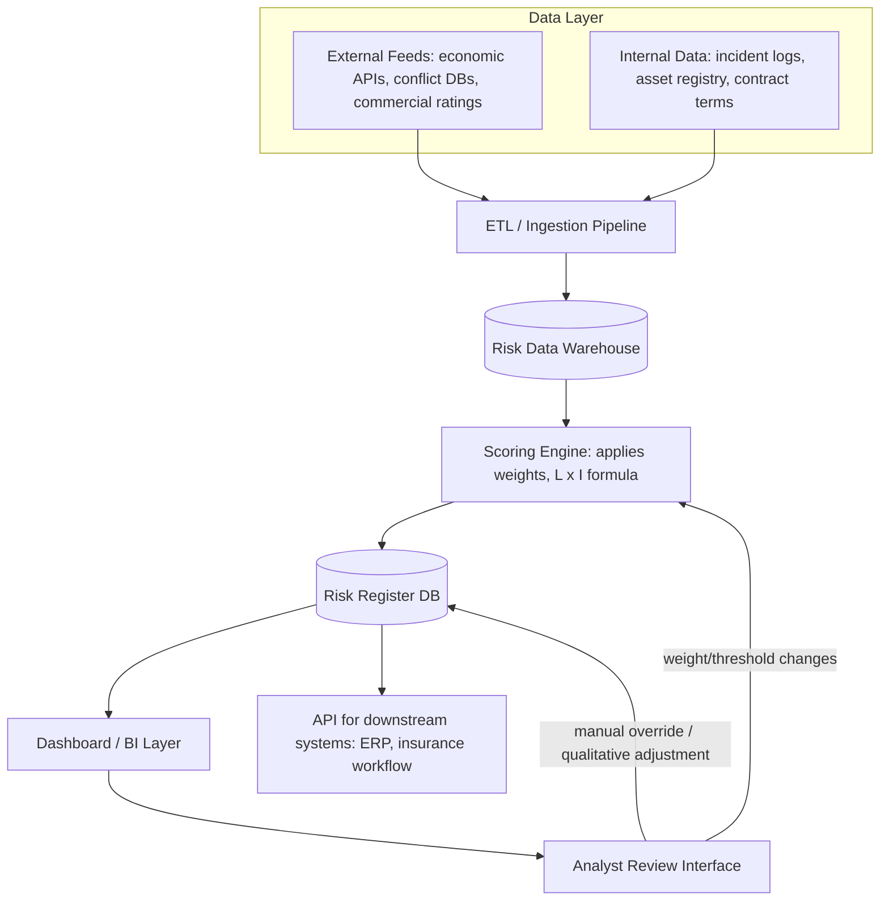

## Building a Custom Geopolitical Risk Framework

### Overview

A custom geopolitical risk framework is an organization-specific system for identifying, scoring, monitoring, and acting on political and geopolitical risks relevant to that organization's particular footprint, assets, and risk tolerance. Off-the-shelf commercial ratings (PRS Group ICRG, Verisk Maplecroft, EIU Risk Briefing) provide standardized, cross-comparable country scores, but they are necessarily generic. A custom framework exists to translate generic country-level risk into **entity-specific, decision-relevant** risk — answering not "how risky is Country X in general" but "how exposed is *this organization's* revenue, personnel, and assets to *this specific set* of political risks."

Building one is fundamentally a systems-design exercise that combines the methodological components covered elsewhere in this chapter (probabilistic scoring, likelihood-impact matrices, early warning indicators) into a coherent, governed, and repeatable process.

### Why Build Custom Rather Than Buy

| Consideration | Off-the-Shelf Rating | Custom Framework |
| --- | --- | --- |
| Speed to deploy | Immediate | Weeks to months |
| Cross-country comparability | High (standardized methodology) | Lower unless deliberately designed for it |
| Relevance to specific assets/operations | Generic | High — tailored to actual exposure |
| Cost | Subscription fee | Internal analyst/data science time |
| Transparency of methodology | Often partially proprietary/black-box | Fully internally auditable |
| Incorporation of proprietary/internal data (supply chain, contracts, local intelligence) | Not possible | Core design feature |

- **Key Points**
  - Most mature risk functions use a **hybrid approach**: commercial country ratings as one input feed, combined with a custom overlay that weights and adjusts for organization-specific exposure
  - A purely custom framework built without external benchmarking risks drifting from defensible, comparable standards — regularly validating custom outputs against established indices helps catch framework drift

### Step 1: Define Scope, Risk Appetite, and Governance

Before any modeling begins, the framework requires an explicit charter:

- **Scope**: which risk categories are in-bounds? (e.g., expropriation, currency inconvertibility, political violence, regulatory change, sanctions exposure, supply chain disruption, personnel safety)
- **Geographic footprint**: current operations, planned expansion markets, and critical supply chain nodes (including tier-2/tier-3 suppliers, which are frequently omitted but often carry outsized risk)
- **Risk appetite statement**: explicit tolerance thresholds set by leadership/board (e.g., "no new investment in markets scoring above X on composite risk index without board-level sign-off")
- **Governance structure**: who owns indicator selection, who approves methodology changes, how often the framework itself is reviewed (distinct from how often risk *scores* are updated)
- **Key Points**
  - Skipping the governance step is a common failure mode: frameworks built purely bottom-up by analysts often lack the institutional authority to influence actual capital allocation decisions
  - Risk appetite should be defined *before* building the scoring model, not derived from it — otherwise there is a temptation to reverse-engineer thresholds to justify decisions already made

### Step 2: Identify Risk Categories and Sub-Risks

Decompose "geopolitical risk" into a structured taxonomy specific to the organization's exposure profile.

```mermaid
flowchart TD
    GR[Geopolitical Risk] --> SOV[Sovereign/Macro Risk]
    GR --> POL[Political Stability Risk]
    GR --> REG[Regulatory/Legal Risk]
    GR --> SEC[Security/Conflict Risk]
    GR --> ECO[Economic Transfer Risk]
    GR --> SOC[Social/Reputational Risk]

    SOV --> SOV1[Sovereign default probability]
    SOV --> SOV2[Sanctions exposure]

    POL --> POL1[Leadership succession risk]
    POL --> POL2[Coup/regime change risk]
    POL --> POL3[Election-related instability]

    REG --> REG1[Expropriation/nationalization]
    REG --> REG2[Regulatory reversal]
    REG --> REG3[Contract sanctity risk]

    SEC --> SEC1[Civil conflict/insurgency]
    SEC --> SEC2[Interstate conflict spillover]
    SEC --> SEC3[Terrorism targeting assets]

    ECO --> ECO1[Currency inconvertibility]
    ECO --> ECO2[Capital control imposition]

    SOC --> SOC1[Labor unrest]
    SOC --> SOC2[Community/NGO opposition]
```

- **Key Points**
  - This taxonomy should map directly to the organization's actual risk exposures — a manufacturing firm with fixed assets weighs expropriation and civil conflict heavily; a portfolio investor weighs sovereign default and capital controls; a professional services firm weighs personnel safety and reputational risk
  - Avoid taxonomy sprawl: each sub-risk category needs at least one measurable indicator and a designated analyst owner, or it becomes an unmaintained checkbox

### Step 3: Select and Weight Indicators

Draw on the indicator categories established in early-warning-system design (economic, political/institutional, social, security, digital/open-source — see prior chapter item), but weight them according to the organization's specific risk taxonomy from Step 2.

**Weighting methodologies:**

**1. Expert-Elicited Weights (Analytic Hierarchy Process — AHP)**

Stakeholders pairwise-compare the relative importance of risk categories, and weights are derived from the resulting comparison matrix's principal eigenvector.

$$A \mathbf{w} = \lambda_{max} \mathbf{w}$$

where $A$ is the pairwise comparison matrix, $\mathbf{w}$ the derived weight vector, and $\lambda_{max}$ the matrix's principal eigenvalue (used also to compute a consistency ratio validating that the comparisons were not contradictory).

- **Key Points**
  - AHP provides a structured, auditable way to convert subjective stakeholder judgment into numeric weights, with a built-in consistency check
  - The consistency ratio (CR) should typically be below 0.10; a higher CR indicates the pairwise judgments were internally contradictory and should be re-elicited

**2. Statistically-Derived Weights**

Where sufficient historical loss/incident data exists internally (e.g., a multinational with decades of incident records across markets), regression-based weighting can estimate each indicator's empirical association with realized losses.

- [Inference: statistically-derived weights are only as good as the internal historical incident dataset; most organizations have insufficient loss events to support robust regression, making this approach viable mainly for large multinationals with long operating histories across many markets]

**3. Hybrid Weighting**

Start with expert-elicited weights, then adjust incrementally as internal validation data (see Step 6) accumulates over successive review cycles.

### Step 4: Design the Scoring Architecture

Combine indicators, weights, and the likelihood-impact structure into a formal scoring pipeline:

$$RiskScore_{country,asset} = \sum_{c=1}^{n} w_c \cdot \left( L_c \times I_{c,asset} \right)$$

where the summation runs over risk categories $c$, $L_c$ is the likelihood of category $c$ materializing in the given country/context, $I_{c,asset}$ is the impact *specific to the asset or business unit in question* (critically, not a generic country-level impact figure), and $w_c$ is the category weight from Step 3.

- **Example**
  - A logistics company has a container port asset in Country Y
  - Category: Civil conflict/insurgency risk, $w_c = 0.25$
  - Country-level likelihood $L_c = 3$ (Possible, per structured elicitation)
  - Asset-specific impact $I_{c,asset} = 5$ (port closure would halt 40% of regional throughput — high because of concentration, not generic country risk)
  - Contribution to composite score: $0.25 \times (3 \times 5) = 3.75$
  - This is repeated and summed across all risk categories to produce the asset's total composite score

**Output structure** (illustrative risk register schema):

| Field | Example |
| --- | --- |
| Asset ID | PORT-Y-001 |
| Country | Country Y |
| Risk Category | Civil conflict/insurgency |
| Likelihood (1–5) | 3 |
| Asset Impact (1–5) | 5 |
| Category Weight | 0.25 |
| Category Contribution | 3.75 |
| Composite Score | 14.2 (sum across all categories) |
| Tier | High |
| Last Reviewed | 2026-08-01 |
| Owner | Regional Risk Analyst |

### Step 5: Build the Monitoring and Update Cadence

A static framework decays in relevance quickly. Define explicit cadences:

- **Continuous/automated**: indicator data feeds (economic data releases, conflict event feeds, news/social monitoring) updating a live dashboard
- **Periodic formal review** (e.g., quarterly): analyst-driven re-scoring incorporating qualitative judgment the automated feed cannot capture
- **Trigger-based ad hoc review**: predefined events (election called, major leadership change, sanctions announcement) that mandate immediate off-cycle reassessment regardless of the regular schedule

### Step 6: Validation and Backtesting

Before relying on the framework for real decisions, and periodically thereafter:

- **Historical backtesting**: apply the framework's methodology retroactively to known past events the organization or industry experienced, checking whether the framework (had it existed then) would have flagged elevated risk with adequate lead time
- **Cross-validation against commercial benchmarks**: compare custom composite scores against established indices (Fragile States Index, PRS ICRG) for overlapping countries — large, unexplained divergences should prompt methodology review, not automatic rejection (the custom framework may legitimately differ due to asset-specific factors, but the divergence should be *understood*, not just present)
- **Post-incident review**: after any realized risk event, formally assess whether the framework flagged it, at what tier, and with what lead time — feed findings back into indicator weights and thresholds
- **Key Points**
  - [Inference: validation quality is fundamentally constrained by the low base rate of major political risk events for any single organization, so statistical confidence in backtested performance will typically remain limited regardless of framework sophistication]
  - A framework that is never revised after validation findings is not actually being validated — the feedback loop must have institutional teeth (i.e., authority to change weights/thresholds)

### Step 7: Integration into Decision Workflows

A risk score with no decision hook attached is an academic exercise. Common integration points:

- **Investment committee gating**: composite score above a defined threshold requires additional committee-level sign-off before capital commitment
- **Insurance and hedging decisions**: political risk insurance (PRI) procurement decisions (e.g., via MIGA, OPIC/DFC, or private insurers) informed directly by category-level scores (particularly expropriation and currency inconvertibility sub-scores)
- **Contractual protections**: risk scores above certain thresholds trigger requirements for specific contract clauses (stabilization clauses, international arbitration provisions, currency hedging requirements)
- **Contingency and business continuity planning**: Orange/Red tier assets receive mandatory contingency plans (evacuation plans, alternate logistics routing, local partnership diversification)
- **Portfolio-level reporting**: aggregated exposure reporting to the board/leadership, often visualized as a heat map across the full asset portfolio

### Reference Architecture: Technical Implementation

For organizations building a data-system-backed (rather than purely spreadsheet-based) framework:

- **Key Points**
  - Separating the **scoring engine** from the **risk register database** allows methodology changes (re-weighting, new indicators) to be applied and audited without disrupting historical record integrity
  - An **analyst override capability** is essential — pure algorithmic scores should generally be treated as a strong prior that a qualified analyst can adjust with documented rationale, not an unquestionable final output, given the inherent limits of quantitative political risk modeling discussed throughout this chapter
  - Behavior of any specific scoring engine implementation may vary based on configuration, data quality, and update frequency — organizations should test their specific pipeline thoroughly before relying on it for high-stakes decisions

### Common Pitfalls in Custom Framework Design

- **Over-engineering before validating basic utility**: building a highly sophisticated statistical model before confirming that a simple weighted-indicator approach even gets adopted into real decisions
- **Indicator overload**: including dozens of indicators "just in case" without clear ownership or updating discipline, leading to stale, unmaintained inputs quietly degrading model quality
- **Ignoring the qualitative layer**: purely quantitative frameworks systematically underweight hard-to-quantify factors like elite cohesion, personalistic leadership risk, and succession dynamics — these often matter more than measurable economic indicators for coup/regime-change-type risks
- **No sunset/review clause on methodology**: frameworks calibrated once and never revisited become progressively less relevant as the political and economic context shifts
- **Conflating framework ownership with risk ownership**: the team that builds/maintains the scoring model should not be the sole approver of what the organization does in response — this creates a conflict of interest and single point of failure

### Related Topics

- **Next Steps**
  - Probabilistic risk scoring and likelihood-impact matrix construction (methodological foundation for Step 4)
  - Early warning systems and indicator-based monitoring (input layer for Step 5)
  - Political risk insurance (PRI) mechanisms: MIGA, DFC, private market providers
  - Analytic Hierarchy Process (AHP) for structured weight elicitation
  - Scenario planning integration with quantitative risk scoring
  - Contractual risk mitigation: stabilization clauses and international arbitration
  - Portfolio-level geopolitical risk aggregation and correlation modeling
  - Board-level risk governance and risk appetite statement design