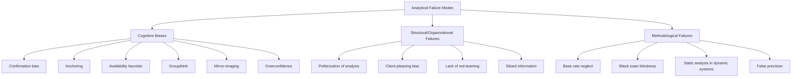
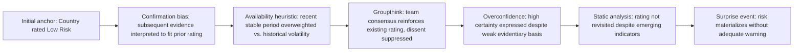

## Common Pitfalls and Biases in Risk Assessment

### Overview

Political risk assessment is performed by human analysts operating under uncertainty, time pressure, and incomplete information — conditions under which cognitive biases exert their strongest and most predictable distorting effects. This item catalogs the recurring analytical failure modes documented in intelligence studies, behavioral economics, and forecasting research, and connects each to concrete mitigation techniques used in professional practice. Many of these biases were formally studied in the intelligence community context by analysts such as Richards Heuer (CIA), whose work on the Analysis of Competing Hypotheses remains foundational.

### Categories of Analytical Failure

Analytical failures in political risk assessment broadly fall into three categories:

### Cognitive Biases

**1. Confirmation Bias**

The tendency to search for, interpret, and recall information that confirms pre-existing beliefs while discounting disconfirming evidence.

- **Example**: An analyst who has assessed a government as "stable" for years continues interpreting rising protest activity as "isolated incidents" rather than updating toward instability, because the stable-government hypothesis has become an anchor for interpreting all subsequent data
- **Mitigation**: Analysis of Competing Hypotheses (ACH) — a structured technique requiring analysts to explicitly list multiple competing hypotheses and systematically evaluate evidence against *all* of them, rather than evaluating evidence only against a single favored hypothesis. Evidence that is equally consistent with multiple hypotheses is diagnostically weak and should be flagged as such, even if it "feels" confirmatory

**2. Anchoring**

Over-reliance on an initial piece of information (an "anchor") when making subsequent judgments, even when that anchor is arbitrary or has been superseded by new information.

- **Example**: An initial coup-risk estimate of "Low" set six months ago continues to weigh on the analyst's current estimate even after several elevated-risk indicators have emerged, because probability adjustments tend to be insufficiently large relative to what the new evidence warrants
- **Mitigation**: Deliberately re-deriving probability estimates from current evidence alone during formal review cycles, rather than starting from "the last score" and adjusting incrementally; blind re-scoring by a second analyst without showing them the prior score, then comparing

**3. Availability Heuristic**

Overweighting the probability of events that are more easily recalled — typically because they are recent, vivid, or heavily covered in media — regardless of actual base rate.

- **Example**: Following extensive media coverage of a coup in one country, analysts may systematically overestimate coup risk in unrelated countries with superficially similar characteristics (e.g., similar GDP per capita or military budget share), a pattern sometimes discussed in forecasting literature as a driver of forecasting error clusters following salient events — [Inference: the specific magnitude of this overestimation effect varies across studies and should not be treated as a fixed, universally applicable correction factor]
- **Mitigation**: Explicit reference-class base rate lookup as a mandatory first step before adjusting probability for country-specific factors, rather than starting from an intuitive "gut" estimate anchored to recent salient events

**4. Groupthink**

Group decision-making dynamics that suppress dissent and prematurely converge on consensus, particularly in cohesive teams under time pressure or facing a dominant senior voice.

- **Key Points**
  - First formally studied by Irving Janis in the context of U.S. foreign policy decision-making failures
  - Symptoms include: illusion of unanimity, self-censorship of doubts, direct pressure on dissenters, and an unquestioned belief in the group's inherent morality/correctness of judgment
- **Mitigation**: Designated devil's advocate role (formal, rotating assignment, not an informal "whoever feels like disagreeing"); anonymous/blind initial estimate collection before group discussion (Delphi-style) to surface genuine independent judgment before social conformity pressure takes effect; deliberately structured minority-opinion documentation in final products

**5. Mirror-Imaging**

Assuming that foreign leaders, institutions, or populations will act according to the analyst's own cultural, political, or rational-actor assumptions, rather than according to the actual decision-making logic operative in that specific context.

- **Example**: Assuming an authoritarian leader facing economic crisis will prioritize economic stabilization measures a Western-trained economist would recommend, when the leader's actual priority function may weight regime survival and elite patronage networks far more heavily than aggregate economic indicators
- **Mitigation**: Deliberate incorporation of country/culture-specific area expertise into the analytical process, not just generalist risk modeling; explicitly modeling the decision-maker's actual incentive structure and constituency rather than an assumed generic rational-actor function

**6. Overconfidence and Illusion of Validity**

Excessive confidence in the precision or accuracy of one's own judgments, often increasing (rather than decreasing) with additional information that does not actually improve predictive accuracy.

- **Key Points**
  - Research on expert political judgment (notably Philip Tetlock's long-running forecasting studies) has found that many domain experts' probability judgments, when tracked over time against Brier-score-style calibration metrics, showed no consistent advantage over simple statistical extrapolation and in some documented cases underperformed it — [Unverified: precise comparative figures and their generalizability depend on the specific study, time period, and expert population; readers should consult the original published research (e.g., Tetlock's "Expert Political Judgment") for exact figures rather than treating any single number as a universal constant]
  - Overconfidence tends to correlate with perceived rather than actual track record — analysts who are frequently interviewed or cited are not necessarily better calibrated
- **Mitigation**: Mandatory confidence-interval or probability-range reporting (rather than single-point estimates) with periodic Brier-score tracking against actual outcomes to build an honest, auditable calibration record over time

### Structural and Organizational Failures

**7. Politicization of Analysis**

Pressure — explicit or implicit — for analytical conclusions to align with a client's, employer's, or government sponsor's preferred narrative or existing commitments.

- **Key Points**
  - Distinct from deliberate dishonesty; politicization often operates subtly through selective tasking (which questions get asked), selective emphasis in framing, or informal social pressure rather than overt instruction to reach a specific conclusion
  - Documented historically in intelligence failures where analysis was alleged to have been shaped to support pre-existing policy positions — a recurring theme in post-mortem reviews of major intelligence assessments
- **Mitigation**: Structural separation between analysis production and the stakeholders who have a vested interest in specific conclusions; formal tradecraft standards requiring explicit sourcing and confidence-level statements that make the evidentiary basis auditable independent of the conclusion reached

**8. Client-Pleasing Bias (in Consulting/Commercial Contexts)**

A commercial variant of politicization: risk consultancies may face commercial incentive to produce findings that support a client's existing investment thesis (especially when the client is paying for the assessment after having already committed to a market entry decision).

- **Mitigation**: Framing assessments as inputs to decision-making rather than post-hoc justifications; contractual/ethical firewalls between business development and analytical teams; standardized methodology applied consistently regardless of client preference, with methodology documented and available for audit

**9. Absence of Red-Teaming**

Failure to systematically stress-test the prevailing assessment by assigning a team to argue the strongest possible case for an alternative conclusion.

- **Mitigation**: Formal red-team exercises before major decisions (particularly capital commitments in higher-risk markets); "pre-mortem" exercises where the team imagines the assessment turned out to be badly wrong and works backward to identify what evidence or reasoning failure would explain it

**10. Siloed Information**

Relevant information existing within an organization (e.g., a regional country manager's on-the-ground observations, or a legal team's contract-review insights) but never reaching the risk analysis function due to organizational or communication barriers.

- **Mitigation**: Formal, scheduled cross-functional input channels into the risk assessment process (not just ad hoc, informal information sharing); designated liaison roles between field/operational staff and central risk analysis functions

### Methodological Failures

**11. Base Rate Neglect**

Ignoring the statistical base rate of an event's occurrence in favor of case-specific narrative or vivid detail (related to, but distinct from, the availability heuristic — this is specifically about failing to *anchor* on base rates at all, even when known).

- **Example**: Estimating a high probability of successful coup based on a compelling narrative about elite dissatisfaction, without first establishing that base rate for successful coups (as opposed to attempted coups) in comparable political systems is empirically low
- **Mitigation**: Mandatory "outside view" step preceding "inside view" narrative analysis, formalized in forecasting methodology as starting with the reference-class base rate and then adjusting for case-specific factors, rather than starting from the narrative and only checking the base rate afterward (if at all)

**12. Black Swan Blindness / Tail-Risk Underestimation**

Systematic underweighting of low-probability, high-impact events, partly because standard historical-data-driven models are, by construction, poorly equipped to anticipate events outside their training distribution.

- **Key Points**
  - Term popularized by Nassim Nicholas Taleb, describing rare, high-impact, and (in retrospect) rationalized-as-predictable events
  - Standard probabilistic scoring models (see prior chapter item) are structurally prone to this failure because likelihood estimation typically relies on historical base rates, which by definition underrepresent genuinely unprecedented event types
- **Mitigation**: Scenario planning and stress-testing exercises specifically designed to explore low-probability/high-impact scenarios outside historical precedent, run as a complement to (not replacement for) standard probabilistic scoring; maintaining organizational contingency capacity/flexibility as a hedge against risks that cannot be reliably forecast rather than relying solely on prediction accuracy

**13. Static Analysis in Dynamic Systems**

Treating a risk assessment as a fixed conclusion rather than a continuously updated judgment, failing to account for how quickly political conditions — and the underlying causal relationships between indicators — can shift.

- **Mitigation**: Explicit re-assessment cadences and trigger-based review protocols (as discussed in early-warning-system design); treating any point-in-time risk score as having a defined "shelf life" after which it requires formal reconfirmation, not passive continued reliance

**14. False Precision**

Presenting risk estimates with a degree of numerical specificity that is not epistemically warranted by the underlying evidence and methodology (e.g., "34.2% probability of regulatory reversal within 18 months" derived largely from qualitative judgment).

- **Mitigation**: Using ordinal bands rather than spuriously precise point probabilities except where the underlying methodology genuinely supports that precision (e.g., pure statistical extrapolation from large, high-quality datasets); explicitly documenting confidence levels and the evidentiary basis alongside every quantitative estimate

### Bias Interaction Effects

Biases frequently compound rather than operate independently. A common failure chain:

- **Key Points**
  - This compounding pattern — sometimes summarized as an "analytical failure cascade" — helps explain why post-mortem reviews of major forecasting failures frequently identify not one single error but a chain of individually minor, mutually reinforcing biases
  - Mitigation strategies are most effective when applied at multiple points in this chain simultaneously (e.g., combining ACH with structured Delphi elicitation with mandatory periodic re-scoring), rather than relying on a single technique to correct for all bias types

### Mitigation Technique Summary

| Bias/Failure Mode | Primary Mitigation Technique |
| --- | --- |
| Confirmation bias | Analysis of Competing Hypotheses (ACH) |
| Anchoring | Blind re-scoring, independent re-derivation |
| Availability heuristic | Mandatory reference-class base rate lookup |
| Groupthink | Delphi method, designated devil's advocate |
| Mirror-imaging | Area/cultural expertise integration |
| Overconfidence | Probability ranges, Brier score tracking |
| Politicization | Structural separation of analysis from stakeholders |
| Client-pleasing bias | Business/analysis firewall, standardized methodology |
| Absence of red-teaming | Formal red-team and pre-mortem exercises |
| Siloed information | Cross-functional input channels |
| Base rate neglect | Outside-view-first forecasting discipline |
| Black swan blindness | Scenario planning, contingency capacity |
| Static analysis | Trigger-based review protocols |
| False precision | Ordinal scoring, documented confidence levels |

### Institutionalizing Bias Mitigation

- **Key Points**
  - Individual analyst training in these biases has documented but limited effect in isolation; the more durable fix is embedding mitigation techniques into mandatory process steps (e.g., ACH is a required template field, not an optional technique an individual analyst may or may not remember to apply)
  - Tradecraft standards (formal documentation requirements specifying sourcing, confidence levels, and alternative hypotheses considered) function as an institutional memory that persists independent of individual analyst awareness or discipline
  - Rotating analysts across different countries/regions periodically can reduce the risk of any single analyst developing entrenched, hard-to-dislodge priors about a specific country over a long tenure — though this must be balanced against the loss of accumulated area expertise, representing a genuine institutional trade-off rather than a costless fix

### Related Topics

- **Next Steps**
  - Structured Analytic Techniques (SATs): Analysis of Competing Hypotheses (ACH) in depth
  - Superforecasting and calibration training methodologies
  - Scenario planning and alternative futures analysis
  - Probabilistic risk scoring and likelihood-impact matrices (methodological counterpart)
  - Red-teaming and pre-mortem exercise design
  - Intelligence tradecraft standards and analytic documentation requirements
  - Delphi method for structured group elicitation
  - Post-mortem review frameworks for forecasting failures