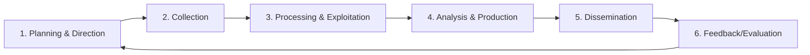
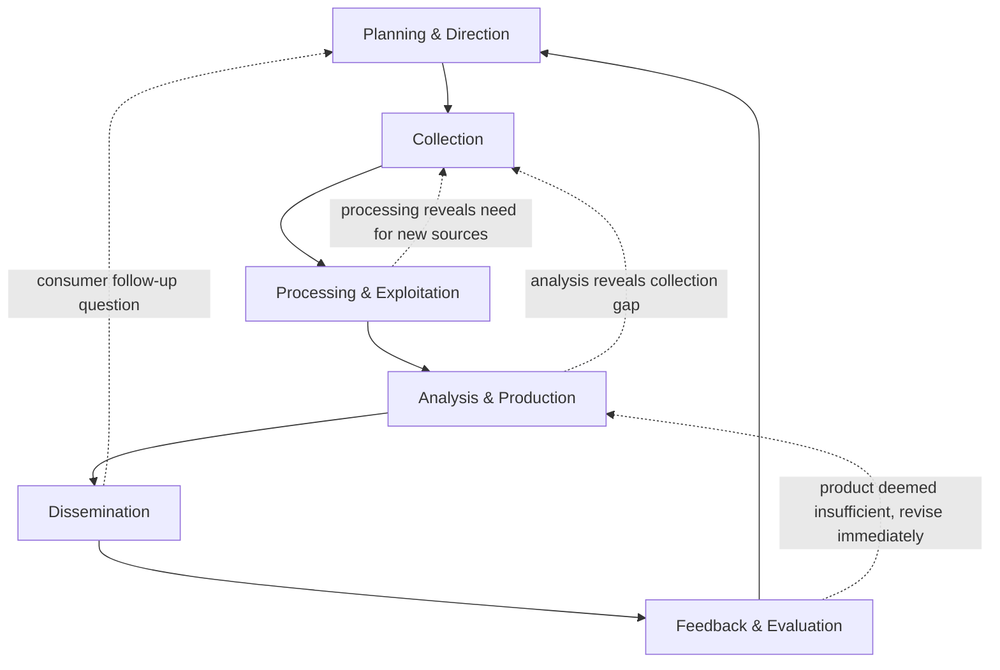

## The Intelligence Cycle

### Overview

The intelligence cycle is the foundational process model describing how raw information is transformed into finished intelligence products that inform decision-making. It provides the organizing structure for virtually all professional intelligence tradecraft — governmental, military, and commercial/corporate — including political and geopolitical risk analysis functions. While often taught as a clean, linear sequence, in operational practice it functions more as a set of interacting, overlapping, and frequently iterated activities.

### The Standard Five (or Six) Phase Model

Most doctrinal formulations (used by the U.S. Intelligence Community, NATO, and widely adapted in commercial risk intelligence practice) describe the cycle as five or six phases:

- **Key Points**
  - Some formulations (notably CIA doctrine) separate "Processing" and "Exploitation" as distinct steps and label the final feedback step as evaluation; other formulations merge phases differently, but the substantive activities described below are broadly consistent across models
  - The cycle is best understood as **iterative and non-linear** in practice: analysis frequently reveals gaps that trigger new collection requirements, and dissemination often generates follow-up questions that restart the cycle for a related but distinct requirement — rather than a rigid, waterfall-style single pass

### Phase 1: Planning and Direction

The cycle begins with identifying **intelligence requirements** — the specific questions decision-makers need answered — and translating those into actionable collection and analytical tasking.

- **Key Points**
  - Requirements typically originate from a "consumer" (a policymaker, military commander, or in the corporate context, a business unit leader or board) and are refined by intelligence professionals into precise, answerable questions
  - A poorly specified requirement (e.g., "tell me about political risk in Country X" rather than "what is the probability of capital controls being imposed in Country X within the next 12 months, and what would trigger early warning of this") propagates ambiguity through every subsequent phase
  - **Priority Intelligence Requirements (PIRs)** are the formalized, prioritized list of what the organization most needs to know, typically re-validated on a regular cycle as the operating environment changes

**Example**

A multinational's risk function receives a business requirement: "Assess whether to proceed with a planned $200M facility investment in Country Z given upcoming elections." This is refined into specific intelligence requirements:

1. What is the probability of a contested/disputed election outcome?
2. What is the historical pattern of post-election unrest in Country Z and comparable political systems?
3. Which specific leading indicators should be monitored between now and the election date?
4. What is the current government's track record on honoring foreign investment commitments during periods of political transition?

### Phase 2: Collection

Gathering raw information relevant to the defined requirements, drawn from multiple **collection disciplines** (often referred to by their intelligence community abbreviations — "INTs"):

| Discipline | Abbreviation | Description | Political Risk Application |
| --- | --- | --- | --- |
| Open-Source Intelligence | OSINT | Publicly available media, academic, government publications | News monitoring, government gazette tracking, think-tank reporting |
| Human Intelligence | HUMINT | Information from human sources | Local contacts, in-country advisors, diplomatic contacts |
| Signals Intelligence | SIGINT | Intercepted communications | Rarely available to commercial risk functions; government-restricted |
| Imagery/Geospatial Intelligence | IMINT/GEOINT | Satellite and aerial imagery | Infrastructure monitoring, troop movement detection, nighttime lights economic proxies |
| Financial Intelligence | FININT | Financial transaction and market data | Capital flow monitoring, sovereign bond spreads, currency market signals |
| Social Media Intelligence | SOCMINT | Social media platform data | Sentiment analysis, coordinated inauthentic behavior detection, protest mobilization signals |

- **Key Points**
  - Commercial/corporate political risk functions rely overwhelmingly on OSINT, SOCMINT, FININT, and HUMINT (through local partners, advisors, and staff), since SIGINT and most classified IMINT/GEOINT capabilities are restricted to government intelligence agencies
  - **Collection bias** is a persistent risk at this stage: readily available sources (English-language media, easily accessible databases) are systematically overrepresented relative to harder-to-access but potentially more diagnostic sources (local-language media, informal networks, restricted government data) — this connects directly to the availability heuristic discussed in the biases item
  - Collection should be explicitly tied back to the Phase 1 requirements; "collect everything and see what's useful" is inefficient and tends to produce information overload downstream

### Phase 3: Processing and Exploitation

Converting raw collected data into a form usable by analysts — this phase is where volume and format transformation happens, distinct from the analytical judgment applied in Phase 4.

- **Key Points**
  - Includes: translation of foreign-language material, transcription, structuring unstructured text (e.g., automated event-coding of news articles into actor-action-target-location tuples, as used in systems like GDELT), deduplication of redundant reporting, and initial relevance/quality filtering
  - Increasingly automated via NLP pipelines (named entity recognition, sentiment scoring, event extraction) given the volume of digital OSINT and SOCMINT now available — manual processing alone cannot scale to modern information volumes
  - **Processing is not analysis**: converting a news article into a structured "protest event with location and date" record does not yet constitute a judgment about what that event means for risk; conflating processing with analysis is a documented tradecraft error that can smuggle unstated assumptions into what appears to be neutral data structuring

### Phase 4: Analysis and Production

Applying analytical judgment, structured techniques, and domain expertise to processed information to produce assessments that directly answer the Phase 1 requirements.

- **Key Points**
  - This is where **Structured Analytic Techniques (SATs)** are applied — Analysis of Competing Hypotheses (ACH), Key Assumptions Check, Devil's Advocacy, scenario planning, and the probabilistic scoring/matrix methods covered elsewhere in this chapter
  - Production involves converting analytical judgment into a specific **product format** appropriate to the consumer and use case (see Product Types below)
  - This phase is most exposed to the cognitive and structural biases catalogued in the prior chapter item — confirmation bias, groupthink, politicization, and false precision are primarily analysis-and-production-phase failures rather than collection-phase failures

**Common intelligence product types:**

| Product Type | Purpose | Typical Length/Format |
| --- | --- | --- |
| Current intelligence briefing | Timely update on fast-moving situation | Short, often daily/weekly |
| Warning intelligence | Alert to emerging threat requiring attention | Short, urgent, trigger-based |
| Estimative intelligence | Forward-looking probabilistic assessment | Medium-length, includes confidence levels |
| Research/in-depth assessment | Comprehensive analysis of a structural issue | Long-form, thorough sourcing |
| Indicators and warning (I&W) product | Ongoing monitoring against defined triggers | Dashboard/tracker format, continuously updated |

### Phase 5: Dissemination

Delivering finished intelligence products to the consumers who requested them (or who otherwise need them), in a form and through a channel that ensures the information actually reaches and is usable by the decision-maker.

- **Key Points**
  - Dissemination failures — the right analysis reaching the wrong person, arriving too late, or being formatted in a way the consumer cannot act on — are a well-documented category of intelligence failure distinct from analytical error; a correct assessment that never reaches the decision-maker in time is operationally equivalent to no assessment at all
  - Format matters: a board-level audience typically needs a one-page executive summary with a clear bottom-line-up-front (BLUFF/BLUF) judgment and confidence level, not the full underlying analytical workup
  - Timeliness must be balanced against completeness — a highly thorough assessment delivered after the decision has already been made has limited value regardless of its analytical quality

### Phase 6: Feedback and Evaluation

Consumers evaluate whether the disseminated product actually answered their requirement, and this feedback loops back to refine future Planning and Direction.

- **Key Points**
  - This phase is frequently the weakest link in practice — organizations often skip formal feedback collection, leaving the intelligence function without a structured mechanism to learn whether its products are actually useful or accurate
  - Feedback should address two distinct questions: (1) Did the product answer the actual decision-maker's question in a usable way? (2) Did the analytical judgment turn out to be accurate once events unfolded? These require different evaluation mechanisms — the first is a consumer satisfaction/utility check, the second is a calibration/accuracy check (connecting to Brier scoring and backtesting practices covered elsewhere in this chapter)
  - Without this phase functioning well, the entire cycle can persist indefinitely producing analytically sound but practically unused, or systematically miscalibrated, products

### The Cycle in Practice: Non-Linearity and Feedback Loops

The clean sequential diagram understates how the cycle actually operates operationally. A more realistic representation includes feedback and skip-ahead paths:

- **Key Points**
  - An analyst discovering during Phase 4 that a critical data point is missing does not wait for the "official" next cycle iteration — they generate an ad hoc new collection tasking immediately, illustrating why the linear model is a teaching simplification rather than an operational description
  - In fast-moving political risk situations (e.g., an unfolding electoral crisis), multiple abbreviated cycle iterations may occur within a single day, compressing all six phases into an hours-long tempo rather than the weeks-to-months tempo typical of strategic-level assessments

### Applying the Cycle to Corporate/Commercial Political Risk Functions

| Government Intelligence Cycle Element | Corporate Political Risk Equivalent |
| --- | --- |
| National policymaker requirement | Board/executive committee investment or operational question |
| Classified collection (SIGINT, HUMINT via case officers) | OSINT platforms, commercial data feeds, local advisors/consultants, in-country staff |
| Classified analytical product (President's Daily Brief style) | Risk memo, board briefing, risk register update |
| Interagency coordination | Cross-functional coordination (legal, treasury, operations, security) |
| Formal intelligence oversight/evaluation | Internal audit, post-decision review, backtesting against custom framework (see prior chapter item) |

- **Key Points**
  - The structural logic transfers directly even though the institutional actors, classification constraints, and available collection disciplines differ substantially between government and commercial contexts
  - Commercial risk functions typically compress the formal, document-heavy government process into faster, less bureaucratic cycles — appropriate given generally smaller teams and more direct lines to decision-makers, but this compression increases the risk of skipping the feedback/evaluation phase specifically, since it is the phase most easily deprioritized under time pressure

### Related Topics

- **Next Steps**
  - Structured Analytic Techniques (SATs) and the Analysis of Competing Hypotheses (ACH)
  - OSINT collection methodologies and source evaluation standards
  - Common pitfalls and biases in risk assessment (directly relevant to Phase 4 failure modes)
  - Intelligence product design: writing for the Bottom-Line-Up-Front (BLUF) standard
  - Source evaluation and the Admiralty/NATO source reliability grading system
  - Requirements management and Priority Intelligence Requirements (PIR) design
  - Building a custom geopolitical risk framework (operationalizes the full cycle)
  - Warning intelligence and indicators & warning (I&W) product design