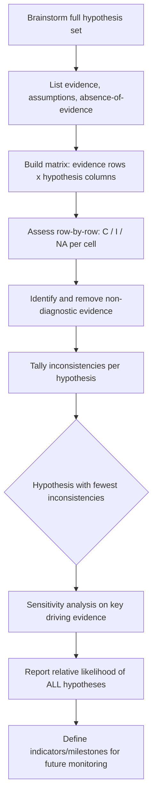

## Analysis of Competing Hypotheses

### Overview

Analysis of Competing Hypotheses (ACH) is a structured analytic technique developed by Richards J. Heuer Jr. at the CIA, designed to counter cognitive biases—particularly confirmation bias and satisficing (accepting the first plausible explanation)—in intelligence analysis. Rather than seeking evidence to confirm a preferred hypothesis, ACH forces the analyst to systematically disconfirm competing hypotheses, making the process of elimination explicit and auditable.

The core insight is epistemological: human analysts naturally seek evidence that confirms an existing belief and are slow to change that belief once formed. ACH inverts this by evaluating evidence against *all* plausible hypotheses simultaneously, favoring the hypothesis with the *least* disconfirming evidence rather than the one with the most confirming evidence.

### Key Points

- **Refutation over confirmation**: ACH's central mechanism is falsification-driven, borrowing from Karl Popper's philosophy of science — hypotheses survive by resisting disproof, not by accumulating supportive evidence.
- **Matrix-based structure**: Hypotheses form columns, evidence/arguments form rows, and each cell records consistency (C), inconsistency (I), or not applicable/ambiguous (NA).
- **Diagnosticity is the key metric**: Evidence that is consistent with *all* hypotheses has zero diagnostic value, even if it feels compelling. Evidence that discriminates between hypotheses is what matters.
- **Inconsistency counts, not consistency**: The hypothesis with the fewest "I" marks — not the most "C" marks — is analytically favored.
- Developed originally for counterintelligence and foreign intelligence estimates; now standard in structured analytic technique (SAT) doctrine across the US IC (per ICD 203) and widely taught in corporate/geopolitical risk analysis.

### The Eight-Step Process

1. **Identify possible hypotheses** — Brainstorm the full hypothesis set, including low-probability but non-trivial ones. Use a group if possible to avoid individual framing bias.
2. **List significant evidence and arguments** — Includes evidence, assumptions, and absence-of-evidence (the absence of an expected indicator is itself evidentiary).
3. **Build the matrix** — Evidence as rows, hypotheses as columns; assess each evidence item against each hypothesis independently (row-by-row, not hypothesis-by-hypothesis, to reduce anchoring).
4. **Refine the matrix** — Reconsider hypotheses; delete non-diagnostic evidence rows (those consistent with every hypothesis contribute no discriminating power).
5. **Draw tentative conclusions about relative likelihood** — Focus on disconfirmation; the hypothesis with the fewest inconsistencies is provisionally strongest.
6. **Analyze sensitivity** — Identify which few pieces of evidence are driving the conclusion; stress-test their reliability and source credibility.
7. **Report conclusions** — Present relative likelihood of *all* hypotheses, not just the winner, including how sensitive the judgment is to key evidence.
8. **Identify milestones for future observation** — Specify what future evidence would confirm or overturn the judgment (supports ongoing monitoring/indicators work).

### Matrix Construction Example

Geopolitical scenario: assessing why Country X is amassing troops near a border.

| Evidence / Argument | H1: Coercive signaling (no invasion intent) | H2: Preparing limited incursion | H3: Preparing full invasion |
| --- | --- | --- | --- |
| Troop buildup announced publicly | C | C | I |
| Field hospitals deployed forward | I | C | C |
| Diplomatic channels still open | C | C | I |
| No reservist mobilization | C | I | I |
| Media narrative shifts to "provocation" framing | C | C | C (non-diagnostic) |
| Logistics units embedded w/ combat units | I | C | C |

Reading the matrix: the "media narrative" row is consistent with all three hypotheses (C, C, C) — it has **zero diagnostic value** and should be deprioritized or dropped despite feeling significant. H1 accumulates the most inconsistencies (I marks), making it the *least* likely surviving hypothesis under ACH logic, while H2 and H3 remain more competitive and need further discriminating evidence.

### Diagnosticity — Worked Logic

Evidence $E$ has diagnostic value with respect to hypothesis set $\{H_1, H_2, ..., H_n\}$ only if:

$$P(E \mid H_i) \neq P(E \mid H_j) \text{ for some } i \neq j$$

If $P(E \mid H_i)$ is approximately equal across all $H_i$, the evidence is non-diagnostic regardless of how strongly it seems to "fit" the analyst's preferred narrative. This is the formal justification for step 4 (deleting non-diagnostic rows) and is the single most common error analysts make without ACH: treating "consistent with my hypothesis" as support, when it may be consistent with *every* hypothesis.

### Process Flow

### Matrix Structure (Diagram)

<svg xmlns="http://www.w3.org/2000/svg" viewBox="0 0 720 320">
<text x="360" y="24" text-anchor="middle" font-size="15" font-weight="bold" fill="#1a1a1a">ACH Matrix Structure (svg_diagram)</text>

<rect x="180" y="50" width="110" height="36" fill="#2c5f8a" />
<text x="235" y="73" text-anchor="middle" font-size="12" fill="#fff">H1</text>
<rect x="292" y="50" width="110" height="36" fill="#2c5f8a" />
<text x="347" y="73" text-anchor="middle" font-size="12" fill="#fff">H2</text>
<rect x="404" y="50" width="110" height="36" fill="#2c5f8a" />
<text x="459" y="73" text-anchor="middle" font-size="12" fill="#fff">H3</text>
<rect x="516" y="50" width="110" height="36" fill="#2c5f8a" />
<text x="571" y="73" text-anchor="middle" font-size="12" fill="#fff">H4</text>

<rect x="40" y="86" width="140" height="36" fill="#3a3a3a" />
<text x="110" y="109" text-anchor="middle" font-size="11" fill="#fff">Evidence 1</text>
<rect x="40" y="122" width="140" height="36" fill="#4a4a4a" />
<text x="110" y="145" text-anchor="middle" font-size="11" fill="#fff">Evidence 2</text>
<rect x="40" y="158" width="140" height="36" fill="#3a3a3a" />
<text x="110" y="181" text-anchor="middle" font-size="11" fill="#fff">Evidence 3</text>
<rect x="40" y="194" width="140" height="36" fill="#4a4a4a" />
<text x="110" y="217" text-anchor="middle" font-size="11" fill="#fff">Evidence 4</text>

<g font-size="13" text-anchor="middle">

<rect x="180" y="86" width="112" height="36" fill="#eafaf1" stroke="#ccc" /><text x="235" y="109" fill="#1a7a3c">C</text>
<rect x="292" y="86" width="112" height="36" fill="#fdecea" stroke="#ccc" /><text x="347" y="109" fill="#b3261e">I</text>
<rect x="404" y="86" width="112" height="36" fill="#eafaf1" stroke="#ccc" /><text x="459" y="109" fill="#1a7a3c">C</text>
<rect x="516" y="86" width="112" height="36" fill="#f0f0f0" stroke="#ccc" /><text x="571" y="109" fill="#666">NA</text>

<rect x="180" y="122" width="112" height="36" fill="#eafaf1" stroke="#ccc" /><text x="235" y="145" fill="#1a7a3c">C</text>
<rect x="292" y="122" width="112" height="36" fill="#eafaf1" stroke="#ccc" /><text x="347" y="145" fill="#1a7a3c">C</text>
<rect x="404" y="122" width="112" height="36" fill="#eafaf1" stroke="#ccc" /><text x="459" y="145" fill="#1a7a3c">C</text>
<rect x="516" y="122" width="112" height="36" fill="#eafaf1" stroke="#ccc" /><text x="571" y="145" fill="#1a7a3c">C</text>

<rect x="180" y="158" width="112" height="36" fill="#fdecea" stroke="#ccc" /><text x="235" y="181" fill="#b3261e">I</text>
<rect x="292" y="158" width="112" height="36" fill="#eafaf1" stroke="#ccc" /><text x="347" y="181" fill="#1a7a3c">C</text>
<rect x="404" y="158" width="112" height="36" fill="#fdecea" stroke="#ccc" /><text x="459" y="181" fill="#b3261e">I</text>
<rect x="516" y="158" width="112" height="36" fill="#eafaf1" stroke="#ccc" /><text x="571" y="181" fill="#1a7a3c">C</text>

<rect x="180" y="194" width="112" height="36" fill="#eafaf1" stroke="#ccc" /><text x="235" y="217" fill="#1a7a3c">C</text>
<rect x="292" y="194" width="112" height="36" fill="#fdecea" stroke="#ccc" /><text x="347" y="217" fill="#b3261e">I</text>
<rect x="404" y="194" width="112" height="36" fill="#fdecea" stroke="#ccc" /><text x="459" y="217" fill="#b3261e">I</text>
<rect x="516" y="194" width="112" height="36" fill="#eafaf1" stroke="#ccc" /><text x="571" y="217" fill="#1a7a3c">C</text>
</g>

<text x="20" y="260" font-size="11" fill="#333">Row 2 (all "C") = non-diagnostic; candidate for removal per Step 4</text>

<text x="20" y="278" font-size="11" fill="#333">Column tally of "I" marks drives relative hypothesis ranking, not "C" tally</text>

<text x="20" y="296" font-size="11" fill="#333">Favored hypothesis = fewest inconsistencies, not most consistencies</text>

</svg>

### Common Pitfalls

- **Evaluating hypothesis-by-hypothesis instead of row-by-row**: Increases anchoring on a preferred hypothesis; the matrix should be filled in one evidence row at a time across all hypotheses.
- **Treating "consistent with" as "supports"**: Non-diagnostic evidence inflates confidence without adding analytic value.
- **Hypothesis set too narrow**: If the "true" explanation was never brainstormed as a hypothesis, ACH cannot surface it — the technique only ranks the hypotheses it is given.
- **Static, one-time use**: ACH is meant to be revisited as new evidence arrives; treating the matrix as a final artifact rather than a living tool undercuts its value for ongoing geopolitical monitoring.
- [Inference] In practice, groups often abandon strict row-by-row discipline under time pressure, reverting to intuitive hypothesis-ranking and using the matrix as post-hoc justification rather than a generative tool — this is a documented critique in the SAT literature rather than an inherent flaw of the method itself.

### ACH vs. Other Structured Analytic Techniques

| Technique | Primary Purpose | Best Used When |
| --- | --- | --- |
| ACH | Discriminate between competing explanations | Multiple plausible hypotheses, risk of confirmation bias |
| Key Assumptions Check | Surface and test underlying assumptions | Long-standing judgments, legacy assessments |
| Devil's Advocacy | Challenge a strong consensus view | Groupthink risk, high-confidence single narrative |
| Indicators/Signposts | Monitor for future confirming/disconfirming events | Post-judgment monitoring, warning intelligence |
| Red Team Analysis | Model adversary's perspective/decision calculus | Understanding intent, not just likelihood |

ACH is frequently used as a foundation technique, with Key Assumptions Check run beforehand (to validate the assumptions feeding the hypotheses) and Indicators/Signposts run afterward (to operationalize step 8's monitoring requirement).

### Application in Geopolitical Risk Analysis

In a corporate or geopolitical risk context (as opposed to classified IC use), ACH is applied to questions such as: will a central bank pursue capital controls, will a regime change be orderly or violent, will a regional conflict escalate to involve a third-party state, or whether a sanctions regime will hold or fracture. The technique's value is highest when:

- Multiple analysts or stakeholders hold divergent priors (the explicit matrix surfaces disagreement productively rather than through unstructured debate)
- The cost of being wrong is high (M&A due diligence, sovereign risk pricing, supply chain relocation decisions)
- There's pressure toward a single "consensus narrative" that a formal disconfirmation exercise can stress-test

### Related Topics

- Key Assumptions Check (KAC)
- Indicators and Warning (I&W) analysis / signposts
- Devil's Advocacy and Team A/Team B analysis
- Cognitive biases in intelligence analysis (confirmation bias, mirror-imaging, anchoring)
- Bayesian updating as a formal alternative/complement to ACH
- Scenario planning and alternative futures analysis
- Source reliability and credibility assessment frameworks
- Richards J. Heuer Jr., *Psychology of Intelligence Analysis* (foundational text)