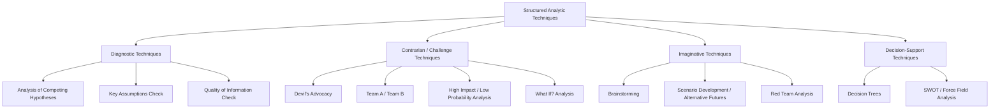

## Structured Analytic Techniques and Devil's Advocacy


### Overview

Structured Analytic Techniques (SATs) are a family of formal methods developed to counter well-documented cognitive biases in intelligence analysis — confirmation bias, anchoring, groupthink, mirror-imaging, and premature closure. Rather than relying on unaided expert judgment, SATs impose an explicit, externalized process on reasoning, making assumptions, evidence, and inference steps visible and auditable to both the analyst and any reviewer. They are codified in US Intelligence Community doctrine (notably Intelligence Community Directive 203, "Analytic Standards") and in Heuer & Pherson's *Structured Analytic Techniques for Intelligence Analysis*, and have been adopted widely outside government in geopolitical risk consultancies, corporate intelligence units, and financial risk desks.

Devil's Advocacy is one specific SAT within this family — a "challenge" technique whose purpose is to actively contest an established or emerging consensus judgment, rather than to generate or discriminate between hypotheses from scratch.

### Key Points

- SATs exist to slow down and externalize reasoning that would otherwise happen implicitly and unaccountably inside a single analyst's head.
- They are typically grouped into families by function: **diagnostic**, **contrarian/challenge**, **imaginative/scenario**, and **decision-support** techniques.
- Devil's Advocacy belongs to the **contrarian (challenge)** family, alongside Team A/Team B analysis and "What If?" analysis.
- SATs are process tools, not truth-generators — they reduce the *probability* of certain error types but do not guarantee correct conclusions. [Inference] Empirical validation of SAT effectiveness is an active area of IC tradecraft research and results are mixed across techniques and populations.
- Devil's Advocacy is most effective against a single, strongly-held consensus view, not against a genuinely contested or divided analytic line (ACH is better suited there).

### Taxonomy of Structured Analytic Techniques



### Devil's Advocacy — Mechanics

**Purpose**: Devil's Advocacy formally assigns one analyst or subteam the role of arguing *against* the prevailing or majority-favored judgment, regardless of their personal view, in order to surface weaknesses, unstated assumptions, and alternative explanations that consensus-seeking may have suppressed.

**Procedure**:

1. **Select the target judgment** — Choose a conclusion that carries high confidence or broad agreement and has significant downstream consequences if wrong (policy decisions, investment calls, force posture).
2. **Assign the devil's advocate role** — Ideally to an analyst not personally invested in the original judgment; the role is explicitly adversarial by design, not a reflection of the assignee's actual belief.
3. **Build the strongest possible counter-case** — The advocate marshals evidence, alternative interpretations, and logical challenges against the consensus, actively seeking disconfirming information the main analytic line may have discounted.
4. **Present the challenge formally** — Typically as a structured critique or a competing short paper, delivered to the original analytic team or to management.
5. **Reconcile or escalate** — The original team either strengthens its judgment (having survived the challenge), revises it, or the disagreement is presented to decision-makers as genuine, unresolved uncertainty.

### Devil's Advocacy vs. Team A/Team B

These are frequently confused; the distinction is procedural.

| Dimension | Devil's Advocacy | Team A / Team B |
| --- | --- | --- |
| Structure | One team (majority) + one advocate/subteam challenging it | Two independent teams, each building a full case |
| Starting point | An existing consensus judgment | Often no prior consensus; two hypotheses argued in parallel from the outset |
| Advocate's belief | Need not personally hold the contrarian view | Team typically genuinely believes or is assigned to argue its case with full commitment |
| Typical use case | Stress-testing a near-final judgment before release | Deeply divided or highly consequential questions from early analysis |
| Resource cost | Lower — one additional reviewer/subteam | Higher — two full parallel analytic efforts |

### Worked Example — Geopolitical Risk Application

**Consensus judgment**: "Country Y's central bank will avoid capital controls through the next fiscal quarter, prioritizing currency stability to protect foreign investment."

**Devil's advocate brief** (constructed to challenge this):

- **Reframes the incentive structure**: leadership's political survival may outweigh investor-confidence considerations if reserves fall below a critical threshold — the consensus view may be over-weighting technocratic rationality and under-weighting political risk.
- **Surfaces discounted evidence**: prior instances where the same finance ministry reversed public commitments within weeks under reserve pressure, which the main analytic line treated as an outlier rather than a pattern.
- **Tests source reliance**: the consensus judgment leans heavily on statements from central bank officials with a track record of managing market expectations rather than disclosing intent — a Quality of Information Check embedded within the devil's advocacy critique.
- **Conclusion delivered to decision-makers**: not "the consensus is wrong," but "confidence in the no-capital-controls judgment should be downgraded from high to moderate, and a specific reserve-level indicator should trigger reassessment."

This illustrates the intended output of devil's advocacy: not necessarily a reversal of the judgment, but a calibrated confidence level and an explicit reconciliation of the strongest counter-evidence, rather than a judgment issued as if no serious counter-case existed.

### When to Use Which SAT

<svg xmlns="http://www.w3.org/2000/svg" viewBox="0 0 720 300">
<text x="360" y="24" text-anchor="middle" font-size="15" font-weight="bold" fill="#1a1a1a">SAT Selection by Analytic Situation (svg_diagram)</text>
<g font-size="12">
<rect x="30" y="50" width="200" height="50" fill="#2c5f8a" rx="4" />
<text x="130" y="72" text-anchor="middle" fill="#fff" font-weight="bold">Multiple plausible</text>
<text x="130" y="88" text-anchor="middle" fill="#fff" font-weight="bold">explanations, unclear which</text>



```
<rect x="30" y="115" width="200" height="40" fill="#eafaf1" stroke="#2c5f8a" />
<text x="130" y="139" text-anchor="middle" fill="#1a7a3c">→ Analysis of Competing Hypotheses</text>

<rect x="260" y="50" width="200" height="50" fill="#8a4c2c" rx="4" />
<text x="360" y="72" text-anchor="middle" fill="#fff" font-weight="bold">Strong existing consensus,</text>
<text x="360" y="88" text-anchor="middle" fill="#fff" font-weight="bold">needs stress-test</text>

<rect x="260" y="115" width="200" height="40" fill="#fdecea" stroke="#8a4c2c" />
<text x="360" y="139" text-anchor="middle" fill="#b3261e">→ Devil's Advocacy</text>

<rect x="490" y="50" width="200" height="50" fill="#5a2c8a" rx="4" />
<text x="590" y="72" text-anchor="middle" fill="#fff" font-weight="bold">Deeply divided analysts,</text>
<text x="590" y="88" text-anchor="middle" fill="#fff" font-weight="bold">high stakes, early stage</text>

<rect x="490" y="115" width="200" height="40" fill="#f2eafa" stroke="#5a2c8a" />
<text x="590" y="139" text-anchor="middle" fill="#5a2c8a">→ Team A / Team B</text>

<rect x="30" y="175" width="200" height="50" fill="#2c8a5f" rx="4" />
<text x="130" y="197" text-anchor="middle" fill="#fff" font-weight="bold">Judgment relies on old</text>
<text x="130" y="213" text-anchor="middle" fill="#fff" font-weight="bold">or unexamined premises</text>

<rect x="30" y="240" width="200" height="40" fill="#eafaf6" stroke="#2c8a5f" />
<text x="130" y="264" text-anchor="middle" fill="#1a7a5c">→ Key Assumptions Check</text>

<rect x="260" y="175" width="200" height="50" fill="#8a2c5f" rx="4" />
<text x="360" y="197" text-anchor="middle" fill="#fff" font-weight="bold">Low-probability, high-impact</text>
<text x="360" y="213" text-anchor="middle" fill="#fff" font-weight="bold">tail scenario overlooked</text>

<rect x="260" y="240" width="200" height="40" fill="#faeaf2" stroke="#8a2c5f" />
<text x="360" y="264" text-anchor="middle" fill="#7a1a4c">→ High Impact/Low Probability Analysis</text>

<rect x="490" y="175" width="200" height="50" fill="#8a7a2c" rx="4" />
<text x="590" y="197" text-anchor="middle" fill="#fff" font-weight="bold">Need to model adversary's</text>
<text x="590" y="213" text-anchor="middle" fill="#fff" font-weight="bold">own decision calculus</text>

<rect x="490" y="240" width="200" height="40" fill="#faf6ea" stroke="#8a7a2c" />
<text x="590" y="264" text-anchor="middle" fill="#7a6a1a">→ Red Team Analysis</text>
```

</g>
</svg>

### Institutional Safeguards and Limitations

- **Role clarity is essential**: if the devil's advocate role becomes associated with a specific person's actual views over repeated use, it loses its adversarial-by-assignment character and risks becoming a proxy for pre-existing factional disagreement.
- **Timing matters**: applied too early, devil's advocacy can short-circuit hypothesis generation; applied too late, it becomes a pro forma exercise that doesn't meaningfully alter a judgment that's already been briefed upward.
- **Not a substitute for evidentiary rigor**: devil's advocacy strengthens or weakens confidence in a judgment but does not itself generate new primary evidence — it is a reasoning-quality check, not a collection technique.
- **Risk of false balance**: presenting a devil's advocate case can create the impression of a 50/50 split to decision-makers even when the original judgment remains substantially stronger; SAT doctrine emphasizes that outputs should include calibrated confidence levels, not simply "here are two sides."
- [Inference] In fast-moving geopolitical risk contexts (as opposed to the slower cadence of some IC products), devil's advocacy is often run informally and briefly rather than as a fully resourced parallel exercise, given time constraints on delivering client-facing assessments.

### Related Topics

- Analysis of Competing Hypotheses (ACH)
- Key Assumptions Check
- Team A / Team B analysis
- Red Team analysis and adversary decision-modeling
- High Impact/Low Probability (HI/LP) analysis
- Quality of Information / source reliability checks
- Groupthink and premature closure in analytic teams
- ICD 203 Analytic Standards