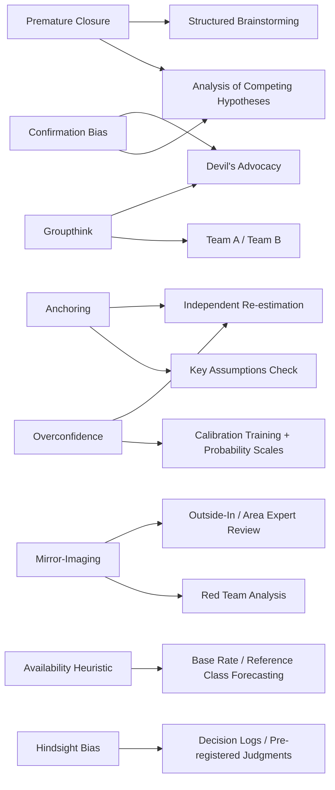

## Cognitive Bias Mitigation in Analytic Judgment

### Overview

Cognitive bias mitigation is the tradecraft discipline concerned with identifying the systematic, predictable errors that human reasoning makes under uncertainty and building procedural, organizational, and technique-based countermeasures against them. The foundational premise — articulated most influentially by Richards J. Heuer Jr. — is that these biases are not failures of intelligence or effort, but structural features of human cognition that operate even on expert, well-trained analysts. Because the biases arise from *how* the mind processes information rather than from insufficient knowledge, they cannot be reliably corrected by "trying harder" or by expertise alone; they require externalized structure — which is why this topic sits upstream of, and motivates, the entire Structured Analytic Techniques family.

This topic overlaps substantially with judgment and decision-making research from cognitive psychology (Kahneman, Tversky, Simon) but is scoped here specifically to its application in intelligence and geopolitical risk analysis, where consequences of biased judgment are amplified by high stakes, adversarial deception, and incomplete information.

### Key Points

- Biases are systematic (they push errors in a consistent direction) rather than random, which is what makes them detectable and — to a degree — correctable through process design.
- Mitigation operates at three levels: **individual awareness**, **structured technique** (see SATs), and **organizational/process design** (peer review, red teams, tradecraft standards).
- Awareness alone has limited effect — [Inference] research on debiasing broadly suggests that simply knowing about a bias does not reliably prevent an analyst from exhibiting it, which is the primary justification for externalized, procedural mitigations over training-only approaches.
- Mitigation techniques generally trade analytic speed for analytic rigor; organizations must calibrate which technique's overhead is justified by a judgment's stakes.
- No mitigation technique eliminates bias; all are designed to reduce its probability and surface it for review, not to guarantee an unbiased conclusion.

### Core Biases Relevant to Analytic Judgment

**Confirmation bias** — The tendency to search for, interpret, and recall information in ways that confirm a pre-existing hypothesis, and to discount or under-weight disconfirming evidence. This is the single most cited bias in intelligence failure post-mortems and is the direct target of ACH's row-by-row, disconfirmation-first structure.

**Anchoring** — Over-reliance on an initial piece of information (a first estimate, an early intelligence report, a prior year's assessment) such that subsequent judgment insufficiently adjusts away from it, even as new evidence accumulates.

**Mirror-imaging** — Assuming a foreign actor will act as the analyst's own culture, organization, or self would act under similar circumstances, rather than according to that actor's actual values, constraints, and decision-making style. A recurring root cause in state-behavior misjudgments (e.g., assuming rational cost-benefit calculations mirroring Western policy logic).

**Groupthink** — Pressure toward consensus within a cohesive team that suppresses dissenting views, critical evaluation, and the presentation of alternatives — often intensified by time pressure, strong leadership within the group, or prior team success that breeds overconfidence.

**Premature closure / satisficing** — Accepting the first analytically "good enough" explanation rather than continuing to generate and test alternative hypotheses, especially under time pressure.

**Availability heuristic** — Overweighting the probability or salience of events that are easily recalled (vivid, recent, or emotionally charged) relative to their actual base rate — e.g., overestimating coup risk shortly after a highly publicized coup elsewhere.

**Overconfidence / certainty of judgment** — Miscalibration between stated confidence levels and actual accuracy; analysts (like most experts) tend to be more confident than their track record justifies, particularly on judgments made with sparse evidence.

**Hindsight bias** — After an outcome is known, perceiving it as having been more predictable beforehand than it actually was — this corrupts institutional learning from past assessments if not explicitly corrected for during post-mortems.

### Bias-to-Mitigation Mapping

### Mitigation Mechanisms — Detail

1. **Calibration training and probability scales**: Analysts are trained against standardized probability-language conventions (e.g., ICD 203's "almost no chance," "unlikely," "roughly even chance," "likely," "almost certain," mapped to numeric bands) and tracked against historical accuracy (Brier scoring in forecasting contexts) to expose and correct systematic over- or under-confidence over time.
2. **Base rate / reference class forecasting**: Before estimating the probability of a specific event, analysts first establish the historical base rate for similar events in similar contexts (e.g., "how often have currency pegs of this type collapsed within 12 months of comparable reserve depletion?"), anchoring judgment in outside-view statistics rather than case-specific narrative alone.
3. **Pre-mortem / decision logging**: Recording a judgment, its confidence level, and its key supporting assumptions *before* the outcome is known, explicitly to defeat hindsight bias during later accuracy reviews and to create an auditable record for institutional learning.
4. **Structured brainstorming**: Formal techniques (e.g., nominal group technique) that require each participant to generate ideas independently before group discussion, specifically to prevent early anchoring on the first idea voiced and to reduce groupthink pressure during hypothesis generation.
5. **Independent re-estimation**: Having a second analyst or team reach a judgment without exposure to the first team's conclusion, then comparing results — a structural defense against anchoring and groupthink that doesn't require either team to know they're being cross-checked.
6. **Outside-in review / red teaming**: Bringing in reviewers without a stake in the existing analytic line — sometimes with deliberately different cultural or disciplinary backgrounds — specifically to catch mirror-imaging that an internally homogeneous team would not detect in itself.

### Worked Example — Geopolitical Risk Application

**Scenario**: A risk team is asked whether a neighboring state will intervene militarily in a border dispute.

- **Mirror-imaging check**: The team notes its initial judgment ("intervention is irrational given the economic cost") implicitly assumes the foreign leadership weighs economic cost the way the analysts' own institution would. A red-team pass reframes the calculus around the leadership's domestic political survival incentives, which may value a nationalist rally-effect above near-term economic cost.
- **Base rate correction**: Rather than reasoning solely from this specific dispute's narrative, the team pulls a reference class of comparable border disputes involving regimes under similar domestic pressure, establishing a base intervention rate to anchor the estimate before layering in case-specific evidence.
- **Confidence calibration**: The team's initial draft states "intervention is unlikely" without a numeric anchor; calibration convention requires translating this to a standard probability band (e.g., 20–35%) and logging that figure for future accuracy tracking against the ICD 203-style lexicon.
- **Hindsight-bias defense**: The final judgment, its confidence band, and its three most load-bearing assumptions are logged before the dispute resolves, so that a post-outcome review can assess *process* quality independent of whether the specific outcome happened to occur.

### Organizational and Process-Level Mitigations

Beyond individual techniques, mature analytic organizations institutionalize bias mitigation through:

- **Mandatory alternative-analysis requirements** for judgments above a stakes threshold (formal ACH or devil's advocacy sign-off before publication)
- **Diverse team composition** across disciplinary background, seniority, and — where relevant — cultural/regional expertise, to reduce the homogeneity that enables both groupthink and mirror-imaging
- **Separation of collection and analysis functions**, reducing the risk that an analyst's investment in a source's value biases interpretation of that source's reporting
- **Structured post-mortems on both correct and incorrect judgments**, since reviewing only failures risks over-correcting for the most recent visible error rather than systematically assessing process quality
- **Standardized confidence-language and source-reliability conventions** applied uniformly across products, so that stated certainty is comparable across analysts and time

### Limitations of Bias Mitigation Tradecraft

- Mitigation techniques carry real time and resource costs, creating tension with operational tempo requirements in fast-moving geopolitical risk environments.
- Over-application of challenge techniques (excessive devil's advocacy, exhaustive ACH matrices on low-stakes judgments) can degrade organizational trust in the techniques themselves and produce technique fatigue.
- [Speculation] Some critics of SAT doctrine argue that heavy proceduralization can substitute the *appearance* of rigor for substantively better judgment if applied mechanically rather than as a genuine aid to reasoning — this is a contested position within the tradecraft literature rather than a settled finding.
- Debiasing research outside the intelligence context (e.g., in behavioral economics and medical decision-making) shows mixed and context-dependent effectiveness for many popular interventions, which counsels against treating any single mitigation technique as fully solving the underlying cognitive tendency.

### Related Topics

- Analysis of Competing Hypotheses (ACH)
- Structured analytic techniques and devil's advocacy
- Calibration, Brier scoring, and probabilistic forecasting (Tetlock/"superforecasting" literature)
- Base rate neglect and reference class forecasting
- Red team analysis and adversary decision-modeling
- ICD 203 Analytic Standards and confidence-language conventions
- Post-mortem and lessons-learned methodologies in intelligence organizations