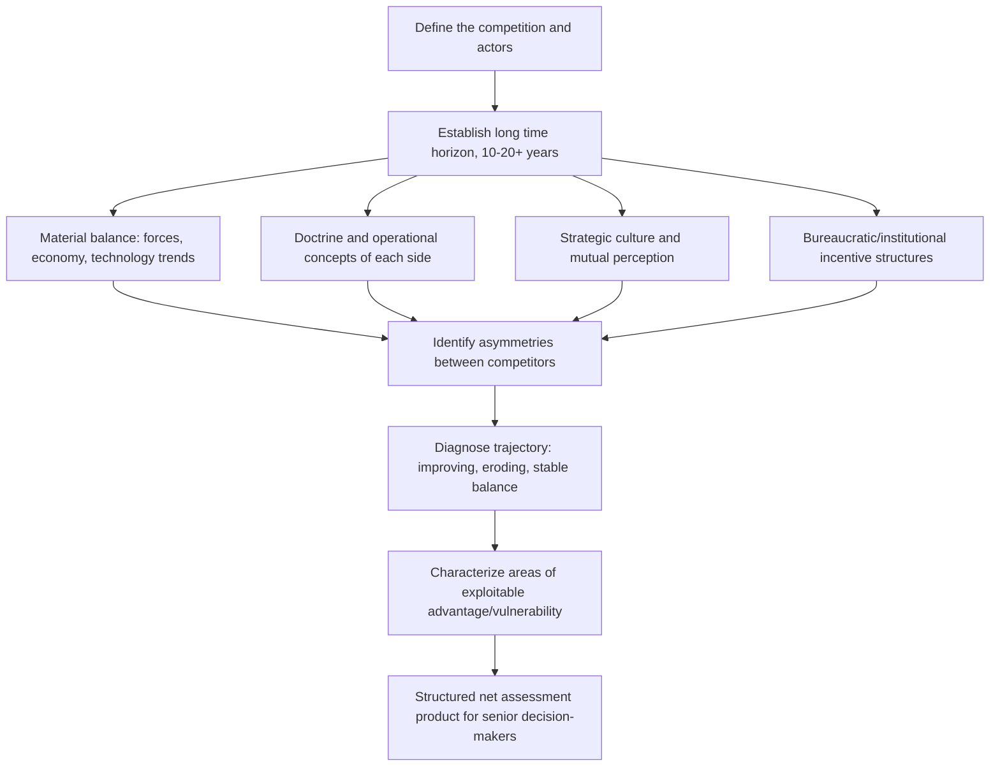

## Net Assessment Methodology

### Overview

Net assessment is a strategic-level analytic methodology for evaluating the long-term military, economic, and political balance between two or more competing states or actors, with particular emphasis on *asymmetries* — differences in doctrine, culture, bureaucratic incentive, and perception — that simple bilateral force comparisons overlook. The discipline was institutionalized in the US context by Andrew Marshall, founding director of the Department of Defense's Office of Net Assessment (ONA, 1973–2015), who drew on earlier RAND Corporation systems-analysis work but explicitly rejected the idea that competitive balance could be reduced to quantitative force-ratio comparisons alone.

Where conventional net assessment in the colloquial sense (comparing troop counts, GDP, or weapons inventories) is essentially a bookkeeping exercise, Marshall-school net assessment is fundamentally diagnostic and asymmetric: it asks not just "who has more," but "where do the competitors' respective strengths, weaknesses, and *ways of thinking about the competition* create exploitable advantage or vulnerability over a multi-decade horizon." This makes it distinct from both order-of-battle analysis (a snapshot capability inventory) and from single-scenario wargaming (a narrow simulated interaction).

### Key Points

- Net assessment is inherently **comparative and asymmetric** — it explicitly avoids treating the two sides as mirror images of each other, in direct contrast to the mirror-imaging bias net assessment doctrine was partly designed to counteract.
- It operates on a **long time horizon** (typically 10–20+ years), distinguishing it from current intelligence and most tactical/operational analysis.
- The methodology is explicitly **diagnostic, not predictive** in the narrow sense — its output is a structured characterization of the competitive balance and its drivers, not a single forecast or point estimate.
- Net assessment gives significant weight to **organizational behavior, bureaucratic incentive structures, and strategic culture** as drivers of competitive outcomes, not just material capability.
- It is resource- and expertise-intensive, historically conducted by small, elite teams over extended study periods rather than as a routine, repeatable production process.

### Core Analytic Dimensions

Net assessment studies conventionally examine competition across several interacting dimensions simultaneously, rather than in isolation:

1. **Material balance** — Force structure, technology, economic base, and resource allocation trends over time (not a static snapshot).
2. **Doctrine and operational concepts** — How each side plans to actually employ its capabilities, which can differ dramatically from what raw capability comparisons would suggest.
3. **Strategic culture and perception** — How each competitor perceives itself, the other, and the nature of the competition itself; net assessment treats *mutual perception* as a substantive variable, not noise.
4. **Bureaucratic and institutional dynamics** — How internal organizational incentives (budget competition among services, career incentives, procurement politics) shape actual behavior independent of stated strategy.
5. **Trends over time (diagnosis of trajectory)** — Net assessment is explicitly concerned with the *direction and rate of change* in the balance, not only its current state — a slowly eroding advantage is analytically distinct from a stable one even if the current snapshot looks similar.
6. **Asymmetries and exploitable areas** — Where a competitor's structural weakness, doctrine mismatch, or blind spot creates disproportionate opportunity or risk relative to a simple aggregate capability comparison.

### Net Assessment Process Flow

### Net Assessment vs. Adjacent Methodologies

| Dimension | Net Assessment | Order-of-Battle Analysis | Wargaming | Scenario Planning |
| --- | --- | --- | --- | --- |
| Time horizon | Long (decade+) | Snapshot/current | Single scenario, bounded | Multiple alternative futures |
| Comparison logic | Explicitly asymmetric | Often symmetric/tabular | Interactive, adversarial | Branching, not necessarily comparative |
| Core question | Where is exploitable advantage/vulnerability? | What forces exist now? | How would a specific scenario play out? | What futures are plausible? |
| Weight on culture/bureaucracy | High | Low | Moderate (in role-play) | Variable |
| Output | Diagnostic characterization | Capability inventory | Simulated outcome/insights | Set of plausible trajectories |
| Typical resourcing | Small elite team, extended study | Standing analytic cell | Structured exercise, defined duration | Facilitated workshop |

Net assessment often *incorporates* wargaming and scenario development as supporting techniques within a broader study, rather than being an alternative to them — the distinguishing feature is the asymmetric, long-horizon, culture-and-bureaucracy-inclusive framing applied around those tools.

### Illustrative Structure — Asymmetry Mapping

<svg xmlns="http://www.w3.org/2000/svg" viewBox="0 0 720 340">
<text x="360" y="24" text-anchor="middle" font-size="15" font-weight="bold" fill="#1a1a1a">Net Assessment Asymmetry Mapping (svg_diagram)</text>

<rect x="40" y="50" width="280" height="36" fill="#2c5f8a" />
<text x="180" y="73" text-anchor="middle" font-size="13" fill="#fff" font-weight="bold">Competitor A</text>

<rect x="400" y="50" width="280" height="36" fill="#8a2c2c" />
<text x="540" y="73" text-anchor="middle" font-size="13" fill="#fff" font-weight="bold">Competitor B</text>

<text x="20" y="112" font-size="11" fill="#333" font-weight="bold">Material</text>

<rect x="40" y="96" width="280" height="30" fill="`#eafaf1`" stroke="#ccc" />

<text x="180" y="116" text-anchor="middle" font-size="11" fill="`#1a7a3c`">Larger standing force, aging platforms</text>

<rect x="400" y="96" width="280" height="30" fill="`#fdecea`" stroke="#ccc" />

<text x="540" y="116" text-anchor="middle" font-size="11" fill="`#b3261e`">Smaller force, newer precision systems</text>

<rect x="40" y="130" width="280" height="30" fill="#eafaf1" stroke="#ccc" />
<text x="180" y="150" text-anchor="middle" font-size="11" fill="#1a7a3c">Attrition-oriented doctrine</text>
<rect x="400" y="130" width="280" height="30" fill="#fdecea" stroke="#ccc" />
<text x="540" y="150" text-anchor="middle" font-size="11" fill="#b3261e">Maneuver / denial-oriented doctrine</text>

<rect x="40" y="164" width="280" height="30" fill="#eafaf1" stroke="#ccc" />
<text x="180" y="184" text-anchor="middle" font-size="11" fill="#1a7a3c">High risk tolerance, centralized decision</text>
<rect x="400" y="164" width="280" height="30" fill="#fdecea" stroke="#ccc" />
<text x="540" y="184" text-anchor="middle" font-size="11" fill="#b3261e">Risk-averse, consensus-based decision</text>

<rect x="40" y="198" width="280" height="30" fill="#eafaf1" stroke="#ccc" />
<text x="180" y="218" text-anchor="middle" font-size="11" fill="#1a7a3c">Inter-service budget competition</text>
<rect x="400" y="198" width="280" height="30" fill="#fdecea" stroke="#ccc" />
<text x="540" y="218" text-anchor="middle" font-size="11" fill="#b3261e">Unified procurement authority</text>

<rect x="120" y="250" width="480" height="66" fill="#fff6da" stroke="#c9a227" stroke-width="1.5" />
<text x="360" y="270" text-anchor="middle" font-size="11" fill="#7a5c00" font-weight="bold">Exploitable Asymmetry</text>
<text x="360" y="288" text-anchor="middle" font-size="11" fill="#5c4400">A's centralized, high-risk-tolerance decision culture combined with</text>
<text x="360" y="304" text-anchor="middle" font-size="11" fill="#5c4400">attrition doctrine is poorly matched against B's denial-oriented systems</text>
</svg>

### Worked Example — Geopolitical Risk Application

**Question**: Assess the long-term strategic balance between two regional rivals over a naval chokepoint, for a client evaluating a 15-year infrastructure investment.

- **Material trajectory**: Rather than a snapshot fleet comparison, the assessment tracks each state's shipbuilding rate, procurement budget trend as a share of GDP, and technology-generation gap over the past decade to project relative trajectory, not just current standing.
- **Doctrine mismatch**: One state's naval doctrine emphasizes blue-water power projection; the other's emphasizes sea-denial (anti-access/area-denial systems). A raw tonnage comparison would understate the denial-oriented state's practical leverage over the specific chokepoint in question.
- **Bureaucratic dynamic**: Procurement in State A is fragmented across competing service branches with historically poor coordination, creating persistent implementation lag between stated strategy and fielded capability — a factor a pure capability inventory would miss entirely.
- **Perception asymmetry**: State B's leadership reportedly perceives the chokepoint as an existential rather than merely strategic interest, implying a willingness to accept costs/risks in a crisis that State A's own strategic culture would not accept in a mirrored scenario — directly informing risk pricing on infrastructure exposed to that chokepoint.
- **Output framing**: The final net assessment does not issue a single probability of conflict, but characterizes the balance as trending toward increased denial-side leverage over the 15-year horizon, flags the bureaucratic implementation lag as a monitorable indicator, and recommends specific milestones (procurement announcements, doctrine publications) for periodic reassessment.

### Limitations and Critiques

- **Resource intensity**: Genuine net assessment, as practiced by ONA-style teams, requires sustained access to multi-disciplinary expertise (military, economic, cultural, historical) over extended study periods — a significant constraint for organizations needing rapid-turnaround products.
- **Subjectivity in culture/perception judgments**: Because strategic culture and perception are qualitative and difficult to falsify, net assessment findings on these dimensions are more contestable than material-balance findings and carry higher risk of analyst projection if not paired with area expertise and, ideally, techniques like devil's advocacy.
- **Institutional dependency**: [Inference] The methodology's historical strength was closely tied to specific institutional conditions (ONA's unusual multi-decade continuity under a single director) that are difficult to replicate in organizations with shorter analytic tenures or higher staff turnover, which may affect the depth achievable in net assessment products produced elsewhere.
- **Not a substitute for near-term warning**: Given its long time horizon and diagnostic (rather than event-predictive) framing, net assessment is poorly suited to acute crisis warning or short-term tactical questions, where Indicators/Warning methodologies are more appropriate.

### Related Topics

- Analysis of Competing Hypotheses (ACH)
- Structured analytic techniques and devil's advocacy
- Cognitive bias mitigation in analytic judgment (mirror-imaging in particular)
- Wargaming and scenario-based analysis
- Indicators and Warning (I&W) methodology
- Strategic culture theory
- Balance-of-power and power-transition theory in international relations
- Andrew Marshall and the DoD Office of Net Assessment (historical/institutional background)