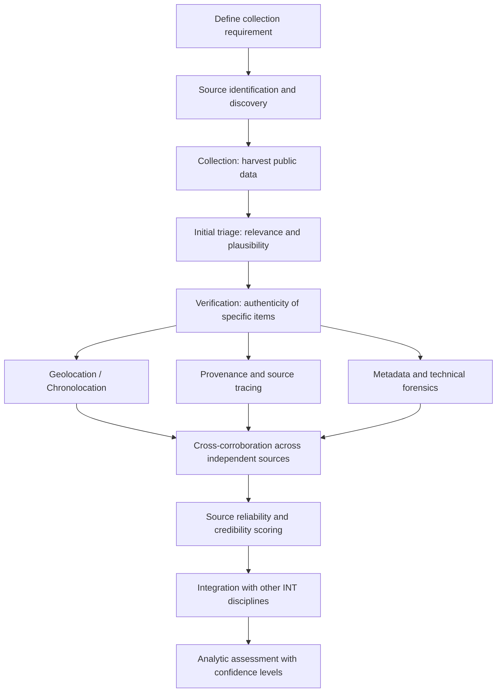

## Open-Source Intelligence Collection and Verification

### Overview

Open-Source Intelligence (OSINT) is intelligence derived from publicly available information — media, government publications, academic and grey literature, commercial data, and increasingly, social media, satellite imagery, and other digitally-native sources — that is deliberately discovered, discriminated, distilled, and disseminated to meet a specific analytic requirement. The defining characteristic that separates OSINT from casual internet research is not the *source type* (public vs. classified) but the *analytic discipline* applied: systematic collection against defined requirements, source evaluation, cross-corroboration, and explicit confidence assessment, following the same tradecraft rigor expected of any other intelligence discipline (SIGINT, HUMINT, IMINT).

Since roughly the mid-2010s, OSINT has been substantially reshaped by two developments: the proliferation of high-resolution commercial satellite imagery and geospatial tools, and the rise of "digital forensics" verification communities (Bellingcat being the most prominent example) that apply structured, often crowd-assisted methods to verify user-generated content (UGC) — social media video, images, and metadata — at a scale and speed that traditional media verification could not match. This has made OSINT increasingly central to geopolitical risk analysis, particularly for conflict monitoring, sanctions evasion detection, and infrastructure/supply-chain risk assessment.

### Key Points

- OSINT is defined by **analytic tradecraft applied to public data**, not simply by the public availability of the underlying source — undisciplined internet research is not OSINT in the professional sense.
- The core workflow follows a **collection → verification → corroboration → assessment** pipeline, mirroring the broader intelligence cycle (requirements, collection, processing, analysis, dissemination).
- **Verification of user-generated content** (geolocation, chronolocation, source/provenance tracing, reverse image search) has become a specialized sub-discipline within OSINT, driven substantially by conflict-monitoring use cases.
- OSINT is uniquely exposed to **deliberate deception and information operations** because its sources are, by definition, publicly accessible and therefore equally accessible to actors seeking to manipulate the information environment.
- Legal, ethical, and platform-policy constraints (privacy law, platform terms of service, doxxing risk) are a live operational concern in OSINT practice, distinct from — but often conflated with — its purely technical methodology.

### The OSINT Collection Cycle

### Source Categories

| Category | Examples | Primary Analytic Use |
| --- | --- | --- |
| Traditional media | Wire services, national/local press, trade publications | Baseline event reporting, official statements |
| Government/institutional | Official statements, court filings, regulatory filings, budget documents | Policy intent, legal exposure, procurement trends |
| Academic/grey literature | Think tank reports, conference papers, technical standards docs | Deep domain context, technical specification |
| Commercial data | Corporate registries, shipping/AIS data, trade databases, satellite imagery providers | Sanctions evasion, supply chain mapping, infrastructure monitoring |
| Social media / UGC | Video, images, livestreams, posts | Real-time/near-real-time event verification, ground-truth signal |
| Geospatial | Satellite imagery (commercial and open), aerial imagery, mapping platforms | Physical verification, change detection, force posture |

### Verification Techniques for User-Generated Content

**Geolocation** — Determining where an image or video was captured by matching visible terrain, architecture, signage, vegetation, or shadow angles against satellite imagery, street-view platforms, and mapping data. Typically an iterative process of narrowing candidate locations through distinctive visual anchors (a specific building facade, road layout, or terrain feature) and confirming via multiple independent visual matches.

**Chronolocation** — Establishing *when* content was captured, using shadow-angle/sun-position calculation (given a geolocated position, shadow length and direction can bound plausible date/time ranges), weather-record cross-referencing, and contextual clues (foliage state, event-specific visual markers) to narrow or confirm a timeframe independent of any claimed upload date.

**Reverse image/video search** — Using tools to check whether an image or video has appeared previously online, which can reveal recycled or mislabeled content presented as new/current — a common vector for deliberate misattribution during fast-moving events.

**Metadata analysis** — Examining EXIF data (where present and unstripped by platform compression), file properties, and platform-specific artifacts, while accounting for the fact that most major social platforms strip identifying metadata on upload — meaning absence of metadata is not itself suspicious, but its presence can be highly informative when intact.

**Source and provenance tracing** — Identifying the original poster/account and tracing the propagation path of content across platforms, since the earliest verifiable instance of a piece of content is generally the most evidentially significant, and content that has been re-shared through multiple unverified intermediaries carries substantially higher risk of manipulation or mislabeling by the time it's widely circulated.

**Cross-platform and cross-source corroboration** — No single piece of UGC is treated as verified in isolation; standard practice requires independent corroboration from at least one additional source type (a second video from a different angle/account, satellite imagery consistent with the claimed location, or traditional media confirmation) before an item informs an analytic judgment.

### Verification Workflow — Illustrated

<svg xmlns="http://www.w3.org/2000/svg" viewBox="0 0 720 300">
<text x="360" y="24" text-anchor="middle" font-size="15" font-weight="bold" fill="#1a1a1a">UGC Verification Workflow (svg_diagram)</text>
<rect x="30" y="50" width="150" height="50" rx="6" fill="#2c5f8a" />
<text x="105" y="80" text-anchor="middle" font-size="12" fill="#fff">Candidate content surfaces</text>
<rect x="220" y="50" width="150" height="50" rx="6" fill="#2c5f8a" />
<text x="295" y="72" text-anchor="middle" font-size="11" fill="#fff">Reverse search:</text>
<text x="295" y="88" text-anchor="middle" font-size="11" fill="#fff">is this recycled?</text>
<rect x="410" y="50" width="150" height="50" rx="6" fill="#2c5f8a" />
<text x="485" y="72" text-anchor="middle" font-size="11" fill="#fff">Geolocation via</text>
<text x="485" y="88" text-anchor="middle" font-size="11" fill="#fff">visual anchors</text>
<rect x="600" y="50" width="100" height="50" rx="6" fill="#2c5f8a" />
<text x="650" y="80" text-anchor="middle" font-size="11" fill="#fff">Chronolocation</text>
<line x1="180" y1="75" x2="220" y2="75" stroke="#666" stroke-width="2" marker-end="url(#arrow)" />
<line x1="370" y1="75" x2="410" y2="75" stroke="#666" stroke-width="2" marker-end="url(#arrow)" />
<line x1="560" y1="75" x2="600" y2="75" stroke="#666" stroke-width="2" marker-end="url(#arrow)" />
<rect x="180" y="140" width="360" height="50" rx="6" fill="#8a4c2c" />
<text x="360" y="170" text-anchor="middle" font-size="12" fill="#fff">Cross-corroborate: ≥1 independent source type required</text>
<line x1="105" y1="100" x2="105" y2="165" stroke="#666" stroke-width="2" />
<line x1="105" y1="165" x2="180" y2="165" stroke="#666" stroke-width="2" marker-end="url(#arrow)" />
<line x1="485" y1="100" x2="485" y2="165" stroke="#666" stroke-width="2" marker-end="url(#arrow)" />
<line x1="650" y1="100" x2="650" y2="165" stroke="#666" stroke-width="2" />
<line x1="650" y1="165" x2="540" y2="165" stroke="#666" stroke-width="2" marker-end="url(#arrow)" />
<rect x="230" y="230" width="260" height="46" rx="6" fill="#2c8a5f" />
<text x="360" y="258" text-anchor="middle" font-size="12" fill="#fff">Assign source reliability + confidence level</text>
<line x1="360" y1="190" x2="360" y2="225" stroke="#666" stroke-width="2" marker-end="url(#arrow)" />
</svg>

### Source Reliability Frameworks

Professional OSINT practice typically separates two independent axes of source assessment, following conventions similar to the NATO Admiralty System used across intelligence disciplines:

- **Source reliability** (A–F scale) — an assessment of the *source's* track record and trustworthiness, independent of any specific report's content (e.g., "A" = reliable, no doubt of authenticity; "F" = reliability cannot be judged).
- **Information credibility** (1–6 scale) — an assessment of the *specific item's* plausibility and corroboration status, independent of the source's general reputation (e.g., "1" = confirmed by other independent sources; "6" = truth cannot be judged).

This two-axis separation matters because a generally reliable source can report unconfirmed or incorrect information, and a generally unreliable or unknown source can occasionally produce accurate, independently corroborated content — collapsing the two into a single trust score discards analytically important information.

### Deception, Disinformation, and OSINT-Specific Risk

Because OSINT sources are by definition publicly accessible, they are equally accessible to actors with incentive to manipulate the information environment — state information operations, coordinated inauthentic behavior networks, and opportunistic misattribution during fast-moving events (old footage relabeled as current, footage from a different conflict misattributed to the event under analysis). Key mitigations specific to this risk:

- **Never single-source a high-stakes judgment from UGC** — the corroboration requirement above is the primary structural defense.
- **Treat rapid, high-volume, coordinated posting patterns as a signal warranting scrutiny**, since organic information spread and coordinated amplification campaigns often have distinguishable structural signatures (posting velocity, account creation clustering, network structure).
- **Explicitly track provenance chains**, since content that has passed through multiple unverified reposts before reaching the analyst carries cumulative, often unrecoverable uncertainty about its original context.
- [Inference] The specific technical signatures used to detect coordinated inauthentic behavior and synthetic media are an actively evolving area, and detection methods that are reliable at one point are subject to adversarial adaptation over time — this is a structural feature of the domain rather than a gap in any particular method.

### Worked Example — Geopolitical Risk Application

**Scenario**: A risk team receives social media video allegedly showing new military infrastructure construction near a contested border, relevant to a client's regional operations risk assessment.

1. **Reverse search** confirms the video does not match any prior known upload — it is not recycled footage from an earlier period.
2. **Geolocation** matches visible terrain and a distinctive road junction against satellite basemap imagery, narrowing the candidate location to a specific coordinate.
3. **Chronolocation** via shadow-angle analysis at the geolocated coordinates is consistent with a claimed recent capture date, within a plausible seasonal window.
4. **Commercial satellite imagery** for the identified coordinates is pulled for the relevant date range, providing independent corroboration of construction activity consistent with the video.
5. **Source reliability/credibility scoring**: the original posting account has no established track record (reliability: unproven), but the information itself is now rated as confirmed by independent means (credibility: 1–2 on the standard scale) due to satellite corroboration — illustrating why the two axes are scored separately.
6. **Integration**: the verified OSINT finding is combined with any available commercial/trade data (contractor filings, procurement announcements) to assess purpose and pace of construction, feeding the broader geopolitical risk judgment with an explicit confidence level and sourcing trail.

### Limitations

- **Verification is resource- and skill-intensive** relative to raw collection volume; the bottleneck in modern OSINT is typically triage and verification capacity, not availability of raw data.
- **Platform dependency and access risk**: API access changes, platform policy shifts, and account suspensions can materially disrupt established collection workflows with little warning, an operational risk distinct from the analytic methodology itself.
- **Legal and ethical constraints**: privacy law, platform terms of service, and doxxing risk impose real limits on permissible collection and publication practices, particularly regarding identification of private individuals — these constraints vary by jurisdiction and organizational policy and should be treated as a first-class operational concern, not an afterthought.
- **Selection bias in UGC availability**: content availability correlates with internet penetration, platform usage patterns, and even lighting/time-of-day conditions, meaning the *absence* of UGC evidence for an event is weak evidence of the event's absence and should not be over-weighted.

### Related Topics

- Cognitive bias mitigation in analytic judgment
- Analysis of Competing Hypotheses (ACH)
- Source reliability and the Admiralty System (NATO grading convention)
- Geospatial intelligence (GEOINT) and commercial satellite imagery analysis
- Information operations and disinformation detection
- Digital forensics and synthetic media (deepfake) detection
- Sanctions evasion monitoring via commercial/trade data OSINT