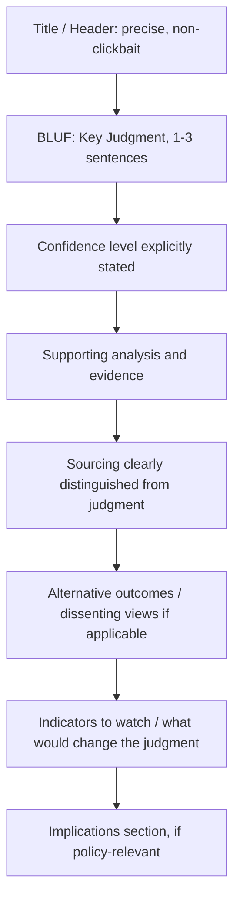

## Writing Analytic Assessments and Policy Memos

### Overview

Writing analytic assessments is the tradecraft discipline of translating analytic judgment — the outputs of methods like ACH, structured brainstorming, or net assessment — into a written product that a time-constrained decision-maker can act on with an accurate understanding of both the conclusion and its uncertainty. This is not a stylistic afterthought to analysis; poorly structured or poorly hedged writing can actively distort a correct analytic judgment as effectively as a flawed analytic process can. The discipline is codified most explicitly in the US Intelligence Community through Intelligence Community Directive (ICD) 203, "Analytic Standards," which mandates specific conventions around source description, confidence-language, and the explicit separation of what is known from what is judged.

The core tension the discipline manages is between **decision-usability** (a memo that is too hedged, too long, or too caveated will not be read or acted on) and **analytic integrity** (a memo that overstates certainty to be more "useful" misleads the reader about the actual state of knowledge). Effective analytic writing resolves this tension through structure and convention rather than through simply writing more or less confidently.

### Key Points

- **BLUF (Bottom Line Up Front)** is the near-universal structural convention: the key judgment appears in the first sentence or paragraph, not the conclusion — decision-makers often read only the opening lines.
- **Confidence language must be standardized and distinguished from probability language** — "likely" and "high confidence" answer different questions (how probable is the event vs. how much does the analyst trust the judgment) and conflating them is a common and consequential error.
- **Sourcing and judgment must be visibly separated** — the reader must be able to distinguish "here is what a source reported" from "here is what the analyst concludes," which requires explicit textual signaling, not just accurate underlying reasoning.
- **Alternative outcomes and their drivers belong in the product**, not just the favored judgment — ICD 203-style standards explicitly require presenting alternative hypotheses when there is significant analytic uncertainty, echoing ACH's ranked-hypothesis output rather than a single flat conclusion.
- **Actionability is a first-class requirement** for policy memos specifically (as distinct from pure assessments) — a policy memo that describes a situation without addressing implications or decision points for the reader has not fully done its job.

### Standard Structure — Analytic Assessment

### The BLUF Convention — Mechanics

BLUF inverts the structure familiar from academic or journalistic writing, where context and evidence typically precede the conclusion. In analytic writing, the key judgment leads:

**Weak (context-first) structure**:

> "Over the past six months, Country X has undertaken several diplomatic and economic actions that bear on regional stability, including trade agreement negotiations, military exercises, and statements from senior officials regarding..."

**BLUF-compliant structure**:

> "Country X is likely to formalize a defense pact with Country Y within the next two quarters, driven primarily by [specific driver]. This assessment is made with moderate confidence."

The rationale is empirical and practical rather than stylistic preference: senior decision-makers frequently read only the first paragraph of a product under time pressure, so any judgment placed after that point risks not reaching the reader at all, regardless of how well-supported it is in the body of the text.

### Confidence Language vs. Probability Language

This is one of the most consistently misapplied conventions in analytic writing, and ICD 203 treats it as a distinct, mandatory dimension of any judgment.

| Dimension | Answers the question | Example terms | Independent of |
| --- | --- | --- | --- |
| **Probability / likelihood language** | How likely is the event itself? | almost no chance, unlikely, roughly even chance, likely, almost certain | The analyst's confidence in that estimate |
| **Confidence level** | How much does the analyst trust this judgment, given evidence quality, source reliability, and analytic assumptions? | low / moderate / high confidence | The actual probability assigned |

A judgment can be stated as "likely" with **low confidence** (a directional lean based on thin or single-sourced evidence) or "roughly even chance" with **high confidence** (a well-supported judgment that the outcome is genuinely uncertain, not an artifact of poor information). Collapsing these into a single scale — treating "high confidence" as if it always means "very likely" — is a documented source of miscommunication between analysts and policy consumers.

### Confidence and Probability — Illustrated Independence

<svg xmlns="http://www.w3.org/2000/svg" viewBox="0 0 640 320">
<text x="320" y="24" text-anchor="middle" font-size="15" font-weight="bold" fill="#1a1a1a">Probability vs. Confidence Are Independent Axes (svg_diagram)</text>

<line x1="80" y1="270" x2="560" y2="270" stroke="#333" stroke-width="1.5" />
<line x1="80" y1="270" x2="80" y2="60" stroke="#333" stroke-width="1.5" />
<text x="320" y="298" text-anchor="middle" font-size="12" fill="#333">Probability the event occurs (low → high)</text>
<text x="30" y="165" text-anchor="middle" font-size="12" fill="#333" transform="rotate(-90 30 165)">Analyst confidence (low → high)</text>

<circle cx="180" cy="100" r="7" fill="#2c5f8a" />
<text x="180" y="85" text-anchor="middle" font-size="10" fill="#2c5f8a">"Unlikely," high confidence</text>
<circle cx="460" cy="100" r="7" fill="#8a2c2c" />
<text x="460" y="85" text-anchor="middle" font-size="10" fill="#8a2c2c">"Likely," high confidence</text>
<circle cx="180" cy="230" r="7" fill="#2c8a5f" />
<text x="180" y="248" text-anchor="middle" font-size="10" fill="#2c8a5f">"Unlikely," low confidence</text>
<circle cx="460" cy="230" r="7" fill="#8a7a2c" />
<text x="460" y="248" text-anchor="middle" font-size="10" fill="#8a7a2c">"Likely," low confidence</text>
<circle cx="320" cy="165" r="7" fill="#5a2c8a" />
<text x="320" y="150" text-anchor="middle" font-size="10" fill="#5a2c8a">"Even chance," high confidence</text>
<text x="320" y="185" text-anchor="middle" font-size="9" fill="#666">(genuinely uncertain, well-supported)</text>
</svg>

### Separating Sourcing from Judgment

Analytic products must make it structurally clear which statements are reported fact (with sourcing attribution and reliability caveats) and which are the analyst's own inference or conclusion. Common textual conventions:

- **Reported information**: "According to [source type/reliability grade], Country X's finance ministry has begun..." — attributes the claim and implicitly or explicitly signals source reliability.
- **Analytic judgment**: "We assess that..." / "We judge that..." — explicitly flags analyst-generated inference, distinct from a sourced fact.
- **Assumption-dependent judgment**: "This judgment assumes that..." — surfaces a load-bearing assumption the reader should be aware could invalidate the conclusion if wrong, echoing the Key Assumptions Check technique.

Blurring these categories — presenting an inference in the same voice as a sourced fact — is one of the more consequential writing failures because it transfers analyst uncertainty onto the reader invisibly, defeating the purpose of the confidence-language conventions described above.

### Analytic Assessment vs. Policy Memo

| Dimension | Analytic Assessment | Policy Memo |
| --- | --- | --- |
| Primary purpose | Characterize a situation and its trajectory | Inform or support a specific decision |
| Audience | Broad — analytic/decision-maker community | Often narrower — specific decision-maker(s) |
| Structural emphasis | BLUF, evidence, confidence, alternatives | BLUF, implications, options, recommendation (if in scope) |
| Recommendation content | Generally avoided — assessments characterize, they don't advocate | Often expected — policy memos may explicitly lay out options and trade-offs |
| Time horizon framing | Can be descriptive/diagnostic (net-assessment style) | Usually tied to an imminent or pending decision point |

The line between the two is a live institutional debate: rigid separation of "intelligence" (assessment) from "policy" (recommendation) is a longstanding IC norm intended to preserve analytic objectivity, but geopolitical risk analysis in a corporate/consulting context often blends the two by design, since clients typically want both the assessment and its implications for a specific decision.

### Worked Example — Structure Applied

**Prompt**: Will Country Z's currency peg hold through year-end?

> **BLUF**: We assess that Country Z's currency peg is unlikely to hold through year-end without a significant policy intervention, with moderate confidence. This judgment reflects thinning foreign reserves and increasing black-market spread, but is tempered by the government's demonstrated political will to defend the peg in two prior comparable episodes.
>
> **Confidence and key assumptions**: This judgment assumes no material change in [specific external variable]. Confidence is moderate rather than high because reserve reporting from official sources has historically lagged actual reserve positions by 4–6 weeks, per [source reliability note].
>
> **Supporting analysis**: [Evidence, trend data, sourced reporting distinguished from analyst inference throughout]
>
> **Alternative outcome**: A negotiated external support package — currently under discussion per [sourced reporting] — could allow the peg to hold; we assess this as a roughly even-chance possibility independent of the primary judgment above.
>
> **Indicators to watch**: A drawdown of reserves below [specific threshold], a shift in official rhetoric away from peg defense, or confirmation of external support negotiations would each warrant reassessment.
>
> **Implications** (policy-memo-specific addition): For [decision-maker's specific exposure], this suggests [concrete decision-relevant framing] ahead of the year-end window.

### Common Failure Modes

- **Burying the lede**: leading with background/context rather than the key judgment, risking the judgment never being read.
- **False precision**: assigning a specific numeric probability or an overly narrow confidence band when the underlying evidence does not support that level of granularity.
- **Confidence-probability conflation**: using "high confidence" and "highly likely" interchangeably, which — as shown above — collapses two independent and separately meaningful dimensions.
- **Invisible assumption-dependence**: presenting a conclusion without flagging the load-bearing assumptions it rests on, leaving the reader unable to judge how the assessment would change if those assumptions were wrong.
- **Advocacy creep in assessments**: allowing a policy preference to shape the framing of what is nominally a neutral assessment — a specific institutional manifestation of confirmation bias at the writing stage rather than the analysis stage.
- [Inference] In fast-turnaround geopolitical risk contexts, time pressure often compresses the "alternative outcomes" and "indicators to watch" sections first, since they are seen as secondary to the primary judgment — this is a documented tendency in practitioner discussion of tradecraft under deadline pressure rather than a formally studied finding.

### Related Topics

- Cognitive bias mitigation in analytic judgment
- Analysis of Competing Hypotheses (ACH)
- ICD 203 Analytic Standards and confidence-language conventions
- Key Assumptions Check
- Source reliability grading (Admiralty System)
- Calibration and probabilistic forecasting (Brier scoring, superforecasting literature)
- Indicators and Warning (I&W) product design