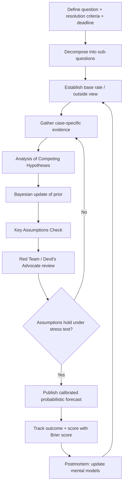

## Principles of Forecasting Under Geopolitical Uncertainty

### Overview

Forecasting under geopolitical uncertainty is the discipline of producing structured, decision-useful judgments about future political, security, and economic events when the underlying system is non-stationary, adversarial, and low-frequency in its most consequential outcomes. Unlike forecasting in domains with abundant historical data and stable generative processes (e.g., weather, credit default rates), geopolitical forecasting deals with unique, path-dependent events (a coup, an invasion, a sanctions regime collapse) that resist standard statistical extrapolation. The discipline sits at the intersection of intelligence analysis tradecraft, applied probability, decision theory, and behavioral psychology.

### Core Conceptual Distinctions

**Risk vs. Uncertainty vs. Ambiguity**

- **Risk**: Outcomes and their probability distributions are known (e.g., actuarial tables). Rare in geopolitics.
- **Uncertainty** (Knightian): Possible outcomes may be enumerable, but probabilities are unknown or contested. Most geopolitical forecasting operates here.
- **Ambiguity**: Even the space of possible outcomes is not fully known — "unknown unknowns." Structural breaks, novel weapons technology, or unprecedented alliance realignments often fall here.

A mature forecasting practice explicitly tags which regime a question falls into, because the appropriate method differs: risk problems tolerate frequentist modeling; uncertainty problems require subjective (Bayesian) probability elicitation; ambiguity problems require scenario planning rather than point forecasts.

**Aleatory vs. Epistemic Uncertainty**

- **Aleatory uncertainty**: Irreducible randomness in the system itself (e.g., exact timing of a leader's death, weather affecting a military operation).
- **Epistemic uncertainty**: Uncertainty due to incomplete information that could, in principle, be reduced with more/better data (e.g., unclear troop positioning, ambiguous signaling).

This distinction matters operationally: epistemic uncertainty justifies investment in intelligence collection or additional research; aleatory uncertainty does not — no amount of study reduces genuine randomness, so effort should shift to robustness/hedging instead of further inquiry.

### Foundational Principles

**1. Probabilistic Thinking Over Binary Prediction**

Point predictions ("X will happen") are epistemically dishonest for genuinely uncertain events. The Tetlock/Good Judgment Project research program established that calibrated probabilistic forecasts (e.g., "35% chance of a ceasefire by Q3") consistently outperform confident binary claims and allow for rigorous scoring.

**Key Points**

- Use explicit probability ranges or point probabilities, not verbal hedges alone ("likely," "probable") without a numeric anchor — the Kent/Sherman Kent "Words of Estimative Probability" problem shows that readers interpret vague qualifiers wildly inconsistently.
- Standard IC (Intelligence Community) probability bands, per ICD 203:

| Term | Probability Range |
| --- | --- |
| Almost no chance | 1–5% |
| Very unlikely | 5–20% |
| Unlikely | 20–45% |
| Roughly even chance | 45–55% |
| Likely | 55–80% |
| Very likely | 80–95% |
| Almost certain | 95–99% |

**2. Calibration and Resolution as Twin Goals**

- **Calibration**: Of all events assigned 70% probability, roughly 70% should occur. Measured via Brier scores or calibration curves.
- **Resolution**: The forecaster's ability to discriminate — assigning probabilities far from the base rate (0% or 100%) when justified, rather than always hedging near 50%.

$$\text{Brier Score} = \frac{1}{N}\sum_{i=1}^{N}(f_i - o_i)^2$$

where $f_i$ is the forecast probability and $o_i \in \{0,1\}$ is the observed outcome. Lower is better; a Brier score can be decomposed (Murphy decomposition) into calibration, resolution, and uncertainty terms — a forecaster can be well-calibrated but low-resolution (uninformative), which is why calibration alone is an insufficient success metric.

**3. Base Rate Anchoring (Outside View)**

Kahneman and Tversky's "inside view / outside view" distinction is central. Analysts fixate on the specific causal story of the case at hand (inside view) and neglect the reference class of similar historical cases (outside view — e.g., "how often do post-election disputes escalate to armed conflict across all historical instances?"). Forecasting under geopolitical uncertainty requires:

1. Identify a reference class of structurally similar past events (coups, insurgencies, currency crises, border skirmishes).
2. Establish the base rate of the outcome in that reference class.
3. Adjust the base rate using case-specific evidence — but treat large adjustments with suspicion, since case-specific narratives are more persuasive than they are diagnostic.

[Inference] Because comprehensive, clean reference-class datasets for many geopolitical event types (e.g., "leader assassination attempts leading to regime change") are sparse or contested in coding methodology, base rate estimates in this domain often carry wider uncertainty than base rates in domains like public health or finance.

**4. Fox vs. Hedgehog Cognitive Style**

Tetlock's "Expert Political Judgment" research found that "foxes" — forecasters who draw on many small, competing models and update incrementally — substantially outperform "hedgehogs" — forecasters who apply one grand theory (realism, liberal institutionalism, a single ideological lens) to every case. Practical implications:

- Maintain multiple competing hypotheses simultaneously (see Analysis of Competing Hypotheses below).
- Distrust any single-paradigm explanation that accounts for "everything."
- Actively seek disconfirming evidence rather than confirming a preferred narrative.

**5. Decomposition**

Complex geopolitical questions should be decomposed into smaller, more tractable sub-questions with clearer resolution criteria, then recombined (often via a probability tree or Fermi-style estimation).

*Example*: "Will there be a military confrontation between Country A and Country B in the next 12 months?" decomposes into:

- P(diplomatic talks collapse)
- P(escalatory incident occurs | talks collapsed)
- P(incident triggers military response | escalatory incident occurs)
- P(response classified as "confrontation" by resolution criteria | military response occurs)

Combine via conditional probability chains rather than guessing the compound event directly, since human intuition is poor at estimating low-probability compound events holistically.

**6. Timeframe and Resolution Criteria Discipline**

A forecast without a specific time horizon and an unambiguous resolution criterion is not falsifiable and therefore not a real forecast. "Tensions will rise" is not scoreable; "Country X will impose new sanctions on Country Y before December 31" is. Superforecasting tradecraft insists on:

- A hard deadline.
- A binary or ordinal, publicly verifiable resolution source agreed upon in advance.
- Explicit handling of ambiguous edge cases in the question wording itself.

**7. Adversarial and Strategic Dynamics**

Geopolitical actors are not passive stochastic processes — they observe forecasts, adapt, and sometimes deliberately falsify signals (deception, denial, maskirovka-style operations). This means:

- Historical base rates can be actively invalidated by actors aware they are being modeled (Goodhart/Lucas-critique analog).
- Game-theoretic reasoning (best-response analysis, signaling games) supplements probabilistic forecasting, particularly for questions involving negotiation, deterrence, or coercive diplomacy.
- Analysts must account for deliberate deception operations and the possibility that observed "signals" are engineered for exactly this audience.

**8. Distinguishing Forecasting from Scenario Planning**

- **Forecasting** produces probability-weighted, falsifiable statements about specific future states, optimized for questions with reasonably bounded outcome spaces.
- **Scenario planning** constructs several internally consistent, divergent narratives of the future to stress-test strategy and decision-making under deep (ambiguous) uncertainty, without assigning precise probabilities.

[Inference] The two are complementary rather than substitutable: scenario planning is generally preferred when the outcome space itself is contested or evolving (e.g., "what does the post-hegemonic order look like in 2050"), while probabilistic forecasting is preferred for bounded, near-term, resolvable questions (e.g., "will the ceasefire hold through year-end"). This chapter's subsequent sections cover scenario construction in depth.

### Structured Analytic Techniques (Tradecraft)

**Analysis of Competing Hypotheses (ACH)**

Developed by Richards Heuer at CIA. Procedure:

1. Enumerate all plausible hypotheses (not just the leading one).
2. List all available evidence/arguments.
3. Build a matrix scoring each piece of evidence against each hypothesis for consistency/inconsistency (not just support for the favored hypothesis).
4. Identify the hypothesis with the *least* inconsistent evidence, rather than the one with the *most* supporting evidence — this counters confirmation bias, since diagnostic evidence is evidence that discriminates between hypotheses, not evidence that merely confirms one.
5. Seek evidence that would most efficiently eliminate hypotheses.

**Key Assumptions Check**

Before finalizing a forecast, explicitly list the load-bearing assumptions underlying the analysis and stress-test each one: "What if this assumption is wrong?" This surfaces single points of failure in the analytic chain.

**Red Teaming / Team A–Team B**

An independent team constructs the strongest case for an alternative hypothesis or for the adversary's perspective, deliberately countering groupthink and mirror-imaging (the error of assuming an adversary reasons as the analyst would).

**Devil's Advocacy**

A designated individual argues against the prevailing consensus judgment, structurally institutionalizing dissent so that groupthink does not suppress minority-but-correct views.

**Premortem Analysis**

Before committing to a forecast, imagine the forecast turned out to be badly wrong, and work backward to construct plausible causal paths that would produce that failure. This technique (Klein) surfaces blind spots that forward reasoning misses.

### Cognitive Biases Specific to Geopolitical Forecasting

**Key Points**

- **Mirror-imaging**: Assuming a foreign leader or state will behave as the analyst's own culture/political system would.
- **Groupthink**: Consensus-seeking within an analytic team suppresses dissenting, possibly correct, views (classic case study: the 1961 Bay of Pigs assessment).
- **Availability heuristic**: Overweighting vivid, recent, or media-salient events (e.g., overestimating terrorism risk after a high-profile attack relative to base rates).
- **Confirmation bias**: Selectively seeking/interpreting evidence that supports a pre-existing hypothesis about a regime's or actor's intentions.
- **Overconfidence / narrative fallacy**: Constructing a single coherent causal story that feels compelling and treating its coherence as evidence of its accuracy (Kahneman/Taleb).
- **Status quo bias**: Systematically underestimating the probability of abrupt regime change, war onset, or discontinuous shifts because continuity is the more cognitively available default.
- **Anchoring**: Insufficiently updating away from an initially stated probability, even after receiving strong disconfirming evidence.

### Forecasting Methodologies in Practice

**1. Structured Expert Elicitation**

Formal aggregation of subject-matter expert judgments using techniques such as:

- **Delphi Method**: Iterative, anonymous rounds of estimation with feedback of the group's aggregate distribution between rounds, converging on a consensus range while reducing social conformity pressure.
- **IDEA Protocol** (Investigate, Discuss, Estimate, Aggregate): A structured elicitation method used in ecological and geopolitical risk contexts to combine independent estimation with facilitated discussion before final aggregation.

**2. Crowd/Prediction Markets and Forecasting Tournaments**

Aggregating many independent forecasts (via prediction markets or tournament platforms like the Good Judgment Project's successors) often outperforms individual experts, consistent with "wisdom of crowds" findings — provided forecasters are genuinely independent and diverse in information sources, since correlated errors do not cancel out.

**3. Quantitative/Structural Models**

Used primarily for base-rate generation rather than point-event prediction:

- **Conflict onset models** (e.g., logistic regression or machine learning models using variables like GDP per capita, regime type, ethnic fractionalization, prior conflict history) — academic literature includes the Political Instability Task Force (PITF) models and ViEWS (Violence Early-Warning System).
- **Elite/political survival models**: Bueno de Mesquita's selectorate theory-informed models estimate leader durability and coup risk from institutional variables.
- **Economic stress indicators**: Sovereign bond spreads, currency reserve depletion rates, and capital flight patterns as leading indicators of state fragility.

[Unverified] Publicly reported accuracy rates for structural conflict-onset models vary substantially by study and region, and out-of-sample performance for novel conflict types is generally weaker than in-sample fit — treat specific accuracy percentages cited in individual papers with caution absent independent replication.

**4. Bayesian Updating**

Systematic revision of a prior probability as new evidence arrives:

$$P(H \mid E) = \frac{P(E \mid H) \, P(H)}{P(E)}$$

where $H$ is the hypothesis (e.g., "State X will invade State Y"), $E$ is newly observed evidence (e.g., troop mobilization near the border), $P(H)$ is the prior probability, $P(E \mid H)$ is the likelihood of observing that evidence given the hypothesis is true, and $P(E)$ is the marginal probability of the evidence across all hypotheses.

*Example*: If the prior probability of invasion is 15%, and troop mobilization is observed 90% of the time before actual invasions but also occurs 20% of the time as a bluffing/coercive-signaling tactic with no invasion following, Bayes' theorem yields a substantially revised posterior — illustrating why single-indicator evidence should rarely be treated as dispositive without considering its false-positive rate under alternative hypotheses (denial and deception).

### Diagram: Forecasting Workflow Under Uncertainty

### Worked Example: Applying the Principles

**Example**

Question: "Will Country Z experience a change in head of government (via any mechanism) within 12 months?"

1. **Resolution criteria**: Defined precisely — includes election loss, resignation, coup, or death in office; excludes cabinet reshuffles that leave the head of government in place.
2. **Base rate**: Historical reference class of "leaders in similarly structured semi-presidential systems with sub-40% approval and an active opposition coalition" shows head-of-government turnover in roughly a documented historical range within 12-month windows — establishing an outside-view anchor. [Inference: exact percentage depends on reference-class construction and dataset chosen; treat any specific cited figure as illustrative unless sourced to a specific, named dataset.]
3. **Case-specific adjustment**: Current approval polling, coalition fragility, upcoming no-confidence vote scheduling, and elite defection signals are weighed as Bayesian evidence adjusting the prior upward or downward.
4. **ACH matrix**: Competing hypotheses — (a) government survives full term, (b) negotiated early election, (c) coup, (d) resignation under scandal pressure — each scored against available evidence (opposition statements, military statements, economic indicators).
5. **Key assumptions check**: Is the assumption "the military remains apolitical" load-bearing? If military neutrality is uncertain, this materially changes hypothesis (c)'s weight.
6. **Final output**: A calibrated probability distribution across the mutually exclusive, collectively exhaustive outcomes (e.g., 55% survives term / 25% negotiated early election / 12% resignation / 8% coup), each individually falsifiable and dated.

### Common Pitfalls

**Key Points**

- Treating punditry (confident narrative explanation) as equivalent to forecasting (falsifiable, scored probability).
- Neglecting to track forecast accuracy over time, which prevents any real calibration feedback loop from forming.
- Using vague verbal probability language without numeric anchors, causing miscommunication with decision-makers.
- Over-reliance on a single information source or a single analytic paradigm (hedgehog failure mode).
- Failing to specify a resolution deadline, producing an unfalsifiable and therefore untestable claim.
- Ignoring adversarial adaptation — assuming actors will not change behavior in response to being observed or forecasted.
- Conflating confidence in the analytic process with confidence in the outcome probability itself (process rigor does not guarantee a high or low probability — it guarantees a *defensible* probability).

### Conclusion

Principled forecasting under geopolitical uncertainty replaces narrative confidence with calibrated, falsifiable, probabilistic judgment, disciplined by base-rate anchoring, structured analytic techniques, explicit assumption-testing, and continuous accuracy tracking. It treats forecasting as a measurable skill rather than an art of persuasive storytelling, and it explicitly distinguishes tractable, resolvable near-term questions (suited to point forecasts) from deeply ambiguous, structurally uncertain futures (better suited to scenario planning, covered in subsequent sections of this chapter).

**Related Topics**

- Scenario planning and alternative futures construction
- Structured Analytic Techniques (ACH, Key Assumptions Check, Red Teaming) in depth
- Superforecasting and the Good Judgment Project methodology
- Bayesian reasoning and probability elicitation techniques
- Early-warning indicator systems and leading indicators of state fragility
- Conflict onset modeling (PITF, ViEWS, machine learning approaches)
- Cognitive bias mitigation in intelligence analysis
- Wargaming and simulation as complements to probabilistic forecasting
- Deception, denial, and adversarial signaling in strategic forecasting
- Calibration training and Brier score tracking systems