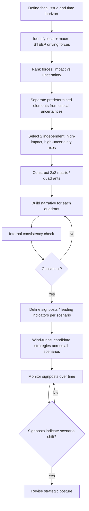

## Scenario Development and Axes of Uncertainty


### Overview

Scenario development is a structured methodology for exploring plural, internally consistent futures under conditions of deep (ambiguous) uncertainty, rather than producing a single most-likely forecast. Where probabilistic forecasting (covered in the preceding section) is optimized for bounded, resolvable, near-term questions, scenario planning is optimized for strategic questions where the outcome space itself is contested, the timeframe is long, causal drivers interact non-linearly, and decision-makers need to stress-test strategy across a *range* of plausible futures rather than bet on one. Its intellectual lineage runs from military wargaming through Herman Kahn's Cold War futurism at RAND, into Royal Dutch Shell's corporate scenario planning under Pierre Wack in the 1970s (credited with anticipating the 1973 oil shock), and into contemporary geopolitical risk practice at institutions such as the National Intelligence Council (the "Global Trends" series) and private risk advisories.

### Why Scenarios Instead of a Single Forecast

**Key Points**

- Deep uncertainty means the *set* of possible outcomes, not just their probabilities, is contested — a single point forecast conceals rather than communicates this.
- Scenarios decouple planning from prediction: the goal is not "which scenario is correct" but "is our strategy robust across the plausible range."
- Scenarios counter overconfidence and narrative lock-in by forcing engagement with futures the analyst may find uncomfortable or unlikely-feeling.
- Scenarios are a communication device as much as an analytic one — they make strategic assumptions visible and debatable to decision-makers who may not engage with probability tables.

[Inference] Scenario planning is most valuable, relative to point forecasting, in proportion to how long the time horizon is and how structurally unstable the current system appears — for short-horizon, well-bounded questions the marginal value of full scenario construction over a decomposed probabilistic forecast is typically lower.

### Core Methodology: The Intuitive Logics / GBN Approach

The most widely used framework in corporate and geopolitical risk practice descends from the Global Business Network (GBN) method (Schwartz, "The Art of the Long View"). The canonical steps:

1. **Define the focal issue or decision**: A specific strategic question with a defined time horizon (e.g., "How should the firm position its regional supply chain given the strategic landscape in 2035?").
2. **Identify key forces in the local environment**: Actors, dynamics, and factors directly relevant to the focal issue (competitors, regulators, specific bilateral relationships).
3. **Identify driving forces in the macro-environment**: Broader STEEP categories — Social, Technological, Economic, Environmental, Political — that shape the local environment.
4. **Rank driving forces by two criteria**: (a) importance/impact on the focal issue, and (b) degree of uncertainty.
5. **Select the axes of uncertainty**: The two (occasionally three) most important *and* most uncertain driving forces become the axes that define the scenario matrix (detailed below).
6. **Flesh out scenario logics**: Build a coherent narrative for each quadrant/combination, giving it a name, a causal storyline, and internal consistency checks.
7. **Assess implications**: For each scenario, evaluate what it would mean for the focal decision.
8. **Select leading indicators and signposts**: Observable, trackable variables that would indicate which scenario is emerging in reality.

### Axes of Uncertainty: Selection Criteria

The single most consequential — and most frequently mishandled — step in scenario construction is selecting the axes. An axis of uncertainty is a *bipolar spectrum* between two plausible extreme outcomes of a single driving force, not a list of unrelated variables.

**Selection Criteria (Key Points)**

- **High impact**: The variable, if it resolves differently, meaningfully changes the strategic implications for the focal issue. Low-impact variables are noise, regardless of how uncertain they are.
- **High uncertainty**: The variable's outcome is genuinely unknown/unpredictable over the time horizon — a variable following a stable, well-understood trend (e.g., long-run demographic aging in a given country) is a *predetermined element*, not an axis, because its trajectory can be forecast with reasonable confidence and belongs in the narrative background of every scenario rather than differentiating between them.
- **Independence**: The two chosen axes should be as causally independent of each other as feasible; if they are strongly correlated, two of the four resulting quadrants become internally implausible or redundant, collapsing the matrix's effective diversity.
- **Structural, not tactical**: Axes should capture deep structural uncertainties (e.g., "degree of great-power bloc consolidation vs. multipolar fragmentation") rather than tactical/short-term uncertainties (e.g., "will a specific summit produce a joint statement").
- **Bipolarity with genuine extremes**: Each axis should be framed with two named, distinguishable poles (not "high/low" alone) so narrative writers have a clear anchor — e.g., "Fragmented Multilateralism" vs. "Consolidated Bloc Order," rather than an unlabeled continuum.

**Predetermined Elements vs. Critical Uncertainties**

This distinction (central to Shell/GBN practice) is frequently conflated in weaker scenario work:

| Category | Definition | Treatment in Scenarios |
| --- | --- | --- |
| Predetermined elements | High-confidence trends given structural momentum (demographics, committed infrastructure, locked-in treaty obligations, physical resource endowments) | Held constant/common across *all* scenarios |
| Critical uncertainties | Genuinely unresolved variables with high impact | Become the differentiating axes across scenarios |

[Inference] Misclassifying a predetermined element as a critical uncertainty (or vice versa) is one of the most common failure modes in practitioner-built scenario sets, because trends that feel uncertain to a given analyst are not always uncertain in a base-rate or structural sense — e.g., a specific country's aging population curve over a 10-year horizon is usually a predetermined element even though it "feels" like a live policy question in public discourse.

### Common Axes in Geopolitical Risk Practice

While axes must be tailored to the specific focal issue, recurring categories of critical uncertainty in geopolitical scenario work include:

- **Order structure**: Unipolar/hegemonic vs. multipolar vs. bipolar bloc competition.
- **Institutional strength**: Multilateral institutions strengthen and gain enforcement capacity vs. institutions erode/are bypassed via minilateral or bilateral arrangements.
- **Technology diffusion and control**: Open, broadly diffused technology ecosystems vs. fragmented, bloc-restricted "splinternet"/tech-decoupling ecosystems.
- **Domestic political trajectory**: Democratic consolidation/liberalization vs. authoritarian consolidation/backsliding within key states.
- **Economic integration**: Continued globalization/interdependence vs. deglobalization/reshoring/bloc-based trade.
- **Resource and climate stress**: Managed transition/adaptation vs. acute resource scarcity and climate-driven displacement.
- **Conflict character**: Great-power restraint/proxy competition vs. direct/kinetic great-power confrontation.

### The 2x2 Scenario Matrix

The two selected axes are drawn as perpendicular spectrums, producing four quadrants, each representing one internally consistent scenario.

```mermaid
quadrantChart
    title Axes of Uncertainty Matrix (svg_diagram)
    x-axis Fragmented Order --> Consolidated Bloc Order
    y-axis Tech Decoupling --> Open Tech Diffusion
    quadrant-1 Scenario B: Digital Blocs
    quadrant-2 Scenario A: Networked Multipolarity
    quadrant-3 Scenario C: Fortress Fragmentation
    quadrant-4 Scenario D: Managed Convergence
```

Note: `quadrantChart` syntax is Mermaid-native; per this reference material's formatting requirement, it is rendered here strictly as fenced plaintext and not executed as a live diagram. An equivalent construction as a manually drawn 2x2 in raw text form:



```
                    Open Tech Diffusion
|
   Networked Multipolarity  |   Managed Convergence
|
Fragmented ---------------- + ---------------- Consolidated
Order                       |                   Bloc Order
|
   Fortress Fragmentation   |   Digital Blocs
|
                    Tech Decoupling
```

### Scenario Narrative Construction

Each quadrant is developed into a full narrative, typically containing:

1. **Name**: A memorable, evocative label (not merely "Scenario 1") that itself communicates the scenario's essence to a non-specialist audience.
2. **Core storyline**: A plausible causal chain from the present to the scenario's future state — what happened, in what sequence, and why.
3. **Key actors and their behavior**: How major states, institutions, and non-state actors act differently in this world.
4. **Internal consistency check**: Verifying no element of the narrative contradicts another (e.g., a scenario cannot simultaneously feature "collapsed multilateral trade institutions" and "record-low tariff levels sustained by WTO enforcement" without an explicit causal bridge explaining the apparent contradiction).
5. **Early indicators/signposts**: Concrete, observable variables that would provide evidence this scenario is emerging (e.g., specific treaty withdrawals, specific export-control expansions, specific alliance defections).
6. **Strategic implications**: What this world means for the focal decision-maker's plans, exposures, and options.

**Example**

Focal issue: "How should a multinational manufacturer structure its Asia-Pacific supply chain over the next decade?"

Axes selected: (1) *Bloc Consolidation* (fragmented multipolarity ↔ consolidated bloc competition) and (2) *Technology Control Regime* (open diffusion ↔ restrictive export-control/decoupling regime).

Resulting scenario ("Digital Blocs" quadrant — bloc consolidation + tech decoupling):

- **Storyline**: Escalating export controls on semiconductor and AI-relevant technologies harden into two largely separate technology ecosystems; supply chains bifurcate along bloc lines; standard-setting bodies fragment.
- **Signposts**: Expansion of entity lists/export-control regimes beyond current scope; announcement of parallel technical standards bodies; divergence in 5G/6G equipment vendor selection by bloc.
- **Strategic implication**: Dual-sourcing and dual-certification of critical components becomes necessary; single global platform strategies carry elevated stranded-asset risk.

### Alternative and Complementary Methodologies

**Morphological Analysis**

Rather than limiting to two axes and four scenarios, morphological analysis (Zwicky) enumerates multiple uncertainty dimensions (often 4–8), each with several discrete states, then systematically explores the resulting combinatorial space, pruning internally inconsistent combinations via cross-consistency assessment. Used when a focal issue has more than two genuinely independent, high-impact critical uncertainties and a 2x2 matrix would force an artificial reduction.

**Cross-Impact Analysis**

Assesses how the occurrence of one uncertain event changes the probability of others, producing a matrix of conditional interdependencies rather than treating drivers as independent — useful for identifying cascading or mutually reinforcing dynamics (e.g., how a currency crisis in one state changes the probability of political instability in a trade-dependent neighbor).

**Probabilistic (Bayesian) Scenario Trees**

A hybrid approach that retains scenario branching structure while assigning explicit conditional probabilities at each branch point, producing a decision tree rather than a flat quadrant set. Useful when decision-makers require some probability weighting alongside qualitative narrative richness, at the cost of the "probability-free" objectivity that pure GBN-style scenarios are designed to preserve.

**Wind-Tunneling / Strategy Stress-Testing**

Once scenarios are built, existing or candidate strategies are "wind-tunneled" — evaluated for performance/robustness across *all* scenarios, not just the most-likely one. A strategy that performs adequately across all four quadrants is considered robust; a strategy that only succeeds in one quadrant carries concentrated scenario risk and may warrant hedging or optionality-preserving adjustments.

### Diagram: End-to-End Scenario Development Workflow



### Quality Criteria for a Well-Constructed Scenario Set

**Key Points**

- **Plausibility**: Each scenario, however uncomfortable, must be defensible as a coherent causal chain from the present — not a caricature or straw-man extreme.
- **Divergence**: Scenarios should be meaningfully different from one another, not near-duplicates varying only in degree.
- **Internal consistency**: No scenario should contain self-contradictory elements without an explicit causal bridge.
- **Relevance**: Every scenario must connect back to concrete implications for the focal decision — a vivid narrative that yields no strategic guidance has failed its purpose.
- **Memorability/usability**: Named, distinct scenarios are more likely to be retained and referenced by decision-makers than numbered or unnamed ones.
- **Challenge to conventional wisdom**: A scenario set that merely reproduces the current consensus view in four flavors has likely failed to surface genuine critical uncertainty.

### Common Pitfalls

- **Axis conflation**: Combining two non-independent variables into what is presented as two axes, producing quadrants where one or more combinations are logically near-impossible.
- **Treating predetermined trends as axes**: Wastes scenario diversity differentiating on a variable that will not actually diverge much across the time horizon.
- **The "most likely" quadrant fixation**: Decision-makers (and sometimes analysts) gravitate to treating one quadrant as "the real forecast" and the others as decorative, undermining the entire purpose of multi-scenario robustness testing.
- **Excessive scenario count**: Beyond roughly four to six scenarios, decision-makers typically cannot hold the full set in mind simultaneously, degrading the method's communicative value. [Inference] This is a widely cited practitioner heuristic in the scenario-planning literature rather than a formally derived cognitive limit, and appropriate scenario count can vary with audience and complexity.
- **Narrative without signposts**: A scenario with no defined observable indicators cannot be monitored, meaning the organization has no way of knowing which future is emerging in real time.
- **Confusing scenario planning with forecasting**: Assigning explicit probabilities to GBN-style scenarios (without an explicit probabilistic-tree redesign) misrepresents the method's epistemic status and can create false precision.

### Conclusion

Scenario development structures deep, ambiguous uncertainty into a small set of plausible, internally consistent, divergent futures built around carefully selected axes of uncertainty — high-impact, high-uncertainty, mutually independent driving forces distinguished from merely predetermined trends. The discipline's value lies not in predicting which scenario will occur but in stress-testing strategy for robustness across the plausible range, using signposts to monitor emerging reality against the constructed narratives over time.

**Related Topics**

- Wind-tunneling and robustness testing of strategy against scenario sets
- Morphological analysis and cross-impact matrices for multi-variable uncertainty
- Signposting and early-warning indicator design
- Probabilistic (Bayesian) scenario trees as a hybrid methodology
- STEEP/PESTLE driving-force identification frameworks
- Case study: Shell scenario planning and the 1973 oil shock
- National Intelligence Council "Global Trends" scenario methodology
- Facilitation techniques for multi-stakeholder scenario workshops
- Linking scenario planning outputs to formal decision analysis and real options valuation