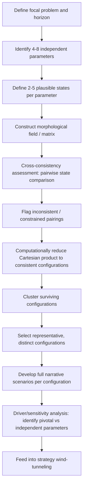

## Morphological Analysis and Alternative Futures

### Overview

Morphological analysis (MA) is a general problem-structuring method, developed by astrophysicist Fritz Zwicky at Caltech in the 1940s–60s, for systematically mapping the total solution space of a complex, non-quantifiable problem by decomposing it into its constituent dimensions (parameters), enumerating the plausible discrete states (values) each dimension can take, and then examining the full cross-combinatorial space to identify internally consistent configurations. In geopolitical risk and futures work, MA is used specifically when a strategic question has *more than two* genuinely independent, high-impact critical uncertainties — a situation where the standard 2x2 scenario matrix (covered in the previous section) would force an artificial and potentially misleading reduction of dimensionality. General Morphological Analysis (GMA), as systematized by Tom Ritchey at the Swedish Defence Research Agency (FOI), is the dominant contemporary variant used in defense, policy, and corporate futures practice.

### Relationship to Scenario Development

**Key Points**

- Standard GBN-style scenario planning (previous section) deliberately limits itself to two axes to keep the output set small, memorable, and communicable — at the cost of collapsing additional real uncertainty dimensions into the narrative background.
- Morphological analysis relaxes this constraint, allowing four, six, or more uncertainty dimensions to be modeled explicitly, at the cost of a combinatorially larger raw solution space that must then be pruned down to a manageable, internally consistent subset.
- MA is therefore typically used as a *front-end* structuring method: practitioners often run a full morphological analysis first to rigorously identify which combinations of driver-states are actually plausible, and then select a small number of the most illustrative, high-value configurations to develop into full narrative scenarios using GBN-style techniques.
- [Inference] Because MA's core value is combinatorial completeness and explicit consistency screening, it is best suited to problems where practitioners suspect that intuitively "obvious" 2x2 framings may be hiding non-independent or higher-order uncertainty dimensions relevant to the focal issue.

### Core Methodology (General Morphological Analysis / Ritchey Method)

**1. Define the Problem Space**

Articulate the focal question with a bounded time horizon and scope, precisely as in scenario development. MA does not replace this step; it structures what follows it.

**2. Identify Parameters (Dimensions)**

Decompose the problem into a set of distinct, salient dimensions — typically 4 to 8 in practice. Each parameter should:

- Be conceptually independent of the others (not a restatement or sub-case of another parameter).
- Be exhaustive enough, at the level of its assigned states, to cover the plausible range of outcomes for that dimension.
- Be phrased at a comparable level of abstraction to the other parameters (mixing a very broad geopolitical-order parameter with a narrow tactical parameter distorts the resulting matrix).

*Example parameters for a regional security question*:

- Great-power alignment posture
- Domestic political stability of the focal state
- Resource/energy dependency structure
- Technology and cyber-capability diffusion
- Alliance/treaty architecture durability

**3. Define States (Values) for Each Parameter**

For each parameter, enumerate 2–5 discrete, mutually exclusive, plausible states that span the parameter's realistic range.

*Example* (for "Great-power alignment posture"):

- Bandwagon with Power A
- Bandwagon with Power B
- Strategic non-alignment / hedging
- Fragmented/contested alignment (internal elite division)

**4. Construct the Morphological Field**

Arrange all parameters and their states into a matrix (the "morphological field" or "morphospace") — parameters as rows, states as columns. The total *unconstrained* solution space is the Cartesian product of all states across all parameters:

$$N_{\text{total}} = \prod_{i=1}^{k} n_i$$

where $k$ is the number of parameters and $n_i$ is the number of states for parameter $i$. Even a modest field of 5 parameters with 4 states each yields $4^5 = 1024$ raw combinations — illustrating why the next step is indispensable.

**5. Cross-Consistency Assessment (CCA)**

The defining innovation of GMA relative to naive combinatorics. Every pairwise combination of states (across all parameter pairs) is manually assessed and marked as:

- **Consistent**: No inherent contradiction or strong tension.
- **Inconsistent (logically or empirically impossible)**: The states cannot co-occur — e.g., "consolidated bloc alignment with Power A" is logically inconsistent with "domestic elite consensus favors Power B alignment" in the same scenario without an explicit transitional narrative.
- **Constrained/conditional**: Possible but requires a specific causal bridge or is empirically rare.

This pairwise assessment is recorded in a symmetric cross-consistency matrix. Because the number of pairwise cells grows as $\binom{\text{total states}}{2}$, this step is typically supported by dedicated MA software (e.g., FOI's own tools, or generic GMA software packages) rather than performed manually at scale, though small fields (under ~30 total states) can be assessed by an expert panel directly using spreadsheet matrices.

**6. Reduce the Solution Space**

Applying the cross-consistency constraints eliminates internally contradictory combinations from the full Cartesian product, typically reducing the raw combinatorial space by one to several orders of magnitude down to a much smaller set of internally consistent configurations — this reduced set constitutes the field of genuinely plausible "alternative futures."

**7. Cluster and Select Representative Configurations**

The surviving consistent configurations are typically still too numerous to present individually to decision-makers. Practitioners cluster similar configurations and select a small number (often 4–8) of maximally distinct, high-relevance representative configurations to develop into full scenario narratives, using the same narrative-construction techniques (naming, storyline, signposts, strategic implications) described in scenario development practice.

**8. Sensitivity and Driver Analysis**

Because the full consistency matrix is retained, MA supports formal sensitivity analysis: identifying which parameters are most "constraining" (appear disproportionately often in inconsistent pairings, indicating they are pivotal drivers that narrow the solution space most) versus which are most "independent" (combine freely with most other states, indicating lower structural leverage over the overall outcome space).

### Diagram: Morphological Analysis Workflow

### Worked Example: Simplified Morphological Field

Focal issue: "What will the regional security architecture of a contested maritime region look like in 10 years?"

**Parameters and States**

| Parameter | State 1 | State 2 | State 3 |
| --- | --- | --- | --- |
| P1: Great-power posture | Direct confrontation | Managed rivalry | Cooperative condominium |
| P2: Regional bloc cohesion | Strong regional bloc | Fragmented/bilateral | Bloc captured by external power |
| P3: Maritime law regime | Reinforced UNCLOS-based order | Contested/parallel legal claims | Ad hoc bilateral arrangements |
| P4: Resource exploitation | Joint development regimes | Unilateral exploitation | Frozen/disputed, undeveloped |

Raw combinatorial space: $3 \times 3 \times 3 \times 3 = 81$ configurations.

**Illustrative Cross-Consistency Findings** (illustrative, not derived from a specific real dataset)

- "Direct confrontation" (P1) paired with "Joint development regimes" (P4) is flagged **inconsistent** — active great-power confrontation is difficult to reconcile with simultaneous cooperative joint resource development absent an explicit de-escalation narrative bridge.
- "Cooperative condominium" (P1) paired with "Reinforced UNCLOS-based order" (P3) is flagged **consistent and mutually reinforcing** — cooperative great-power relations plausibly support, and are supported by, a strengthened multilateral legal order.
- "Bloc captured by external power" (P2) paired with "Strong regional bloc" would be flagged **logically inconsistent** by definition (a captured bloc cannot simultaneously be assessed as strongly cohesive and autonomous).

After applying such constraints across the full field, the practitioner might reduce the 81 raw combinations to, e.g., roughly 12–18 internally consistent configurations, which are then clustered into perhaps 4–5 representative alternative futures for full narrative development — such as "Managed Rivalry with Contested Legal Order" or "Cooperative Condominium under Reinforced Multilateralism."

[Inference] The specific numeric reduction ratio in any real application depends entirely on the domain-specific consistency judgments made by the expert panel conducting the CCA step; the figures above are illustrative of the *method's* combinatorial-reduction logic, not a claimed empirical result from a documented case.

### Alternative Futures: Distinguishing the Term from "Scenarios"

The term "alternative futures" is used somewhat interchangeably with "scenarios" in general futures-studies literature, but within a morphological-analysis-informed practice it carries a more specific connotation:

- **Scenarios** (GBN sense): A small, deliberately limited set (typically four) of narratively rich, memorable futures built around two selected axes, optimized for strategic communication and decision framing.
- **Alternative futures** (MA sense): The broader, more exhaustively derived set of internally consistent configurations surfaced by systematic combinatorial analysis across many dimensions, prior to narrative curation — emphasizing completeness and rigor of the *possibility space* over communicative economy.

A mature futures practice often uses MA to *discover* the alternative-futures possibility space comprehensively, and then uses GBN-style narrative techniques to *communicate* a curated subset of that space as scenarios to decision-makers — the two methods are complementary stages of one pipeline rather than competitors.

### Strengths and Limitations

**Key Points — Strengths**

- Handles genuinely multi-dimensional uncertainty (more than two critical drivers) without artificial dimensional collapse.
- The cross-consistency assessment step forces explicit, auditable reasoning about *why* certain combinations are ruled out, rather than relying on unstated intuition — this materially improves transparency and reduces analyst-team blind spots relative to ad hoc scenario writing.
- Surfaces non-obvious plausible configurations that intuitive 2x2 framing might miss entirely, since the full Cartesian product is examined systematically rather than only the combinations analysts think to consider.
- Supports formal driver/sensitivity analysis identifying which parameters most constrain the outcome space.

**Key Points — Limitations**

- Combinatorial explosion: even modest parameter counts produce solution spaces that are unwieldy without dedicated software support for the cross-consistency step.
- The quality of output is entirely dependent on the quality of parameter and state selection at the outset — poorly chosen or non-independent parameters propagate errors through the entire combinatorial structure ("garbage in, garbage out" applies with particular force here given the method's apparent rigor).
- Cross-consistency judgments are themselves subjective expert assessments, not objective facts — the method structures and makes auditable the subjectivity but does not eliminate it.
- Less naturally suited than GBN scenarios to producing a small, memorable, board-ready narrative set — typically requires a subsequent narrative-curation stage to be decision-maker-friendly.
- [Inference] The facilitation burden and specialist software/expertise requirement of full GMA with formal CCA is generally higher than that of standard 2x2 scenario workshops, which likely explains why 2x2 scenario planning remains more commonly used for time-constrained corporate risk exercises, while full GMA is more often reserved for defense, government, and academic futures work where the additional rigor is warranted by the stakes and available resourcing.

### Common Pitfalls

- **Non-independent parameters**: Choosing parameters that are actually restatements of each other (e.g., "alliance cohesion" and "bloc unity" as separate parameters when they are functionally the same driver) artificially inflates and distorts the solution space.
- **Skipping cross-consistency assessment**: Presenting the raw Cartesian product as "alternative futures" without consistency screening produces a large number of implausible or self-contradictory configurations, undermining the method's core value proposition.
- **Overly granular states**: Defining too many fine-grained states per parameter (beyond roughly 5) causes combinatorial explosion that exceeds practical CCA capacity without corresponding gains in insight.
- **Treating MA output as probabilistic**: Like GBN scenarios, MA-derived alternative futures are not probability-weighted; treating a "consistent" configuration as automatically "likely" conflates logical/empirical plausibility with probability.
- **Skipping the narrative curation step**: Presenting a raw list of a dozen-plus abstract parameter-state configurations directly to decision-makers, without curating and narratively developing a small representative subset, typically fails to achieve the strategic communication value that motivated the exercise in the first place.

### Conclusion

Morphological analysis extends scenario-based futures work to genuinely multi-dimensional uncertainty by systematically decomposing a problem into independent parameters and states, exhaustively examining their combinatorial space, and using cross-consistency assessment to rigorously prune implausible configurations down to a defensible set of alternative futures. It trades the communicative simplicity of a 2x2 scenario matrix for combinatorial completeness and auditable reasoning, and is most valuable as a front-end structuring method feeding into, rather than replacing, narrative scenario development for final decision-maker communication.

**Related Topics**

- Cross-impact analysis and conditional interdependency modeling between drivers
- GBN/intuitive-logics scenario development and axes of uncertainty (preceding section)
- Fritz Zwicky's original morphological approach and its applications beyond futures studies
- FOI (Swedish Defence Research Agency) general morphological analysis case studies
- Software tools for cross-consistency assessment at scale
- Clustering algorithms for reducing large consistent-configuration sets to representative scenarios
- Driver/sensitivity analysis and identifying pivotal versus independent parameters
- Integrating morphological analysis outputs with Bayesian scenario trees
- Delphi and expert-panel facilitation techniques for parameter and state elicitation