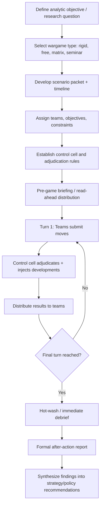

## Wargaming and Simulation Exercises

### Overview

Wargaming is a structured, interactive method for exploring strategic decision-making, adversary behavior, and crisis dynamics by having human participants (or, increasingly, hybrid human–computational systems) role-play competing actors under a defined scenario, ruleset, and set of constraints, with outcomes adjudicated turn by turn. Unlike forecasting (which produces probability estimates) or scenario planning (which produces static narrative futures), wargaming is fundamentally *interactive and adversarial* — it surfaces dynamics that emerge specifically from actors reasoning about, anticipating, and reacting to each other's choices in real time, including deception, escalation, misperception, and bargaining behavior that static analysis often cannot capture. Its lineage runs from 19th-century Prussian Kriegsspiel through Cold War-era RAND and Naval War College practice into contemporary use across defense ministries, intelligence communities, and corporate/political risk advisories.

### Purpose and Positioning Relative to Other Methods

**Key Points**

- **Forecasting** answers "what is the probability of X?" **Scenario planning** answers "what are the plausible distinct futures?" **Wargaming** answers "how would specific actors actually behave, and what dynamics emerge, when they interact strategically under this specific situation?"
- Wargames are not predictive in a probabilistic sense — a single game's outcome is one plausible trajectory among many, shaped by the specific participants' choices, not a probability-weighted forecast.
- The core analytic value of wargaming lies less in "what happened" in any single game and more in the *process*: surfacing unconsidered options, exposing flawed assumptions about adversary behavior, revealing escalation dynamics, and stress-testing decision-making processes and organizational coordination under pressure.
- [Inference] Because a single wargame reflects the specific participants, rules, and adjudication choices made in that instance, findings are generally treated as most robust when a scenario is gamed multiple times with different participant groups or branch points, rather than treated as a single definitive result — though resource constraints often limit real-world practice to a small number of iterations.

### Taxonomy of Wargame Types

**1. By Adjudication Method**

- **Rigid (closed) wargames**: Outcomes of player moves are adjudicated by fixed, pre-defined rules and often quantitative combat models (e.g., force-on-force attrition tables). High reproducibility, lower flexibility, historically dominant in military staff training contexts.
- **Free (open) wargames**: Outcomes are adjudicated by expert human judgment (a "control cell" or "white cell") rather than fixed rules, allowing for nuanced political, diplomatic, and non-kinetic dynamics that rigid rulesets struggle to encode. Lower reproducibility, higher realism for political-military and geopolitical questions.
- **Matrix games**: A structured hybrid — players propose an action and an argument for why it should succeed, the control cell/group assigns a probability of success, and a die roll or similar mechanism resolves the outcome. Popular for lower-resource, rapid geopolitical wargaming due to their light rules overhead.

**2. By Domain/Focus**

- **Political-military (pol-mil) wargames**: Focus on crisis decision-making, escalation dynamics, and diplomatic-military interaction rather than tactical combat detail (most relevant to geopolitical risk analysis).
- **Tactical/operational wargames**: Focus on specific military operations at unit/force level, typically with more quantitative combat resolution.
- **Business/economic wargames**: Model competitive corporate strategy, market entry, or economic sanctions/countersanctions dynamics using similar structured role-play techniques.
- **Seminar wargames**: Discussion-based, minimal formal adjudication mechanics, closer to structured facilitated discussion than a "game" in the mechanical sense — used for exploring broad strategic concepts rather than specific move-by-move dynamics.

**3. By Format**

- **Single-sided (red-teaming) exercises**: One team plays an adversary role against a fixed friendly posture, primarily to stress-test that posture rather than to model full interaction.
- **Two-sided (or multi-sided) games**: Multiple teams, each representing a distinct actor (e.g., State A, State B, a regional bloc, non-state actors), interact and are adjudicated in relation to each other.
- **Seminar vs. computer-assisted vs. fully computerized**: Ranges from purely human discussion, through human decision-making supported by computational adjudication models, to fully automated agent-based simulations with minimal or no human-in-the-loop play.

### Core Design Components

**1. Scenario and Scenario Packet**

The starting conditions: geopolitical context, actor objectives, force postures/capabilities, timeline, and the specific triggering event or crisis point. Should be detailed enough to bound player behavior realistically without over-constraining creative strategic responses. Typically distributed to players in advance as read-ahead material.

**2. Teams and Roles**

Each team is assigned a specific actor (a state, coalition, or institution) along with:

- **Objectives**: What that actor is trying to achieve (which may be only partially known to opposing teams — information asymmetry is often deliberately designed in).
- **Constraints**: Resource limits, domestic political constraints, alliance obligations.
- **Persona/mandate**: Explicit instruction on how faithfully to role-play the assigned actor's likely real-world behavior versus how much latitude for creative strategy is permitted.

**3. The Control Cell ("White Cell")**

A neutral facilitation and adjudication team responsible for:

- Injecting scenario developments (news events, third-party actions, intelligence updates) between turns.
- Adjudicating the outcomes of player moves, particularly in free/matrix games where no fixed combat-resolution formula exists.
- Enforcing the ruleset and maintaining scenario plausibility.
- Managing time and pacing across game turns.

**4. Move-Adjudication-Response Cycle**

The turn-based structure: each turn, teams submit moves (decisions/actions) simultaneously or sequentially; the control cell adjudicates outcomes (using rules, judgment, or a hybrid); results and any control-cell-injected developments are distributed; the next turn begins. The number of turns and the time each represents (hours, days, months of "game time" per turn) is a key design parameter set in advance.

**5. Data Collection and Observation**

Dedicated observers (distinct from the control cell) record team deliberations, decision rationales, and key inflection points — this qualitative data is often the primary analytic product of the exercise, more so than the specific final "outcome" reached.

**6. After-Action Review / Hot-wash and Report**

Immediately following the game, a structured debrief captures participant reflections while memory is fresh ("hot-wash"), followed by a more formal written after-action report synthesizing findings, surprises, and implications.

### Diagram: Wargame Design and Execution Workflow

### Matrix Game Mechanics (Detailed Example)

Matrix games are increasingly favored in geopolitical risk practice for their low resource overhead relative to rigid wargames. Standard procedure:

1. A player proposes an **argument**: "I want to [action], because [reasons], so that [intended effect]."
2. Other players (or the control cell) may offer counter-arguments adjusting the plausibility of the proposed outcome.
3. The control cell (or a facilitated group discussion) assigns a probability of success, often using a simple qualitative scale (e.g., very likely / likely / even / unlikely / very unlikely) mapped to numeric thresholds.
4. A die roll (or equivalent randomization mechanism) against that threshold determines whether the action succeeds, partially succeeds, or fails.
5. The narrative and game state are updated accordingly, and play proceeds to the next action/turn.

*Example*: In a matrix game modeling an energy-supply crisis, a team representing "Importing State" might argue: "We impose emergency strategic reserve releases, because our reserves are at 85% capacity and public pressure is mounting, so that domestic fuel prices stabilize within 30 days." The control cell judges this "likely" (say, requiring a roll of 4+ on a six-sided die) given the stated reserve capacity, rolls, and updates the game state based on the result — success, partial success (prices stabilize but reserves draw down faster than planned, creating a new vulnerability), or failure (prices continue rising, creating pressure toward the next round of more drastic action).

### Analytical Value and Common Findings Categories

**Key Points**

- **Assumption-testing**: Wargames frequently reveal that a team's real-world counterpart organization holds an assumption about adversary behavior (e.g., "State X would never risk direct confrontation over this issue") that collapses once a human player, freed from institutional caution, plays that adversary role and takes the "unthinkable" action.
- **Escalation dynamics**: Multi-turn interactive play surfaces action-reaction spirals (e.g., reciprocal sanctions, mobilization responses) that static single-shot scenario analysis does not naturally generate.
- **Decision-process stress-testing**: Beyond substantive findings, wargames reveal organizational and process weaknesses — unclear decision authority, information bottlenecks, coordination failures between represented agencies/departments — that are as valuable to the sponsoring organization as the substantive scenario findings.
- **Signaling and misperception**: Because opposing teams typically have imperfect information about each other's true objectives and constraints, wargames can illustrate how ambiguous signals are miscalibrated or misread by an adversary, informing real-world signaling strategy.

### Limitations and Methodological Cautions

**Key Points**

- **Small-N problem**: A single game execution reflects the specific players, their risk tolerance, and the specific adjudication calls made — generalizing from one game's outcome to real-world probability is not methodologically sound. [Inference] This is why serious wargaming programs generally emphasize iterated play (multiple runs, sometimes with different player cohorts) and treat any single game's trajectory as illustrative rather than predictive, though the degree of iteration achieved in practice varies substantially by program resourcing.
- **Player behavior does not equal real actor behavior**: Participants — even subject-matter experts — role-playing an adversary may be more risk-tolerant, more rational, or differently incentivized than the real decision-makers they represent (a professional wargame participant faces no real domestic political or career consequences for an aggressive move, unlike an actual head of state).
- **Adjudicator bias**: In free and matrix games, control-cell judgment calls are subjective and can unintentionally encode the adjudicators' own priors about what is "plausible," constraining the game toward expected outcomes rather than genuinely exploring the full space.
- **Scenario framing effects**: The specific scenario packet and initial conditions substantially shape possible outcomes; a poorly or narrowly constructed scenario can foreclose dynamics that would matter in reality.
- **Resource intensity**: High-fidelity, multi-day wargames with expert participants, dedicated control cells, and professional facilitation are resource-intensive (time, expert participant availability, facilitation expertise), which constrains how often and how many iterations organizations can realistically run.
- **Confusing engagement with rigor**: The high engagement and vividness of a well-run wargame can lead sponsors to over-weight its findings relative to their actual epistemic status as one illustrative interactive trajectory rather than a validated prediction.

### Computational and Agent-Based Extensions

Contemporary practice increasingly supplements human wargaming with computational tools:

- **Agent-based modeling (ABM)**: Computational agents with defined behavioral rules or utility functions interact within a simulated environment across many automated iterations, allowing exploration of a much larger number of trajectories than feasible with human-only play, at the cost of the behavioral realism and creative strategic reasoning that skilled human participants bring.
- **Hybrid human-computer wargames**: Human players make strategic-level decisions while computational models handle lower-level adjudication (e.g., economic effects of sanctions, logistics/attrition calculations), combining human judgment on ambiguous political dynamics with computational consistency on quantifiable sub-systems.
- **Monte Carlo iteration of matrix-game-style probability structures**: Running many computational iterations of a matrix-game-style probabilistic branching structure to generate a distribution of possible trajectories rather than relying on a single human-played run, blurring the line between wargaming and probabilistic scenario-tree forecasting.

[Unverified] The relative analytic value of large-scale agent-based/computational wargaming versus traditional expert-facilitated human wargaming for geopolitical (as opposed to tactical/logistical) questions remains an actively debated methodological question in the field, with proponents on each side; specific comparative performance claims should be treated as contested rather than settled.

### Worked Example: Structuring a Geopolitical Crisis Wargame

Analytic objective: "Assess how a regional maritime incident between two states could escalate or de-escalate, and identify decision points where allied intervention most affects the trajectory."

- **Type selected**: Free/matrix hybrid, political-military, two-sided plus a control cell representing "systemic/international reaction."
- **Teams**: State A government, State B government, Allied Coalition (representing a third-party alliance with treaty interests), and a Control Cell managing media/international reaction injects.
- **Scenario packet**: A specific triggering incident (e.g., a collision between coast guard vessels in a contested zone), force postures, existing treaty obligations, and each team's private objectives (some known to opponents, some deliberately hidden).
- **Turns**: Represent 48-hour real-world periods; 4–6 turns covering roughly two weeks of "game time."
- **Adjudication**: Matrix-game argument/probability/die-roll mechanism for ambiguous political-military actions; simple fixed rules for unambiguous logistics (e.g., transit times for naval assets).
- **Data collection**: Dedicated observers per team record internal deliberation on escalation versus restraint trade-offs.
- **Output**: After-action report identifying, e.g., the specific decision point at which Allied Coalition signaling (or the absence/ambiguity thereof) most influenced whether State A or State B chose escalatory versus restrained responses — informing real-world alliance signaling and crisis-communication protocol recommendations.

### Common Pitfalls

- **Treating a single game outcome as a forecast**: Reporting "the wargame showed State X will invade" rather than "the wargame illustrated one plausible escalation pathway and the decision points along it."
- **Insufficiently briefed or unrepresentative players**: Participants without genuine subject-matter grounding in the actor they represent produce dynamics that reflect the players' own assumptions rather than plausible real-actor behavior.
- **Over-scripted scenarios**: A scenario packet that too tightly constrains available moves forecloses the emergent dynamics that justify running a game rather than a static tabletop discussion.
- **Weak or absent control-cell rigor**: Inconsistent or ad hoc adjudication in free/matrix games undermines player trust in the exercise and can distort the dynamics being studied.
- **Neglecting the debrief**: The after-action synthesis is where much of a wargame's analytic value is actually extracted; under-investing in structured debrief relative to game execution wastes the exercise's primary output.
- **Single-iteration reliance for high-stakes decisions**: Basing significant real-world strategic choices on the trajectory of one game run, without corroborating iteration or triangulation against forecasting/scenario methods.

### Conclusion

Wargaming and simulation exercises provide a uniquely interactive, adversarial complement to probabilistic forecasting and static scenario planning, surfacing emergent escalation dynamics, testing organizational decision processes, and challenging assumptions about adversary behavior through structured human (and increasingly computational) role-play. Their analytic value lies primarily in the process of play and structured debrief rather than in treating any single game's outcome as predictive, and rigorous practice depends on careful scenario design, disciplined adjudication, genuinely representative role-play, and honest interpretation of findings as illustrative rather than probabilistic.

**Related Topics**

- Matrix game design and probability-threshold adjudication techniques
- Red teaming and devil's advocacy as complementary structured analytic techniques
- Agent-based modeling and computational simulation of geopolitical systems
- Crisis signaling, deterrence theory, and escalation-ladder frameworks
- After-action review methodology and structured debrief facilitation
- Integrating wargame findings with scenario planning and probabilistic forecasting outputs
- Historical case studies: RAND Cold War wargaming, Naval War College practice
- Designing information asymmetry and hidden objectives in multi-team exercises
- Ethical and resourcing considerations in running large-scale policy wargames