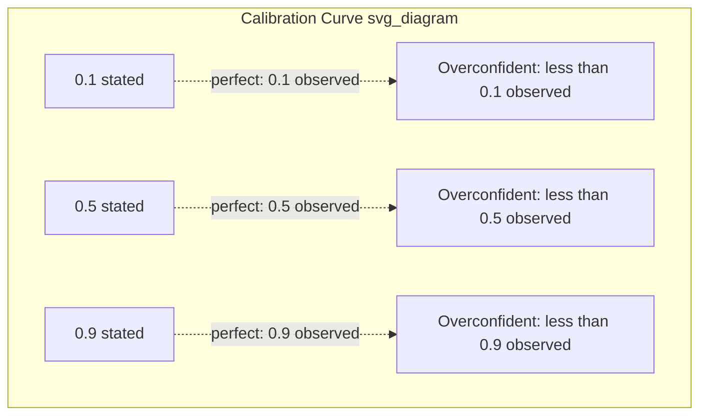

## Superforecasting and Calibrated Probability Judgment

### Overview

Superforecasting refers to the empirically documented phenomenon, identified through Philip Tetlock and Barbara Mellers's Good Judgment Project (GJP) — the highest-performing team in the U.S. Intelligence Advanced Research Projects Activity's (IARPA) 2011–2015 Aggregative Contingent Estimation (ACE) forecasting tournament — that a small subset of forecasters consistently and substantially outperform both subject-matter experts and prediction markets on geopolitical forecasting questions over multi-year periods. Superforecasting is not a single technique but an empirically derived cluster of cognitive habits, methods, and dispositions that correlate with sustained forecasting accuracy. Calibrated probability judgment is the underlying measurable skill superforecasters exhibit: the ability to assign numeric probabilities to uncertain events such that, in aggregate, stated confidence levels match observed outcome frequencies.

### Historical and Empirical Basis

**Expert Political Judgment (Tetlock, 1980s–2005)**

Tetlock's original 20-year longitudinal study tracked roughly 82,000 probability judgments from several hundred political and economic experts. The widely cited finding — that the average expert's forecasting accuracy was not meaningfully better than chance, and in some framings compared unfavorably to simple extrapolation algorithms — established the baseline problem the Good Judgment Project was designed to address: are *some* forecasters, using *some* methods, reliably better, and if so, why?

**The Good Judgment Project and IARPA ACE Tournament**

[Inference] Publicly reported comparative results from the IARPA ACE tournament indicate the Good Judgment Project's aggregated forecasts substantially outperformed competing university research teams and, in various analyses, prediction markets and intelligence community analysts with access to classified information on the same questions — however, exact percentage margins vary by specific study, question set, and scoring period reported, so any single precise figure should be treated as illustrative of the general, well-replicated finding rather than a fixed benchmark. From this tournament, a subset of top-performing participants (the top ~2% by cumulative Brier score) were identified and labeled "superforecasters," and their subsequent performance was tracked to confirm the effect was a persistent skill rather than one-off luck — persistence of top-tier ranking across successive tournament years was a key piece of evidence used to argue for genuine skill rather than statistical noise.

### Defining Calibration Formally

**Calibration**

A forecaster is well-calibrated if, across all instances where they assign a given probability $p$ to an event, the event occurs with observed frequency approximately equal to $p$. Formally, for a set of forecasts binned by stated probability:

$$\text{Calibration error} = \sum_{k} \frac{n_k}{N} \left( \bar{p}_k - \bar{o}_k \right)^2$$

where $k$ indexes probability bins, $n_k$ is the number of forecasts in bin $k$, $N$ is total forecasts, $\bar{p}_k$ is the mean stated probability in that bin, and $\bar{o}_k$ is the observed outcome frequency in that bin.

**Resolution**

The complementary property: a forecaster's ability to sort events into confidently correct high- or low-probability bins rather than defaulting to values near the base rate. A forecaster who always predicts 50% for binary questions with a 50% base rate is perfectly calibrated but has zero resolution — entirely uninformative.

**Brier Score Decomposition (Murphy, 1973)**

$$\text{BS} = \underbrace{\frac{1}{N}\sum_k n_k(\bar{p}_k - \bar{o}_k)^2}_{\text{Calibration}} - \underbrace{\frac{1}{N}\sum_k n_k(\bar{o}_k - \bar{o})^2}_{\text{Resolution}} + \underbrace{\bar{o}(1-\bar{o})}_{\text{Uncertainty}}$$

where $\bar{o}$ is the overall base rate of the outcome across the full dataset. This decomposition is why "calibration" alone is an insufficient success criterion in professional forecasting evaluation: a low Brier score requires both good calibration (low first term) and good resolution (high second term, since it is subtracted).

**Calibration Curve (Reliability Diagram)**

A standard visualization plots stated probability (x-axis) against observed outcome frequency (y-axis) across binned forecasts. A perfectly calibrated forecaster's curve lies exactly on the 45-degree diagonal; systematic deviation above the diagonal indicates underconfidence (events happen more often than stated probabilities suggest), while deviation below indicates overconfidence.

*(Note: a reliability diagram is more precisely rendered as an SVG scatter/line plot; the above Mermaid representation is a simplified conceptual placeholder consistent with this reference's fenced-diagram formatting requirement — see the SVG illustration below for the actual plotted form.)*

<svg xmlns="http://www.w3.org/2000/svg" viewBox="0 0 420 340">
<title>Calibration Curve — Reliability Diagram (svg_diagram)</title>
<rect x="0" y="0" width="420" height="340" fill="#ffffff" />
<line x1="60" y1="280" x2="60" y2="20" stroke="#333" stroke-width="1.5" />
<line x1="60" y1="280" x2="380" y2="280" stroke="#333" stroke-width="1.5" />
<text x="20" y="150" font-size="12" fill="#333" transform="rotate(-90 20,150)">Observed Frequency</text>
<text x="180" y="310" font-size="12" fill="#333">Stated Probability</text>
<line x1="60" y1="280" x2="380" y2="20" stroke="#999" stroke-width="1" stroke-dasharray="4,4" />
<text x="330" y="35" font-size="10" fill="#666">Perfect calibration</text>
<polyline points="60,280 124,255 188,205 252,150 316,95 380,50" fill="none" stroke="#1a73e8" stroke-width="2" />
<circle cx="60" cy="280" r="3" fill="#1a73e8" />
<circle cx="124" cy="255" r="3" fill="#1a73e8" />
<circle cx="188" cy="205" r="3" fill="#1a73e8" />
<circle cx="252" cy="150" r="3" fill="#1a73e8" />
<circle cx="316" cy="95" r="3" fill="#1a73e8" />
<circle cx="380" cy="50" r="3" fill="#1a73e8" />
<text x="130" y="230" font-size="10" fill="#1a73e8">Example forecaster (overconfident at high p)</text>
<text x="45" y="295" font-size="10" fill="#333">0.0</text>
<text x="365" y="295" font-size="10" fill="#333">1.0</text>
<text x="35" y="284" font-size="10" fill="#333">0.0</text>
<text x="35" y="25" font-size="10" fill="#333">1.0</text>
</svg>

### The Ten Commandments of Superforecasting (Tetlock and Gardner)

Tetlock and Gardner's *Superforecasting: The Art and Science of Prediction* (2015) distills the GJP's empirical findings into a widely cited practitioner heuristic set:

1. **Triage**: Focus effort on questions that are within the "Goldilocks zone" of tractability — neither near-certain nor irreducibly random.
2. **Break seemingly intractable problems into tractable sub-problems**: Fermi-style decomposition (see forecasting principles, prior section).
3. **Strike the right balance between inside and outside views**: Anchor on base rates first, then adjust with case-specific evidence.
4. **Strike the right balance between under- and overreacting to evidence**: Update proportionally to genuinely diagnostic new information; avoid both stubborn anchoring and excessive volatility.
5. **Look for the clashing causal forces at work in each problem**: Explicitly consider factors pushing toward and away from the outcome.
6. **Strive to distinguish as many degrees of doubt as the problem permits, but no more**: Use fine-grained probabilities (e.g., 63% rather than "somewhat likely") where evidence genuinely supports that precision, without false precision beyond what the evidence justifies.
7. **Strike the right balance between confidence and caution**: Avoid both excessive hedging (low resolution) and overconfidence.
8. **Look for the errors behind your mistakes, but beware of rearview-mirror hindsight biases**: Conduct honest postmortems without concluding a bad outcome necessarily implies a bad process, or vice versa.
9. **Bring out the best in others and let others bring out the best in you**: Superforecasters in the GJP tournament worked in teams that shared information and challenged each other's reasoning — team-based forecasting outperformed isolated individual forecasting in the tournament data.
10. **Master the error-balancing bicycle**: Treat forecasting as a trainable skill improved through deliberate practice and feedback, analogous to learning to ride a bicycle — theory alone does not confer the skill; repeated, scored practice does.

### Cognitive and Dispositional Traits Associated with Superforecasters

**Key Points** (as characterized in GJP research and subsequent analysis)

- **Actively open-minded thinking**: Treating one's own beliefs as testable hypotheses rather than identities to defend; actively seeking disconfirming evidence.
- **Numeracy and comfort with probabilistic reasoning**: Willingness to express uncertainty in fine-grained numeric terms rather than vague qualitative language.
- **Fox-like cognitive style**: Drawing on multiple analytic frameworks and information sources rather than a single grand theory (see prior section's Fox/Hedgehog discussion).
- **Frequent, incremental belief updating**: Superforecasters in GJP data updated their forecasts more often and in smaller increments in response to new information, compared to less accurate forecasters who updated rarely and in larger jumps.
- **Intellectual humility paired with high effort**: Willingness to say "I don't know" precisely (via a probability near 50% when genuinely warranted) combined with substantial time investment in research per question.
- **Team collaboration and constructive dissent**: Active engagement in team-based information sharing and challenge, rather than isolated analysis.
- **Growth mindset toward forecasting skill**: Treating accuracy as a skill to be improved via feedback and deliberate practice rather than a fixed trait.

[Inference] These traits are correlational findings from observational and tournament data rather than causally isolated in fully controlled experiments; while the GJP research program's authors argue for a causal, trainable-skill interpretation (supported by the finding that basic probabilistic-reasoning training modestly improved subsequent forecasting accuracy in tournament sub-experiments), the precise causal weight of each individual trait relative to the others remains an area of ongoing methodological discussion in the forecasting research literature.

### Calibration Training Methodology

**1. Trivia-Based Calibration Exercises**

A standard training technique: presenting general-knowledge questions with an associated confidence-elicitation step (e.g., "What is the population of Peru: is it above or below 30 million? How confident are you, from 50% to 100%?"), then scoring calibration across many such questions to build the habit of mapping subjective confidence to numeric probability accurately before applying the skill to genuinely uncertain geopolitical questions.

**2. Structured Forecasting Journals**

Recording, for each forecast: the stated probability, the reasoning and evidence considered, the resolution date, and (after resolution) the actual outcome and a brief postmortem — enabling personal calibration-curve construction over time.

**3. Team-Based Forecasting with Aggregation**

GJP tournament data indicated that team-based forecasting, with structured information-sharing and challenge among team members, followed by algorithmic aggregation of individual team-member forecasts, outperformed isolated individual forecasting — informing the design of contemporary forecasting platforms that combine crowd input with structured aggregation rules.

**4. Extremizing Aggregation Algorithms**

A documented technical finding from GJP research: simple averaging of a crowd's individual probability estimates tends to be *underconfident* relative to the optimal aggregate, because individual forecasters' private information is diluted through averaging. "Extremizing" transformations — pushing the aggregated median or mean probability further from 50% via a calibrated transformation function — were found to improve aggregate accuracy in GJP tournament data relative to simple unweighted averaging.

$$p_{\text{extremized}} = \frac{p_{\text{avg}}^{\alpha}}{p_{\text{avg}}^{\alpha} + (1-p_{\text{avg}})^{\alpha}}$$

where $p_{\text{avg}}$ is the simple average of individual forecaster probabilities and $\alpha > 1$ is an extremizing parameter empirically tuned against historical tournament data. [Unverified] The specific optimal value of $\alpha$ is dataset- and context-dependent and reported optimal values vary across published analyses; treat any single cited value as illustrative of the technique rather than a universal constant.

### Applying Superforecasting Discipline to Geopolitical Risk Practice

**Example**

Question: "Will the ceasefire between Party A and Party B hold (no verified ceasefire violation resulting in more than 10 casualties) through the next 90 days?"

Applying the ten-commandments framework:

1. **Triage**: Confirm the question sits in a tractable zone — not so obviously stable that forecasting adds no value, not so chaotic that no evidence could inform a judgment.
2. **Decompose**: Break into sub-questions — P(major triggering incident occurs), P(incident escalates past the casualty threshold | incident occurs), P(political will to maintain ceasefire despite incident | escalation).
3. **Outside view first**: Reference class of historical ceasefires with similar characteristics (external guarantor presence, prior ceasefire violation history, mediating power involvement) establishes a base rate.
4. **Weigh evidence proportionally**: A single ambiguous border incident report should shift the estimate modestly, not dramatically, absent strong corroboration.
5. **Identify clashing forces**: International pressure to maintain the ceasefire (downward pressure on violation probability) versus a documented history of prior violations by one party (upward pressure).
6. **Fine-grained probability**: State 72% rather than "probably" — with the numeric estimate revisited and revised as new evidence arrives across the 90-day window.
7. **Balance confidence and caution**: Avoid rounding to 50% out of excessive hedging when evidence genuinely supports a more confident estimate, and avoid false certainty at 95%+ absent strong justification.
8. **Postmortem regardless of outcome**: If the ceasefire holds, examine whether the 72% estimate reflected sound reasoning or was simply lucky; if it breaks down, examine whether the break was foreseeable from available evidence or a genuine low-probability tail event.

### Superforecasting vs. Related Concepts — Comparison

| Dimension | Superforecasting | Traditional Expert Judgment | Prediction Markets |
| --- | --- | --- | --- |
| Core mechanism | Individually scored, calibration-trained probabilistic judgment, often team-aggregated | Domain expertise-based qualitative/narrative judgment | Price-based aggregation of many traders' incentivized bets |
| Primary accuracy driver | Cognitive style + calibration training + frequent updating | Depth of domain knowledge (weakly correlated with accuracy in Tetlock's original EPJ findings) | Market liquidity and trader diversity |
| Typical resolution horizon | Short-to-medium term, well-defined questions | Varies widely, often less rigorously scored | Short-to-medium term, market-defined questions |
| Scoring/feedback loop | Explicit, via Brier scores and calibration tracking | Often absent or informal | Implicit, via market settlement |
| Institutionalization | Growing (some intelligence community and corporate adoption) | Historically dominant in intelligence/policy analysis | Established in some financial and prediction-market platforms; more limited/regulated for geopolitical events |

### Common Pitfalls in Applying Superforecasting Methods

**Key Points**

- **False precision without genuine informational basis**: Stating 67% rather than 65% conveys spurious rigor if the underlying evidence does not actually support that granularity — the "no more precision than the problem permits" commandment is frequently violated in both directions.
- **Neglecting to track and score forecasts over time**: Without a scored feedback loop, no genuine calibration improvement can occur — this is the single most common gap between claimed superforecasting practice and its actual empirical basis.
- **Treating superforecasting as purely individual talent rather than a trainable, team-supported process**: GJP findings emphasize team collaboration and structured practice, not solely innate ability — organizations that recruit "smart people" without instituting calibration training and scoring infrastructure are unlikely to replicate GJP-level performance.
- **Applying superforecasting-style short-horizon calibration technique to genuinely deep-uncertainty, long-horizon questions**: The GJP tournament questions were characteristically short-to-medium horizon and well-defined; [Inference] the technique's demonstrated empirical advantage is most directly established for that class of question, and its applicability to multi-decade, structurally ambiguous questions is better complemented by scenario planning methods (prior sections) than substituted for by calibration-only technique.
- **Ignoring resolution alongside calibration**: Optimizing purely for calibration (e.g., defaulting to base rates) without developing genuine resolution/discrimination skill produces well-calibrated but low-value forecasts.

### Conclusion

Superforecasting names an empirically documented, trainable cluster of cognitive habits and disciplined practices — active open-mindedness, fox-like multi-model reasoning, careful balancing of inside and outside views, frequent incremental updating, team-based collaboration, and rigorous outcome tracking — that produce measurably superior calibrated probability judgments relative to both individual expert intuition and, in the IARPA ACE tournament data, several benchmark methods including prediction markets on comparable question sets. Its core measurable construct, calibration (supplemented by resolution), provides a rigorous, scoreable standard against which geopolitical risk forecasting practice can be continuously trained and evaluated, distinguishing genuine forecasting skill from confident but unscored narrative judgment.

**Related Topics**

- Brier score decomposition and calibration curve construction in practice
- Extremizing algorithms and crowd-aggregation techniques for forecasting platforms
- Actively open-minded thinking and debiasing training programs
- Team-based forecasting tournament design (Good Judgment Open and successor platforms)
- Comparative accuracy of prediction markets versus forecaster aggregation
- Principles of forecasting under geopolitical uncertainty (preceding section)
- Structured Analytic Techniques and their integration with calibration training
- Long-horizon forecasting limitations and the case for complementary scenario planning
- Institutional adoption of calibrated forecasting in intelligence and corporate risk functions