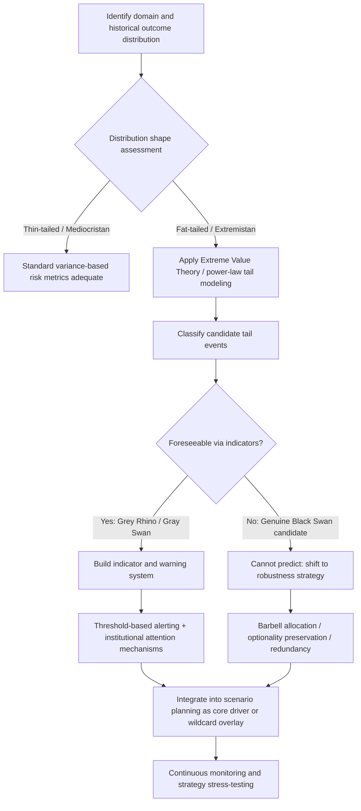

## Tail-Risk and Black Swan Analysis

### Overview

Tail-risk analysis is the study of low-probability, high-consequence events that reside in the extreme ends ("tails") of an outcome distribution — events that standard forecasting and scenario methods, calibrated primarily for the central, more probable range of outcomes, systematically underweight or fail to anticipate. "Black swan" is Nassim Nicholas Taleb's specific term (from *The Black Swan*, 2007, building on earlier philosophical use of the metaphor by John Stuart Mill and others regarding the classical problem of induction) for a narrower category: an event that is (a) an outlier lying outside the realm of regular expectations, (b) carries extreme impact, and (c) is only explainable and rationalized *after the fact* through retrospective narrative construction, despite having been fundamentally unpredictable in advance. Distinguishing genuine black swans from merely unlikely-but-foreseeable tail events is central to rigorous practice in this domain, since the two require different analytic and risk-management responses.

### Taleb's Formal Definition and Related Distinctions

**The Three Black Swan Criteria**

1. **Outlier status**: The event lies outside the range of normal expectations, because nothing in the past reliably pointed to its possibility.
2. **Extreme impact**: The consequences are severe and disproportionate relative to typical events in the domain.
3. **Retrospective (not prospective) explainability**: After the event, human cognition constructs a coherent causal narrative making it seem, in hindsight, as though it should have been predictable — this retrospective narrative-fitting is the hindsight bias mechanism that makes black swans feel less surprising after the fact than they genuinely were beforehand.

**Black Swans vs. "Grey Rhinos" vs. "Gray Swans" vs. Ordinary Tail Risk**

| Term | Definition | Predictability |
| --- | --- | --- |
| Black swan (Taleb) | Genuinely unforeseeable outlier event, rationalized only in hindsight | Not predictable in advance, even in principle, by standard analytic methods |
| Gray swan | A high-impact, low-probability event that is at least partially anticipated by some analysts or fits a known (if fat) distribution tail, even though its specific timing/form surprises most observers | Partially foreseeable; sits at the edge of known risk models |
| Grey rhino (Michele Wucker) | A highly probable, high-impact threat that is visible, well-documented, and often explicitly warned about in advance, yet is neglected or denied until it manifests | Highly foreseeable; the failure is one of will/attention, not knowledge |
| Ordinary tail risk | Low-probability outcomes that fall within a known, modeled probability distribution's tail (e.g., a 1-in-100-year event under an established statistical model) | Foreseeable and quantifiable in principle, though rare in occurrence |

[Inference] In practice, many events popularly labeled "black swans" in media commentary — including some financial crises and geopolitical shocks — are more precisely classified as gray swans or grey rhinos under Taleb's stricter definition, since they were flagged as plausible risks by at least some specialists beforehand; the term's popularization has led to looser usage than its original technical definition supports, which matters for practitioners because conflating a foreseeable-but-ignored grey rhino with a genuinely unforeseeable black swan leads to the wrong remedy (better attention and institutional will versus fundamentally different analytic and hedging approaches).

### Statistical Foundations: Fat Tails and Non-Normality

**Why Standard Distributions Underestimate Tail Risk**

Many conventional forecasting and risk models implicitly or explicitly assume approximately normal (Gaussian) distributions, under which extreme deviations become vanishingly improbable at an accelerating rate. Real-world geopolitical, financial, and social systems, however, frequently exhibit **fat-tailed** (leptokurtic) distributions, where extreme events occur far more often than a Gaussian model would predict.

$$P(X > x) \sim x^{-\alpha} \quad \text{(power-law tail, as } x \to \infty\text{)}$$

versus the Gaussian tail's much faster decay:

$$P(X > x) \sim e^{-x^2/2\sigma^2}$$

Under a power-law (Pareto-type) tail with a low $\alpha$ exponent, the probability of extreme events decays polynomially rather than exponentially, meaning that events many standard deviations from the mean remain non-negligible in probability — a regime Taleb terms "Extremistan," contrasted with "Mediocristan," where a Gaussian/thin-tailed model is a reasonable approximation (e.g., human height, which cannot exceed certain bounds) and adding one more observation cannot radically change an aggregate statistic.

**Mediocristan vs. Extremistan (Key Points)**

- **Mediocristan**: Individual observations are bounded and no single data point can disproportionately alter the aggregate (e.g., average human weight in a large sample).
- **Extremistan**: A single observation can dominate or radically alter the aggregate (e.g., wealth distribution, where one individual's net worth can exceed the combined wealth of millions of others; casualty counts in conflict, where a single mass-casualty event can dwarf the cumulative total of many smaller incidents).
- Geopolitical variables of high analytic interest — conflict casualties, market crash magnitudes, contagion effects of state collapse — frequently exhibit Extremistan-like properties, meaning standard variance/standard-deviation-based risk metrics calibrated on historical central-tendency data are structurally unreliable for tail estimation in this domain.

**Kurtosis and Tail Weight**

$$\text{Kurtosis} = \frac{E[(X-\mu)^4]}{\sigma^4}$$

A normal distribution has kurtosis of 3; distributions with kurtosis substantially above 3 ("leptokurtic," fat-tailed) indicate elevated tail risk relative to a Gaussian baseline — a diagnostic flag practitioners use when assessing whether a historical dataset (e.g., conflict fatality counts, currency devaluation magnitudes) is amenable to standard variance-based risk estimation or requires extreme-value statistical treatment instead.

**Extreme Value Theory (EVT)**

A specialized statistical framework (Fisher–Tippett–Gnedenko theorem; Generalized Extreme Value and Generalized Pareto distributions) designed specifically to model the tail behavior of a distribution rather than its central tendency, used in fields from hydrology (flood risk) to finance (crash risk) and increasingly applied to conflict-fatality and instability-event tail modeling. EVT does not eliminate tail-risk uncertainty but provides a more statistically principled basis for extrapolating beyond observed historical extremes than naive normal-distribution assumptions.

### Diagram: Fat-Tailed vs. Normal Distribution Comparison

<svg xmlns="http://www.w3.org/2000/svg" viewBox="0 0 460 300">
<title>Fat-Tailed vs. Normal Distribution (svg_diagram)</title>
<rect x="0" y="0" width="460" height="300" fill="#ffffff" />
<line x1="40" y1="250" x2="440" y2="250" stroke="#333" stroke-width="1.5" />
<line x1="40" y1="250" x2="40" y2="20" stroke="#333" stroke-width="1.5" />
<text x="220" y="280" font-size="12" fill="#333">Outcome magnitude</text>
<text x="10" y="140" font-size="12" fill="#333" transform="rotate(-90 10,140)">Probability density</text>
<path d="M 40 250 C 100 250, 130 60, 240 60 C 350 60, 380 250, 440 250" fill="none" stroke="#1a73e8" stroke-width="2" />
<path d="M 40 250 C 90 250, 140 100, 240 90 C 300 85, 320 150, 360 200 C 390 225, 410 240, 440 246" fill="none" stroke="#d93025" stroke-width="2" />
<text x="290" y="70" font-size="10" fill="#1a73e8">Normal (thin-tailed)</text>
<text x="330" y="200" font-size="10" fill="#d93025">Fat-tailed / power-law</text>
<text x="360" y="235" font-size="9" fill="#d93025">Extreme events remain non-negligible</text>
</svg>

### Analytic Approaches to Tail-Risk in Geopolitical Practice

**1. Pre-Mortem and Red-Teaming for Tail Scenarios (Structured Imagination)**

Since genuine black swans are, by definition, outside standard predictive models, structured techniques for deliberately imagining low-probability, high-impact scenarios (rather than relying on statistical extrapolation alone) are central to tail-risk practice:

- **Devil's advocacy and contrarian scenario construction**: Deliberately constructing the scenario a consensus view considers "unthinkable" and stress-testing why it might occur.
- **Tail-focused premortems**: Rather than asking "what is most likely," asking "what event, however improbable-seeming, would be catastrophic if it occurred, and what early indicators might precede it."
- **Extending scenario/morphological analysis to extreme-state combinations**: In the morphological field constructed for a focal issue (see prior section), deliberately examining extreme, low-consistency-but-not-impossible combinations of parameter states, rather than only the most internally consistent, comfortable ones.

**2. Indicator and Warning (I&W) Systems for Grey Rhinos and Gray Swans**

Because grey rhinos and many gray swans are at least partially foreseeable, structured early-warning indicator frameworks can raise attention before manifestation, even though genuine black swans (by Taleb's stricter definition) resist this treatment by construction:

- Identifying leading indicators specific to known high-impact risk categories (currency reserve depletion curves preceding currency crises; elite defection signals preceding coup risk; troop mobilization patterns preceding invasion).
- Establishing threshold-based alerting rather than relying solely on point forecasts, since tail events often manifest via a rapid nonlinear threshold-crossing dynamic rather than a smooth trend.
- Institutionalizing "devil's advocate" review specifically for the *dismissal* of known risks (grey rhino risk is fundamentally an organizational-attention and incentive failure, not a knowledge failure).

**3. Robustness and Antifragility-Oriented Strategy (Rather Than Point-Prediction)**

Because black swans are definitionally resistant to prediction, Taleb's prescriptive framework shifts emphasis from *forecasting* tail events to *structuring exposure* so that the impact of an unforeseen tail event is bounded (robustness) or, ideally, the system benefits from volatility and disorder rather than merely surviving it (antifragility):

- **Barbell strategies**: Combining a large allocation to very low-risk, highly liquid positions with a small allocation to high-risk, high-optionality positions, avoiding the "moderate risk everywhere" middle ground that leaves an actor exposed to correlated tail losses without corresponding tail upside.
- **Optionality preservation**: Maintaining strategic flexibility (diversified alliances, multiple supply-chain sources, avoiding irreversible commitments) so that the actor can adapt cheaply when an unforeseen shock occurs, rather than betting heavily on a single forecasted trajectory.
- **Redundancy over efficiency**: Deliberately maintaining slack/redundant capacity (strategic reserves, backup channels, diversified dependencies) that appears "inefficient" in normal-scenario cost-benefit terms but provides critical resilience against tail-risk realization.

**4. Scenario Planning Extension: The "Wildcard" Category**

Many institutional scenario-planning frameworks (see prior section) explicitly supplement the core 2x2 or morphological scenario set with a separate category of **wildcards** — low-probability, high-impact, often exogenous shock events (a novel pandemic, a sudden leader incapacitation, a major natural disaster compounding an existing crisis) that are not derived from the main axes of uncertainty but are appended as stress-test overlays applied across all core scenarios, precisely because they do not fit neatly into the systematic driving-force taxonomy that generates the primary scenario set.

### Diagram: Tail-Risk Analytic Workflow

### Worked Example

**Example**

Domain: Sovereign default risk for a mid-sized emerging-market economy.

- **Central-tendency analysis**: Standard forecasting models (debt-to-GDP trajectories, current account balances, bond spread trends) suggest a moderate, gradually rising default probability over a 5-year horizon — the "central scenario."
- **Tail-risk overlay**: Historical sovereign default data exhibits fat-tailed clustering (defaults often occur in rapid contagion waves following a triggering event elsewhere, rather than as smoothly distributed independent events) — indicating standard trend extrapolation likely understates true tail risk.
- **Grey rhino identification**: A specific, well-documented structural vulnerability (e.g., heavy reliance on short-term foreign-currency-denominated debt rollover) is flagged by multiple analysts as a known, visible risk — this is a grey rhino, not a black swan, and the analytic task is ensuring institutional attention rather than discovery.
- **Genuine tail/black-swan candidate**: A sudden, unrelated global liquidity shock (e.g., an unexpected major-economy financial event) that triggers indiscriminate emerging-market capital flight regardless of this specific country's fundamentals — this exogenous contagion channel is closer to genuine black-swan territory for this specific country's risk profile, since its timing and triggering mechanism originate outside the analyzed system.
- **Recommended strategic response**: Rather than attempting to precisely forecast the contagion-trigger event, recommend building foreign-currency reserve buffers (redundancy), diversifying debt-instrument currency exposure (robustness), and maintaining precautionary credit-line arrangements (optionality) — a robustness-oriented response appropriate to genuine tail uncertainty, alongside a targeted debt-rollover risk reduction program appropriate to the identified grey rhino.

### Cognitive Biases Specific to Tail-Risk Assessment

**Key Points**

- **Hindsight bias / narrative fallacy**: After a tail event occurs, retrospective narrative construction makes it feel more predictable than it genuinely was beforehand, distorting institutional learning ("we should have seen this coming" often overstates genuine ex ante predictability).
- **Normalcy bias**: Systematic underweighting of the possibility of a sharp discontinuity, because recent stable experience is more cognitively available than rare historical precedents of abrupt system breaks.
- **Turkey problem (Taleb)**: A system's historical stability, however long-lasting, provides no genuine statistical guarantee against a tail event, since the sample of past observations does not include the conditions under which the system fails — a variable's long track record of stability can inductively mislead the observer into a false sense of security about a fundamentally fragile underlying structure.
- **Availability cascade**: Overweighting of the *last* tail event's specific mechanism when preparing for the *next* one, even though genuine black swans are, by definition, unlikely to repeat the exact causal pathway of a prior shock.
- **Denial/dismissal of known risks (grey rhino blindness)**: Institutional and psychological resistance to acting on well-documented risks due to short-term incentive misalignment, sunk-cost commitments, or the discomfort of disrupting current operations to hedge against a probabilistic future threat.

### Limitations of Tail-Risk and Black Swan Frameworks

**Key Points**

- **Unfalsifiability tension**: Because a true black swan is defined partly by its unforeseeability, the framework can be applied post hoc to explain almost any surprising failure, risking a degree of unfalsifiability if not applied with the specific three-criteria discipline outlined above.
- **Overuse/dilution of terminology**: As noted, popular usage frequently mislabels foreseeable grey rhinos as black swans, which can inappropriately excuse institutional failures of attention as if they were failures of fundamental predictability.
- **Difficulty operationalizing "robustness" metrics**: Unlike calibrated probability judgment (previous section), robustness and antifragility are harder to score/measure directly, making it more difficult to evaluate whether a given robustness-oriented strategy genuinely improved tail-risk resilience versus simply avoided being tested.
- **Tension with resource allocation**: Robustness and redundancy measures (reserves, diversification, slack capacity) carry real, certain costs in the near term to hedge against uncertain, possibly-never-realized tail risks — creating a persistent organizational tension between efficiency-focused and resilience-focused resource allocation that tail-risk frameworks surface but do not resolve.
- [Unverified] The comparative real-world effectiveness of formal barbell/antifragility strategies versus more conventional diversified-hedging approaches in geopolitical (as opposed to financial-portfolio) risk contexts is less rigorously empirically documented than the underlying statistical case for fat-tailed distributions themselves; practitioners should treat specific prescriptive claims about optimal tail-hedging allocations with appropriate caution absent domain-specific validation.

### Conclusion

Tail-risk and black swan analysis addresses the structural blind spot that standard central-tendency-focused forecasting and scenario methods leave around low-probability, high-consequence events, grounding this concern in the statistical reality of fat-tailed ("Extremistan") distributions common to geopolitical, conflict, and financial systems. Rigorous practice depends on carefully distinguishing genuinely unforeseeable black swans from foreseeable-but-neglected grey rhinos and partially-anticipated gray swans, since each requires a different response: indicator-and-warning systems and institutional attention for the foreseeable categories, and robustness, optionality, and redundancy-oriented strategy — rather than futile point-prediction — for genuine tail uncertainty.

**Related Topics**

- Extreme Value Theory and power-law tail statistical modeling
- Antifragility, barbell strategies, and optionality-preserving strategic design
- Grey rhino risk identification and institutional attention/incentive failures
- Wildcard scenario overlays in scenario planning frameworks
- Hindsight bias, narrative fallacy, and normalcy bias mitigation techniques
- Indicator and warning (I&W) system design for foreseeable high-impact risks
- Case studies in historical black swan and grey rhino misclassification
- Contagion dynamics and correlated tail risk across interconnected systems
- Integrating tail-risk overlays with calibrated probabilistic forecasting and wargaming methods