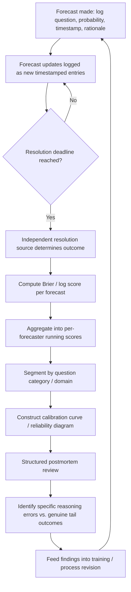

## Tracking and Improving Forecast Accuracy

### Overview

Tracking and improving forecast accuracy is the discipline of closing the feedback loop between forecasts made and outcomes observed, so that forecasting practice becomes a measurable, self-correcting skill rather than an unaccountable exercise in confident narrative. Without systematic tracking, no individual forecaster or institution can distinguish genuine forecasting skill from luck, identify specific reasoning errors, or demonstrate improvement over time. This discipline operationalizes the calibration and resolution concepts introduced in the superforecasting section into concrete organizational infrastructure: scoring rules, forecast logs, aggregation methods, and structured review processes.

### Why Tracking Is Foundational (Not Optional)

**Key Points**

- Without a scored historical record, claims of forecasting expertise are unfalsifiable — an analyst or institution can always construct a post hoc narrative explaining why a missed forecast was "reasonable given what was known at the time," and no external observer can verify or refute this without a documented prior estimate.
- Tetlock's original Expert Political Judgment research found that most political experts, when asked, could not accurately recall their own past predictions, let alone their accuracy rate — memory alone is an unreliable substitute for a written, timestamped forecast record.
- Systematic tracking is the only way to distinguish a forecaster who is well-calibrated across many questions from one who was simply correct on a small, memorable subset (survivorship-biased self-perception).
- Institutional forecasting functions (intelligence agencies, corporate risk units, financial analysts) that do not track accuracy cannot demonstrate return on investment for the forecasting function itself, nor identify which methods, question types, or personnel are actually adding value.

### Core Scoring Metrics

**1. Brier Score (Binary and Multi-Category Events)**

The standard proper scoring rule for probabilistic binary forecasts, introduced in the superforecasting section:

$$\text{Brier Score} = \frac{1}{N}\sum_{i=1}^{N}(f_i - o_i)^2$$

For multi-category (more than two mutually exclusive outcomes) questions, the score generalizes to:

$$\text{Brier Score} = \frac{1}{N}\sum_{i=1}^{N}\sum_{j=1}^{R}(f_{ij} - o_{ij})^2$$

where $R$ is the number of possible outcome categories, $f_{ij}$ is the forecast probability assigned to category $j$ for question $i$, and $o_{ij} \in \{0,1\}$ indicates whether category $j$ was the realized outcome.

A **proper scoring rule** is one where a forecaster's expected score is optimized precisely by reporting their true subjective probability — meaning the Brier score cannot be gamed by strategically over- or under-stating confidence relative to genuine belief. This property is why Brier scoring (rather than simpler "percent correct" metrics) is the standard in rigorous forecasting evaluation.

**2. Logarithmic Score**

An alternative proper scoring rule that penalizes confident wrong forecasts more severely than the Brier score:

$$\text{Log Score} = -\log(f_i) \text{ if outcome occurred, or } -\log(1-f_i) \text{ if it did not}$$

Because the logarithmic score approaches infinite penalty as a confidently wrong forecast (e.g., stating 99% for an event that then fails to occur) approaches certainty, it more strongly disincentivizes overconfidence than the bounded Brier score, at the cost of being undefined at the extremes (0% or 100%) — a practical reason many forecasting platforms cap stated probabilities at, e.g., 1%–99% rather than allowing literal 0/100 values.

**3. Relative Skill Metrics: Brier Skill Score**

Raw Brier scores are difficult to interpret in isolation because they depend heavily on the base rate and difficulty of the specific question set. The Brier Skill Score normalizes against a reference forecast (commonly the historical base rate or a "no-skill" naive forecaster):

$$\text{BSS} = 1 - \frac{\text{BS}_{\text{forecaster}}}{\text{BS}_{\text{reference}}}$$

A BSS of 0 indicates performance equivalent to the naive reference forecast; positive values indicate skill above that baseline; negative values indicate the forecaster performed worse than simply always forecasting the base rate.

**4. Calibration and Resolution Tracking (Reliability Diagrams)**

As detailed in the superforecasting section, plotting stated probability against observed outcome frequency across binned forecasts, and periodically reviewing this curve, is essential to distinguishing *why* a Brier score is high or low (poor calibration, poor resolution, or both) — a single aggregate score conceals this diagnostic information, which is why mature tracking systems maintain the full binned reliability data, not just the summary score.

### Building a Forecast Tracking System

**1. Structured Forecast Logging**

At the point a forecast is made (not after the fact), record:

- The precise question wording and resolution criteria.
- The stated probability (or probability distribution for continuous/multi-category questions).
- The date the forecast was made and the resolution deadline.
- Key evidence and reasoning considered (a brief rationale, sufficient for later postmortem review).
- The forecaster's identity/team (for individual and aggregate skill tracking).

**2. Immutable Forecast Records**

Once logged, a forecast should not be retroactively editable in a way that obscures the original timestamp and stated probability — tracking systems typically append revised forecasts as new timestamped entries (creating a forecast *trajectory* over time) rather than overwriting the original, which additionally enables tracking of how promptly and appropriately a forecaster updates in response to new evidence.

**3. Resolution and Scoring Pipeline**

At the resolution deadline, an independent, pre-agreed resolution source determines the actual outcome, which is then applied against every logged forecast for that question to compute individual Brier/log scores — resolution criteria clarity (established at question-creation time, per the forecasting-principles discussion of falsifiability) is what makes this step objective rather than contestable after the fact.

**4. Aggregation and Leaderboard Construction**

For team or crowd forecasting, individual scores are aggregated into:

- **Per-forecaster running average Brier scores**, often computed over a trailing window (e.g., the past 12 months) rather than all-time, since forecasting skill and question difficulty mix shift over time.
- **Per-question-category breakdowns** (e.g., separate tracking for military/security questions versus economic questions versus domestic political questions), since a forecaster's skill is not necessarily uniform across all domains.
- **Team/crowd aggregate scores**, often computed via extremized averaging (see superforecasting section) rather than simple mean, since GJP research found this improves aggregate accuracy relative to naive averaging.

### Diagram: Forecast Accuracy Tracking Pipeline

### Structured Postmortem Analysis

Scoring alone identifies *that* a forecast was inaccurate; postmortem analysis identifies *why*, which is the step that actually converts tracking data into improved future performance.

**Key Diagnostic Questions**

1. **Was the error in the base rate, the case-specific adjustment, or both?** Distinguishing whether the outside-view anchor itself was poorly chosen versus whether the case-specific evidence was misweighted relative to a sound base rate.
2. **Was new evidence underweighted or overweighted?** Reviewing the forecast trajectory (the sequence of updates over time) against the sequence of actual news/evidence to assess whether updates were proportionate, too slow (anchoring), or too volatile (overreaction).
3. **Was the error a reasoning failure or a genuine low-probability tail outcome?** A well-calibrated 20% forecast that resolves "yes" is not necessarily a bad forecast — roughly one in five well-calibrated 20% forecasts should resolve "yes" by construction. Distinguishing this from a forecast that was wrong *because of* an identifiable reasoning flaw (ignoring available evidence, mirror-imaging, groupthink) is essential to avoid the hindsight-bias trap of treating every miss as a process failure.
4. **Was the resolution criterion itself flawed?** Sometimes an apparent forecasting error traces back to ambiguous or poorly specified resolution criteria rather than the probability judgment itself — a process failure at question-design stage rather than forecasting stage.
5. **Were there process/organizational failures independent of the individual forecast?** E.g., relevant evidence existed but was not surfaced to the forecaster in time, or groupthink suppressed a dissenting, ultimately correct minority view.

[Inference] Because hindsight bias makes any miss feel more avoidable in retrospect than it was in prospect, disciplined postmortem practice generally benefits from having a structured checklist (as above) applied consistently to both hits and misses, rather than only reviewing high-profile misses — reviewing correct-but-lucky forecasts with the same rigor as incorrect ones helps prevent the false lesson that a good outcome always implies a good process.

### Organizational Infrastructure for Sustained Improvement

**1. Regular Calibration Training**

As discussed in the superforecasting section, periodic calibration exercises using verifiable general-knowledge questions (distinct from the live geopolitical forecasts) help forecasters maintain and improve the underlying skill of mapping subjective confidence to numeric probability, independent of domain-specific substantive knowledge.

**2. Cross-Domain Comparison and Benchmarking**

Comparing an internal forecasting team's tracked accuracy against external benchmarks — published tournament results, other institutions' track records where available, or simple base-rate/naive-model baselines — provides context for whether internal Brier scores represent genuine skill or are difficult to interpret in isolation.

**3. Incentive Design**

[Inference] Institutional forecasting functions face a structural tension: analysts and institutions are often incentivized (career-wise, politically) to avoid being on-record with a specific falsifiable numeric probability that could later prove embarrassingly wrong, favoring vague qualitative hedging instead — sustained forecast tracking practice generally requires an explicit organizational commitment to reward calibration and honest uncertainty expression (including well-reasoned near-50% forecasts) rather than only rewarding forecasters who happened to be confidently right, since the latter incentive structure encourages overconfidence and discourages genuine numeric commitment.

**4. Version-Controlled Question and Resolution Criteria Repositories**

Particularly relevant to organizations running many concurrent forecasting questions: maintaining a structured, timestamped repository of question wording, resolution criteria, and any clarifications issued during the question's active period, so that scoring disputes can be resolved by reference to the originally agreed criteria rather than after-the-fact reinterpretation.

**5. Periodic Reliability Diagram Review at the Institutional Level**

Beyond individual forecaster calibration curves, reviewing an institution's *aggregate* calibration curve across all forecasters and questions over a period (e.g., annually) surfaces systematic institutional biases — for example, a pattern of aggregate overconfidence specifically on military-escalation questions, or systematic underconfidence on economic questions — that would not be visible from any single forecaster's individual scorecard.

### Worked Example: Building a Minimal Forecast Tracking Log

**Example**

| Field | Example Entry |
| --- | --- |
| Question ID | GEO-2026-0143 |
| Question text | "Will State X hold a national election on schedule (no postponement beyond 30 days) by December 31, 2026?" |
| Resolution criteria | Official election commission announcement; postponement of 31+ days counts as "No" |
| Forecaster | Analyst A |
| Initial forecast (date, probability) | 2026-03-01, 78% |
| Update 1 (date, probability, rationale) | 2026-06-15, 65% — opposition boycott threat increases postponement risk |
| Update 2 (date, probability, rationale) | 2026-09-01, 70% — government reaffirms schedule publicly, partial reassurance |
| Final forecast before resolution | 2026-11-15, 72% |
| Resolution date and outcome | 2026-12-31, election held on schedule = "Yes" |
| Brier score (final forecast) | $(0.72 - 1)^2 = 0.0784$ |
| Postmortem note | Calibration appropriate; June update proportionate to genuine new evidence (boycott threat), September update correctly reversed course as threat receded; no reasoning error identified despite imperfect final precision |

This structured entry allows later aggregate analysis (Analyst A's running Brier score across all questions), calibration curve placement (this forecast falls in the 70–80% stated-probability bin, which resolved "yes"), and postmortem learning (were sequential updates proportionate to new evidence, consistent with well-calibrated behavior, rather than either excessive stubbornness or excessive volatility) — all of which are only possible because the forecast trajectory, not just the final number, was logged at the time.

### Common Pitfalls

**Key Points**

- **Scoring only final forecasts, discarding trajectory data**: Loses the ability to assess whether updating behavior itself was well-calibrated, which is a distinct and diagnostically valuable skill from single-point-in-time calibration.
- **Retroactively editing forecasts**: Undermines the entire evidentiary basis of tracking; any system allowing silent post hoc revision of a stated probability destroys accountability.
- **Comparing raw Brier scores across dissimilar question sets without normalization**: A low Brier score on a set of easy, high-base-rate questions is not comparable to a similarly low score on a set of genuinely difficult, close-to-50% questions — Brier Skill Scores or matched-difficulty comparison groups are necessary for fair comparison.
- **Treating every miss as a process failure (hindsight bias in postmortems)**: As discussed, a well-calibrated forecaster is *expected* to be wrong a predictable fraction of the time; postmortems that punish all misses equally regardless of whether the underlying process was sound will perversely train forecasters toward overconfident hedging rather than honest calibration.
- **Neglecting resolution-criteria ambiguity as a source of apparent forecasting error**: Attributing an inaccurate-seeming score to poor judgment when the actual root cause was an ambiguously worded question, misdirecting the corrective action.
- **No incentive alignment**: Building a sophisticated tracking system while implicitly punishing forecasters for confidently-stated-but-wrong numeric forecasts (rather than rewarding overall calibration across many questions) drives behavior back toward unfalsifiable qualitative hedging, defeating the system's purpose.
- **Insufficient question volume for statistical reliability**: Calibration and Brier score metrics require a reasonably large number of scored forecasts to be statistically meaningful; drawing strong conclusions about an individual's skill from a handful of questions risks mistaking noise for signal.

### Conclusion

Tracking and improving forecast accuracy operationalizes calibration theory into concrete institutional practice: structured, timestamped forecast logging; proper scoring rules (Brier and logarithmic scores) that cannot be gamed by strategic over- or under-confidence; calibration curve construction to diagnose *why* scores are what they are; and disciplined postmortem review that distinguishes genuine reasoning errors from expected low-probability tail outcomes. Sustained improvement depends as much on organizational incentive design — rewarding honest, well-calibrated numeric commitment rather than only confident correctness — as on the technical scoring infrastructure itself, since a tracking system undermined by perverse incentives will fail to elicit the honest, falsifiable forecasts it depends on.

**Related Topics**

- Brier score decomposition, calibration, and resolution (superforecasting section)
- Proper scoring rules: Brier score versus logarithmic score trade-offs
- Extremizing algorithms for crowd forecast aggregation
- Structured postmortem and after-action review methodology
- Incentive design for honest probabilistic disclosure in organizations
- Forecasting tournament platform design (Good Judgment Open and successors)
- Reliability diagrams and institutional-level calibration auditing
- Resolution criteria design and question-wording best practices
- Integrating forecast tracking with wargaming and scenario-planning feedback loops