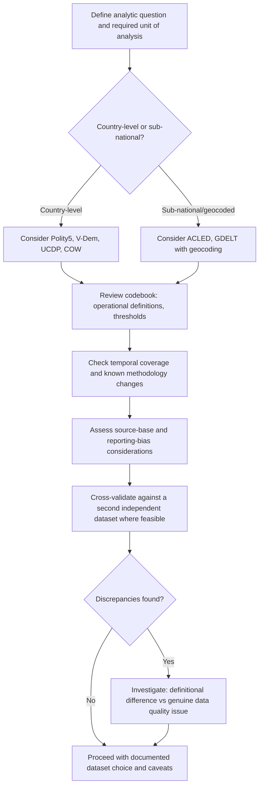

## Geopolitical Risk Datasets and Event Databases

### Overview

Geopolitical risk datasets and event databases are the empirical infrastructure underlying quantitative analysis in this field: structured, machine-readable records of political events, conflicts, sanctions, elite behavior, and macro-indicators that support base-rate estimation, statistical modeling, indicator construction, and historical reference-class analysis referenced throughout the forecasting and scenario planning methods discussed earlier in this course. Selecting and correctly interpreting these datasets — understanding their coding methodology, coverage limitations, and known biases — is a prerequisite for any rigorous quantitative geopolitical risk work, since dataset choice materially shapes downstream analytic conclusions.

### Taxonomy of Dataset Types

**1. Event Datasets (Machine-Coded, High-Frequency)**

Automatically extracted from news text using natural language processing to identify actor-action-target triples, typically coded to a standardized event ontology (most commonly CAMEO — Conflict and Mediation Event Observations).

- **GDELT (Global Database of Events, Language, and Tone)**: An open, continuously updated (near real-time) dataset monitoring global news media in over 100 languages, coding events, actors, locations, and sentiment/tone at very high volume and frequency. [Inference] Because GDELT relies on fully automated machine coding of news text at massive scale, it offers unmatched temporal/geographic coverage and update frequency relative to hand-coded alternatives, but this automation trades off some accuracy and nuance relative to expert-coded datasets — duplicate event inflation (the same real-world event reported by many outlets being counted multiple times) and media-attention bias (events in heavily covered regions/languages being overrepresented relative to under-covered regions) are commonly cited methodological considerations that practitioners should account for rather than treating raw event counts as a direct proxy for underlying event frequency.
- **ICEWS (Integrated Crisis Early Warning System)**: Originally developed under DARPA funding, also machine-coded using CAMEO-based ontology, historically used in academic and government early-warning modeling; distributed in part via the Harvard Dataverse.
- **Phoenix/POLECAT**: More recent open-source event-coding pipelines building on similar CAMEO-style extraction methodology, developed partly as open alternatives addressing some known limitations of earlier machine-coded datasets.

**2. Conflict and Violence Datasets (Expert/Hybrid-Coded)**

- **UCDP (Uppsala Conflict Data Program)**: A widely used academic conflict dataset distinguishing state-based armed conflict, non-state conflict, and one-sided violence, with clearly documented, transparent coding rules (e.g., a battle-death threshold defining "armed conflict" status) and long historical coverage extending back to the mid-20th century. Produced in long-standing collaboration with, and cross-referenced against, PRIO (Peace Research Institute Oslo).
- **ACLED (Armed Conflict Location & Event Data Project)**: A widely used real-time conflict event dataset with more granular geographic (sub-national, often geocoded to specific localities) and event-type coding than UCDP, covering political violence and protest events, using a hybrid of human coding and structured source review rather than fully automated extraction.
- **Correlates of War (COW) Project**: One of the longest-running academic conflict data projects, providing historical interstate and intrastate war data, alliance data, and national capability indices extending back to the early 19th century, widely used as a foundational reference dataset in quantitative international relations research.

**3. Political Instability and Regime Datasets**

- **Polity Project (Polity5)**: Codes regime authority characteristics (executive constraints, political competition, executive recruitment) into a composite democracy-autocracy scale, widely used as a standard regime-type control variable in quantitative political science and conflict-onset modeling.
- **V-Dem (Varieties of Democracy)**: A more granular, multi-dimensional dataset coding numerous distinct components of democratic governance (electoral, liberal, participatory, deliberative, egalitarian dimensions) via large-scale expert surveys, offering more disaggregated measurement than Polity's single composite scale.
- **Political Instability Task Force (PITF)** (formerly the State Failure Task Force): Historically produced structural models and associated datasets specifically oriented toward forecasting state failure and instability, using a curated set of structural risk-factor variables.

**4. Sanctions, Trade, and Economic-Statecraft Datasets**

- **Global Sanctions Data Base (GSDB)**: An academic dataset systematically coding the imposition, objectives, and (where assessable) outcomes of international sanctions episodes across many countries and years.
- **Threat and Imposition of Sanctions (TIES) dataset**: An earlier, widely cited academic dataset on sanctions episodes, their goals, and their success/failure coding.
- Trade and economic exposure data from sources such as the **IMF's Direction of Trade Statistics (DOTS)**, **UN Comtrade**, and **World Bank World Development Indicators**, frequently used as covariates in geopolitical risk modeling (trade dependency, currency reserve adequacy, debt sustainability indicators).

**5. Elite, Coup, and Leadership Datasets**

- **Cline Center Coup D'état Project / Powell and Thyne Coup Data**: Widely cited academic datasets coding coup attempts, successes, and failures across countries and time, used as both an outcome variable and a reference-class source for base-rate estimation on coup risk (directly relevant to the forecasting-principles worked example in an earlier section of this chapter).
- **Archigos**: A dataset on political leaders' tenure, entry, and exit modes (election, coup, natural death, etc.), useful for elite-survival and leadership-transition risk analysis.

**6. Proprietary/Commercial Risk Indices and Platforms**

Beyond open academic datasets, commercial and institutional providers offer proprietary indices and country risk scores (e.g., country risk ratings from major political-risk consultancies, sovereign risk services from ratings agencies, and specialized geopolitical risk indices published by financial institutions and think tanks). [Unverified] Because these products' underlying methodologies are often only partially disclosed (proprietary weighting schemes, non-public underlying data), independent replication and validation of their specific numeric outputs is generally more limited than for transparent, documented academic datasets, and practitioners should treat their scores as one input alongside — rather than a substitute for — transparent, replicable open data sources where rigor and auditability are required.

### Diagram: Dataset Taxonomy and Typical Use Cases

```mermaid
flowchart TD
    A[Geopolitical Risk Data Landscape] --> B[Event Datasets]
    A --> C[Conflict / Violence Datasets]
    A --> D[Political Instability / Regime Datasets]
    A --> E[Sanctions / Trade / Economic Datasets]
    A --> F[Elite / Coup / Leadership Datasets]
    A --> G[Proprietary / Commercial Indices]

    B --> B1[GDELT: high-frequency, machine-coded, near real-time]
    B --> B2[ICEWS: CAMEO-coded, early-warning modeling]
    B --> B3[Phoenix / POLECAT: open pipeline alternatives]

    C --> C1[UCDP: battle-death threshold, long historical coverage]
    C --> C2[ACLED: geocoded, hybrid-coded, real-time]
    C --> C3[Correlates of War: historical interstate/intrastate wars]

    D --> D1[Polity5: composite democracy-autocracy scale]
    D --> D2[V-Dem: multi-dimensional expert-coded democracy measures]

    E --> E1[GSDB / TIES: sanctions episodes and outcomes]
    E --> E2[IMF DOTS / UN Comtrade: trade exposure]

    F --> F1[Coup datasets: base rates for coup risk]
    F --> F2[Archigos: leader tenure and exit modes]

    G --> G1[Commercial country risk scores: opaque methodology caveat]
```

### Coding Methodology Considerations

**Machine-Coded vs. Human-Coded Trade-offs**

| Dimension | Machine-Coded (e.g., GDELT, ICEWS) | Human/Hybrid-Coded (e.g., UCDP, ACLED) |
| --- | --- | --- |
| Coverage volume/frequency | Very high; near real-time | Lower frequency; often updated weekly/monthly or retrospectively |
| Geographic/language coverage | Broad, multi-language automated ingestion | Depends on analyst/source review capacity; often more selectively sourced |
| Duplicate event risk | Higher — same event reported by multiple outlets can be separately coded | Lower — human review typically deduplicates |
| Nuance/context sensitivity | Lower — automated actor/action extraction can misclassify ambiguous text | Higher — trained coders apply documented judgment rules to ambiguous cases |
| Transparency of coding rules | Ontology (e.g., CAMEO) is documented, but automated extraction logic is less auditable case-by-case | Coding manuals and case-level decisions are typically more fully documented and auditable |
| Typical use case | High-frequency trend monitoring, machine-learning feature input, real-time signal detection | Rigorous academic conflict-onset modeling, base-rate estimation, historical reference-class construction |

**Key Coding Methodology Questions to Ask of Any Dataset Before Use**

1. **What is the precise operational definition of the coded event/outcome?** (e.g., UCDP's specific battle-death threshold for "armed conflict" status; a sanctions dataset's definition of "imposition" versus mere threat).
2. **What is the source base?** (Which news outlets, languages, wire services; does the source base itself have known regional/political coverage biases?)
3. **Is coding automated, human, or hybrid, and what is the documented inter-coder reliability (for human-coded data) or validation methodology (for machine-coded data)?**
4. **What is the temporal coverage and update frequency, and are there known coverage gaps or discontinuities (e.g., a change in source base or coding methodology partway through the historical series)?**
5. **Is the geographic unit of analysis (country-level, sub-national, geocoded point-event) appropriate to the analytic question at hand?**

### Common Dataset Biases and Limitations

**Key Points**

- **Media/reporting bias**: Event datasets built from news text inherit the coverage patterns of their source media — regions, languages, or event types that receive less international media attention will be systematically undercounted relative to their true underlying frequency, independent of the coding methodology's technical accuracy.
- **Duplicate/pile-up bias**: A single real-world event widely reported across many outlets can be coded multiple times in high-frequency machine-coded datasets, inflating apparent event counts for heavily covered incidents relative to less-covered ones of similar actual significance.
- **Definitional discontinuities over time**: Some long-running datasets have revised their coding rules or source base at points in their historical series (documented in changelogs/codebooks), which can create apparent trend breaks that reflect methodology changes rather than genuine underlying change — a critical consideration when using a dataset for long-run trend or base-rate analysis.
- **Selection bias in what gets reported at all**: Authoritarian or heavily censored media environments may suppress reporting of certain event types (e.g., domestic unrest, elite conflict), leading datasets reliant on open-source media to systematically undercount events in less press-free environments relative to otherwise-comparable open societies.
- **Aggregation-level mismatches**: Country-level datasets can obscure important sub-national heterogeneity (a national-level "stability" score may mask acute regional instability), relevant when the analytic question concerns a specific sub-national area rather than the country as a whole.
- [Inference] Because most large-scale event and conflict datasets are, to varying degrees, derived from or cross-validated against publicly available media and reporting, none is fully immune from the general class of media/reporting biases described above; the practical implication is that dataset choice should be matched to the specific analytic question (e.g., ACLED's finer geographic granularity may suit sub-national protest-risk analysis better than a country-level index, while UCDP's stricter, more conservative battle-death threshold may suit cross-national armed-conflict-onset base-rate estimation better than a broader event dataset that captures lower-intensity incidents).

### Practical Workflow: Selecting and Validating a Dataset for a Given Analytic Task

### Worked Example: Cross-Dataset Validation for Base-Rate Estimation

**Example**

Task: Estimate the historical base rate of coup attempts in states with a specific structural profile (low GDP per capita, recent contested election, weak civilian control of the military), as an input to the reference-class step of a probabilistic forecast (per the forecasting-principles worked example in an earlier section).

1. Pull candidate coup events from both the Powell and Thyne coup dataset and the Cline Center Coup D'état Project independently, since the two use somewhat different operational definitions of what constitutes a "coup attempt" (e.g., differing treatment of failed/aborted attempts, self-coups, or foreign-backed interventions).
2. Cross-tabulate the two datasets' coded events for the reference-class period and country set; identify cases where the two datasets disagree on coup-attempt classification.
3. For disagreement cases, consult each dataset's codebook to determine whether the discrepancy reflects a genuine definitional difference (e.g., one dataset excludes self-coups by sitting executives, the other includes them) or a likely coding error.
4. Report the base-rate estimate as a range bounded by the two datasets' counts, rather than a single point estimate derived from only one source, and explicitly document which definitional choice most closely matches the specific forecasting question's own resolution criteria.
5. Layer in Archigos leader-tenure data to assess whether the reference-class states' leadership-exit patterns are broadly consistent with the coup base-rate estimate derived above, as a form of independent cross-validation.

This multi-dataset triangulation approach, rather than reliance on a single source, is standard practice in rigorous quantitative geopolitical risk work precisely because of the definitional and coverage variation documented above.

### Common Pitfalls

**Key Points**

- **Treating raw event counts as a direct, unadjusted proxy for underlying event frequency**: Ignoring media-attention and duplicate-coding biases in machine-coded datasets can lead to spurious "trend" findings that actually reflect changes in media coverage patterns rather than genuine underlying change.
- **Ignoring codebook definitional details**: Using a dataset's headline variable (e.g., "armed conflict") without checking the precise operational threshold behind it, then applying findings to a question with a different implicit definition.
- **Single-source reliance for high-stakes base-rate estimation**: As the worked example illustrates, definitional and coverage differences across datasets can produce materially different base-rate estimates; cross-validation is standard practice for consequential estimates.
- **Failing to account for known methodology discontinuities**: Treating a long time series as methodologically uniform throughout when the codebook documents a source-base or coding-rule change partway through, producing spurious apparent trend breaks.
- **Overlooking aggregation-level mismatches**: Applying country-level indices to sub-national analytic questions (or vice versa) without acknowledging the resulting loss of relevant granularity.
- **Uncritical use of opaque commercial indices in place of auditable open data**: Particularly in contexts (academic publication, high-stakes policy analysis) where independent replicability matters, favoring a proprietary black-box score over a transparent, documented open dataset undermines auditability.

### Conclusion

Geopolitical risk datasets and event databases provide the empirical foundation for base-rate estimation, statistical modeling, and reference-class construction throughout quantitative geopolitical risk practice, but each major dataset family — machine-coded event data, expert-coded conflict data, regime and instability indices, sanctions/trade data, and elite/leadership data — carries distinct coding methodologies, coverage patterns, and known biases that must be understood and, where consequential, cross-validated rather than assumed away. Rigorous practice matches dataset selection to the specific unit of analysis and definitional requirements of the analytic question, documents known limitations transparently, and favors auditable, well-documented sources over opaque proprietary alternatives wherever independent verification matters.

**Related Topics**

- CAMEO event ontology and machine-coding methodology in depth
- Cross-dataset validation and triangulation techniques for base-rate estimation
- Constructing composite geopolitical risk indices from underlying datasets
- Sub-national geocoded conflict analysis using ACLED and similar sources
- Codebook literacy and operational-definition auditing practices
- Structural conflict-onset modeling using PITF/ViEWS-style variable sets
- Integrating open datasets with proprietary commercial risk scores
- Data quality assessment frameworks for social-science event data
- Time-series discontinuity detection in long-running political datasets