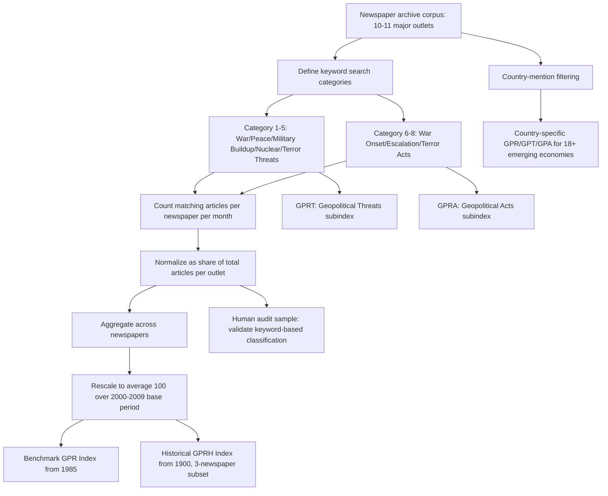

## The Geopolitical Risk Index and Related Measures

### Overview

The Geopolitical Risk Index (GPR), developed by Federal Reserve Board economists Dario Caldara and Matteo Iacoviello, is the most widely cited and academically validated quantitative measure of geopolitical risk in contemporary economic and financial research. Published in its definitive form in the *American Economic Review* in 2022, the GPR provides a news-based measure of adverse geopolitical events and associated risks, constructed through automated textual analysis of major international newspaper archives extending back to 1900. It sits within a broader family of text-based, news-derived uncertainty indices — most notably the Economic Policy Uncertainty (EPU) index of Baker, Bloom, and Davis — that share a common methodological lineage: converting large volumes of unstructured news text into a structured, continuously updated time series proxying for a latent, otherwise unobservable risk construct. [American Economic Association](https://www.aeaweb.org/articles?id=10.1257%2Faer.20191823)

### Construction Methodology

**Core Approach**

The construction of the GPR index involves three main steps: definition, measurement, and audit. The index reflects automated text-search results of the electronic archives of 10 newspapers: Chicago Tribune, the Daily Telegraph, Financial Times, The Globe and Mail, The Guardian, the Los Angeles Times, The New York Times, USA Today, The Wall Street Journal, and The Washington Post. In an earlier working-paper vintage, the benchmark search covered 11 national and international newspapers. Caldara and Iacoviello calculate the index by counting the number of articles related to geopolitical risk in each newspaper for each month (as a share of the total number of news articles). The index is then normalized to average a value of 100 in the 2000-2009 decade. [K.7 Measuring Geopolitical Risk Caldara, Dario and Matteo Iacoviello +3](https://www.federalreserve.gov/econres/ifdp/files/ifdp1222.pdf)

**The Eight (Originally Six) Search Categories**

The keyword search is organized into thematic categories capturing distinct dimensions of geopolitical tension. In the AER-published version, the search is organized in eight categories: War Threats (Category 1), Peace Threats (Category 2), Military Buildups (Category 3), Nuclear Threats (Category 4), Terror Threats (Category 5), Beginning of War (Category 6), Escalation of War (Category 7), Terror Acts (Category 8). An earlier working-paper description of the methodology grouped the search differently: Group 1 includes words associated with explicit mentions of geopolitical risk, as well as mentions of military-related tensions involving large regions of the world and a U.S. involvement. Group 2 includes words directly related to nuclear tensions., with subsequent groups covering war and terrorist threats and actual event realization — reflecting methodological refinement across successive paper vintages. [Policyuncertainty](https://www.policyuncertainty.com/gpr.html)[Bc](https://www2.bc.edu/matteo-iacoviello/gpr.htm)

**Subindices: Threats vs. Acts**

Based on the search groups above, Caldara and Iacoviello also constructs two subindexes. The Geopolitical Threats (GPRT) includes words belonging to categories 1 to 5 above. The Geopolitical Acts (GPRA) index includes words belonging to categories 6 to 8. This threat/act decomposition is analytically important: it allows researchers to distinguish the economic and financial effects of anticipated risk (threats, which can depress investment and markets even absent any realized event) from the effects of realized adverse events (acts) — a distinction directly relevant to the forecasting-versus-realized-outcome framing discussed throughout this course's forecasting chapter. [Policyuncertainty](https://www.policyuncertainty.com/gpr.html)

**Historical vs. Benchmark Series**

The Benchmark Index (GPR) uses 10 newspapers and starts in 1985. Caldara and Iacoviello use the same methodology to construct a Geopolitical Risk Historical Index (GPRH), which uses three newspapers and starts in 1900, enabling long-run historical analysis extending well before most other quantitative political-risk datasets provide coverage. [Policyuncertainty](https://www.policyuncertainty.com/gpr.html)

**Country-Specific Variants**

Beyond the global aggregate, the data also include (beta-version) country-specific GPR indices for 18 emerging economies, developed in Caldara, Iacoviello, and Markiewitz's companion work on country-specific geopolitical risk, alongside indices for advanced economies. The country-level construction methodology adapts the keyword approach to country-specific mentions: the country-specific GPT index is based on articles that mention a particular country and include phrases related to threats and concerns about scope, duration, and ramifications of geopolitical tensions. The country-specific GPA index is based on phrases referring to the outbreak of geopolitically adverse acts affecting that specific country — extending the threats/acts decomposition to the country level, allowing analysis of idiosyncratic (country-specific) versus global geopolitical risk exposure. [Bc](https://www2.bc.edu/matteo-iacoviello/gpr.htm)[Matteoiacoviello](https://www.matteoiacoviello.com/research_files/GPR_INFLATION_PAPER.pdf)

### Diagram: GPR Index Construction Pipeline

### Empirical Findings and Documented Behavior

**Historical Spikes**

The published index exhibits clear, historically interpretable spikes: the geopolitical risk (GPR) index spikes around the two world wars, at the beginning of the Korean War, during the Cuban Missile Crisis, and after 9/11. An earlier working-paper vintage using a different newspaper sample also documented spikes around the Gulf War, after 9/11, during the 2003 Iraq invasion, during the 2014 Russia-Ukraine crisis, and after the Paris terrorist attacks — this face-validity property (the index rising visibly and appropriately during well-documented historical crises) is a standard robustness check cited in support of the measure's construct validity. [American Economic Association](https://www.aeaweb.org/articles?id=10.1257%2Faer.20191823)[Bc](https://www2.bc.edu/matteo-iacoviello/gpr.htm)

**Macroeconomic and Financial Effects**

The AER paper's central empirical contribution: higher geopolitical risk foreshadows lower investment and employment and is associated with higher disaster probability and larger downside risks. The adverse consequences of the GPR index are driven by both the threat and the realization of adverse geopolitical events. At the firm and industry level, investment drops more in industries that are exposed to aggregate geopolitical risk. Higher firm-level geopolitical risk is associated with lower firm-level investment. [American Economic Association](https://www.aeaweb.org/articles?id=10.1257%2Faer.20191823)[American Economic Association](https://www.aeaweb.org/articles?id=10.1257%2Faer.20191823)

**Inflation Transmission**

Follow-on research by Caldara and Conlisk decomposes the GPR into its threat and act subcomponents specifically to study differential macroeconomic transmission: the use of the two subcomponents of the GPR index allows us to better capture the effects of geopolitical risks on financial conditions and commodity prices, fast-moving variables that immediately react to "threats" about future events, with the research further examining whether the macroeconomic effects of geopolitical risk differ depending on the nature of the shock—whether it stems from geopolitical acts or threats and whether it reflects global developments or country-specific dynamics. [Do Geopolitical Risks Raise or Lower Inflation?∗ Dario Caldara† Sarah Conlisk‡ +2](https://www.matteoiacoviello.com/research_files/GPR_INFLATION_PAPER.pdf)

### Critical Methodological Consideration: Measuring Attention, Not Events

**Key Points**

The single most important interpretive caveat for the GPR index, raised directly in comparative academic literature, is that it is fundamentally a media-attention proxy rather than a direct measure of underlying event frequency or severity: the Geopolitical Risk Index (GPR) of Caldara and Iacoviello (2022) infers geopolitical risk from newspaper article counts discussing wars, terrorism, and military tensions—measuring media *attention* rather than the events themselves. [arxiv](https://arxiv.org/pdf/2507.04833)

Comparative validation work measuring the GPR against an independently constructed, GDP-weighted conflict-intensity measure found meaningful but incomplete co-movement: the two series co-move during traditional military confrontations (Vietnam War, post-Cold War peace dividend, Russia-Ukraine war), with correlations of ρ = 0.28 (aggregate), 0.50 (China), and 0.36 (Russia). [Inference] Correlations in this moderate range (roughly 0.28–0.50 depending on the specific country/aggregate comparison) suggest the GPR captures a meaningfully related but distinct construct from underlying conflict intensity itself — consistent with the interpretation that media attention and actual event severity are correlated but not interchangeable, an important caveat when using the GPR as a proxy input into models where the analytic target is genuine event risk rather than media salience. [arxiv](https://arxiv.org/pdf/2507.04833)

This directly parallels the dataset-bias considerations discussed in the preceding section on geopolitical risk datasets: like GDELT and other media-derived event counts, the GPR inherits whatever coverage patterns, editorial attention allocation, and reporting salience characterize its underlying newspaper corpus, and does not directly measure the "ground truth" frequency or severity of geopolitical events independent of how heavily the press covers them.

### Related and Comparator Measures

**Economic Policy Uncertainty (EPU) Index**

The Economic Policy Uncertainty (EPU) index of Baker et al. (2016) follows a similar approach, measuring uncertainty about which economic policies will be implemented and when. The EPU and GPR share near-identical construction methodology (automated newspaper keyword counting, monthly frequency, historical normalization) but target conceptually distinct constructs — EPU centers on domestic/international economic-policy uncertainty broadly, while GPR centers specifically on adverse geopolitical/military/terrorism-related events and threats. [arxiv](https://arxiv.org/pdf/2606.07049)

**Topic-Modeling and LLM-Based Extensions**

Several subsequent contributions have extended these methodologies using topic modelling (Azqueta-Gavaldón et al., 2023; Azqueta-Gavaldón, 2017) and large language models (Ghomi and Hurtado, 2026), demonstrating that richer text representations can sharpen the measurement of uncertainty. [Inference] This reflects a broader methodological trajectory in the field: moving from rigid keyword-matching approaches (as in the original GPR construction) toward more flexible, context-sensitive natural language processing techniques capable of capturing semantic nuance that fixed keyword lists may miss or over/under-count, though the tradeoffs of interpretability, reproducibility, and long-run historical backward-compatibility relative to the original transparent keyword methodology are relevant considerations when evaluating these newer variants. [arxiv](https://arxiv.org/pdf/2606.07049)

**Real-Time OSINT-Derived Indices**

More recent research has explored constructing geopolitical risk measures directly from open-source intelligence (OSINT) channels rather than traditional newspaper archives, aiming at higher-frequency, more real-time risk signal extraction for applications such as financial market causal analysis — an extension of the GPR's core logic (text-derived risk proxy) to a broader and faster-updating source base than curated newspaper archives alone.

**Related Federal Reserve Measures from the Same Research Program**

Caldara and Iacoviello's broader research program has produced methodologically related indices using the same newspaper-archive text-search approach applied to different constructs, including a measure of measuring shortages since 1900 — illustrating that the underlying text-search-and-normalize methodology pioneered for GPR has been extended by its original authors to other latent economic constructs beyond geopolitical risk specifically. [Matteoiacoviello](https://www.matteoiacoviello.com/research_files/GPR_INFLATION_PAPER.pdf)

### Data Access and Update Cadence

The GPR index is published as an ongoing, actively maintained data product. Data updated monthly around the 10th of the month. Data release includes preliminary reading for current month based on searches until the 10th of the month. Daily-frequency data are also made available for the benchmark index according to the hosting sites. The index is hosted both on the original authors' academic sites and mirrored on the Federal Reserve-affiliated Policy Uncertainty data portal alongside the EPU index family, reflecting the close methodological and institutional relationship between the two index families. [Google Sites](https://sites.google.com/view/dariocaldara/geopolitical-risk?authuser=0)

### Applying the GPR Index in Geopolitical Risk Practice

**Example**

A practitioner building a quantitative early-warning model for emerging-market currency stress (as discussed in the forecasting-principles worked example earlier in this course) might incorporate the country-specific GPR/GPT/GPA series for a target country as one input variable alongside more direct economic indicators (currency reserve adequacy, sovereign bond spreads). Given the attention-versus-events caveat above, best practice treats a GPR spike as a signal that *press attention and threat perception* around that country have risen — informative for a channel where market sentiment and perceived risk (rather than ground-truth event severity alone) drive capital flows and currency pressure — rather than as a direct, unmediated proxy for the objective probability of an adverse event actually occurring. Cross-referencing a GPR spike against an independent event dataset (e.g., ACLED or UCDP, per the preceding section) provides a check on whether elevated media attention corresponds to a genuine escalation in underlying event activity or reflects a period of intense threat-focused coverage without a commensurate rise in realized events.

### Comparison Table: GPR Index vs. Complementary Measures

| Measure | Core Construct | Primary Data Source | Frequency | Historical Depth |
| --- | --- | --- | --- | --- |
| GPR (Caldara-Iacoviello) | Media attention to geopolitical threats/acts | Newspaper archive keyword search | Monthly (daily benchmark available) | 1900 (GPRH) / 1985 (benchmark) |
| EPU (Baker-Bloom-Davis) | Economic policy uncertainty | Newspaper archive keyword search | Monthly | Varies by country series |
| Event datasets (GDELT, ACLED, UCDP) | Underlying event occurrence/frequency | News-derived, human/machine-coded event extraction | Daily to yearly depending on source | Varies (GDELT: recent decades; UCDP: mid-20th century+) |
| Conflict-intensity measures (GDP-weighted) | Direct conflict severity/scale | Conflict/casualty data weighted by economic exposure | Varies | Varies by underlying conflict dataset |

### Common Pitfalls

**Key Points**

- **Conflating media attention with event ground truth**: As documented above, treating GPR spikes as direct, calibrated probability signals of actual event occurrence, rather than as a measure of press salience that correlates with but does not equal underlying event severity.
- **Ignoring methodology version differences**: The specific newspaper count (10 vs. 11), category count (six vs. eight), and base-period normalization have evolved across working-paper and published vintages; using an outdated methodology description when the underlying data series has since been revised can create confusion when comparing figures across sources.
- **Overlooking the threats/acts decomposition**: Using only the aggregate GPR series when a research question specifically concerns anticipatory risk pricing (better captured by GPRT) versus realized-shock transmission (better captured by GPRA) discards analytically valuable structure the index already provides.
- **Treating beta-version country-specific indices as equally mature as the benchmark global series**: The country-specific GPR variants for emerging economies are explicitly labeled beta-version by the original authors, warranting appropriate caution regarding data maturity and stability relative to the long-established global benchmark and historical series.
- **Neglecting cross-validation against independent event data**: Given the attention-versus-events distinction, using GPR in isolation without cross-referencing against event-count or conflict-intensity datasets (per the preceding section's dataset taxonomy) forgoes an important robustness check.

### Conclusion

The Geopolitical Risk Index represents the most rigorously validated and widely adopted quantitative text-based measure of geopolitical risk in economic and financial research, constructed through transparent, reproducible newspaper keyword search methodology and decomposed into threats/acts subindices and country-specific variants that enable nuanced macroeconomic and financial transmission analysis. Its central interpretive limitation — that it measures media attention to geopolitical tension rather than a direct, unmediated count of underlying events — situates it as a valuable but partial input that is best used alongside, rather than as a substitute for, the event and conflict datasets discussed in the preceding section, particularly for analytic questions where the distinction between perceived/anticipated risk and realized event severity is consequential.

**Related Topics**

- Economic Policy Uncertainty (EPU) index and its relationship to GPR methodology
- Threats versus Acts decomposition and differential macroeconomic transmission channels
- Country-specific geopolitical risk indices for emerging market analysis
- Topic modeling and LLM-based extensions to keyword-based text indices
- Cross-validating attention-based indices against event datasets (ACLED, UCDP, GDELT)
- GPR applications in asset pricing, investment, and firm-level risk exposure studies
- Real-time OSINT-derived geopolitical risk signal construction
- Newspaper archive text-search methodology and keyword robustness testing
- Integrating GPR as a covariate in early-warning and forecasting models