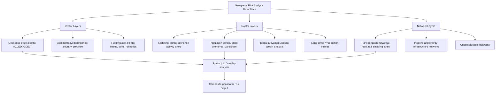

## Geospatial and GIS-Based Risk Analysis

### Overview

Geospatial and GIS-based risk analysis applies geographic information systems, spatial statistics, and remote sensing to geopolitical risk problems where the *location* and *spatial relationships* between events, assets, populations, and infrastructure are analytically central — not merely incidental metadata. Where the datasets discussed in the earlier section (GDELT, ACLED, UCDP) provide the underlying event records, geospatial analysis is the toolkit that transforms those geocoded point-events, along with satellite imagery, terrain data, and infrastructure layers, into spatially explicit risk assessments: proximity-based exposure scoring, hotspot detection, corridor and chokepoint vulnerability mapping, and spatial diffusion modeling of instability.

### Why Space Matters in Geopolitical Risk

**Key Points**

- Geopolitical risk is rarely uniformly distributed within a country or region — a national-level index (e.g., a country risk score) can obscure acute sub-national variation, understating risk in a conflict-affected border province while overstating it for a stable capital region, or vice versa.
- Physical geography constrains and shapes conflict, trade, and instability dynamics directly: mountainous terrain affects insurgency dynamics and military logistics; maritime chokepoints concentrate global trade risk into narrow, geographically fixed corridors; river basins and resource deposits generate spatially specific competition.
- Spatial proximity is itself a risk factor: instability, conflict, and displacement exhibit well-documented spatial diffusion/contagion patterns, where risk in one location elevates risk in geographically adjacent locations independent of those locations' own underlying structural characteristics.
- Physical/critical infrastructure (pipelines, ports, undersea cables, transportation corridors) has fixed geographic coordinates, making point-based and network-based geospatial risk assessment a natural fit for infrastructure-exposure analysis.

### Core Geospatial Data Types

**1. Vector Data**

Discrete geographic features represented as points, lines, or polygons with associated attribute tables:

- **Points**: Event locations (geocoded ACLED incidents), facility locations (military bases, refineries, ports), population centers.
- **Lines**: Transportation networks (roads, railways, pipelines, shipping lanes), borders, rivers.
- **Polygons**: Administrative boundaries (countries, provinces, exclusive economic zones), conflict-affected area delineations, resource concession blocks.

**2. Raster Data**

Continuous surfaces represented as a grid of cells, each holding a value:

- Satellite-derived nighttime lights intensity (widely used as a proxy for economic activity and, by extension, for detecting economic disruption during conflict or sanctions episodes).
- Population density grids (e.g., WorldPop, LandScan) — critical for estimating civilian exposure to a given hazard or conflict zone.
- Terrain/elevation models (Digital Elevation Models, DEMs) — used in terrain-based conflict and logistics analysis.
- Land cover and vegetation indices — relevant to resource-conflict and climate-security analysis.

**3. Network Data**

Graph-structured geographic data explicitly modeling connectivity: transportation networks, pipeline networks, and supply chains, where risk analysis focuses not just on node locations but on the structural criticality of specific links or chokepoints within the broader network topology.

### Diagram: Geospatial Data Layers for Risk Analysis

### Core Analytic Techniques

**1. Hotspot Detection and Spatial Clustering**

Statistical methods identifying geographic areas with significantly elevated event density relative to surrounding areas, rather than relying on visual inspection alone:

- **Kernel Density Estimation (KDE)**: Produces a smoothed density surface from discrete event points, useful for visualizing conflict intensity gradients across a region.
- **Getis-Ord Gi* statistic**: A local spatial statistic identifying statistically significant clusters of high values ("hot spots") or low values ("cold spots") among neighboring areal units, commonly applied to gridded or administrative-unit-level event counts.
- **Moran's I**: A global measure of spatial autocorrelation, testing whether high (or low) values of a variable (e.g., instability index by province) are spatially clustered rather than randomly distributed:

$$I = \frac{n}{\sum_i \sum_j w_{ij}} \cdot \frac{\sum_i \sum_j w_{ij}(x_i - \bar{x})(x_j - \bar{x})}{\sum_i (x_i - \bar{x})^2}$$

where $n$ is the number of spatial units, $w_{ij}$ is a spatial weight (typically based on adjacency or distance) between units $i$ and $j$, and $x_i$ is the variable value at unit $i$. Values of $I$ significantly above the expected value under spatial randomness indicate positive spatial autocorrelation (clustering); significantly below indicates dispersion.

**2. Proximity and Buffer Analysis**

Calculating distance-based exposure metrics: e.g., the number of critical facilities within a defined buffer distance of an active conflict zone, or the population residing within a specified radius of a border area experiencing elevated tension. Buffer analysis is a foundational technique for translating point-event conflict data into asset- or population-level exposure metrics.

**3. Spatial Diffusion and Contagion Modeling**

Modeling how instability or conflict risk spreads geographically over time, typically incorporating a spatial lag term capturing the influence of neighboring units' risk levels on a given unit's own risk:

$$y_i = \rho \sum_j w_{ij} y_j + X_i \beta + \epsilon_i$$

where $y_i$ is the outcome (e.g., conflict onset probability) in unit $i$, $\rho$ is the spatial autoregressive coefficient capturing diffusion strength, $w_{ij}$ is the spatial weight matrix, $X_i$ is a vector of unit-specific structural covariates, and $\beta$ their coefficients. This spatial-lag structure is a standard extension of the conflict-onset structural models referenced in the earlier datasets section, incorporating explicit geographic contagion rather than treating each spatial unit as independent.

**4. Network Criticality and Chokepoint Analysis**

For transportation, energy, and communications networks, graph-theoretic centrality measures identify which specific nodes or links are most structurally critical:

- **Betweenness centrality**: Identifies nodes/edges that lie on the largest number of shortest paths between other network nodes — high-betweenness points in a shipping-lane or pipeline network represent chokepoints whose disruption would maximally impede overall network flow.
- **Redundancy/resilience analysis**: Assessing how much alternative capacity exists if a given chokepoint is disrupted (e.g., alternative shipping routes around a strait closure, alternative pipeline routing), directly informing the robustness/optionality strategic responses discussed in the tail-risk section.

**5. Remote Sensing-Based Change Detection**

Comparing satellite imagery across time periods to detect physical changes relevant to risk assessment without requiring on-the-ground access, particularly valuable in denied or hard-to-access areas:

- **Nighttime lights anomaly detection**: A sudden, sustained drop in nighttime light intensity in a given area can indicate infrastructure damage, population displacement, or economic disruption consistent with conflict or sanctions impact.
- **Optical and synthetic aperture radar (SAR) imagery analysis**: Detecting military buildup indicators (vehicle/equipment concentrations, new infrastructure construction) or damage assessment (building destruction, agricultural disruption) — SAR imagery's ability to penetrate cloud cover and operate day/night makes it particularly valuable for continuous monitoring in regions with frequent adverse weather or для operational security reasons around monitoring timing.
- **Thermal and fire-detection satellite products**: Used to detect and geolocate conflict-related fires, industrial facility damage, or resource-extraction activity (e.g., illicit refining operations) in near-real time.

### Worked Example: Maritime Chokepoint Risk Assessment

**Example**

Task: Assess the geopolitical risk exposure of global energy trade to a specific maritime strait.

1. **Network mapping**: Construct a vector network of major tanker shipping routes, geocoding the strait as a critical link (edge) connecting origin (production/export) nodes to destination (consumption/import) nodes.
2. **Volume/criticality quantification**: Overlay shipping-traffic density data (e.g., AIS - Automatic Identification System vessel-tracking data) onto the network to quantify what share of global seaborne energy trade transits this specific chokepoint — a direct empirical measure of betweenness-centrality-style structural importance.
3. **Proximity risk layering**: Buffer-analyze the strait against a geocoded event layer (ACLED or GDELT) tracking military activity, piracy incidents, or political tension in immediately adjacent coastal states, to assess current elevated-risk status.
4. **Redundancy assessment**: Identify alternative routing options (e.g., longer maritime routes around a landmass, or overland pipeline alternatives) and quantify the additional transit time/cost penalty of rerouting if the chokepoint were disrupted — informing the robustness/optionality tail-risk framework from the earlier section.
5. **Composite output**: A geospatial risk layer combining (a) baseline structural criticality (trade volume through the chokepoint), (b) current dynamic risk (nearby event density and trend), and (c) redundancy/resilience (available alternative routing capacity), typically visualized as a risk-weighted map product for decision-maker briefing.

### Integration with Forecasting and Scenario Methods

**Key Points**

- Geospatial hotspot and diffusion analysis provides an empirically grounded input to the "signposts" and leading-indicator components of scenario planning (discussed in the earlier scenario-development section) — a geospatially detected expansion of a conflict hotspot toward a previously unaffected province is a concrete, trackable signpost distinguishing which of several constructed scenarios is emerging in reality.
- Spatial lag/diffusion models feed directly into the structural conflict-onset quantitative models referenced in the datasets section, improving on non-spatial models by explicitly accounting for the well-documented tendency of conflict risk to cluster and spread geographically rather than occurring independently across units.
- Remote-sensing-based change detection provides a partially independent verification channel for wargaming and forecasting exercises concerning denied-access or heavily censored environments, where open-source event reporting (per the earlier dataset-bias discussion) may be systematically suppressed or unreliable — satellite-derived proxies (nighttime lights, thermal anomalies) can partially substitute for ground-level reporting in such contexts, subject to their own interpretive limitations.
- Network criticality analysis directly informs the tail-risk barbell/redundancy strategic framework (prior chapter section) by quantifying, in concrete geographic and volumetric terms, exactly where single-point-of-failure exposure exists and how much genuine routing redundancy is available as a hedge.

### Common Software and Platform Considerations

**Key Points**

- **Desktop/enterprise GIS**: ESRI ArcGIS and the open-source QGIS are the dominant platforms for vector/raster analysis, spatial statistics, and cartographic output production in professional risk-analysis practice.
- **Programmatic/scripted geospatial analysis**: Python libraries (GeoPandas, Shapely, Rasterio, PySAL for spatial statistics, NetworkX for network analysis) and R packages (sf, spdep, igraph) are widely used for reproducible, scriptable geospatial workflows integrated into broader quantitative pipelines, rather than one-off manual GIS desktop analysis.
- **Satellite imagery access**: Publicly available imagery (Sentinel, Landsat via open data portals) supports basic change-detection work; higher-resolution commercial imagery (from providers such as Maxar or Planet) is typically required for fine-grained infrastructure or military-activity assessment, generally at commercial licensing cost.
- **AIS vessel-tracking data**: Widely used for maritime chokepoint and shipping-disruption analysis, available through both commercial maritime-intelligence providers and, with more limited coverage/latency, some open feeds.
- [Inference] Because remote-sensing and commercial AIS data access often involves licensing costs and, for higher-resolution imagery, tasking lead times, integrating these sources into a fast-moving geopolitical risk workflow typically requires establishing data-access arrangements and analytic pipelines in advance of an acute crisis, rather than attempting to procure and process this data reactively once a crisis is already underway.

### Common Pitfalls

**Key Points**

- **Ignoring the modifiable areal unit problem (MAUP)**: Statistical results from spatial analysis (e.g., Moran's I clustering results) can be sensitive to the specific administrative or grid-unit boundaries chosen for aggregation — the same underlying point-event data can produce visibly different apparent spatial patterns depending on whether analysis is conducted at province, district, or grid-cell level, a well-documented methodological artifact requiring sensitivity testing across aggregation levels.
- **Treating remote-sensing proxies as ground truth**: A nighttime-lights drop or thermal anomaly is a correlate, not a direct confirmation, of the underlying event (economic disruption, conflict damage) it is presumed to indicate — corroboration against other data sources is standard practice, echoing the general dataset-triangulation principle from the earlier section.
- **Overlooking edge effects and cross-border spatial dependence**: Analyzing a country's internal spatial risk patterns while ignoring adjacent countries' conditions can miss genuine cross-border contagion dynamics, particularly relevant for conflict and displacement analysis in border regions.
- **Static analysis of an inherently dynamic phenomenon**: A single-snapshot hotspot map can understate risk if the underlying process is actively diffusing outward; time-series animated or repeated-interval hotspot analysis is generally more informative than a single static output for genuinely dynamic instability.
- **Neglecting network redundancy in chokepoint analysis**: Focusing solely on a chokepoint's current traffic volume without assessing genuine alternative-routing capacity can overstate the chokepoint's criticality if meaningful redundancy exists, or understate true systemic fragility if alternative routes are more theoretical than practically available at scale.
- **Resolution mismatch between imagery and analytic question**: Using coarse-resolution, freely available imagery for a question that genuinely requires fine-grained (sub-meter) resolution to detect the relevant feature (e.g., specific military equipment types) produces an analytically insufficient result regardless of how sophisticated the surrounding analytic pipeline is.

### Conclusion

Geospatial and GIS-based risk analysis brings explicit spatial reasoning — proximity, clustering, diffusion, network structure, and remote-sensing-derived physical observation — to geopolitical risk practice, complementing the aspatial statistical and text-based methods covered in the preceding sections of this chapter. Its core techniques (hotspot detection, spatial autocorrelation testing, buffer/proximity analysis, spatial-lag diffusion modeling, and network criticality analysis) transform geocoded event and infrastructure data into decision-relevant, spatially explicit risk assessments, while remote sensing provides a partially independent observational channel particularly valuable in denied-access or under-reported environments — with the recurring caveat, consistent with this chapter's broader data-quality themes, that spatial proxies require corroboration and methodological sensitivity testing rather than uncritical acceptance as ground truth.

**Related Topics**

- Modifiable areal unit problem (MAUP) and spatial aggregation sensitivity testing
- Spatial econometrics and spatial-lag conflict-onset modeling
- Remote sensing change detection for denied-access conflict monitoring
- AIS vessel-tracking data and maritime chokepoint risk quantification
- Network centrality measures and critical-infrastructure resilience analysis
- Nighttime lights as an economic-activity and conflict-disruption proxy
- Integrating geospatial signposts into scenario planning and early-warning systems
- QGIS/ArcGIS and Python geospatial (GeoPandas, PySAL) tooling for risk analysts
- Population displacement modeling using gridded population and conflict event data