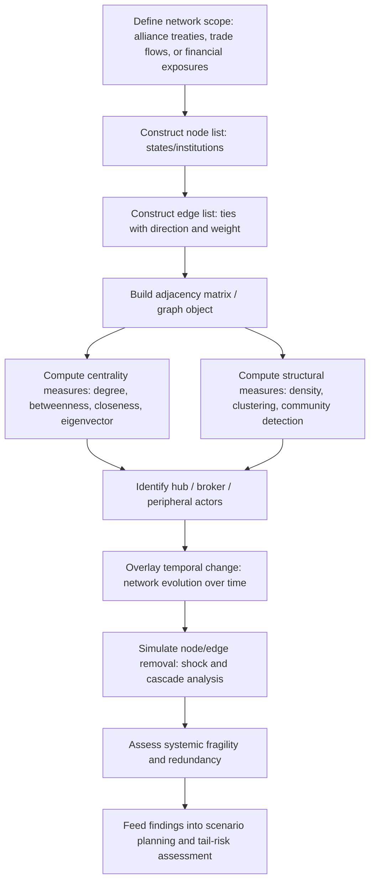

## Network Analysis of Alliances and Trade Relationships

### Overview

Network analysis applies graph theory and social network analysis (SNA) methods to model states, institutions, and other actors as nodes connected by edges representing alliances, trade flows, diplomatic ties, financial linkages, or military cooperation. Unlike dyadic (pairwise) analysis, which examines one bilateral relationship in isolation, network analysis captures the *systemic* structure of interdependence — how a shock or shift affecting one node propagates through indirect connections, which actors occupy structurally powerful "bridging" positions, and how the overall architecture of the international system (multipolar, hub-and-spoke, densely clustered) shapes stability and conflict dynamics. This methodology directly complements the geospatial network techniques (chokepoint/betweenness analysis) introduced in the preceding section, generalizing the same graph-theoretic toolkit from physical infrastructure networks to abstract relational networks of states and institutions.

### Core Graph-Theoretic Concepts

**Nodes and Edges**

- **Nodes (vertices)**: Typically states, but can also be international organizations, firms, or non-state actors depending on the network being modeled.
- **Edges (ties/links)**: Represent the relationship of interest — a defense pact, a bilateral trade flow, a diplomatic mission, a financial exposure.
- **Directed vs. undirected edges**: Alliance networks are often modeled as undirected (mutual defense commitments), while trade networks are typically directed and weighted (Country A exports $X to Country B, a distinct edge from B's exports to A).
- **Weighted edges**: Edge weight can represent trade volume, alliance treaty strength/formality, or diplomatic exchange frequency — weighted network analysis generally provides more analytically rich results than binary (tie exists / does not exist) representations, at the cost of requiring more granular underlying data.

**Adjacency Matrix Representation**

A network of $n$ nodes can be represented as an $n \times n$ adjacency matrix $A$, where $A_{ij}$ represents the tie (or tie weight) from node $i$ to node $j$:

$$A_{ij} = \begin{cases} w_{ij} & \text{if a tie exists from } i \text{ to } j \\ 0 & \text{otherwise} \end{cases}$$

For undirected networks, $A$ is symmetric ($A_{ij} = A_{ji}$); for directed networks (such as most trade-flow data), it generally is not.

### Centrality Measures

**Key Points** — the primary toolkit for identifying which nodes are structurally most important within a network, each capturing a distinct notion of "importance":

- **Degree centrality**: The simple count of a node's direct ties (or, for weighted networks, the sum of tie weights). In a trade network, this might correspond to a country's total number of active bilateral trade partners or total trade volume.

$$C_D(i) = \sum_j A_{ij}$$

- **Betweenness centrality**: Measures how often a node lies on the shortest path between other pairs of nodes, identifying "broker" or "bridge" nodes whose removal would most disrupt overall network connectivity — directly analogous to the chokepoint concept introduced for physical infrastructure networks in the preceding section, applied here to abstract relational networks.

$$C_B(i) = \sum_{s \neq i \neq t} \frac{\sigma_{st}(i)}{\sigma_{st}}$$

where $\sigma_{st}$ is the total number of shortest paths between nodes $s$ and $t$, and $\sigma_{st}(i)$ is the number of those paths passing through node $i$.

- **Closeness centrality**: Measures how close a node is, on average, to all other nodes in the network — high closeness indicates a node that can reach (or be reached by) the rest of the network quickly, relevant to modeling how rapidly information, capital, or influence can propagate from a given actor.

$$C_C(i) = \frac{n-1}{\sum_j d(i,j)}$$

where $d(i,j)$ is the shortest-path distance between nodes $i$ and $j$.

- **Eigenvector centrality**: A recursive measure where a node's importance depends on the importance of the nodes it is connected to — being tied to a few highly central nodes contributes more to a node's own centrality than being tied to many peripheral nodes. Google's PageRank algorithm is a well-known directed-graph variant of this same underlying concept.

$$C_E(i) = \frac{1}{\lambda}\sum_j A_{ij} C_E(j)$$

where $\lambda$ is the largest eigenvalue of the adjacency matrix. In an alliance or trade network, eigenvector centrality distinguishes a state that is well-connected to *other well-connected, powerful* states from one that has many ties but predominantly to peripheral actors.

### Diagram: Centrality Concepts Compared

<svg xmlns="http://www.w3.org/2000/svg" viewBox="0 0 480 320">
<title>Network Centrality Measures Compared (svg_diagram)</title>
<rect width="480" height="320" fill="#ffffff" />
<text x="20" y="25" font-size="13" font-weight="bold" fill="#222">Degree Centrality</text>
<circle cx="90" cy="80" r="14" fill="#1a73e8" />
<circle cx="40" cy="50" r="8" fill="#999" />
<circle cx="40" cy="110" r="8" fill="#999" />
<circle cx="140" cy="50" r="8" fill="#999" />
<circle cx="140" cy="110" r="8" fill="#999" />
<line x1="90" y1="80" x2="40" y2="50" stroke="#666" />
<line x1="90" y1="80" x2="40" y2="110" stroke="#666" />
<line x1="90" y1="80" x2="140" y2="50" stroke="#666" />
<line x1="90" y1="80" x2="140" y2="110" stroke="#666" />
<text x="20" y="145" font-size="10" fill="#333">Most direct connections</text>

<text x="260" y="25" font-size="13" font-weight="bold" fill="#222">Betweenness Centrality</text>

<circle cx="270" cy="80" r="8" fill="#999" />

<circle cx="330" cy="80" r="14" fill="`#d93025`" />

<circle cx="390" cy="80" r="8" fill="#999" />

<circle cx="330" cy="30" r="8" fill="#999" />

<circle cx="330" cy="130" r="8" fill="#999" />

<line x1="270" y1="80" x2="330" y2="80" stroke="#666" />

<line x1="330" y1="80" x2="390" y2="80" stroke="#666" />

<line x1="330" y1="30" x2="330" y2="80" stroke="#666" />

<line x1="330" y1="80" x2="330" y2="130" stroke="#666" />

<text x="245" y="155" font-size="10" fill="#333">Sits on many shortest paths (broker)</text>

<text x="20" y="220" font-size="13" font-weight="bold" fill="#222">Eigenvector Centrality</text>

<circle cx="90" cy="270" r="14" fill="`#188038`" />

<circle cx="150" cy="240" r="13" fill="`#188038`" />

<circle cx="150" cy="300" r="6" fill="#999" />

<circle cx="30" cy="240" r="6" fill="#999" />

<line x1="90" y1="270" x2="150" y2="240" stroke="#666" />

<line x1="150" y1="240" x2="150" y2="300" stroke="#666" />

<line x1="90" y1="270" x2="30" y2="240" stroke="#666" />

<text x="10" y="315" font-size="10" fill="#333">Connected to other well-connected nodes</text>

<text x="260" y="220" font-size="13" font-weight="bold" fill="#222">Closeness Centrality</text>

<circle cx="330" cy="270" r="13" fill="`#e37400`" />

<circle cx="290" cy="240" r="7" fill="#999" />

<circle cx="370" cy="240" r="7" fill="#999" />

<circle cx="290" cy="300" r="7" fill="#999" />

<circle cx="370" cy="300" r="7" fill="#999" />

<line x1="330" y1="270" x2="290" y2="240" stroke="#666" />

<line x1="330" y1="270" x2="370" y2="240" stroke="#666" />

<line x1="330" y1="270" x2="290" y2="300" stroke="#666" />

<line x1="330" y1="270" x2="370" y2="300" stroke="#666" />

<text x="255" y="315" font-size="10" fill="#333">Short average distance to all nodes</text>

</svg>

### Network Structure and Topology

**Density and Clustering**

- **Network density**: The ratio of actual ties to all possible ties in the network, indicating overall interconnectedness. Trade and financial networks among major economies tend toward higher density than, e.g., formal mutual-defense alliance networks, which are typically much sparser.
- **Clustering coefficient**: Measures the extent to which a node's neighbors are also connected to each other, capturing local cohesion — high clustering in an alliance network can indicate tightly bound regional blocs.
- **Community detection algorithms** (e.g., modularity maximization, the Louvain method): Algorithmically identify clusters of densely interconnected nodes within a larger network, useful for empirically detecting bloc structures in trade or alliance data without relying solely on a priori political classifications.

**Structural Holes and Brokerage**

Ronald Burt's structural-holes concept identifies actors positioned between otherwise unconnected clusters — such a "broker" node gains informational and strategic advantage (and, in geopolitical terms, bargaining leverage) precisely from occupying this bridging position, since it can mediate, arbitrage, or selectively transmit information/resources/access between clusters that would otherwise be unconnected.

**Small-World and Scale-Free Properties**

Many real-world networks — including some international trade and communications networks — exhibit "small-world" properties (short average path lengths despite high local clustering) and/or "scale-free" degree distributions (a small number of extremely high-degree hub nodes and a long tail of low-degree nodes, following an approximately power-law distribution) rather than a random or uniform structure. [Inference] The presence of scale-free hub structure in a given network — for example, if global trade or financial-clearing networks exhibit strong hub concentration around a small number of major economies or financial centers — has direct systemic-risk implications: disruption to a hub node can cascade disproportionately through the network relative to disruption of a peripheral node, a dynamic directly relevant to contagion analysis in financial and trade-dependency risk assessment, though the precise degree of scale-free structure and hub concentration is an empirical question specific to each network and dataset rather than a universal property assumable without verification.

### Diagram: Network Analysis Workflow for Alliance/Trade Systems

### Applications in Geopolitical Risk Analysis

**1. Alliance Network Analysis**

Mapping formal (treaty-based) and informal security relationships as a network allows analysts to move beyond simple bilateral alliance-counting toward structural questions: Which states occupy bridging positions between rival blocs? How does the removal or addition of a single alliance tie (e.g., a state's accession to or withdrawal from a security pact) change the overall network's connectivity and balance? Historical network-based analysis of pre-WWI alliance structures has been used academically to illustrate how tightly coupled, densely interconnected alliance networks can, under certain structural conditions, amplify a localized conflict trigger into a systemically cascading crisis — an analytic frame directly relevant to escalation-dynamics questions raised in the wargaming section of this course's forecasting chapter.

**2. Trade Network and Interdependence Analysis**

Trade networks are typically constructed from bilateral trade-flow data (e.g., UN Comtrade, IMF DOTS — referenced in the earlier datasets section) as directed, weighted graphs. Key analytic applications:

- **Trade dependency and vulnerability scoring**: Assessing how dependent a given country is on a small number of trading partners for critical goods (e.g., energy, food, semiconductors) — a country with low trade-partner diversification (low effective degree, concentrated edge weights) faces materially higher exposure to a supply disruption than one with a broadly diversified trade network.
- **Sanctions evasion and circumvention pathway analysis**: Network analysis of trade flows can help identify indirect routing patterns (e.g., goods flowing through an intermediary third country) that may indicate sanctions circumvention, by detecting anomalous changes in trade-network structure coincident with a sanctions regime's imposition.
- **Systemic financial contagion modeling**: Interbank and sovereign-debt exposure networks are analyzed using the same centrality and cascade-simulation techniques to assess which financial centers or institutions represent systemically important nodes whose distress could propagate broadly — directly parallel to the trade-network vulnerability analysis above but applied to financial rather than goods flows.

**3. Diplomatic and Institutional Network Analysis**

Networks constructed from diplomatic mission data (embassy presence), international organization co-membership, or voting-alignment patterns in multilateral bodies (e.g., UN General Assembly voting similarity networks) provide an empirical, data-driven basis for measuring bloc alignment and diplomatic influence, complementing more qualitative assessments of alliance cohesion discussed in the scenario-development section's "bloc consolidation" axis example.

### Shock Propagation and Cascade Simulation

A key analytic extension beyond static centrality measurement: simulating the removal or degradation of specific nodes or edges to assess network resilience.

**Methodology**

1. Establish a baseline network structure and connectivity metrics (density, average path length, largest connected component size).
2. Simulate the removal of a specific node (e.g., a major trading hub subjected to comprehensive sanctions) or edge (e.g., a specific bilateral trade relationship severed).
3. Recompute network connectivity metrics post-removal, quantifying the change in average path length, fragmentation into disconnected components, and redistribution of centrality among remaining nodes.
4. Compare **targeted removal** (removing the highest-centrality nodes first, simulating a deliberate strategic action such as sanctions targeting a key hub) against **random removal** (simulating a stochastic shock unrelated to network position) — scale-free networks are frequently found in general network-science literature to be relatively robust to random node failure but disproportionately vulnerable to targeted removal of their highest-degree hub nodes, a distinction directly relevant to assessing whether a network's vulnerability is best characterized as a targeted-attack risk, an idiosyncratic-shock risk, or both.

**Example**

Task: Assess the systemic trade-network impact of comprehensive sanctions removing a specific major economy's trade ties with a set of Western economies.

1. Construct the pre-sanctions global trade network with the sanctioned economy included as a node with its full set of weighted trade edges.
2. Simulate removal of the edges connecting the sanctioned economy to the sanctioning coalition's member states (a targeted, partial-node edge removal rather than full node removal, since the sanctioned economy retains trade relationships with non-participating states).
3. Recompute betweenness and eigenvector centrality for third-party states that previously occupied a less central position — a plausible finding is that certain third-party states, positioned to absorb rerouted trade flows (e.g., intermediary re-export hubs), see a measurable increase in centrality following the edge removal, consistent with sanctions-evasion-adjacent trade diversion.
4. Assess whether the sanctioned economy's remaining network position (post-edge-removal degree and centrality) suggests continued substantial embeddedness in the global system via alternative partners, or genuine isolation — informing forecasts about sanctions effectiveness and the plausible emergence of substitute trade relationships, a question directly relevant to the sanctions-and-economic-statecraft content referenced in the earlier datasets section.

### Common Pitfalls

**Key Points**

- **Treating a static network snapshot as representative of a dynamic system**: Alliance and trade networks evolve, sometimes rapidly during crises; single-snapshot centrality analysis can miss important structural shifts unless repeated at meaningful intervals or modeled explicitly as a temporal network.
- **Conflating high degree with high strategic importance**: A node with many weak ties may be less strategically significant than a node with fewer but much higher-weight ties (e.g., a small number of critical energy-supply relationships) — weighted centrality measures, not simple tie-counting, are generally more analytically appropriate for geopolitical risk questions.
- **Ignoring edge directionality in trade networks**: Treating a directed, asymmetric trade relationship (Country A heavily dependent on imports from B, but B only marginally dependent on exports to A) as if it were a symmetric, mutual dependency significantly misrepresents the actual vulnerability structure.
- **Overgeneralizing scale-free/small-world properties**: Assuming a specific real-world alliance or trade network exhibits textbook scale-free or small-world properties without empirically verifying degree-distribution and path-length statistics for that specific dataset, rather than importing general network-science findings uncritically.
- **Neglecting non-network structural covariates**: Network position is one input among several; a high-centrality node may still be relatively low-risk if its underlying domestic political and economic fundamentals are stable, and network analysis should generally be integrated with, rather than substituted for, the broader forecasting, dataset, and structural-model methods covered elsewhere in this course.
- **Data quality propagation from underlying trade/alliance datasets**: Network analysis is only as reliable as its underlying edge data; the coding-methodology and bias considerations raised in the earlier datasets section (e.g., trade data reporting discrepancies between partner countries, informal alliance commitments not captured in formal treaty data) propagate directly into network-analytic conclusions.

### Conclusion

Network analysis provides a systemic, structurally explicit complement to the dyadic and country-level methods covered elsewhere in this course, using centrality measures, structural topology metrics, and cascade-simulation techniques to identify which states or institutions occupy strategically pivotal positions within alliance and trade systems, and how shocks to specific nodes or edges propagate through the broader system. Its core value lies in surfacing indirect, systemic vulnerabilities and brokerage opportunities that purely bilateral analysis cannot capture — from alliance-network escalation dynamics to trade-dependency vulnerability scoring to financial contagion modeling — while requiring careful attention to edge directionality, weighting, temporal dynamics, and the underlying data quality inherited from the trade and alliance datasets on which any such network is built.

**Related Topics**

- Centrality measures (degree, betweenness, closeness, eigenvector) in depth with computational implementation
- Community detection algorithms for empirical bloc identification
- Structural holes and brokerage theory (Ronald Burt) in international relations
- Cascade simulation and targeted-versus-random node removal analysis
- Financial contagion network modeling and systemically important institutions
- Historical alliance-network case studies (pre-WWI network structure and escalation)
- Trade dependency scoring and supply-chain concentration risk
- Sanctions circumvention detection via trade-flow network anomaly analysis
- Temporal/dynamic network analysis for tracking bloc realignment over time