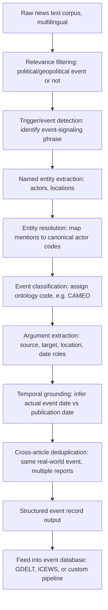

## Natural Language Processing for Event Detection

### Overview

Natural language processing (NLP) for event detection is the computational discipline underlying the machine-coded event datasets introduced earlier in this chapter (GDELT, ICEWS, Phoenix/POLECAT): the automated extraction of structured event records — who did what to whom, where, and when — from unstructured news text at a volume and speed no human coding team could match. This field has evolved through several distinct technical generations, from rule-based pattern matching through statistical machine learning to, most recently, large language model (LLM)-based extraction pipelines, each generation trading off differently across accuracy, interpretability, multilingual coverage, and computational cost. Understanding this pipeline is essential to correctly interpreting the strengths and biases of the event datasets this chapter has already introduced.

### The Event Extraction Task, Formally

**Core Subtasks**

Socio-political event extraction (SPE) enables automated identification of critical events such as protests, conflicts, and policy shifts from unstructured text, and decomposes into several standard NLP subtasks applied in sequence or jointly:

1. **Document/sentence relevance filtering**: Determining whether a given news article or sentence describes a politically or geopolitically relevant event at all, filtering the vast majority of irrelevant news volume before deeper processing.
2. **Trigger/event detection**: Identifying the specific word or phrase in text that signals an event has occurred (e.g., "attacked," "signed," "withdrew," "mobilized").
3. **Actor/entity extraction and resolution**: Identifying named entities (states, organizations, individuals) mentioned in connection with the event trigger, and resolving them to canonical actor identifiers (e.g., mapping "Washington," "the U.S. government," and "the White House" to a single canonical "USA" actor code, consistent with the CAMEO-style actor coding referenced in the earlier datasets section).
4. **Event classification/coding**: Assigning the detected event to a structured ontology category (e.g., a CAMEO event code such as "use conventional military force" or "demand policy change").
5. **Argument/role extraction**: Identifying the specific roles entities play relative to the trigger — source actor, target actor, location, date — analogous to semantic role labeling in general NLP.
6. **Temporal grounding and deduplication**: Determining the actual date the described event occurred (as distinct from the article's publication date) and identifying when multiple articles describe the same underlying real-world event, so as not to inflate event counts, an issue directly connected to the duplicate/pile-up bias discussed for machine-coded datasets earlier in this chapter.

### Diagram: Event Extraction Pipeline

### Technical Generations of Event Extraction Methods

**1. Rule-Based and Dictionary/Pattern Matching (Earliest Generation)**

The original approach underlying systems like the CAMEO-based TABARI and its successors: hand-crafted verb-phrase dictionaries and syntactic pattern rules map specific textual patterns directly to event codes (e.g., a sentence matching the pattern "[ACTOR] launched [military-attack-verb] against [ACTOR]" is coded as a use-of-force event). Highly interpretable and precise for well-covered pattern types, but brittle — struggling with paraphrase, indirect phrasing, negation ("did not attack"), and any construction not explicitly anticipated by the rule dictionary.

**2. Supervised Statistical Machine Learning**

Using labeled training data (human-annotated event examples) to train classifiers — historically support vector machines, conditional random fields for sequence labeling, and later recurrent neural networks and early transformer-based classifiers — to detect triggers and classify events. Improves generalization beyond exact rule matches but requires substantial labeled training data per language/domain and still typically operates as a sequential pipeline of separate subtask models (each with its own error rate that compounds through the pipeline).

**3. Large Language Model-Based Extraction (Current Generation)**

The emergence of large language models (LLMs) like GPT-4 and LLaMA offers new opportunities for flexible, multilingual, and zero-shot socio-political event extraction — meaning an LLM can be prompted to extract structured events from text in a language or domain it was never explicitly fine-tuned on, using only natural-language task instructions rather than a large hand-labeled training set for that specific task. This capability is particularly consequential for reducing the historical language-coverage bias of earlier pipeline-based systems, which typically required separate rule/model development effort for each additional language.

### Recent Methodological Developments (2025–2026)

**GENOME: LLM-Based Geopolitical Event Methodology**

A 2026 methodology explicitly designed to address known weaknesses in earlier machine-coded geopolitical event pipelines: GENOME also demonstrates improved temporal precision by attributing events to their inferred date of occurrence rather than publication date, and effective deduplication of highly covered events. This directly targets two of the specific dataset-bias considerations flagged in the earlier datasets section of this chapter — the tendency of earlier machine-coded datasets to timestamp events by publication rather than occurrence date, and the duplicate-event inflation problem arising when a single real-world event receives extensive multi-outlet coverage.

**Zero-Shot and Few-Shot Extraction Pipelines**

Recent research has explored fully generative, sampling-based approaches to zero-shot sociopolitical event extraction, using LLMs' generative capabilities combined with structured sampling techniques (e.g., Monte Carlo-style repeated generation and aggregation) to extract structured events without requiring a purpose-built labeled training set for each new event ontology or domain — a marked departure from the earlier supervised machine-learning generation's dependency on substantial labeled data.

**LLM-Based Forecasting Frameworks Built on Extracted Events**

Beyond extraction alone, recent frameworks couple event extraction with downstream forecasting: one such framework proposes coupling a domain-adapted large language model with a retrieval-augmented generation mechanism grounded in a structured knowledge graph, where the forecasting component employs a transformer architecture tailored to sparse, irregular event streams, while the generative component translates model outputs into dialogue-ready assessments — illustrating how LLM-based NLP extraction is increasingly integrated end-to-end with forecasting and explanation generation, rather than treated as a separate upstream data-preparation step feeding into a wholly distinct downstream statistical model.

**Target-Stance and Opinion Extraction**

Beyond event-occurrence extraction, related NLP research addresses extracting *stances* and *opinions* toward specific political targets from discourse: political polarization emerges from a complex interplay of beliefs about policies, figures, and issues, and recent work aims to move beyond coarse partisan labels toward identifying the specific target of discussion and the opinion expressed toward them — relevant to geopolitical risk practice concerned with tracking elite or public sentiment shifts (e.g., rising domestic opposition sentiment as a leading indicator of political instability) rather than only discrete, dateable events.

### Documented Risks and Limitations of LLM-Based Event Extraction

**Key Points**

Applying LLMs to sociopolitical event extraction introduces significant risks, including hallucinated outputs, lack of transparency, geopolitical bias, and potential misuse in surveillance or censorship — each of these carries direct implications for geopolitical risk practice:

- **Hallucination risk**: An LLM-based extraction pipeline may generate a plausible-sounding but factually ungrounded event record (an actor, action, or date not actually supported by the source text), a failure mode with no direct analogue in strict rule-based pattern matching, which can only fail by *missing* a pattern, not by *fabricating* one — this distinction matters for downstream data-quality assurance, since hallucination errors can be harder to detect via simple precision/recall benchmarking against a held-out test set alone.
- **Lack of transparency**: Unlike rule-based systems where the exact triggering pattern for a coded event is directly inspectable, LLM-based classification decisions are generally less directly auditable at the level of "exactly which words in the source text caused this specific classification," complicating error diagnosis and methodological transparency reporting relative to earlier rule-based approaches.
- **Geopolitical bias in the underlying model**: Documented research has investigated geopolitical bias in US and China large language models, examining how these models respond to questions concerning international affairs and global conflicts, finding that different foundation models can exhibit systematically different framings or emphases on the same geopolitical questions depending on their training provenance. [Inference] Because an LLM-based event-extraction or event-classification pipeline inherits the underlying foundation model's training-data composition and any associated framing tendencies, practitioners using LLM-based extraction for geopolitically sensitive classification tasks (e.g., characterizing an action as "aggression" versus "defensive response") should treat model choice and validation against multiple models or against human-coded benchmarks as a relevant methodological safeguard, rather than assuming any single foundation model's outputs are neutral by default.
- **Potential misuse in surveillance or censorship**: The same extraction capability that supports open academic and risk-analysis applications can, as documented in the NLP research literature itself, be repurposed for less benign monitoring applications — a dual-use consideration relevant to the broader harmful-content and access considerations that responsible geopolitical risk practice should keep in view when adopting these tools, though this is a general characteristic of powerful information-extraction technology rather than one specific to any particular implementation choice.

### Comparison: Extraction Method Generations

| Dimension | Rule-Based (TABARI-era) | Supervised ML (RNN/CRF-era) | LLM-Based (Current) |
| --- | --- | --- | --- |
| Multilingual coverage | Requires separate rule dictionaries per language | Requires labeled training data per language | Substantially broader zero/few-shot multilingual capability |
| Training data requirement | None (hand-crafted rules) | Large labeled dataset per task/domain | Minimal to none for new tasks (prompt-based) |
| Interpretability of individual decisions | High — exact triggering pattern inspectable | Moderate — feature importance partially inspectable | Lower — less directly auditable per-decision |
| Handling of paraphrase/indirect phrasing | Poor — brittle to unanticipated phrasing | Moderate — generalizes somewhat beyond exact patterns | Strong — generally more robust to varied phrasing |
| Hallucination risk | None (can only miss, not fabricate) | Low | Present and requires active mitigation |
| Temporal/deduplication handling | Generally weaker, often publication-date based | Varies by implementation | Improving — e.g., GENOME's explicit occurrence-date attribution |

### Practical Considerations for Applying NLP Event Extraction in Risk Practice

**Key Points**

- **Validation against human-coded benchmarks remains essential**: Regardless of extraction-method generation, cross-validating a subset of machine-extracted events against human expert coding (as documented in the audit-sample methodology used for datasets like the GPR index discussed earlier) remains standard practice for establishing confidence in a given pipeline's precision and recall for a specific analytic use case.
- **Domain and event-type dependent performance**: Extraction accuracy is unlikely to be uniform across all event types and domains — well-covered, clearly worded event types (e.g., explicit military attacks reported directly) are generally easier to extract reliably than ambiguous, indirectly reported, or heavily euphemistic political developments (e.g., subtle diplomatic signaling), meaning aggregate accuracy statistics can mask significant variation relevant to a specific analytic question.
- **Multilingual source diversity as a bias-mitigation lever**: Because earlier-generation pipelines' language coverage constraints contributed to the media/reporting bias discussed in the datasets section (favoring heavily English-language-covered regions), LLM-based extraction's improved zero-shot multilingual capability offers a potential mitigation path for that specific bias category, though [Unverified] the degree to which this translates into genuinely reduced geographic/regional coverage bias in practice, as opposed to merely technical multilingual capability, depends on the underlying source corpus's actual multilingual breadth and is not automatically guaranteed by the extraction model's language capability alone.
- **Integration with existing event ontologies**: Newer LLM-based pipelines are generally designed to remain compatible with, or at least mappable to, established ontologies (CAMEO and its extensions) to preserve backward compatibility and comparability with the extensive existing historical event-dataset record built on those ontologies, rather than introducing wholly incompatible new classification schemes.

### Worked Example

**Example**

Task: Build a validation check for a new LLM-based event extraction pipeline intended to supplement an existing CAMEO-coded event feed for a specific country of analytic interest.

1. Draw a random sample of source articles covering that country from the relevant time period, stratified to include both clearly reported event types (e.g., explicit statements of military action) and more ambiguous/indirect event types (e.g., diplomatic signaling, economic coercion short of explicit sanctions).
2. Have the LLM-based pipeline extract structured events from this sample, recording the assigned actor codes, event classification, and inferred date.
3. Have independent human expert coders, using the same underlying ontology's codebook, code the identical sample without seeing the LLM outputs.
4. Compute standard extraction-quality metrics (precision, recall, F1) for trigger detection, actor resolution, and event classification, stratified by the clearly-reported versus ambiguous event-type categories established in step 1.
5. Specifically audit a subsample of LLM-extracted events for hallucination (events with no clear textual support in the source article) and for temporal-grounding accuracy (whether the assigned date matches the article's described occurrence date rather than defaulting to publication date).
6. Use the stratified results to determine appropriate confidence weighting or filtering thresholds before integrating the LLM-extracted events into a broader dataset used for base-rate estimation or indicator construction (per the earlier datasets and forecasting sections), rather than treating all LLM-extracted events as uniformly reliable regardless of event-type category.

### Common Pitfalls

**Key Points**

- **Treating LLM extraction confidence/fluency as a proxy for factual accuracy**: A fluently phrased, confident-sounding extracted event record can still be a hallucination; fluency is not evidence of grounding, and validation must check against source text directly rather than relying on output plausibility alone.
- **Skipping cross-model or cross-method validation on geopolitically sensitive classifications**: Given documented findings of geopolitical bias varying by model provenance, relying on a single foundation model's classification of contested framing-sensitive events (e.g., characterizing an actor's action as "provocation" versus "response") without cross-checking against alternative models or human coding risks embedding that model's particular biases into downstream analysis presented as neutral.
- **Assuming zero-shot capability eliminates the need for domain adaptation**: While LLM-based extraction reduces the *labeled-data* burden relative to earlier supervised approaches, it does not eliminate the need for domain-specific validation, prompt engineering, and ontology-mapping work specific to the geopolitical risk domain's particular actor sets and event-type taxonomies.
- **Neglecting publication-date-versus-occurrence-date confusion in older pipeline outputs**: When integrating newer LLM-based feeds (with improved temporal grounding, per GENOME) alongside older, established event-dataset feeds that may default to publication-date timestamping, failing to reconcile this methodological difference can introduce spurious temporal artifacts when merging datasets.
- **Underestimating the dual-use and misuse potential**: Adopting powerful, flexible extraction capability without considering its potential misapplication (e.g., for surveillance purposes if repurposed) as a governance and responsible-use consideration in institutional deployment decisions.

### Conclusion

Natural language processing for event detection is the technical engine underlying the machine-coded geopolitical event datasets this chapter has introduced, having progressed from brittle rule-based pattern matching through supervised statistical machine learning to current-generation large language model-based extraction offering substantially improved multilingual flexibility, zero-shot adaptability, and — in recent methodologies such as GENOME — improved temporal grounding and deduplication. This technical progress does not eliminate the core interpretive cautions established earlier in this chapter regarding media-derived event data; it introduces a new and distinct risk profile (hallucination, reduced per-decision transparency, and model-provenance-dependent geopolitical bias) that practitioners must validate against, generally through continued human-expert benchmarking, rather than assuming newer extraction technology is automatically more reliable across all event types and use cases.

**Related Topics**

- CAMEO event ontology and its adaptation to LLM-based extraction pipelines
- Hallucination detection and mitigation techniques in structured information extraction
- Geopolitical bias auditing across foundation models
- Retrieval-augmented generation for grounding LLM-based forecasting outputs
- Cross-validation methodology: human-coded benchmarks versus automated extraction
- Multilingual NLP and reducing language-coverage bias in event datasets
- Target-stance and sentiment extraction for elite and public-opinion tracking
- Temporal grounding and cross-article event deduplication techniques
- Responsible deployment and dual-use considerations in political NLP tooling