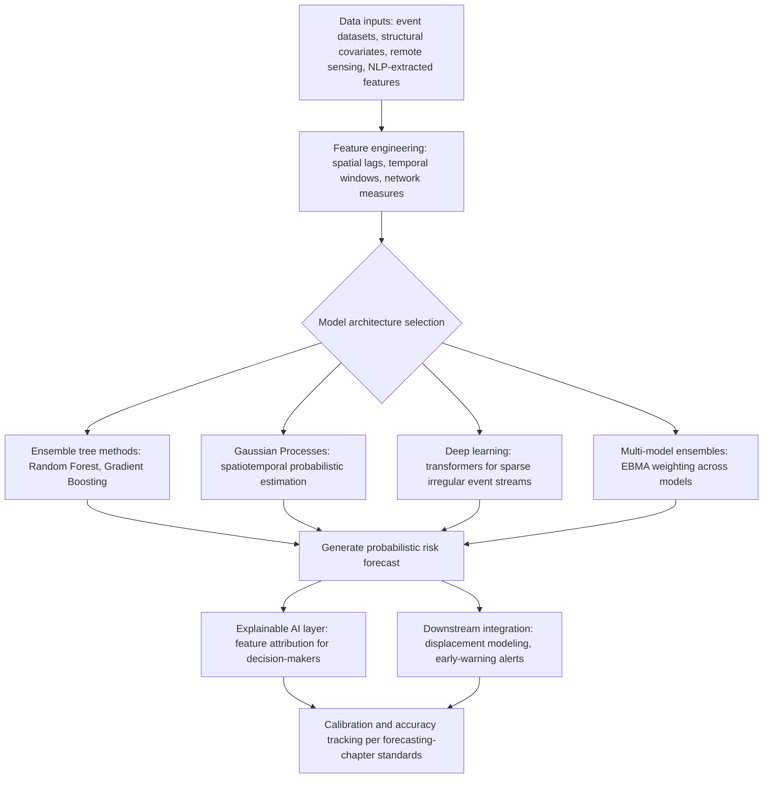

## Machine Learning Applications in Risk Forecasting

### Overview

Machine learning (ML) applications in geopolitical risk forecasting extend the structural conflict-onset modeling introduced earlier in this chapter's datasets discussion into a broader, more methodologically diverse family of algorithmic approaches — from ensemble tree-based classifiers to Gaussian processes to hybrid ML-simulation pipelines — designed to predict conflict, instability, and related outcomes at higher spatial and temporal resolution than traditional structural regression models typically achieve. This section surveys the dominant ML paradigms in operational and academic use, the leading operational early-warning systems built on them, and the well-documented methodological limitations that any practitioner deploying or interpreting these models' outputs must understand.

### Why Machine Learning for Conflict and Risk Forecasting

**Key Points**

- Structural regression models (as referenced in the earlier datasets section, e.g., PITF-style logistic regression) typically rely on a fixed, theoretically motivated set of covariates and functional-form assumptions; ML methods can, in principle, detect more complex, non-linear interactions among a much larger feature set without requiring the analyst to pre-specify the exact functional relationship.
- Rising computational capacity and the availability of high-frequency event data (GDELT, ACLED — per the earlier datasets section) has enabled forecasting at finer spatial and temporal resolution (sub-national, monthly) than earlier country-year structural models typically supported.
- The rise of AI and machine learning (ML) can contribute to global peace and security, for example, by predicting and preventing conflicts more effectively, by analyzing massive amounts of complex data to identify patterns and generate insights that inform policy decisions, helping the international community to manage crises before they fully escalate — reflecting the operational ambition motivating institutional investment in this space, distinct from ML's more established use as a pure academic research tool.

### Core Modeling Approaches

**1. Ensemble Tree-Based Methods (Random Forest, Gradient Boosting)**

Widely used as a robust baseline and, in several documented applications, a production-grade forecasting component due to strong empirical performance on structured, tabular conflict-covariate data combined with relative interpretability (via feature-importance measures) compared to deep neural approaches. A documented application combines a Random Forest classifier for conflict forecasting with the Flee agent-based model of the movements of refugees and internally displaced persons (IDPs), addressing the specific problem that many existing methods for conflict prediction are overly coarse in their spatial and temporal resolution, rendering them inadequate for integration with displacement models — illustrating a hybrid ML-plus-simulation architecture rather than ML operating in isolation.

**2. Ensemble Bayesian Model Averaging (EBMA) and Multi-Model Ensembles**

Rather than relying on a single algorithm, ensemble approaches combine forecasts from multiple distinct models (which may include both ML and traditional structural models), weighting each according to historical performance. Applied specifically to conflict forecasting, research applying Ensemble Bayesian Model Averaging to the challenge of conflict forecasting found that while the precision was slightly lower than that of the best-performing individual model, their chosen ensemble was able to balance true positives and false negatives more effectively than any single constituent model — illustrating a common ML forecasting trade-off between raw precision on a single metric and the more balanced overall performance ensembling typically provides, particularly relevant to the asymmetric-cost nature of conflict forecasting where missed true positives (failing to predict a conflict outbreak) and false positives (predicting conflict that doesn't occur) generally carry very different real-world costs.

**3. Gaussian Processes for Spatiotemporal Estimation**

An approach using highly temporally and spatially disaggregated data on conflict events in tandem with Gaussian processes to estimate temporospatial patterns of violent conflict, offering a probabilistic, non-parametric framework well-suited to modeling smoothly varying spatial risk surfaces (connecting directly to the kernel density estimation and spatial-statistics techniques discussed in the earlier geospatial analysis section) while naturally producing calibrated uncertainty estimates around point predictions, a property directly relevant to the calibration standards established in the forecasting sections of this course.

**4. Deep Learning and Transformer-Based Architectures**

More recent frameworks employ transformer architectures tailored to sparse, irregular event streams — addressing the specific technical challenge that conflict events, unlike many standard time-series forecasting domains, arrive irregularly and sparsely rather than at fixed regular intervals, requiring architectures adapted to this irregular-arrival structure rather than naive application of standard fixed-interval time-series models. Some frameworks further couple this forecasting component with retrieval-augmented generation mechanisms grounded in a structured knowledge graph, so that the forecasting component's outputs can be translated into dialogue-ready assessments for decision-makers — directly connecting to the NLP-based extraction methods discussed in the preceding section, since such pipelines typically consume NLP-extracted event streams as their input feature source.

**5. Explainable AI (XAI) for Satellite and Remote-Sensing-Derived Forecasting**

Building on the remote-sensing techniques introduced in the geospatial section, research has specifically applied explainable AI methods to understand satellite-based riot forecasting models, addressing the interpretability concern that arises when ML models are trained on complex remote-sensing feature inputs (e.g., nighttime lights, land-use change) rather than more directly interpretable structural covariates, and decision-makers require some understanding of *why* a model flags elevated risk rather than only the risk score itself.

### Diagram: Machine Learning Conflict Forecasting Pipeline

### Leading Operational Early-Warning Systems

**ViEWS (Violence Early-Warning System)**

A prominent academic/operational conflict forecasting system, referenced earlier in this chapter's datasets discussion, that produces regularly updated, published forecasts of state-based armed conflict fatalities at country and sub-national levels. Its most recent published forecast illustrates both the system's operational use and a documented methodological property: the estimated number of battle-deaths in 2026 has been projected below observed 2025 fatality levels in some active conflicts, reflecting specific developments such as a ceasefire, while the model incorporates the possibility that both conflicts could end in 2026, VIEWS' forecasts tend to err on the conservative side. Notably, the system also demonstrated substantial short-term forecast revision capability: the model's projected 2026 death toll for one conflict (Sudan) has more than doubled in the past month, underscoring the rapid deterioration of the security situation — illustrating the kind of frequent, evidence-proportionate updating that the superforecasting section of this course identifies as a hallmark of well-calibrated forecasting practice, here implemented algorithmically rather than through individual human judgment.

**Conflict Forecast and Comparative Landscape**

Beyond ViEWS, various operational early-warning systems developed by governments and NGOs exist, with a recent comparative review outlining a landscape of at least ten prominent systems, some are academic or nonprofit projects akin to ViEWS and Conflict Forecast, while others are run by policy organizations and are geared toward direct conflict prevention on the ground, and each system has its own methodological nuances — underscoring that "the ML conflict forecasting model" is not a single standardized artifact but a diverse ecosystem of systems with differing scope, resolution, and update cadence.

**Atrocity and Mass-Violence-Specific Forecasting**

Specialized systems extend beyond general armed-conflict forecasting to specific outcome types: the Atrocity Forecasting Project publishes risk indices for violence against civilians or mass atrocities, typically on an annual or semi-annual cycle, illustrating how ML-based forecasting infrastructure has been adapted to narrower, policy-relevant outcome definitions beyond aggregate conflict fatality counts.

### Reproducibility and Open-Science Considerations

**Key Points**

A documented, specific methodological critique in the current ML conflict-forecasting literature concerns data and code availability: at least one prominent commercial/academic forecasting initiative has only shared a reduced dataset from 2010 onwards, which contains only 40% of the data used to train their models without any code to reproduce the results, which hinders the reproducibility of their results and makes it difficult for researchers to improve over their existing models. This has motivated recent efforts toward open-source AI frameworks for forecasting armed conflict, explicitly designed to address this reproducibility gap by publishing full training data and code. [Inference] This reproducibility concern connects directly to the accuracy-tracking principles established earlier in this course's forecasting chapter: a forecasting system whose training data and methodology cannot be independently audited or replicated is correspondingly harder for the broader research and practitioner community to calibrate-check, stress-test, or improve upon, regardless of how strong its self-reported accuracy claims may be.

### Applications Beyond Conflict Onset

**Hybrid ML-Simulation for Displacement Forecasting**

The Random Forest-plus-agent-based-model hybrid referenced above was validated using case studies from historical conflicts in Mali, Burundi, South Sudan, and the Central African Republic, with results demonstrating comparable predictive accuracy over traditional methods without the need for manual conflict estimations in advance, thus reducing the effort and expertise needed for humanitarian professionals to provide urgent displacement forecasts — illustrating a direct humanitarian-operations application distinct from, but complementary to, the risk-assessment and strategic-planning applications emphasized elsewhere in this course.

**Regional Security and Composite Risk Indices**

Some applications extend beyond conflict-event forecasting to composite regional risk and quality-of-life indices: one documented model trained on heterogeneous socio-economic and security indicators achieved reported classification accuracy in the low-to-mid 90s percent range for a regional security index and in the mid-80s percent range for an associated quality-of-life index on its test set, with low mean absolute error in corresponding regression tasks. [Unverified] Reported accuracy figures of this kind are specific to the particular dataset, feature set, region, and test/train split used in the originating study; such figures should not be treated as generalizable benchmarks transferable to other regions or datasets without independent replication, consistent with the general caution about accuracy claims raised in the earlier datasets section of this chapter.

### Documented Limitations and Methodological Cautions

**Key Points**

- **Spatial and temporal resolution trade-offs**: As explicitly motivating several of the hybrid approaches above, many existing methods for conflict prediction are overly coarse in their spatial and temporal resolution for certain downstream applications (such as displacement modeling), meaning model selection should be matched to the resolution genuinely required by the specific application rather than defaulting to whichever model is most readily available.
- **Precision/recall trade-offs and asymmetric costs**: As the EBMA ensemble finding illustrates, optimizing purely for precision can come at the cost of a less balanced true-positive/false-negative trade-off; because missed conflict onsets (false negatives) and false alarms (false positives) typically carry asymmetric real-world costs in humanitarian and policy contexts, model evaluation should account for this asymmetry rather than relying on a single undifferentiated accuracy metric.
- **Reproducibility and transparency gaps**: As documented above, some prominent forecasting initiatives have not released full training data or code, constraining independent validation, error diagnosis, and methodological improvement by the broader research community — a limitation with direct parallels to the transparency concerns raised for LLM-based extraction pipelines in the preceding section.
- **Model conservatism and updating lag**: ViEWS' own documented tendency to err on the conservative side in scenarios involving potential conflict termination illustrates a specific, acknowledged model behavior pattern that consumers of such forecasts should account for when interpreting point predictions, rather than treating the published figure as an unbiased central estimate in all circumstances.
- **Interpretability versus performance trade-offs**: More complex model architectures (deep learning, transformer-based approaches) that may offer performance advantages on complex, high-dimensional feature sets generally sacrifice some interpretability relative to simpler tree-based or regression approaches, motivating the growing use of explainable AI techniques specifically to recover some of that lost interpretability for decision-maker consumption, rather than presenting model outputs as an unexplained black box.
- **Underlying data quality inheritance**: As with the NLP extraction methods in the preceding section and the datasets discussed earlier in this chapter, ML forecasting models trained on event and structural data inherit whatever coverage biases, definitional inconsistencies, and reporting gaps characterize their underlying training data — a sophisticated model architecture cannot correct for systematically biased or incomplete training data, reinforcing the data-quality-first principle established throughout this chapter.

### Common Pitfalls

**Key Points**

- **Treating a single model's output as consensus**: Given the documented landscape of at least ten prominent operational systems with differing methodological nuances, relying on a single system's forecast without awareness of how it may diverge from other established systems risks presenting one model's particular assumptions as if they were an uncontested consensus view.
- **Ignoring documented model-specific behavioral tendencies**: Using a system's point forecast without accounting for a documented tendency (such as ViEWS' conservative bias around conflict-termination scenarios) risks systematic misinterpretation of that specific number's meaning.
- **Overweighting reported accuracy figures from a single study without cross-context validation**: As cautioned above regarding regional security index accuracy figures, treating impressive in-sample or single-context accuracy metrics as universally generalizable rather than context-specific.
- **Neglecting the humanitarian/operational versus strategic/policy distinction in model design**: A model optimized for fine-grained displacement forecasting (informing near-term humanitarian logistics) is not automatically well-suited, without adaptation, to strategic-level geopolitical risk questions with longer time horizons and different resolution requirements, and vice versa.
- **Insufficient attention to reproducibility when adopting a forecasting system institutionally**: Adopting a closed, non-reproducible forecasting system for high-stakes institutional decision-making without the ability to independently audit its methodology or underlying data forfeits the kind of transparency this course's tracking-and-improvement section identifies as foundational to trustworthy forecasting practice.

### Conclusion

Machine learning applications in risk forecasting extend the structural quantitative modeling introduced earlier in this chapter with a diverse toolkit — ensemble tree methods, Gaussian processes, multi-model ensembles, and increasingly transformer-based architectures adapted to sparse event streams — deployed in a growing landscape of operational early-warning systems including ViEWS and several comparable initiatives, alongside specialized hybrid applications such as ML-plus-agent-based-model displacement forecasting. Rigorous application requires attention to well-documented limitations spanning resolution trade-offs, precision/recall asymmetries, model-specific behavioral tendencies, interpretability costs, and — increasingly recognized as a first-order methodological concern — reproducibility and data transparency, all of which connect directly back to the calibration, tracking, and dataset-quality principles established throughout this course.

**Related Topics**

- ViEWS and comparative operational early-warning system landscape
- Ensemble Bayesian Model Averaging and multi-model forecast combination
- Hybrid machine learning and agent-based modeling for displacement forecasting
- Explainable AI techniques for satellite-based and remote-sensing risk models
- Reproducibility and open-source data/code standards in conflict forecasting research
- Gaussian process methods for spatiotemporal risk surface estimation
- Transformer architectures for sparse and irregular event-stream forecasting
- Integrating ML forecasting outputs with calibration and accuracy-tracking frameworks
- Precision-recall trade-offs and asymmetric-cost evaluation in humanitarian forecasting