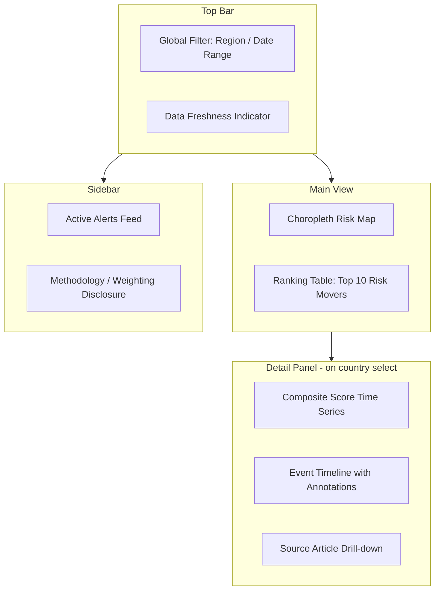

## Building a Geopolitical Risk Monitoring Dashboard


### Purpose and Scope

A geopolitical risk (GPR) monitoring dashboard is a decision-support system that ingests heterogeneous signals — news, structured indices, market data, sanctions lists, conflict event feeds — and renders them into a form analysts and decision-makers can act on quickly. The design challenge is distinct from a generic BI dashboard: geopolitical signals are noisy, low-frequency relative to markets, subject to reporting lag, and often contradictory across sources. A dashboard that simply displays raw feeds without addressing these properties will mislead more than it informs.

The core design questions this chapter item addresses:

- What data sources feed the system, and at what latency/reliability?
- How are qualitative and quantitative signals normalized into comparable scales?
- What architecture supports near-real-time updates without over-engineering?
- How is uncertainty communicated visually rather than hidden?

### Reference Architecture

A typical GPR dashboard follows a four-layer pipeline: ingestion, normalization/scoring, storage, and presentation.

<svg xmlns="http://www.w3.org/2000/svg" viewBox="0 0 900 260" font-family="sans-serif">
<text x="450" y="20" text-anchor="middle" font-size="14" font-weight="bold">GPR Dashboard Pipeline (svg_diagram)</text>
<rect x="10" y="50" width="180" height="90" rx="6" fill="#e8f0fe" stroke="#3b5bdb" />
<text x="100" y="75" text-anchor="middle" font-size="12" font-weight="bold">Ingestion</text>
<text x="100" y="95" text-anchor="middle" font-size="10">News APIs, GDELT,</text>
<text x="100" y="110" text-anchor="middle" font-size="10">ACLED, sanctions lists,</text>
<text x="100" y="125" text-anchor="middle" font-size="10">market/FX feeds</text>
<rect x="240" y="50" width="180" height="90" rx="6" fill="#fff3bf" stroke="#f08c00" />
<text x="330" y="75" text-anchor="middle" font-size="12" font-weight="bold">Normalization</text>
<text x="330" y="95" text-anchor="middle" font-size="10">NLP sentiment/event</text>
<text x="330" y="110" text-anchor="middle" font-size="10">extraction, entity</text>
<text x="330" y="125" text-anchor="middle" font-size="10">resolution, z-scoring</text>
<rect x="470" y="50" width="180" height="90" rx="6" fill="#d3f9d8" stroke="#2f9e44" />
<text x="560" y="75" text-anchor="middle" font-size="12" font-weight="bold">Scoring Engine</text>
<text x="560" y="95" text-anchor="middle" font-size="10">Composite index calc,</text>
<text x="560" y="110" text-anchor="middle" font-size="10">weighting, thresholds,</text>
<text x="560" y="125" text-anchor="middle" font-size="10">alert rules</text>
<rect x="700" y="50" width="180" height="90" rx="6" fill="#ffe3e3" stroke="#e03131" />
<text x="790" y="75" text-anchor="middle" font-size="12" font-weight="bold">Presentation</text>
<text x="790" y="95" text-anchor="middle" font-size="10">Map view, time series,</text>
<text x="790" y="110" text-anchor="middle" font-size="10">alert panel, drill-down</text>
<text x="790" y="125" text-anchor="middle" font-size="10">to source evidence</text>
<line x1="190" y1="95" x2="235" y2="95" stroke="#333" stroke-width="2" marker-end="url(#arrow)" />
<line x1="420" y1="95" x2="465" y2="95" stroke="#333" stroke-width="2" marker-end="url(#arrow)" />
<line x1="650" y1="95" x2="695" y2="95" stroke="#333" stroke-width="2" marker-end="url(#arrow)" />
<rect x="240" y="180" width="410" height="55" rx="6" fill="#f1f3f5" stroke="#868e96" />
<text x="445" y="200" text-anchor="middle" font-size="12" font-weight="bold">Storage Layer</text>
<text x="445" y="218" text-anchor="middle" font-size="10">Time-series DB (events/scores) + document store (raw articles) + cache (latest state)</text>
<line x1="330" y1="140" x2="330" y2="178" stroke="#333" stroke-width="1.5" stroke-dasharray="4,2" />
<line x1="560" y1="140" x2="560" y2="178" stroke="#333" stroke-width="1.5" stroke-dasharray="4,2" />
</svg>

### Data Sources

**Structured/quantitative sources**

- Sovereign risk indices: ICRG, World Bank Worldwide Governance Indicators, Fragile States Index
- Conflict event datasets: ACLED (Armed Conflict Location & Event Data), UCDP Georeferenced Event Dataset
- Market-implied risk: CDS spreads, sovereign bond yield spreads, currency volatility, VIX-equivalent regional indices
- Sanctions/compliance: OFAC SDN list, EU consolidated sanctions list, UN Security Council sanctions

**Unstructured/qualitative sources**

- News wire APIs (Reuters, AP, Bloomberg terminals where licensed)
- GDELT Project — global event database derived from worldwide news, updated every 15 minutes, with tone and Goldstein scale scoring already computed
- Think tank and government risk assessments (CRS reports, IISS Armed Conflict Survey)
- Social media signal (with heavy caveats on reliability and manipulation risk)

[Inference] Combining ACLED-style event data with GDELT tone scores is a common practitioner pattern, but no single "correct" fusion methodology is standardized across the industry — teams typically build proprietary weighting schemes.

### Signal Normalization and Scoring

Raw inputs arrive on incompatible scales (event counts, bond spreads in basis points, sentiment scores from -1 to 1). A composite index requires normalization before aggregation.

A common approach is z-score standardization per source, then weighted aggregation:

$$z_i = \frac{x_i - \mu_i}{\sigma_i}$$


$$\text{GPR}_{\text{composite}} = \sum_{i=1}^{n} w_i \cdot z_i$$

where $w_i$ is the analyst-assigned or empirically-derived weight for source $i$, subject to $\sum w_i = 1$.

For event-based data (ACLED/GDELT), a decay-weighted rolling window is standard to avoid old events dominating current risk perception:

$$\text{EventScore}_t = \sum_{k=0}^{K} e^{-\lambda k} \cdot s_{t-k}$$

where $s_{t-k}$ is the severity-weighted event count at lag $k$, and $\lambda$ controls how quickly historical events lose salience. [Inference] Typical half-lives used in practice range from 7–30 days depending on the risk category (e.g., civil unrest decays faster than sanctions regime changes), but this is a design choice, not a fixed standard.

**Key Points**

- Never display raw heterogeneous scores side-by-side without normalization — it invites false comparison.
- Weighting schemes should be version-controlled and disclosed in dashboard metadata, since they materially change output rankings.
- Include a "data freshness" timestamp per source; geopolitical dashboards silently going stale is a common failure mode.

### Storage Layer Design

- **Time-series database** (e.g., InfluxDB, TimescaleDB, or a partitioned PostgreSQL table) for the composite score history and per-country index values — optimized for range queries over time ("show risk score for Country X over the last 90 days").
- **Document store** (e.g., Elasticsearch, MongoDB) for raw ingested articles/events, enabling full-text search and drill-down from a score spike to the underlying source material.
- **Cache layer** (Redis or similar) holding the latest computed state per entity for low-latency dashboard rendering, refreshed on each pipeline run rather than queried live from the time-series store on every page load.

### Example: Minimal Scoring Pipeline (Python)

```python
import pandas as pd
import numpy as np

def zscore_normalize(series: pd.Series) -> pd.Series:
    return (series - series.mean()) / series.std(ddof=1)

def decay_weighted_score(events: pd.DataFrame, half_life_days: float = 14) -> float:
    """
    events: DataFrame with columns ['days_ago', 'severity']
    Returns a single decay-weighted event score.
    """
    lam = np.log(2) / half_life_days
    weights = np.exp(-lam * events['days_ago'])
    return float((weights * events['severity']).sum())

def composite_gpr_index(source_scores: dict, weights: dict) -> float:
    """
    source_scores: {'acled': 1.8, 'gdelt_tone': -0.6, 'cds_spread': 2.1}
    weights: must sum to 1.0
    """
    assert abs(sum(weights.values()) - 1.0) < 1e-6, "Weights must sum to 1"
    return sum(source_scores[k] * weights[k] for k in weights)

# Example usage
scores = {'acled': 1.8, 'gdelt_tone': -0.6, 'cds_spread': 2.1}
weights = {'acled': 0.4, 'gdelt_tone': 0.3, 'cds_spread': 0.3}
print(composite_gpr_index(scores, weights))
```

**Output**



```
1.35
```

[Behavior may vary based on library versions and the specific pandas/numpy release in use; the calculation logic itself is standard descriptive statistics.]

### Dashboard Presentation Components

**Key Points**

- **Geospatial heat map**: choropleth by country/region, colored by composite GPR score. Use a diverging color scale (not sequential) if the score can be negative (lower risk) to positive (elevated risk).
- **Time-series panel**: composite score trend line per selected country, with annotated event markers (e.g., "Sanctions imposed," "Election date") for context.
- **Alert feed**: rule-triggered notifications (e.g., "score crossed 2 standard deviations above rolling mean") with links to source evidence — never an alert without a traceable cause.
- **Source drill-down**: clicking any score must reveal the underlying articles/events, since opaque scores erode analyst trust.
- **Comparative ranking table**: sortable list of monitored countries/entities by current score, score delta (7-day, 30-day), and trend direction.

### Example Dashboard Layout (Mermaid)



### Alerting Logic Design

Alert thresholds should avoid two failure modes: alert fatigue (too sensitive, analysts start ignoring) and blind spots (too conservative, missing real inflection points). A statistically grounded approach uses rolling volatility bands rather than fixed thresholds:

$$\text{Alert if } |\text{GPR}_t - \bar{\text{GPR}}_{t-30:t}| > k \cdot \sigma_{t-30:t}$$

with $k$ typically set between 1.5 and 2.5 depending on desired sensitivity. [Inference] The exact $k$ value is a tuning decision specific to each monitored entity's historical volatility profile and the organization's risk tolerance — there is no universally agreed default.

### Update Frequency and Latency Considerations

- Market-based inputs (CDS, FX) can update intraday or in real time.
- News/event-based inputs (GDELT) update on the order of 15-minute batches.
- Structured indices (ICRG, WGI) update monthly, quarterly, or annually — these should be treated as slow-moving baseline context, not real-time signal, and clearly labeled as such in the UI so analysts don't misread staleness as stability.

A dashboard mixing these without labeling update cadence per widget risks giving false confidence in the freshness of slow-moving components.

### Common Pitfalls

- **Overfitting the weighting scheme** to past crises, producing a model that explains history well but fails to anticipate novel risk types.
- **Source concentration risk**: relying heavily on one news wire or one country's reporting introduces systematic bias (e.g., underreporting in press-restricted states).
- **Conflating correlation with causation** when a score spike coincides with an event — the dashboard should present co-occurrence, not causal claims, unless the underlying methodology explicitly models causality.
- **Ignoring reporting lag** in conflict zones, where event data can be revised or backfilled days/weeks later (ACLED, for instance, periodically updates historical records).

### Related Topics

- Constructing composite geopolitical risk indices (weighting methodologies in depth)
- GDELT and event-coded data: extraction and use
- Natural language processing for geopolitical sentiment and event classification
- Time-series anomaly detection methods for risk signal alerting
- Sanctions regime tracking and compliance data integration
- Scenario analysis and stress-testing frameworks for geopolitical shocks
- Data governance and source reliability scoring frameworks