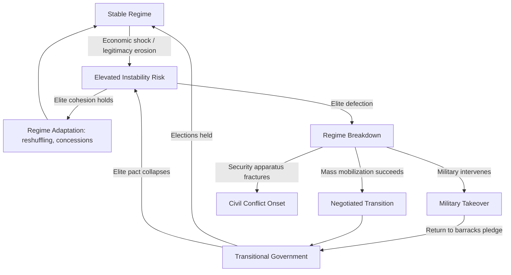

## Regime Type Classification and Stability Implications


### Purpose and Scope

Regime type classification is foundational to geopolitical risk analysis because a state's institutional structure shapes the mechanisms through which power transitions, dissent is managed, and shocks propagate into instability. Analysts use regime typologies not as academic labels but as predictive inputs: different regime types have measurably different failure modes, succession risks, and responses to economic or social stress. This item covers the major classification schemes, the quantitative datasets that operationalize them, and how regime type feeds into stability forecasting.

### Major Classification Schemes

**Polity Project (Polity5)**

Scores states on a -10 (fully institutionalized autocracy) to +10 (fully institutionalized democracy) scale, based on competitiveness of executive recruitment, openness of executive recruitment, constraints on chief executive, and competitiveness/regulation of political participation. Widely used in academic and intelligence-adjacent risk modeling due to its long historical time series (covering most states back to 1800).

**Freedom House (Freedom in the World)**

Rates countries on Political Rights and Civil Liberties, each on a 1–7 scale, aggregated into "Free," "Partly Free," or "Not Free" categories. More granular on rights/liberties dimensions than Polity but less focused on formal institutional structure.

**V-Dem (Varieties of Democracy)**

Disaggregates "democracy" into five sub-indices — electoral, liberal, participatory, deliberative, and egalitarian democracy — using expert-coded surveys aggregated via a Bayesian measurement model. Currently the most granular academic dataset, useful when a single democracy/autocracy scalar is too coarse for the analytical question.

**Geddes, Wright & Frantz (Autocratic Regimes Dataset)**

Classifies autocracies specifically into subtypes: personalist, military, single-party, monarchy, and hybrids thereof. This is the dataset most directly useful for stability forecasting because autocratic subtypes have distinct, well-documented failure modes (detailed below).

**Key Points**

- Polity5 and Freedom House are best for broad time-series trend analysis and cross-country comparison at scale.
- Geddes-Wright-Frantz is best when the analytical question is specifically "how does this regime fail" rather than "how democratic is this regime."
- V-Dem is best when the question requires disaggregating *which* dimension of democratic quality is eroding (e.g., electoral integrity vs. civil liberties).

### Regime Type Taxonomy and Associated Stability Profiles

<svg xmlns="http://www.w3.org/2000/svg" viewBox="0 0 900 400" font-family="sans-serif">
<text x="450" y="20" text-anchor="middle" font-size="14" font-weight="bold">Regime Types and Primary Instability Vectors (svg_diagram)</text>
<rect x="20" y="50" width="200" height="310" rx="6" fill="#e8f0fe" stroke="#3b5bdb" />
<text x="120" y="72" text-anchor="middle" font-size="12" font-weight="bold">Democracy</text>
<text x="120" y="95" text-anchor="middle" font-size="10">Consolidated /</text>
<text x="120" y="108" text-anchor="middle" font-size="10">Hybrid</text>
<text x="30" y="135" font-size="9">Primary risks:</text>
<text x="30" y="150" font-size="9">- Polarization gridlock</text>
<text x="30" y="165" font-size="9">- Democratic backsliding</text>
<text x="30" y="180" font-size="9">- Populist erosion of</text>
<text x="30" y="193" font-size="9"> checks/balances</text>
<text x="30" y="215" font-size="9">Transition mode:</text>
<text x="30" y="230" font-size="9">Electoral, generally</text>
<text x="30" y="243" font-size="9">peaceful (baseline)</text>
<rect x="240" y="50" width="200" height="310" rx="6" fill="#fff3bf" stroke="#f08c00" />
<text x="340" y="72" text-anchor="middle" font-size="12" font-weight="bold">Personalist</text>
<text x="340" y="95" text-anchor="middle" font-size="10">Autocracy</text>
<text x="250" y="135" font-size="9">Primary risks:</text>
<text x="250" y="150" font-size="9">- Succession crisis</text>
<text x="250" y="165" font-size="9">- Elite defection near</text>
<text x="250" y="178" font-size="9"> leader's death/exit</text>
<text x="250" y="193" font-size="9">- Coup risk (mid-high)</text>
<text x="250" y="215" font-size="9">Transition mode:</text>
<text x="250" y="230" font-size="9">Often violent or</text>
<text x="250" y="243" font-size="9">extra-constitutional</text>
<rect x="460" y="50" width="200" height="310" rx="6" fill="#d3f9d8" stroke="#2f9e44" />
<text x="560" y="72" text-anchor="middle" font-size="12" font-weight="bold">Military</text>
<text x="560" y="95" text-anchor="middle" font-size="10">Regime</text>
<text x="470" y="135" font-size="9">Primary risks:</text>
<text x="470" y="150" font-size="9">- Intra-military faction</text>
<text x="470" y="163" font-size="9"> conflict</text>
<text x="470" y="178" font-size="9">- Highest historical</text>
<text x="470" y="191" font-size="9"> coup-on-coup rate</text>
<text x="470" y="215" font-size="9">Transition mode:</text>
<text x="470" y="230" font-size="9">Frequently negotiated</text>
<text x="470" y="243" font-size="9">exit to civilian rule</text>
<rect x="680" y="50" width="200" height="310" rx="6" fill="#ffe3e3" stroke="#e03131" />
<text x="780" y="72" text-anchor="middle" font-size="12" font-weight="bold">Single-Party</text>
<text x="780" y="95" text-anchor="middle" font-size="10">Regime</text>
<text x="690" y="135" font-size="9">Primary risks:</text>
<text x="690" y="150" font-size="9">- Elite factional split</text>
<text x="690" y="165" font-size="9">- Legitimacy crisis if</text>
<text x="690" y="178" font-size="9"> performance/growth</text>
<text x="690" y="191" font-size="9"> falters</text>
<text x="690" y="215" font-size="9">Transition mode:</text>
<text x="690" y="230" font-size="9">Most durable autocratic</text>
<text x="690" y="243" font-size="9">subtype historically</text>
</svg>

[Inference] The relative ranking of "which autocratic subtype is most durable/least durable" reflects a well-established finding in the Geddes-Wright-Frantz literature (single-party systems tend to outlast personalist and military regimes), but exact survival rates vary by dataset vintage and coding decisions, so treat specific duration figures as illustrative rather than fixed constants.

### Quantifying Stability Implications

A common approach in applied risk work is to treat regime type as a categorical covariate in a survival/hazard model estimating time-to-instability-event (coup, mass uprising, civil war onset, irregular leader exit):

$$h(t \mid X) = h_0(t) \cdot \exp(\beta_1 \cdot \text{RegimeType} + \beta_2 \cdot \text{GDPgrowth} + \beta_3 \cdot \text{EliteCohesion} + \dots)$$

This Cox proportional hazards specification allows regime type to shift baseline instability risk while controlling for economic and structural covariates. [Inference] Specific coefficient magnitudes are highly dataset- and period-dependent; the value of this approach is the structural framework (separating baseline hazard from covariate effects), not a universal coefficient set.

**Key Points**

- Regime type alone is a weak standalone predictor; it becomes analytically useful combined with covariates like elite cohesion, security sector loyalty, economic performance, and succession clarity.
- Anocracies (mixed regimes, neither fully autocratic nor democratic — roughly Polity scores -5 to +5) show the highest empirical correlation with civil conflict onset in the political violence literature, a finding sometimes called the "inverted U-curve" of regime type and conflict risk.
- Regime durability and regime legitimacy are distinct variables — a regime can be durable (able to suppress challenges) while having low legitimacy (vulnerable to rapid collapse once suppression capacity weakens, as seen in several 2011 Arab Spring cases).

### Example: Coding a Simplified Regime Instability Score

```python
import pandas as pd

def regime_risk_multiplier(regime_type: str) -> float:
    """
    Illustrative multipliers based on relative historical instability
    rankings from the autocratic regimes literature (Geddes et al.).
    These are illustrative weights for a teaching example, not
    published coefficients from a specific study.
    """
    multipliers = {
        "consolidated_democracy": 1.0,
        "hybrid_anocracy": 2.3,
        "personalist": 1.8,
        "military": 2.0,
        "single_party": 1.3,
        "monarchy": 1.1,
    }
    return multipliers.get(regime_type, 1.5)  # default for unclassified

def composite_instability_score(regime_type: str, elite_cohesion: float,
                                  gdp_growth: float, succession_clarity: float) -> float:
    """
    All inputs normalized 0-1 except regime_type (categorical).
    Lower elite_cohesion, lower gdp_growth, lower succession_clarity => higher risk.
    """
    base = regime_risk_multiplier(regime_type)
    risk = base * (1 - elite_cohesion) * (1 - succession_clarity) * (1.5 - gdp_growth)
    return round(risk, 3)

# Example usage
print(composite_instability_score("personalist", elite_cohesion=0.4,
                                    gdp_growth=0.1, succession_clarity=0.2))
```

**Output**



```
1.882
```

[Behavior may vary depending on the specific input assumptions; this is a pedagogical scoring illustration, not a validated forecasting model.]

### Regime Transition Pathways



### Data Sources for Operationalizing Regime Classification

- **Polity5**: Center for Systemic Peace — annual country-year scores, 1800–present
- **V-Dem**: v-dem.net — annual, ~500 indicators, expert-coded with uncertainty estimates
- **Freedom House**: freedomhouse.org — annual Political Rights/Civil Liberties scores
- **Geddes, Wright & Frantz Autocratic Regimes Data**: episode-level autocratic regime spells with subtype coding and exit mode
- **Archigos**: leader-level dataset coding entry/exit mode for heads of state, useful for succession risk modeling
- **Cline Center Coup D'état Project**: event-level coup attempt data, useful for validating military-regime instability hypotheses

### Common Pitfalls

- **Treating regime type as static** within a country-year when transitions are often gradual (backsliding, creeping authoritarianism) — coding a hard cutoff date can misrepresent genuinely ambiguous periods.
- **Conflating regime type with government type** (e.g., presidential vs. parliamentary) — these are orthogonal classification dimensions and both matter for different risk questions.
- **Ignoring measurement disagreement** between datasets — Polity5, V-Dem, and Freedom House do not always agree on borderline cases (competitive authoritarian regimes are a frequent point of divergence), so single-source regime coding should be treated as one input, not ground truth.
- **Overweighting regime type relative to proximate triggers** — regime type sets baseline vulnerability; it rarely explains *timing* of instability events without conditioning on triggers (economic shocks, succession events, external shocks).

### Related Topics

- Elite cohesion and security sector loyalty as leading indicators of coup risk
- Succession risk modeling in personalist autocracies
- Anocracy and the inverted-U conflict risk curve
- Democratic backsliding indicators and measurement
- Survival/hazard modeling techniques for political instability
- Coup-proofing strategies and their stability trade-offs
- Legitimacy vs. durability as distinct regime stability dimensions