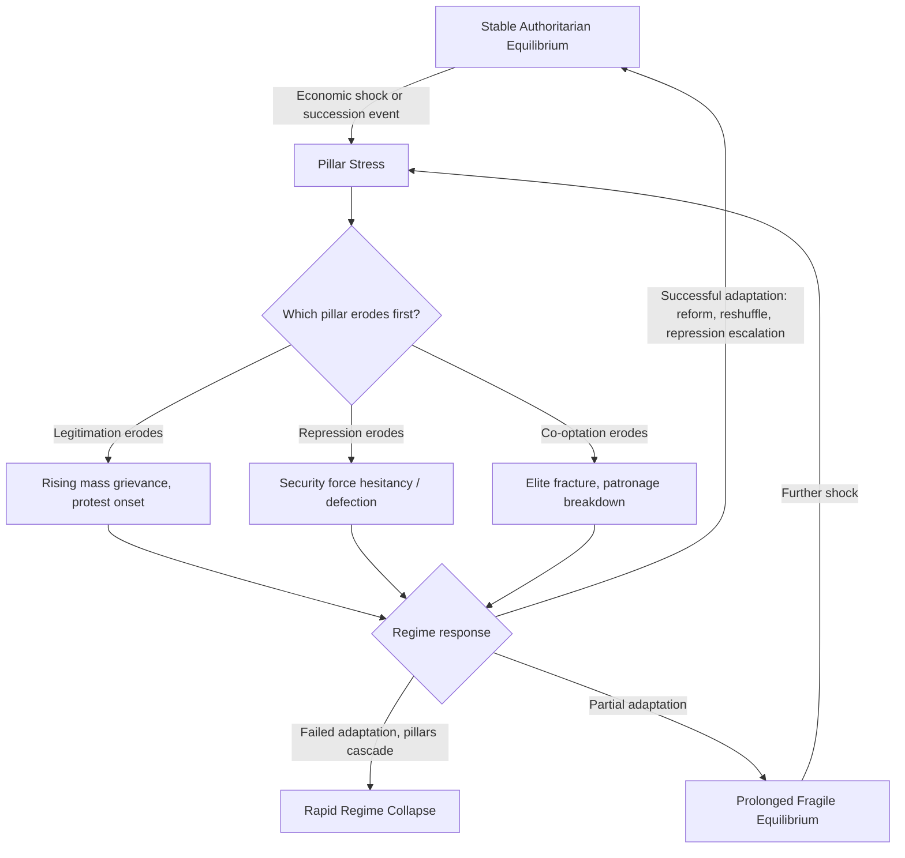

## Authoritarian Resilience and Fragility Indicators


### Purpose and Scope

Authoritarian regimes vary enormously in durability — some persist for decades despite economic crises and international pressure, while others collapse rapidly despite apparent strength. This item covers the analytical frameworks and quantitative indicators used to distinguish resilient authoritarian systems from fragile ones, moving beyond simple regime-type classification into the mechanisms that specifically sustain or undermine non-democratic rule.

### The Resilience-Fragility Distinction

Regime type classification (covered separately) tells an analyst *what kind* of authoritarian system exists. Resilience/fragility analysis asks a different question: given that type, how much shock-absorption capacity does this specific regime currently have? Two personalist regimes can have identical Geddes-Wright-Frantz coding while having very different resilience profiles depending on elite cohesion, repressive capacity, and co-optation network health at a given moment.

**Key Points**

- Resilience is a *time-varying* property, unlike the largely static regime-type label.
- High repressive capacity and high resilience are not synonymous — regimes can be highly repressive yet fragile if repression is the *only* pillar holding the system up (single-pillar fragility).
- Fragility indicators are most useful as leading indicators for *timing* of instability, complementing regime-type as a baseline risk-level indicator.

### The Three Pillars Framework

Authoritarian durability is commonly analyzed through three interacting pillars, drawn from the comparative authoritarianism literature (Svolik, Gerschewski, and related scholarship on authoritarian stability):

<svg xmlns="http://www.w3.org/2000/svg" viewBox="0 0 900 320" font-family="sans-serif">
<text x="450" y="20" text-anchor="middle" font-size="14" font-weight="bold">Three Pillars of Authoritarian Stability (svg_diagram)</text>
<rect x="40" y="50" width="240" height="220" rx="6" fill="#e8f0fe" stroke="#3b5bdb" />
<text x="160" y="75" text-anchor="middle" font-size="13" font-weight="bold">Legitimation</text>
<text x="50" y="100" font-size="10">- Ideological narrative</text>
<text x="50" y="115" font-size="10">- Performance legitimacy</text>
<text x="50" y="130" font-size="10"> (economic delivery)</text>
<text x="50" y="145" font-size="10">- Traditional/religious</text>
<text x="50" y="160" font-size="10"> authority claims</text>
<text x="50" y="185" font-size="10" font-style="italic">Erosion signal:</text>
<text x="50" y="200" font-size="10">Rising cynicism, protest</text>
<text x="50" y="215" font-size="10">framing shifts away from</text>
<text x="50" y="230" font-size="10">regime narrative</text>
<rect x="330" y="50" width="240" height="220" rx="6" fill="#fff3bf" stroke="#f08c00" />
<text x="450" y="75" text-anchor="middle" font-size="13" font-weight="bold">Repression</text>
<text x="340" y="100" font-size="10">- Security sector loyalty</text>
<text x="340" y="115" font-size="10">- Surveillance capacity</text>
<text x="340" y="130" font-size="10">- Judicial/legal coercion</text>
<text x="340" y="145" font-size="10"> tools</text>
<text x="340" y="185" font-size="10" font-style="italic">Erosion signal:</text>
<text x="340" y="200" font-size="10">Security force defections,</text>
<text x="340" y="215" font-size="10">refusal to fire on</text>
<text x="340" y="230" font-size="10">protesters</text>
<rect x="620" y="50" width="240" height="220" rx="6" fill="#d3f9d8" stroke="#2f9e44" />
<text x="740" y="75" text-anchor="middle" font-size="13" font-weight="bold">Co-optation</text>
<text x="630" y="100" font-size="10">- Patronage networks</text>
<text x="630" y="115" font-size="10">- Elite power-sharing</text>
<text x="630" y="130" font-size="10"> (party, military, business)</text>
<text x="630" y="145" font-size="10">- Controlled political</text>
<text x="630" y="160" font-size="10"> participation</text>
<text x="630" y="185" font-size="10" font-style="italic">Erosion signal:</text>
<text x="630" y="200" font-size="10">Elite defection, resource</text>
<text x="630" y="215" font-size="10">scarcity for patronage,</text>
<text x="630" y="230" font-size="10">factional splits</text>
</svg>

[Inference] The three-pillar framing (legitimation, repression, co-optation) is a well-established synthesis in the comparative authoritarianism literature, though different scholars use overlapping but not identical terminology (e.g., some add "cooptation of civil society" as a distinct fourth category) — treat this as a widely-used analytical lens rather than a single canonical model with fixed boundaries.

A regime resting heavily on a single pillar is generally considered more fragile than one with balanced support across all three, because the failure of one pillar removes the entire support structure rather than partially weakening it.

### Quantitative Fragility Indicators

**Elite cohesion proxies**

- Frequency and visibility of high-level defections or purges
- Cabinet reshuffle frequency (unusually high turnover can signal instability management, not strength)
- Public elite dissent or contradictory statements from senior officials

**Security sector indicators**

- Coup attempt history (base rate risk) — Cline Center Coup D'état Project
- Military spending trends relative to GDP and relative to internal security spending (internal security emphasis over external defense can indicate regime prioritizing survival over defense)
- Reported incidents of security forces refusing orders or defecting during unrest

**Economic performance indicators**

- GDP growth volatility and deviation from regime-promised targets
- Inflation and currency stability (hyperinflation episodes strongly correlate with authoritarian breakdown risk)
- Youth unemployment (elevated youth unemployment is a widely cited structural risk factor for unrest, particularly combined with high youth population share)

**Mass mobilization indicators**

- Protest frequency, size, and geographic spread (tracked via ACLED, Mass Mobilization Project)
- Protest demand framing (economic grievance vs. explicit regime-change demands — the latter signals a more advanced legitimacy crisis)
- Diaspora and international solidarity mobilization

**Fragile States Index (FSI) components** — published annually by the Fund for Peace, aggregating 12 indicators across cohesion, economic, political, and social/cross-cutting categories into a composite 0–120 score (higher = more fragile).

### Composite Fragility Scoring Example

$$\text{Fragility}_t = \alpha \cdot (1 - L_t) + \beta \cdot (1 - R_t) + \gamma \cdot (1 - C_t)$$

where $L_t$, $R_t$, $C_t$ are normalized (0–1) legitimation, repression-capacity, and co-optation strength scores at time $t$, and $\alpha + \beta + \gamma = 1$ are analyst- or empirically-derived weights reflecting the relative importance of each pillar for the specific regime under study.

```python
def pillar_fragility_score(legitimation: float, repression: float,
                             cooptation: float,
                             weights: tuple = (0.34, 0.33, 0.33)) -> float:
    """
    All pillar inputs normalized 0 (fully eroded) to 1 (fully intact).
    Returns fragility score 0 (robust) to 1 (maximally fragile).
    """
    alpha, beta, gamma = weights
    assert abs(sum(weights) - 1.0) < 1e-6, "Weights must sum to 1"
    return round(
        alpha * (1 - legitimation) + beta * (1 - repression) + gamma * (1 - cooptation),
        3
    )

def single_pillar_flag(legitimation: float, repression: float,
                         cooptation: float, threshold: float = 0.3) -> str:
    """
    Flags regimes disproportionately dependent on one pillar,
    which the literature associates with elevated fragility
    even when the composite score looks moderate.
    """
    scores = {"legitimation": legitimation, "repression": repression,
              "cooptation": cooptation}
    dominant = max(scores, key=scores.get)
    others_avg = (sum(scores.values()) - scores[dominant]) / 2
    if scores[dominant] - others_avg > threshold:
        return f"Single-pillar dependency detected: {dominant}"
    return "Balanced pillar support"

# Example usage
print(pillar_fragility_score(legitimation=0.2, repression=0.8, cooptation=0.3))
print(single_pillar_flag(legitimation=0.2, repression=0.8, cooptation=0.3))
```

**Output**



```
0.567
Single-pillar dependency detected: repression
```

[Behavior may vary depending on specific input weighting assumptions; this is an illustrative scoring framework rather than a published, validated model.]

### Resilience Decay Pathway



### Historical Illustrative Patterns

[Inference] The following are widely cited illustrative cases in the literature, not exhaustive or definitive causal claims:

- Regimes with strong performance legitimacy (rapid growth delivery) have shown resilience even under authoritarian rule, but become acutely vulnerable during growth slowdowns, since the legitimacy pillar was narrowly performance-based rather than ideological or traditional.
- The 2011 Arab Spring cases are frequently cited as demonstrating rapid collapse despite apparent repressive strength, attributed by many analysts to security force defection (repression pillar failure) once co-optation networks and legitimacy had already substantially eroded.
- Single-party regimes with institutionalized succession procedures (reducing elite uncertainty at leadership transition) are generally associated with greater resilience than personalist regimes lacking such procedures, consistent with the durability rankings discussed in regime-type classification.

### Common Pitfalls

- **Mistaking repression intensity for regime strength** — high visible repression can indicate a regime compensating for eroded legitimation and co-optation, i.e., a fragility signal rather than a strength signal.
- **Underweighting economic indicators due to data lag** — official GDP/inflation statistics from authoritarian states are sometimes manipulated or delayed; triangulating with independent indicators (nighttime lights data, black-market exchange rates, mobile payment volume) is standard practice.
- **Treating protest size alone as the key metric** — protest *demand framing* and *security force response* are often more predictive of trajectory than raw crowd size.
- **Static snapshot bias** — fragility should be tracked as a trend (improving/worsening pillar health over time), not a single point-in-time score, since trajectory often matters more than current level for forecasting.

### Related Topics

- Regime type classification and stability implications (baseline typology)
- Elite defection modeling and coup risk indicators
- Security sector loyalty and civil-military relations analysis
- Nighttime lights and satellite-derived economic proxy indicators
- Protest event coding and mass mobilization datasets (ACLED, Mass Mobilization Project)
- Succession institutionalization and its effect on regime durability
- Sanctions impact on regime resource base and co-optation capacity