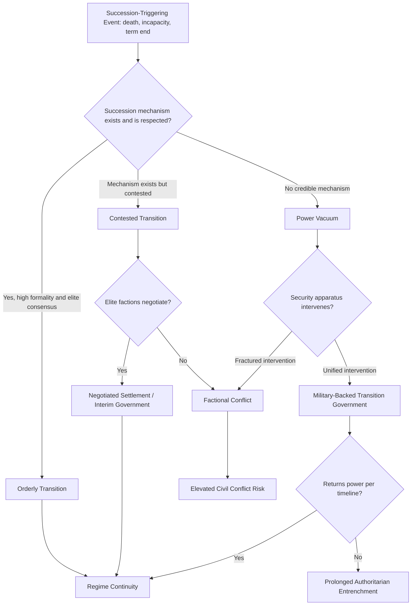

## Leadership Succession and Transition Risk


### Purpose and Scope

Leadership succession is among the highest-probability, most predictable-in-timing instability triggers available to a geopolitical risk analyst — unlike diffuse economic or social pressures, succession events often have identifiable windows (health status, term limits, scheduled elections) even when the outcome is uncertain. This item covers how succession risk arises across regime types, the institutional factors that determine whether a transition is orderly or destabilizing, and the quantitative/analytical tools used to monitor it.

### Why Succession Is a Distinct Risk Category

Succession risk differs from general regime fragility (covered separately) in that it is triggered by a specific, often datable event — death, incapacitation, term expiration, forced removal — rather than accumulating structural stress. The core analytical question is not "will this regime become unstable" but "does this regime have a credible, agreed-upon mechanism for transferring power, and what happens if that mechanism is contested or absent."

**Key Points**

- Succession risk is highest where the rules for transition are informal, personalized, or untested.
- The absence of a succession crisis during a leader's tenure does not indicate low succession risk — it may simply mean the triggering event (death, incapacity) has not yet occurred. This is a common analytical trap: durability under a leader's rule is not evidence of transition-readiness.
- Institutionalized democracies typically have codified succession risk (scheduled elections, constitutional lines of succession) that is comparatively low-uncertainty in *mechanism*, even when the *outcome* is politically contentious.

### Succession Risk by Regime Type

<svg xmlns="http://www.w3.org/2000/svg" viewBox="0 0 900 300" font-family="sans-serif">
<text x="450" y="20" text-anchor="middle" font-size="14" font-weight="bold">Succession Mechanism Formality vs. Risk (svg_diagram)</text>
<line x1="80" y1="250" x2="850" y2="250" stroke="#333" stroke-width="1.5" />
<line x1="80" y1="250" x2="80" y2="50" stroke="#333" stroke-width="1.5" />
<text x="465" y="280" text-anchor="middle" font-size="11">Mechanism Formality (low to high) →</text>
<text x="30" y="150" text-anchor="middle" font-size="11" transform="rotate(-90 30 150)">Transition Risk →</text>
<circle cx="150" cy="80" r="8" fill="#e03131" />
<text x="150" y="65" text-anchor="middle" font-size="10">Personalist</text>
<text x="150" y="105" text-anchor="middle" font-size="9">(no designated heir,</text>
<text x="150" y="118" text-anchor="middle" font-size="9">informal rules)</text>
<circle cx="330" cy="130" r="8" fill="#f08c00" />
<text x="330" y="115" text-anchor="middle" font-size="10">Monarchy</text>
<text x="330" y="155" text-anchor="middle" font-size="9">(hereditary but</text>
<text x="330" y="168" font-size="9" text-anchor="middle">succession disputes</text>
<text x="330" y="181" font-size="9" text-anchor="middle">possible)</text>
<circle cx="520" cy="150" r="8" fill="#f08c00" />
<text x="520" y="135" text-anchor="middle" font-size="10">Single-Party</text>
<text x="520" y="175" text-anchor="middle" font-size="9">(internal party rules,</text>
<text x="520" y="188" text-anchor="middle" font-size="9">variably enforced)</text>
<circle cx="680" cy="190" r="8" fill="#fab005" />
<text x="680" y="175" text-anchor="middle" font-size="10">Military</text>
<text x="680" y="215" text-anchor="middle" font-size="9">(internal hierarchy,</text>
<text x="680" y="228" text-anchor="middle" font-size="9">faction-dependent)</text>
<circle cx="800" cy="225" r="8" fill="#2f9e44" />
<text x="800" y="210" text-anchor="middle" font-size="10">Democracy</text>
<text x="800" y="245" text-anchor="middle" font-size="9">(codified, scheduled)</text>
</svg>

[Inference] This is a stylized illustrative positioning based on general patterns discussed in the comparative authoritarianism and succession literature; exact relative risk ordering can vary by specific country case, and monarchies in particular show wide variance depending on whether primogeniture or agnatic succession rules are clearly codified and enforced.

### Personalist Regime Succession Risk

Personalist autocracies carry the highest succession risk among authoritarian subtypes because power is concentrated around an individual rather than institutionalized in a party or military hierarchy. Key risk factors:

- **No designated or credible heir**: leader avoids naming a successor to prevent that person from becoming a power base for premature challenge — a common but destabilizing pattern.
- **Family succession attempts** (dynastic transition within nominally non-monarchical states) often trigger elite resentment if the successor lacks independent standing with the military or security apparatus.
- **Health concealment**: personalist regimes frequently conceal leader health status, which prevents orderly contingency planning and increases the probability of a chaotic, contested succession when the event occurs.

### Monitoring Indicators for Succession Risk

**Leadership health and tenure signals**

- Age and publicly known health status of the incumbent
- Unusual absence from public appearances (commonly tracked qualitatively by intelligence and media analysts as a proxy for health decline)
- Time since last public succession-relevant statement or constitutional amendment (e.g., term limit changes)

**Institutional signals**

- Existence and clarity of constitutional/legal line of succession
- Historical precedent: has this regime type/country undergone a previous succession, and how was it resolved (Archigos dataset codes leader entry/exit modes historically)
- Recent changes to succession-relevant laws or constitutional provisions (term limit extensions or removals are a well-documented leading indicator of anticipated personalist entrenchment or crisis avoidance)

**Elite positioning signals**

- Visible jockeying among potential successors (public statements, patronage distribution shifts, unusual appointments)
- Purges or promotions concentrated in security-relevant positions in the period before an anticipated transition
- Family members or close associates being placed in strategically significant roles (armed forces, state security, sovereign wealth funds)

**External/diaspora signals**

- Foreign government succession contingency planning activity (difficult to observe directly, but occasionally inferable from diplomatic posture shifts)

### Quantitative Framework: Succession Risk Scoring

A practical approach combines institutional formality with elite consensus indicators into a composite score:

$$\text{SuccessionRisk} = w_1(1 - F) + w_2(1 - H) + w_3(1 - E) + w_4 \cdot A$$

where:

- $F$ = formality/clarity of succession mechanism, normalized 0–1
- $H$ = historical precedent of orderly succession in this regime/country, normalized 0–1
- $E$ = elite consensus around likely successor, normalized 0–1
- $A$ = incumbent age/health risk factor, normalized 0–1 (higher = greater near-term likelihood of triggering event)
- $w_1, w_2, w_3, w_4$ = analyst-assigned weights summing to 1

```python
def succession_risk_score(formality: float, historical_precedent: float,
                            elite_consensus: float, age_health_risk: float,
                            weights: tuple = (0.3, 0.2, 0.3, 0.2)) -> float:
    """
    All inputs normalized 0-1. Higher output = higher succession risk.
    """
    w1, w2, w3, w4 = weights
    assert abs(sum(weights) - 1.0) < 1e-6, "Weights must sum to 1"
    score = (w1 * (1 - formality) + w2 * (1 - historical_precedent) +
             w3 * (1 - elite_consensus) + w4 * age_health_risk)
    return round(score, 3)

def risk_tier(score: float) -> str:
    if score < 0.3:
        return "Low"
    elif score < 0.6:
        return "Moderate"
    else:
        return "High"

# Example: aging personalist leader, no designated heir, no succession precedent
score = succession_risk_score(formality=0.1, historical_precedent=0.1,
                                elite_consensus=0.2, age_health_risk=0.8)
print(score, "-", risk_tier(score))
```

**Output**



```
0.6 - High
```

[Behavior may vary depending on specific input assumptions; this is an illustrative scoring framework, not a validated predictive model.]

### Transition Pathway Analysis



### Historical Illustrative Patterns

[Inference] The following reflect commonly cited patterns in the succession and comparative politics literature rather than universal laws:

- Family-based successions in personalist regimes lacking prior military/security credentials for the successor have frequently faced elite skepticism, though outcomes vary substantially by whether the successor rapidly consolidates security sector loyalty post-transition.
- Term limit removal or extension is widely treated by analysts as an early warning indicator of anticipated entrenchment, since it signals the incumbent's intent to avoid a near-term succession event rather than resolve succession uncertainty.
- Institutionalized single-party systems with formal internal succession procedures (age-based retirement norms, collective leadership bodies) have historically shown comparatively lower succession-related instability than personalist counterparts, consistent with broader single-party durability patterns discussed in regime type classification.

### Common Pitfalls

- **Treating absence of a visible successor as neutral** rather than as itself a risk signal — deliberate ambiguity is common in personalist systems specifically to prevent challengers, but it directly elevates transition risk when the triggering event occurs.
- **Overreliance on health rumor tracking** without corroboration — health status intelligence on authoritarian leaders is frequently unreliable, contradictory, or deliberately obscured; treat single-source health claims with caution.
- **Underestimating negotiated/interim outcomes** — analysts sometimes model succession as a binary (orderly vs. collapse) when negotiated power-sharing or transitional arrangements are a common intermediate outcome, particularly in military and single-party regimes.
- **Ignoring the successor's independent power base** — a formally designated successor lacking genuine security or elite backing does not eliminate succession risk; formal designation and actual power transfer capacity are distinct variables.

### Related Topics

- Regime type classification and stability implications
- Authoritarian resilience and fragility indicators (elite cohesion pillar)
- Coup risk modeling and security sector loyalty analysis
- Archigos leader-level dataset and entry/exit mode coding
- Term limit manipulation as an early warning indicator
- Elite defection and factional conflict dynamics
- Transitional government design and power-sharing arrangements