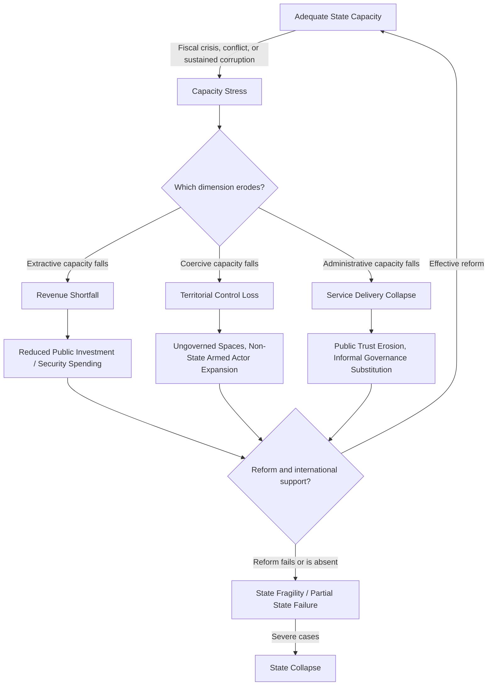

## State Capacity and Institutional Strength Assessment


### Purpose and Scope

State capacity refers to a government's ability to implement policy, deliver public goods, extract revenue, maintain a monopoly on legitimate violence, and enforce rules across its claimed territory. It is analytically distinct from regime type: a democracy and an autocracy can each have high or low state capacity, and capacity, not regime type, is often the better predictor of a state's ability to withstand shocks (natural disasters, economic crises, insurgency) without collapsing into disorder. This item covers the frameworks, indicators, and datasets used to assess institutional strength as a standalone risk dimension.

### State Capacity vs. Regime Type vs. Regime Stability

**Key Points**

- A regime can be politically stable (low succession/coup risk) while having low state capacity (unable to deliver services, collect taxes, or control territory) — these are often conflated but are separate risk dimensions.
- Conversely, a state can have high administrative capacity while facing acute regime-level political instability (e.g., competent bureaucracies persisting through leadership turnover).
- Weak state capacity is a strong predictor of *subnational* risk variation (ungoverned spaces, insurgent sanctuary areas) even when national-level regime stability indicators look moderate.

### Core Dimensions of State Capacity

<svg xmlns="http://www.w3.org/2000/svg" viewBox="0 0 900 340" font-family="sans-serif">
<text x="450" y="20" text-anchor="middle" font-size="14" font-weight="bold">Dimensions of State Capacity (svg_diagram)</text>
<rect x="20" y="50" width="200" height="260" rx="6" fill="#e8f0fe" stroke="#3b5bdb" />
<text x="120" y="75" text-anchor="middle" font-size="12" font-weight="bold">Coercive Capacity</text>
<text x="30" y="100" font-size="9">- Monopoly on legitimate</text>
<text x="30" y="113" font-size="9"> force</text>
<text x="30" y="130" font-size="9">- Territorial control</text>
<text x="30" y="145" font-size="9"> (vs. ungoverned zones)</text>
<text x="30" y="162" font-size="9">- Police/military reach</text>
<text x="30" y="175" font-size="9"> into periphery</text>
<text x="30" y="200" font-size="9" font-style="italic">Proxy measures:</text>
<text x="30" y="215" font-size="9">Armed group presence</text>
<text x="30" y="228" font-size="9">maps, border control</text>
<text x="30" y="241" font-size="9">effectiveness</text>
<rect x="240" y="50" width="200" height="260" rx="6" fill="#fff3bf" stroke="#f08c00" />
<text x="340" y="75" text-anchor="middle" font-size="12" font-weight="bold">Extractive Capacity</text>
<text x="250" y="100" font-size="9">- Tax revenue as %</text>
<text x="250" y="113" font-size="9"> of GDP</text>
<text x="250" y="130" font-size="9">- Tax collection</text>
<text x="250" y="143" font-size="9"> efficiency</text>
<text x="250" y="160" font-size="9">- Informal economy</text>
<text x="250" y="173" font-size="9"> size (inverse proxy)</text>
<text x="250" y="200" font-size="9" font-style="italic">Proxy measures:</text>
<text x="250" y="215" font-size="9">IMF fiscal data, World</text>
<text x="250" y="228" font-size="9">Bank revenue statistics</text>
<rect x="460" y="50" width="200" height="260" rx="6" fill="#d3f9d8" stroke="#2f9e44" />
<text x="560" y="75" text-anchor="middle" font-size="12" font-weight="bold">Administrative Capacity</text>
<text x="470" y="100" font-size="9">- Bureaucratic quality</text>
<text x="470" y="113" font-size="9"> and meritocracy</text>
<text x="470" y="130" font-size="9">- Public service delivery</text>
<text x="470" y="143" font-size="9"> (health, education,</text>
<text x="470" y="156" font-size="9"> infrastructure)</text>
<text x="470" y="173" font-size="9">- Corruption levels</text>
<text x="470" y="200" font-size="9" font-style="italic">Proxy measures:</text>
<text x="470" y="215" font-size="9">WGI Government</text>
<text x="470" y="228" font-size="9">Effectiveness, CPI</text>
<rect x="680" y="50" width="200" height="260" rx="6" fill="#ffe3e3" stroke="#e03131" />
<text x="780" y="75" text-anchor="middle" font-size="12" font-weight="bold">Legal/Judicial Capacity</text>
<text x="690" y="100" font-size="9">- Rule of law</text>
<text x="690" y="113" font-size="9"> enforcement</text>
<text x="690" y="130" font-size="9">- Property rights</text>
<text x="690" y="143" font-size="9"> protection</text>
<text x="690" y="160" font-size="9">- Contract enforcement</text>
<text x="690" y="173" font-size="9"> reliability</text>
<text x="690" y="200" font-size="9" font-style="italic">Proxy measures:</text>
<text x="690" y="215" font-size="9">WJP Rule of Law Index,</text>
<text x="690" y="228" font-size="9">WGI Rule of Law</text>
</svg>

[Inference] This four-dimension framing (coercive, extractive, administrative, legal/judicial) synthesizes overlapping concepts from the state capacity literature (Fukuyama, Besley & Persson, Hendrix); different scholars partition these dimensions somewhat differently, so treat this as a practically useful organizing structure rather than a single agreed taxonomy.

### Key Datasets and Indices

**Worldwide Governance Indicators (WGI)** — World Bank composite covering six dimensions: Voice & Accountability, Political Stability, Government Effectiveness, Regulatory Quality, Rule of Law, Control of Corruption. Percentile-ranked 0–100 across ~200 economies, updated annually.

**Fragile States Index (FSI)** — Fund for Peace, 12 indicators aggregated into a 0–120 fragility score, explicitly designed to capture capacity erosion alongside political and social pressures.

**Bertelsmann Transformation Index (BTI)** — covers governance quality and "state capacity" as an explicit sub-indicator for developing and transition economies, on a 1–10 scale, biennial.

**Varieties of Democracy (V-Dem) — State Capacity indicators** — includes specific indices like "state authority over territory" and administrative capacity proxies embedded within broader governance measurement.

**World Justice Project (WJP) Rule of Law Index** — focused specifically on legal/judicial capacity dimension: constraints on government power, absence of corruption, order and security, fundamental rights, regulatory enforcement, civil/criminal justice quality.

**Tax revenue as % of GDP (IMF/World Bank)** — a widely used single-metric proxy for extractive capacity; low ratios (particularly below regional peer averages) often indicate either narrow tax base, weak enforcement, or heavy informal economy reliance.

### Composite State Capacity Scoring

$$\text{StateCapacity} = w_1 C_{coercive} + w_2 C_{extractive} + w_3 C_{admin} + w_4 C_{legal}$$

where each $C$ component is normalized 0–1 (e.g., via percentile rank against a global reference distribution, following the WGI methodology), and weights reflect analytical priorities (e.g., a counterinsurgency-focused analysis might upweight coercive capacity; an investment climate analysis might upweight legal/judicial capacity).

```python
def state_capacity_score(coercive: float, extractive: float,
                           administrative: float, legal: float,
                           weights: tuple = (0.25, 0.25, 0.25, 0.25)) -> float:
    """
    All inputs normalized 0-1 (e.g., percentile rank / 100).
    Returns composite state capacity score, 0 (weak) to 1 (strong).
    """
    w1, w2, w3, w4 = weights
    assert abs(sum(weights) - 1.0) < 1e-6, "Weights must sum to 1"
    return round(w1 * coercive + w2 * extractive + w3 * administrative + w4 * legal, 3)

def capacity_gap_flag(coercive: float, extractive: float,
                        administrative: float, legal: float,
                        threshold: float = 0.35) -> str:
    """
    Flags uneven capacity profiles — e.g., strong coercive capacity
    but weak administrative capacity, a pattern associated with
    security-heavy, service-delivery-weak states.
    """
    scores = {"coercive": coercive, "extractive": extractive,
              "administrative": administrative, "legal": legal}
    spread = max(scores.values()) - min(scores.values())
    if spread > threshold:
        weakest = min(scores, key=scores.get)
        return f"Uneven capacity profile — weakest dimension: {weakest}"
    return "Balanced capacity profile"

# Example: strong security apparatus, weak service delivery and rule of law
print(state_capacity_score(coercive=0.75, extractive=0.4,
                             administrative=0.3, legal=0.25))
print(capacity_gap_flag(coercive=0.75, extractive=0.4,
                          administrative=0.3, legal=0.25))
```

**Output**



```
0.425
Uneven capacity profile — weakest dimension: legal
```

[Behavior may vary depending on specific input assumptions and weighting choices; this is an illustrative scoring framework, not a published index methodology.]

### Capacity Erosion and Recovery Pathway



### Subnational and Spatial Analysis

State capacity is frequently uneven within a single country — capital regions and economic centers often show high capacity while peripheral or contested regions show effective ungoverned status. Analysts commonly overlay:

- Armed group territorial control maps (ACLED, Rulac)
- Public service access data (health facility density, school enrollment) by subnational administrative unit
- Nighttime lights intensity as a proxy for economic activity and infrastructure reach

[Inference] Nighttime lights data is a widely used proxy in the applied development and conflict economics literature for economic activity where official statistics are unreliable or unavailable, but it captures electrification/economic activity rather than governance capacity directly, so it should be triangulated with other indicators rather than used as a standalone capacity measure.

### Common Pitfalls

- **Conflating state capacity with regime legitimacy or democracy** — a highly capable authoritarian state and a low-capacity democracy are both observed empirically; capacity and regime type should be modeled as independent variables.
- **National-level averaging masking subnational variation** — a country with strong aggregate WGI scores can still have substantial ungoverned or weakly governed peripheral regions relevant to specific risk questions (insurgency, smuggling, resource extraction risk).
- **Overreliance on perception-based indices** without corroborating hard data — WGI and similar composite indices incorporate expert perception surveys, which can lag real conditions or reflect surveyed experts' biases; cross-referencing with harder metrics (tax revenue, infrastructure data) improves robustness.
- **Ignoring capacity trajectory** — a state with currently moderate capacity but a multi-year declining trend (e.g., shrinking tax base, rising corruption perception) presents different risk than one with stable moderate capacity, even if current-year scores are identical.

### Related Topics

- Fragile States Index methodology and component indicators
- Ungoverned spaces and non-state armed actor territorial control mapping
- Nighttime lights and satellite-derived governance/economic proxies
- Corruption measurement and Control of Corruption indicators
- Authoritarian resilience and fragility indicators (institutional dimension overlap)
- Subnational conflict risk modeling
- Fiscal capacity and tax base analysis as instability predictors