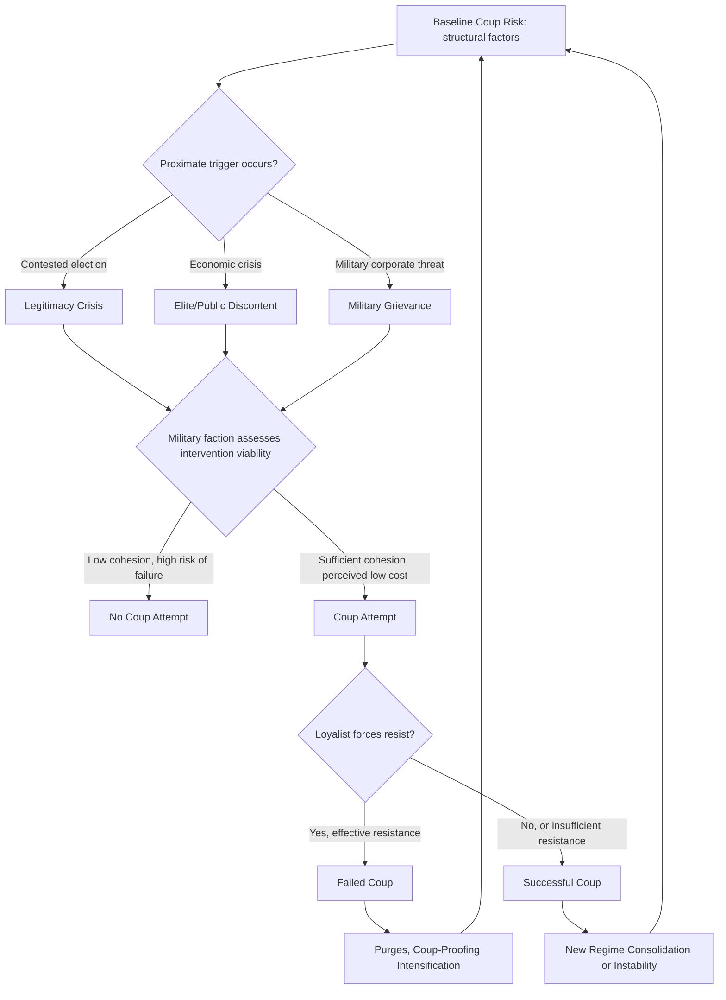

## Coup Risk Factors and Historical Patterns


### Purpose and Scope

Coups d'état — the illegal and overt seizure of state executive authority by military or security elites — remain one of the most extensively studied and quantitatively modeled forms of political instability, largely because they are discrete, dateable events with decades of coded data available. This item covers the empirical risk factors identified in the coup literature, historical base rates and patterns, and how coup risk is operationalized for monitoring purposes.

### Defining and Classifying Coup Events

Coup datasets typically distinguish:

- **Successful coup**: plotters seize and hold power for a minimum period (commonly 7 days in coding conventions such as Powell & Thyne).
- **Failed coup attempt**: plotters attempt seizure but are defeated, arrested, or fail to consolidate control.
- **Coup plot (uncoded/unconfirmed)**: alleged conspiracies that do not reach overt action, generally excluded from primary datasets due to verification difficulty.

Coups are further subclassified by actor type: military coup, palace coup (intra-elite, often within the ruling clique itself), and auto-coup/self-coup (executive suspends constitutional constraints, e.g., dissolving legislature or judiciary while remaining formally in office).

**Key Points**

- Palace coups and auto-coups are sometimes undercounted in datasets focused narrowly on military intervention, so analysts should clarify which coup subtype a given dataset captures.
- A failed coup attempt is not a "non-event" for risk purposes — failed attempts often precede successful ones and are themselves useful leading indicators of elite fracture.

### Major Datasets

**Cline Center Coup D'état Project** — event-level global coup data with detailed classification of coup type, actor, and outcome, widely used in academic and applied risk modeling.

**Powell & Thyne Coup Data** — one of the most cited datasets in political science, covering coup attempts from 1950–present with success/failure coding and a well-documented, replicable coding methodology.

**Center for Systemic Peace (CSP) coup data** — complements Polity5, often used alongside regime-type data for combined analysis.

### Empirically Identified Coup Risk Factors

<svg xmlns="http://www.w3.org/2000/svg" viewBox="0 0 900 320" font-family="sans-serif">
<text x="450" y="20" text-anchor="middle" font-size="14" font-weight="bold">Established Coup Risk Correlates (svg_diagram)</text>
<rect x="20" y="50" width="270" height="240" rx="6" fill="#e8f0fe" stroke="#3b5bdb" />
<text x="155" y="75" text-anchor="middle" font-size="12" font-weight="bold">Structural Factors</text>
<text x="30" y="100" font-size="10">- Prior coup history</text>
<text x="30" y="113" font-size="10"> ("coup trap" effect)</text>
<text x="30" y="130" font-size="10">- Low GDP per capita</text>
<text x="30" y="147" font-size="10">- Regime type: military</text>
<text x="30" y="160" font-size="10"> and personalist highest</text>
<text x="30" y="177" font-size="10">- Ethnic/regional exclusion</text>
<text x="30" y="190" font-size="10"> from power</text>
<text x="30" y="207" font-size="10">- Poor economic growth</text>
<text x="30" y="220" font-size="10"> performance</text>
<rect x="315" y="50" width="270" height="240" rx="6" fill="#fff3bf" stroke="#f08c00" />
<text x="450" y="75" text-anchor="middle" font-size="12" font-weight="bold">Military-Specific Factors</text>
<text x="325" y="100" font-size="10">- Weak civilian control</text>
<text x="325" y="113" font-size="10"> institutions</text>
<text x="325" y="130" font-size="10">- Military factionalism</text>
<text x="325" y="147" font-size="10">- Perceived threat to</text>
<text x="325" y="160" font-size="10"> military corporate</text>
<text x="325" y="173" font-size="10"> interests/budget</text>
<text x="325" y="190" font-size="10">- Recent military defeat</text>
<text x="325" y="203" font-size="10"> or humiliation</text>
<text x="325" y="220" font-size="10">- Coup-proofing failures</text>
<rect x="610" y="50" width="270" height="240" rx="6" fill="#d3f9d8" stroke="#2f9e44" />
<text x="745" y="75" text-anchor="middle" font-size="12" font-weight="bold">Proximate Triggers</text>
<text x="620" y="100" font-size="10">- Contested/fraudulent</text>
<text x="620" y="113" font-size="10"> elections</text>
<text x="620" y="130" font-size="10">- Mass protest/unrest</text>
<text x="620" y="143" font-size="10"> providing intervention</text>
<text x="620" y="156" font-size="10"> pretext</text>
<text x="620" y="173" font-size="10">- Sudden economic crisis</text>
<text x="620" y="186" font-size="10"> (currency collapse,</text>
<text x="620" y="199" font-size="10"> hyperinflation)</text>
<text x="620" y="216" font-size="10">- Leader attempts to purge</text>
<text x="620" y="229" font-size="10"> or restructure military</text>
</svg>

[Inference] These factors reflect a broad consensus across multiple empirical coup studies (Powell, Thyne, Belkin & Schofer's coup-proofing literature, among others), but effect sizes and relative importance vary across studies and time periods, and no single model captures all documented cases with high precision — coup timing in particular remains difficult to forecast precisely even when elevated baseline risk is well identified.

### The "Coup Trap" Phenomenon

One of the most robust empirical findings in the literature is that a country's own coup history is among the strongest predictors of future coup risk — sometimes termed the "coup trap." Having experienced one successful coup substantially raises the probability of subsequent coup attempts, plausibly because:

- A precedent is set demonstrating the military can seize power without complete political or international ruin.
- Institutional norms against military intervention weaken with repeated violation.
- Coup-proofing counter-measures adopted by post-coup leaders (creating parallel security forces, rotating officers) can themselves generate resentment that fuels further coup attempts.

[Inference] While the coup trap correlation is well-documented, the precise causal mechanism (precedent-setting vs. underlying structural conditions that produce repeated coups vs. coup-proofing backlash) remains debated in the literature, and likely varies by case.

### Coup-Proofing and Its Paradoxical Risk

Regimes take deliberate measures to reduce coup risk, but these measures carry their own trade-offs:

- **Counterbalancing**: creating parallel security forces (presidential guards, paramilitaries) to check the regular military. Reduces single-actor coup capability but can create new friction points and inter-force rivalry.
- **Officer rotation and promotion politicization**: prevents commanders from building entrenched loyal networks, but can degrade military professionalism and combat effectiveness.
- **Ethnic/clan stacking**: placing co-ethnics or trusted network members in key security positions. Reduces defection risk from that network but can alienate excluded groups and reduce overall military competence.

[Inference] The coup-proofing literature (notably Belkin & Schofer) documents a widely observed trade-off between coup-proofing intensity and military effectiveness, though the magnitude of this trade-off is context-dependent and not a fixed universal rate.

### Quantitative Risk Scoring Approach

A standard applied approach uses logistic regression or similar binary classification to estimate coup probability in a given country-year:

$$P(\text{coup}_t = 1) = \frac{1}{1 + e^{-(\beta_0 + \beta_1 X_1 + \beta_2 X_2 + \dots + \beta_n X_n)}}$$

where $X_1, \dots, X_n$ typically include prior coup count, GDP growth, regime type dummy variables, years since independence, and ethnic exclusion indices.

```python
import numpy as np

def coup_probability(prior_coups: int, gdp_growth: float,
                       is_military_regime: int, is_personalist: int,
                       years_since_independence: int,
                       coefficients: dict = None) -> float:
    """
    Illustrative logistic model for coup probability.
    Coefficients below are illustrative teaching values, NOT
    estimated from a specific published study — real applications
    require estimation on an actual coded dataset (e.g., Powell & Thyne).
    """
    if coefficients is None:
        coefficients = {
            "intercept": -3.5,
            "prior_coups": 0.35,
            "gdp_growth": -0.15,
            "military_regime": 1.1,
            "personalist": 0.7,
            "log_years_independent": -0.2,
        }
    log_years = np.log(max(years_since_independence, 1))
    z = (coefficients["intercept"]
         + coefficients["prior_coups"] * prior_coups
         + coefficients["gdp_growth"] * gdp_growth
         + coefficients["military_regime"] * is_military_regime
         + coefficients["personalist"] * is_personalist
         + coefficients["log_years_independent"] * log_years)
    return round(1 / (1 + np.exp(-z)), 4)

# Example: country with 3 prior coups, negative growth, military regime
p = coup_probability(prior_coups=3, gdp_growth=-2.0,
                       is_military_regime=1, is_personalist=0,
                       years_since_independence=60)
print(f"Estimated annual coup probability: {p}")
```

**Output**



```
Estimated annual coup probability: 0.5871
```

[Behavior may vary depending on the specific coefficient values used; the coefficients here are illustrative for teaching the modeling structure, not empirically estimated parameters from a published study. Real applications require estimating coefficients on actual historical coup data.]

### Coup Risk Escalation Pathway



### Historical Base Rate Patterns

[Inference] The following reflect broadly established patterns across multiple published coup studies, though exact figures vary by dataset, time period, and coding rules — treat specific numbers as illustrative of general findings rather than precise universal constants:

- Coup attempts have been geographically and temporally concentrated, with sub-Saharan Africa and Latin America historically showing elevated frequency relative to other regions, though rates have generally declined globally since the Cold War's end.
- Post-Cold War coups show a higher failure rate on average compared to Cold War-era coups, plausibly linked to changed international norms (African Union and other regional bodies increasingly imposing sanctions/suspension on coup governments) and reduced superpower sponsorship of client-state coups.
- Coups are more frequent in the years immediately following a country's independence or a major constitutional transition, consistent with the broader pattern of elevated instability during periods of institutional immaturity.

### Common Pitfalls

- **Treating coup risk as independent of regime type risk** — coup risk modeling should be integrated with, not separate from, the broader regime type and stability frameworks, since military and personalist regimes are simultaneously the most coup-prone and the most coup-installed.
- **Underweighting failed attempts** — a failed coup attempt is strong evidence of underlying elite fracture and often precedes a successful attempt or a purge-driven repression cycle; excluding failed attempts from monitoring understates true risk.
- **Ignoring international/regional response norms** — post-Cold War regional bodies (AU, ECOWAS) increasingly impose costs on coup governments, which affects both coup calculus (potential plotters weighing likely international isolation) and consolidation outcomes; purely domestic-factor models can miss this dimension.
- **Overfitting historical base rates to predict timing** — structural risk factors identify elevated baseline probability well; specific timing typically requires monitoring proximate triggers (elections, economic shocks, military grievances) layered on top of the structural baseline.

### Related Topics

- Regime type classification and stability implications (military/personalist subtype risk)
- Authoritarian resilience and fragility indicators (repression pillar and security sector loyalty)
- Leadership succession and transition risk (coup as a succession-failure pathway)
- Coup-proofing strategies and civil-military relations
- Regional organizations' anti-coup norms (AU, ECOWAS sanctions regimes)
- Elite defection and factional conflict modeling
- Logistic regression and survival modeling for political event prediction