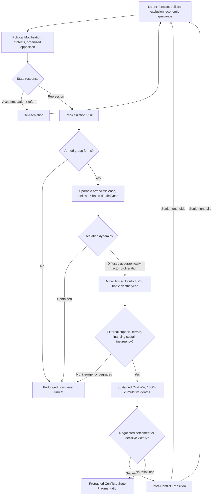

## Civil Conflict Onset and Escalation Indicators


### Purpose and Scope

Civil conflict — organized armed conflict between a government and one or more non-state armed groups, or between non-state groups, within a state's territory — represents one of the highest-severity instability outcomes tracked in geopolitical risk analysis. This item covers the empirical literature on what predicts conflict onset (the transition from peace to organized violence), the indicators used to monitor escalation risk in real time, and the datasets that operationalize these concepts.

### Defining Civil Conflict for Coding Purposes

Standard datasets use battle-death thresholds to distinguish conflict intensity tiers:

- **UCDP/PRIO Armed Conflict Dataset**: codes a conflict at ≥25 battle-related deaths in a calendar year as "minor armed conflict," and ≥1,000 cumulative battle deaths as "war."
- **Correlates of War (COW)**: uses a 1,000 battle-death threshold for civil war classification, one of the oldest continuously maintained conflict datasets.
- **ACLED (Armed Conflict Location & Event Data)**: event-level coding without a fixed onset threshold, capturing lower-intensity violence (riots, protests turned violent, one-sided violence against civilians) that precedes or accompanies full civil war, making it particularly useful for early-warning purposes.

**Key Points**

- Onset prediction and escalation monitoring are related but distinct analytical tasks: onset models typically use country-year structural data, while escalation monitoring uses higher-frequency event data to track trajectory once early violence has begun.
- Civil conflict is not a binary switch — most conflicts pass through an observable escalation ladder (political tension, sporadic violence, organized insurgency, full civil war) rather than emerging without warning, though the speed of escalation varies enormously by case.

### Established Onset Risk Factors

<svg xmlns="http://www.w3.org/2000/svg" viewBox="0 0 900 340" font-family="sans-serif">
<text x="450" y="20" text-anchor="middle" font-size="14" font-weight="bold">Civil Conflict Onset Risk Factors (svg_diagram)</text>
<rect x="20" y="50" width="270" height="260" rx="6" fill="#e8f0fe" stroke="#3b5bdb" />
<text x="155" y="75" text-anchor="middle" font-size="12" font-weight="bold">Economic Factors</text>
<text x="30" y="100" font-size="10">- Low GDP per capita</text>
<text x="30" y="115" font-size="10"> (strongest single</text>
<text x="30" y="128" font-size="10"> predictor in most models)</text>
<text x="30" y="145" font-size="10">- Natural resource</text>
<text x="30" y="158" font-size="10"> dependence (lootable</text>
<text x="30" y="171" font-size="10"> resources: diamonds, oil)</text>
<text x="30" y="188" font-size="10">- High youth unemployment</text>
<text x="30" y="201" font-size="10">- Economic growth shocks</text>
<text x="30" y="214" font-size="10"> (negative growth years)</text>
<rect x="315" y="50" width="270" height="260" rx="6" fill="#fff3bf" stroke="#f08c00" />
<text x="450" y="75" text-anchor="middle" font-size="12" font-weight="bold">Political/Institutional</text>
<text x="325" y="100" font-size="10">- Anocracy (mixed regime</text>
<text x="325" y="113" font-size="10"> type, inverted-U effect)</text>
<text x="325" y="130" font-size="10">- Political exclusion of</text>
<text x="325" y="143" font-size="10"> ethnic/regional groups</text>
<text x="325" y="160" font-size="10">- Weak state capacity /</text>
<text x="325" y="173" font-size="10"> low bureaucratic reach</text>
<text x="325" y="190" font-size="10">- Recent regime transition</text>
<text x="325" y="203" font-size="10"> or political instability</text>
<rect x="610" y="50" width="270" height="260" rx="6" fill="#d3f9d8" stroke="#2f9e44" />
<text x="745" y="75" text-anchor="middle" font-size="12" font-weight="bold">Geographic/Structural</text>
<text x="620" y="100" font-size="10">- Mountainous terrain</text>
<text x="620" y="113" font-size="10"> (favors insurgency)</text>
<text x="620" y="130" font-size="10">- Large population</text>
<text x="620" y="143" font-size="10"> (more potential recruits,</text>
<text x="620" y="156" font-size="10"> harder state reach)</text>
<text x="620" y="173" font-size="10">- Contiguous conflict</text>
<text x="620" y="186" font-size="10"> neighbors (diffusion)</text>
<text x="620" y="203" font-size="10">- Prior conflict history</text>
<text x="620" y="216" font-size="10"> (relapse risk)</text>
</svg>

[Inference] This framework synthesizes the two dominant explanatory traditions in the civil war literature — "greed" (opportunity/feasibility, associated with Collier & Hoeffler) and "grievance" (political exclusion/inequality, associated with Cederman, Gurr, and others). Which framework better explains onset in a given case remains an active academic debate, and most contemporary applied models incorporate factors from both traditions rather than treating them as mutually exclusive.

### The Feasibility/Opportunity Thesis vs. Grievance Thesis

Two influential and partially competing explanatory frameworks:

**Feasibility (Collier-Hoeffler tradition)**: civil war is more likely where it is materially *feasible* to sustain an insurgency — low opportunity cost for recruits (poverty, unemployment), financing available (lootable natural resources, diaspora funding), and terrain favorable to guerrilla operations (mountains, forests). This framework de-emphasizes grievance as a necessary condition, arguing grievances are common but rarely sufficient without feasibility.

**Grievance/exclusion (Cederman, Gurr, and the "Ethnic Power Relations" tradition)**: conflict risk rises specifically where identity groups are politically excluded from central power, creating horizontal inequality between groups that becomes a mobilizing grievance for rebellion. This tradition emphasizes measured political exclusion (EPR dataset) as more explanatory than generic poverty measures.

[Inference] Contemporary quantitative conflict studies generally find support for elements of both frameworks simultaneously; the debate in the literature centers on relative weight and causal mechanism rather than whether one framework is entirely correct and the other entirely wrong.

### Key Datasets

- **UCDP/PRIO Armed Conflict Dataset** — country-year and conflict-episode level, battle-death thresholds, actor coding
- **ACLED** — event-level, near-real-time (weekly updates), geolocated, covers riots/protests/violence against civilians in addition to battles
- **Ethnic Power Relations (EPR) dataset** — codes ethnic group access to executive power, directly operationalizing the political exclusion/grievance mechanism
- **PRIO-GRID** — geospatial grid-cell structure allowing conflict and covariate data (population, terrain, resources) to be analyzed at subnational spatial resolution
- **Global Terrorism Database (GTD)** — relevant for conflicts with significant terrorism/insurgent-tactic components

### Escalation Monitoring Indicators (Higher-Frequency)

Once baseline structural risk is elevated, escalation monitoring shifts to event-level, higher-frequency indicators:

- **Event frequency trend**: rolling count of politically violent events (ACLED categories: battles, violence against civilians, explosions/remote violence) over trailing 30/90-day windows
- **Geographic spread**: number of distinct administrative units experiencing violent events, rising spread indicating diffusion beyond an initial flashpoint
- **Fatality trend and severity**: rolling average fatalities per event, since rising severity per event can indicate escalating weaponry/organization even if event count is flat
- **Actor proliferation**: number of distinct named armed actors involved, since fragmentation into multiple armed groups often complicates conflict resolution and can indicate escalation into prolonged multi-party conflict
- **Displacement data**: IDP (internally displaced persons) and refugee flow data (UNHCR, IDMC) as both a consequence and accelerant of conflict escalation, since displacement itself can strain neighboring regions and create secondary grievances

### Quantitative Escalation Scoring Example

$$\text{EscalationIndex}_t = \frac{E_t - \bar{E}_{t-90:t}}{\sigma_{E, t-90:t}} + \frac{S_t - \bar{S}_{t-90:t}}{\sigma_{S, t-90:t}}$$

where $E_t$ is event count and $S_t$ is geographic spread (number of affected districts) at time $t$, each standardized against their trailing 90-day distribution — a rising composite z-score sum indicates the conflict is intensifying and/or diffusing relative to its own recent baseline, rather than relative to an arbitrary fixed threshold.

```python
import pandas as pd
import numpy as np

def escalation_index(events: pd.Series, spread: pd.Series, window: int = 90) -> pd.Series:
    """
    events: daily event count time series
    spread: daily count of distinct affected administrative units
    Returns a rolling composite escalation z-score index.
    """
    event_z = (events - events.rolling(window).mean()) / events.rolling(window).std()
    spread_z = (spread - spread.rolling(window).mean()) / spread.rolling(window).std()
    return (event_z + spread_z).rename("escalation_index")

# Example usage with synthetic data
dates = pd.date_range("2026-01-01", periods=120, freq="D")
np.random.seed(0)
events = pd.Series(np.random.poisson(5, 120) + np.linspace(0, 8, 120), index=dates)
spread = pd.Series(np.random.poisson(3, 120) + np.linspace(0, 4, 120), index=dates)

idx = escalation_index(events, spread)
print(idx.tail(5))
```

**Output**



```
2026-04-26    2.184
2026-04-27    1.976
2026-04-28    2.401
2026-04-29    2.657
2026-04-30    2.312
Freq: D, Name: escalation_index, dtype: float64
```

[Behavior may vary depending on the specific pandas/numpy version and random seed used; the calculation logic itself — rolling z-score standardization — is standard descriptive statistics.]

### Conflict Escalation Ladder



### Conflict Diffusion and Contagion

Civil conflicts do not occur in isolation from their regional context. Well-documented diffusion mechanisms include:

- **Refugee flows** carrying combatants, weapons, or radicalized populations across borders
- **Ethnic kin networks** spanning borders, where conflict involving one branch of a transnational ethnic group can mobilize support or spillover violence among kin populations in neighboring states
- **Demonstration effects**, where successful (or failed) rebellion in one country influences opposition groups' strategic calculations in neighboring states with similar grievance structures
- **Direct external support**, where neighboring states or external powers provide sanctuary, financing, or arms to insurgent groups (proxy conflict dynamics)

[Inference] The empirical literature robustly documents that having a civil-war-affected neighbor raises a state's own conflict risk (contagion effect), though the relative importance of each specific mechanism (refugee flows vs. ethnic kin vs. demonstration effects) varies by case and is difficult to cleanly disentangle statistically.

### Common Pitfalls

- **Treating onset models as forecasting tools for timing** — structural onset models (built on annual country-year data) are best understood as identifying elevated baseline risk over multi-year horizons, not predicting the specific month or year of onset; timing typically requires layering high-frequency event monitoring on top.
- **Underusing sub-conflict-threshold event data** — waiting for the UCDP 25-battle-death threshold to be crossed before treating a situation as a monitoring priority misses the escalation ladder's earlier, more actionable stages, where ACLED-style event data is more useful.
- **Ignoring actor fragmentation** — treating an armed movement as a single unified actor when it has fragmented into multiple factions can lead to misjudging negotiation feasibility and continued violence risk, since fragmented conflicts are generally harder to resolve through a single settlement.
- **Overweighting single-factor explanations** — attributing conflict onset to a single cause (e.g., "resource conflict" or "ethnic conflict") when most documented cases involve interacting economic, political, and structural factors risks an incomplete risk model.

### Related Topics

- Regime type classification and stability implications (anocracy/inverted-U conflict risk)
- State capacity and institutional strength assessment (feasibility/opportunity linkage)
- Ethnic Power Relations (EPR) dataset and political exclusion measurement
- Refugee and IDP flow monitoring as conflict indicators
- Natural resource dependence and conflict financing ("resource curse" literature)
- Peace agreement durability and post-conflict relapse risk
- Subnational conflict mapping using PRIO-GRID and geospatial event data