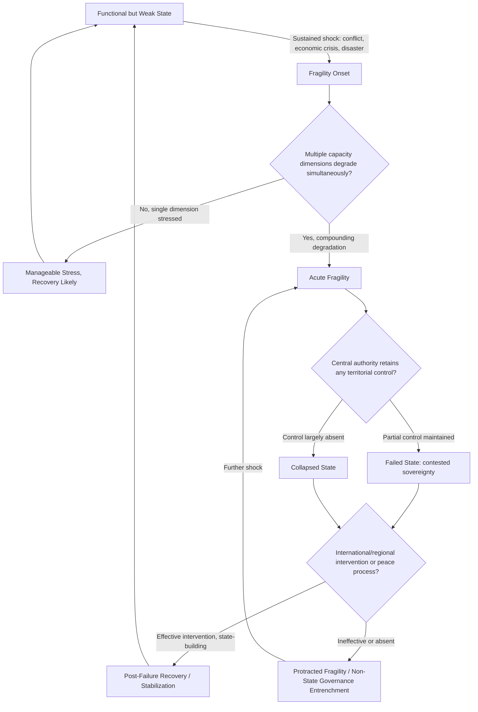

## Failed and Fragile State Dynamics


### Purpose and Scope

Failed and fragile states represent the terminal end of the state stability spectrum — situations where central government loses effective control over core state functions: territorial monopoly on violence, service delivery, revenue extraction, and international legal personality in practice. This item covers the conceptual distinctions between state weakness, fragility, and failure, the composite indices used to measure this spectrum, and the dynamics through which fragile states can either recover or collapse further.

### Conceptual Spectrum: Weak, Fragile, Failed, Collapsed

**Key Points**

- **Weak state**: below-average capacity across some dimensions but functional government retains territorial control and basic legitimacy — a broad category encompassing many developing states that are not in acute crisis.
- **Fragile state**: capacity and/or legitimacy has eroded to the point where the state is vulnerable to shocks it could otherwise absorb; fragility is often framed as a risk condition rather than a fixed state of failure.
- **Failed state**: central government has lost effective control over significant portions of territory and/or core functions, though the state retains formal international recognition and (often) contested claim to authority.
- **Collapsed state**: near-total absence of functioning central government; governance functions (where they exist) are provided by sub-state or non-state actors (warlords, militias, informal governance structures).

[Inference] These categories exist on a continuum rather than as sharply bounded discrete states, and different indices (Fragile States Index, OECD States of Fragility, World Bank Harmonized List) use somewhat different thresholds and criteria to classify countries into fragility tiers — cross-index disagreement on borderline cases is common and expected given the conceptual fuzziness at category boundaries.

### Relationship to Other Stability Concepts Covered

Failed/fragile state dynamics sit downstream of several previously covered concepts:

- Extends **state capacity assessment** to its critical-failure endpoint
- Often follows sustained **civil conflict** that the state could not contain or resolve
- Frequently co-occurs with **authoritarian resilience failure** or chronic **succession crisis** in personalist systems
- Regime type is a weaker predictor here than capacity trajectory — both weak democracies and weak autocracies can fail; what matters is sustained capacity erosion across multiple dimensions simultaneously

### Major Fragility Indices

<svg xmlns="http://www.w3.org/2000/svg" viewBox="0 0 900 300" font-family="sans-serif">
<text x="450" y="20" text-anchor="middle" font-size="14" font-weight="bold">Fragility Measurement Frameworks (svg_diagram)</text>
<rect x="20" y="50" width="270" height="220" rx="6" fill="#e8f0fe" stroke="#3b5bdb" />
<text x="155" y="75" text-anchor="middle" font-size="12" font-weight="bold">Fragile States Index (FSI)</text>
<text x="30" y="100" font-size="9">Fund for Peace, annual</text>
<text x="30" y="115" font-size="9">12 indicators across 4</text>
<text x="30" y="128" font-size="9">categories: Cohesion,</text>
<text x="30" y="141" font-size="9">Economic, Political,</text>
<text x="30" y="154" font-size="9">Social/Cross-cutting</text>
<text x="30" y="171" font-size="9">0-120 scale, higher =</text>
<text x="30" y="184" font-size="9">more fragile</text>
<text x="30" y="205" font-size="9">Broadest country</text>
<text x="30" y="218" font-size="9">coverage (~180 states)</text>
<rect x="315" y="50" width="270" height="220" rx="6" fill="#fff3bf" stroke="#f08c00" />
<text x="450" y="75" text-anchor="middle" font-size="12" font-weight="bold">OECD States of Fragility</text>
<text x="325" y="100" font-size="9">Multidimensional</text>
<text x="325" y="115" font-size="9">framework: Economic,</text>
<text x="325" y="128" font-size="9">Environmental, Political,</text>
<text x="325" y="141" font-size="9">Security, Societal</text>
<text x="325" y="158" font-size="9">Explicitly designed for</text>
<text x="325" y="171" font-size="9">aid/development policy</text>
<text x="325" y="184" font-size="9">targeting, not just</text>
<text x="325" y="197" font-size="9">academic ranking</text>
<rect x="610" y="50" width="270" height="220" rx="6" fill="#d3f9d8" stroke="#2f9e44" />
<text x="745" y="75" text-anchor="middle" font-size="12" font-weight="bold">World Bank Harmonized List</text>
<text x="620" y="100" font-size="9">Fragile and Conflict-</text>
<text x="620" y="113" font-size="9">Affected Situations list</text>
<text x="620" y="130" font-size="9">Combines CPIA (policy/</text>
<text x="620" y="143" font-size="9">institutional score) with</text>
<text x="620" y="156" font-size="9">presence of peacekeeping/</text>
<text x="620" y="169" font-size="9">political mission</text>
<text x="620" y="186" font-size="9">Used operationally for</text>
<text x="620" y="199" font-size="9">World Bank lending terms</text>
</svg>

### FSI Component Indicators (Illustrative Detail)

The Fragile States Index aggregates 12 indicators, commonly grouped as:

**Cohesion indicators**: Security apparatus, factionalized elites, group grievance

**Economic indicators**: Economic decline, uneven economic development, human flight and brain drain

**Political indicators**: State legitimacy, public services, human rights and rule of law

**Social/cross-cutting indicators**: Demographic pressures, refugees and IDPs, external intervention

Each indicator is scored 0–10 (10 = most fragile), summed to produce the composite 0–120 score.

### Pathways Into State Failure

State failure rarely results from a single cause; the literature generally identifies compounding, mutually reinforcing failure across multiple capacity dimensions:

$$\text{FailureRisk} \propto f(\text{CapacityLoss}, \text{LegitimacyLoss}, \text{ExternalShock}, \text{ConflictIntensity})$$

with failure becoming likely when degradation occurs simultaneously across coercive capacity (loss of territorial control), extractive capacity (revenue collapse), and legitimacy (loss of population's willingness to recognize state authority) — a single-dimension weakness is generally survivable, but compounding multi-dimensional collapse is the pattern most associated with actual state failure.

```python
def failure_risk_composite(coercive_loss: float, extractive_loss: float,
                             legitimacy_loss: float, external_shock: float,
                             compounding_multiplier: float = 1.5) -> float:
    """
    All inputs normalized 0 (no loss) to 1 (complete loss/collapse).
    Applies a compounding penalty when multiple dimensions are
    simultaneously degraded, reflecting the reinforcing-failure
    pattern documented in the state failure literature.
    """
    base = (coercive_loss + extractive_loss + legitimacy_loss + external_shock) / 4
    dimensions_critical = sum(1 for x in [coercive_loss, extractive_loss,
                                            legitimacy_loss] if x > 0.6)
    multiplier = compounding_multiplier if dimensions_critical >= 2 else 1.0
    return round(min(base * multiplier, 1.0), 3)

# Example: severe coercive and legitimacy loss, moderate extractive loss
print(failure_risk_composite(coercive_loss=0.8, extractive_loss=0.5,
                               legitimacy_loss=0.75, external_shock=0.3))
```

**Output**



```
0.877
```

[Behavior may vary depending on specific input assumptions; this is an illustrative compounding-risk framework, not a validated predictive model with published coefficients.]

### State Failure Progression



### Dynamics of Non-State Governance in Failed States

A defining feature of failed/collapsed states is the emergence of alternative governance providers filling the vacuum left by central authority:

- **Warlord/militia governance**: local strongmen provide security and basic order in exchange for resource extraction or taxation, often in a predatory rather than developmental relationship with the local population
- **Insurgent/terrorist proto-governance**: groups such as territorially-controlling insurgencies sometimes provide rudimentary services (dispute resolution, taxation, even utilities) as a legitimacy-building and control strategy
- **Traditional/customary authority resurgence**: clan, tribal, or religious authorities fill governance gaps, particularly in rural areas where state presence was historically thin even pre-failure
- **Humanitarian/NGO substitution**: international organizations become de facto service providers (health, food security) in the absence of functioning state institutions, which can create long-term dependency dynamics and complicate eventual state authority restoration

[Inference] The relative prevalence and durability of each non-state governance form is highly case-specific and depends heavily on pre-existing social structures, resource availability, and external actor involvement — no single pattern dominates across failed state cases.

### Recovery and Stabilization Considerations

Analysts assessing recovery trajectory typically examine:

- **External support quality**: whether international intervention/peacekeeping is well-resourced and mandated for stabilization versus symbolic or under-resourced presence
- **Elite bargain formation**: whether competing factions can reach a power-sharing arrangement, since durable recovery from state failure has historically depended heavily on inclusive elite settlements rather than purely military solutions
- **Sequencing of state-building efforts**: the peacebuilding and state-building literature broadly debates whether security sector reform, economic reconstruction, or political institution-building should be prioritized first, without clear consensus on optimal sequencing
- **Regional spillover containment**: whether neighboring states are drawn into the conflict (proxy involvement, refugee burden) in ways that complicate stabilization

### Common Pitfalls

- **Treating "failed state" as a permanent or binary status** — states move in and out of fragility/failure categorization over time (Fragile States Index scores show meaningful year-over-year movement), and framing failure as an endpoint rather than a point on a trajectory undersells recovery possibilities.
- **Overreliance on a single composite index** — FSI, OECD, and World Bank fragility classifications do not always agree on borderline cases due to differing methodology and purpose (academic ranking vs. aid targeting vs. lending policy); triangulating across indices is more robust than citing one score alone.
- **Ignoring subnational variation** — a country can be classified as fragile/failed in aggregate while specific regions retain functional governance (and vice versa); subnational granularity often matters more for operational risk assessment than the national label.
- **Assuming external intervention reliably produces recovery** — the state-building and peacebuilding literature documents highly mixed outcomes from international intervention, and assuming intervention alone resolves failure dynamics risks understating the difficulty of durable recovery.

### Related Topics

- State capacity and institutional strength assessment (precursor capacity dimensions)
- Civil conflict onset and escalation indicators (frequent pathway into failure)
- Fragile States Index methodology and indicator construction
- Non-state armed actor governance and territorial control
- Peacebuilding sequencing and elite bargain / power-sharing design
- Refugee and IDP flow modeling as both cause and consequence of state failure
- Post-conflict reconstruction and state-building effectiveness literature