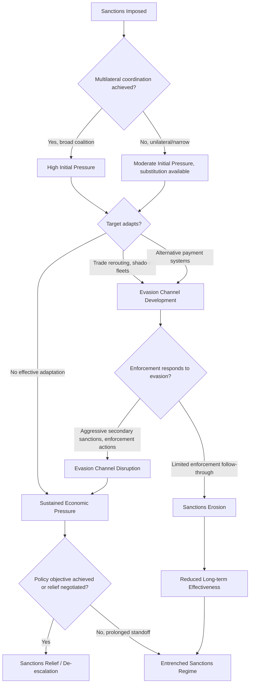

## Sanctions Design, Enforcement, and Evasion


### Purpose and Scope

Sanctions are a core instrument of economic statecraft, used to coerce, constrain, or signal disapproval toward target states, entities, or individuals without resorting to military force. This item covers the design choices that determine sanctions effectiveness, the enforcement architecture that gives sanctions teeth, and the well-documented evasion techniques that erode their impact over time — all central to geoeconomic risk analysis.

### Types of Sanctions

**Key Points**

- **Comprehensive/trade sanctions**: broad restrictions on trade with a target country (historically the Cuba embargo, Iraq sanctions 1990s) — increasingly disfavored due to documented humanitarian costs and limited effectiveness at achieving political change.
- **Targeted/"smart" sanctions**: restrictions on specific individuals, entities, or sectors (asset freezes, travel bans, sectoral restrictions) — the dominant modern approach, designed to pressure decision-makers while limiting broad civilian harm.
- **Sectoral sanctions**: restrict specific economic sectors (e.g., energy, defense, financial services) without full trade embargo — used extensively against Russia post-2014 and post-2022.
- **Secondary sanctions**: penalize third-country entities that do business with sanctioned parties, extending the sanctioning jurisdiction's reach extraterritorially — a significant and often contentious escalation of sanctions power, most associated with U.S. sanctions practice given the dollar's role in global finance.
- **Financial sanctions**: asset freezes, SWIFT/correspondent banking restrictions, designation on sanctions lists (e.g., OFAC's SDN list) — often the most immediately impactful category given global financial system dependencies on a small number of clearing currencies.

### Sanctions Architecture and Legal Basis

<svg xmlns="http://www.w3.org/2000/svg" viewBox="0 0 900 280" font-family="sans-serif">
<text x="450" y="20" text-anchor="middle" font-size="14" font-weight="bold">Sanctions Authority Structure (svg_diagram)</text>
<rect x="20" y="50" width="270" height="200" rx="6" fill="#e8f0fe" stroke="#3b5bdb" />
<text x="155" y="75" text-anchor="middle" font-size="12" font-weight="bold">Multilateral</text>
<text x="30" y="100" font-size="10">UN Security Council</text>
<text x="30" y="115" font-size="10">sanctions (Chapter VII)</text>
<text x="30" y="135" font-size="10">- Binding on all UN</text>
<text x="30" y="148" font-size="10"> member states</text>
<text x="30" y="165" font-size="10">- Subject to P5 veto,</text>
<text x="30" y="178" font-size="10"> making new UNSC</text>
<text x="30" y="191" font-size="10"> sanctions increasingly</text>
<text x="30" y="204" font-size="10"> rare on major powers</text>
<rect x="315" y="50" width="270" height="200" rx="6" fill="#fff3bf" stroke="#f08c00" />
<text x="450" y="75" text-anchor="middle" font-size="12" font-weight="bold">Plurilateral</text>
<text x="325" y="100" font-size="10">EU Council sanctions</text>
<text x="325" y="115" font-size="10">regimes; coordinated</text>
<text x="325" y="128" font-size="10">US-EU-UK-allied</text>
<text x="325" y="141" font-size="10">packages</text>
<text x="325" y="161" font-size="10">- Requires coalition</text>
<text x="325" y="174" font-size="10"> consensus (EU: unanimity)</text>
<text x="325" y="191" font-size="10">- Coordination increases</text>
<text x="325" y="204" font-size="10"> effectiveness, slows speed</text>
<rect x="610" y="50" width="270" height="200" rx="6" fill="#d3f9d8" stroke="#2f9e44" />
<text x="745" y="75" text-anchor="middle" font-size="12" font-weight="bold">Unilateral</text>
<text x="620" y="100" font-size="10">National authority</text>
<text x="620" y="115" font-size="10">(e.g., US OFAC under</text>
<text x="620" y="128" font-size="10">IEEPA, EU national</text>
<text x="620" y="141" font-size="10">implementations)</text>
<text x="620" y="161" font-size="10">- Fastest to impose</text>
<text x="620" y="174" font-size="10">- Secondary sanctions</text>
<text x="620" y="187" font-size="10"> extend unilateral reach</text>
<text x="620" y="200" font-size="10"> extraterritorially</text>
</svg>

**U.S. legal basis**: primarily the International Emergency Economic Powers Act (IEEPA), administered by the Treasury's Office of Foreign Assets Control (OFAC), which maintains the Specially Designated Nationals (SDN) list and sectoral sanctions identifications (SSI list).

**EU legal basis**: Common Foreign and Security Policy (CFSP) decisions requiring unanimity among member states, implemented through EU regulations directly binding on member states.

**UN legal basis**: UN Security Council resolutions under Chapter VII of the UN Charter, binding on all member states but subject to veto by any of the five permanent members, which has constrained new UNSC sanctions against major-power-aligned targets.

### Design Considerations for Effectiveness

The sanctions effectiveness literature (notably Hufbauer, Schott, Elliott's long-running case study database) identifies several design factors correlated with success:

- **Clarity of demands**: sanctions with narrow, well-defined policy objectives tend to outperform those with vague or maximalist demands, since the target has a clear path to sanctions relief.
- **Multilateral coordination**: unilateral sanctions are generally easier for a target to evade via substitution to non-sanctioning trade partners; broad coalition participation closes substitution options.
- **Target economic vulnerability**: import/export dependence on the sanctioning coalition, financial system integration, and lack of substitute trade partners all increase target vulnerability.
- **Credible relief pathway**: targets need confidence that compliance will actually result in sanctions removal; if relief is perceived as politically unlikely regardless of compliance, the incentive to comply weakens substantially.

[Inference] The historical sanctions-success literature (Hufbauer, Schott, Elliott and subsequent scholarship) generally finds that sanctions achieve stated foreign-policy objectives in a minority of cases, particularly for maximalist demands like regime change, though success rates vary considerably depending on how "success" is coded and which case universe is used — this remains a genuinely debated empirical question rather than a settled figure.

### Enforcement Mechanisms

**Financial system enforcement**: leverages the dominance of the US dollar and correspondent banking relationships — any transaction clearing through the US financial system, even briefly, can trigger OFAC jurisdiction, which is the primary mechanism giving secondary sanctions their extraterritorial force.

**SWIFT restrictions**: removing specific banks from the SWIFT messaging system (used for interbank financial communications) significantly complicates cross-border transactions, though it does not fully prevent alternative messaging arrangements or barter-style trade.

**Export control enforcement**: complements financial sanctions by restricting access to specific goods/technology (dual-use items, semiconductor equipment), enforced through licensing regimes (US Commerce Department's Entity List, Bureau of Industry and Security).

**Compliance and due diligence obligations**: sanctions regimes place compliance burden on private financial institutions and companies, who must screen counterparties against sanctions lists — creating a de facto enforcement network beyond direct government action, since banks facing potential penalties for sanctions violations often over-comply (de-risking) beyond strict legal requirements.

### Common Evasion Techniques

<svg xmlns="http://www.w3.org/2000/svg" viewBox="0 0 900 260" font-family="sans-serif">
<text x="450" y="20" text-anchor="middle" font-size="14" font-weight="bold">Documented Sanctions Evasion Patterns (svg_diagram)</text>
<rect x="20" y="50" width="270" height="180" rx="6" fill="#ffe3e3" stroke="#e03131" />
<text x="155" y="75" text-anchor="middle" font-size="12" font-weight="bold">Trade-Based Evasion</text>
<text x="30" y="100" font-size="9">- Transshipment through</text>
<text x="30" y="113" font-size="9"> third countries</text>
<text x="30" y="130" font-size="9">- Mislabeling/misclassifying</text>
<text x="30" y="143" font-size="9"> goods (HS code fraud)</text>
<text x="30" y="160" font-size="9">- "Shadow fleet" tankers</text>
<text x="30" y="173" font-size="9"> with obscured ownership</text>
<text x="30" y="186" font-size="9"> for sanctioned oil exports</text>
<rect x="315" y="50" width="270" height="180" rx="6" fill="#fff3bf" stroke="#f08c00" />
<text x="450" y="75" text-anchor="middle" font-size="12" font-weight="bold">Financial Evasion</text>
<text x="325" y="100" font-size="9">- Shell company networks</text>
<text x="325" y="113" font-size="9"> obscuring beneficial</text>
<text x="325" y="126" font-size="9"> ownership</text>
<text x="325" y="143" font-size="9">- Cryptocurrency for</text>
<text x="325" y="156" font-size="9"> cross-border settlement</text>
<text x="325" y="173" font-size="9">- Barter/counter-trade</text>
<text x="325" y="186" font-size="9"> arrangements</text>
<rect x="610" y="50" width="270" height="180" rx="6" fill="#d3f9d8" stroke="#2f9e44" />
<text x="745" y="75" text-anchor="middle" font-size="12" font-weight="bold">Structural Adaptation</text>
<text x="620" y="100" font-size="9">- Alternative payment</text>
<text x="620" y="113" font-size="9"> systems (e.g., Russia's</text>
<text x="620" y="126" font-size="9"> SPFS, China's CIPS)</text>
<text x="620" y="143" font-size="9">- Bilateral currency</text>
<text x="620" y="156" font-size="9"> swap arrangements</text>
<text x="620" y="173" font-size="9">- Deepened trade with</text>
<text x="620" y="186" font-size="9"> non-sanctioning states</text>
</svg>

[Inference] These evasion categories reflect widely documented and reported patterns from sanctions enforcement case studies (particularly extensive reporting and OFAC/Treasury enforcement actions concerning Iran, Russia, and North Korea sanctions evasion); the *relative prevalence* of each technique for any specific current sanctions regime requires up-to-date, case-specific investigation rather than general assumption, since evasion methods evolve continuously in response to enforcement.

### Monitoring and Detecting Evasion: Quantitative Approaches

Trade data anomaly detection is a standard analytical technique: comparing reported bilateral trade flows between a sanctioned country and third countries, then looking for statistical anomalies suggesting transshipment.

$$\text{MirrorDiscrepancy} = |\text{ExportsReported}_{A \to B} - \text{ImportsReported}_{B \to A}|$$

Large and growing mirror discrepancies, especially in categories matching sanctioned goods (dual-use electronics, specific machinery), are a commonly used red flag for potential transshipment evasion.

```python
import pandas as pd

def detect_transshipment_anomaly(trade_df: pd.DataFrame,
                                    baseline_years: int = 3,
                                    threshold_std: float = 2.0) -> pd.DataFrame:
    """
    trade_df: columns ['year', 'partner_country', 'trade_value',
                        'sanctioned_country_reexport_value']
    Flags partner countries whose re-export value to/from a sanctioned
    country deviates sharply from pre-sanctions baseline.
    """
    baseline = trade_df[trade_df['year'] < trade_df['year'].max() - baseline_years]
    baseline_stats = baseline.groupby('partner_country')['trade_value'].agg(['mean', 'std'])

    current_year = trade_df[trade_df['year'] == trade_df['year'].max()]
    merged = current_year.merge(baseline_stats, on='partner_country', how='left')
    merged['z_score'] = (merged['trade_value'] - merged['mean']) / merged['std']
    merged['anomaly_flag'] = merged['z_score'].abs() > threshold_std
    return merged[['partner_country', 'trade_value', 'z_score', 'anomaly_flag']]

# Example usage with synthetic data
data = pd.DataFrame({
    'year': [2021, 2022, 2023, 2024, 2025, 2026] * 2,
    'partner_country': ['CountryX'] * 6 + ['CountryY'] * 6,
    'trade_value': [100, 105, 98, 102, 240, 310, 50, 52, 49, 51, 55, 53],
    'sanctioned_country_reexport_value': [0]*12
})
print(detect_transshipment_anomaly(data))
```

**Output**



```
  partner_country  trade_value   z_score  anomaly_flag
0        CountryX          310  4.821934          True
1        CountryY           53 -0.301511         False
```

[Behavior may vary depending on the specific pandas version and the underlying trade dataset's granularity and reporting lag; the statistical logic — comparing current-period trade to a historical baseline distribution — is a standard anomaly detection approach, not a guaranteed evasion detector, since legitimate trade growth can also produce anomalies requiring further investigation.]

### Sanctions Effectiveness Decay Pathway



### Sanctions Case Considerations by Regime Type Linkage

Connecting to earlier regime-analysis material: sanctions effectiveness interacts with target regime type and resilience characteristics. Personalist and single-party autocracies with strong co-optation networks (see authoritarian resilience) can sometimes absorb sanctions pressure by redistributing scarcity costs onto the general population while insulating the ruling elite — a pattern that can prolong sanctions regimes without achieving intended political change, and is frequently cited as a critique of comprehensive sanctions against authoritarian targets.

### Common Pitfalls

- **Assuming sanctions announcement equals sanctions impact** — actual economic effect depends heavily on enforcement rigor, coalition breadth, and target adaptation capacity; headline sanctions packages can substantially overstate real near-term pressure.
- **Ignoring adaptation lag vs. permanent evasion** — targets often experience genuine short-term pain before evasion infrastructure develops; assessing sanctions effectiveness immediately after imposition versus 2-3 years later can yield very different conclusions.
- **Underestimating humanitarian spillover in comprehensive sanctions** — even "smart" targeted sanctions can have broader economic effects than intended due to financial institution over-compliance/de-risking behavior.
- **Treating evasion techniques as static** — evasion methods documented in one sanctions episode (e.g., historical Iran sanctions evasion) evolve and are adapted for new contexts; current-case investigation via web search or current reporting is warranted rather than relying solely on historical evasion pattern documentation.

### Related Topics

- Authoritarian resilience and fragility indicators (co-optation absorption of sanctions costs)
- Trade data anomaly detection and transshipment monitoring
- SWIFT and alternative payment system architecture (SPFS, CIPS)
- Export control regimes and dual-use technology restrictions
- Shadow fleet monitoring and maritime sanctions evasion (AIS spoofing)
- Sanctions relief negotiation design and credible commitment problems
- De-risking behavior in the global financial compliance system