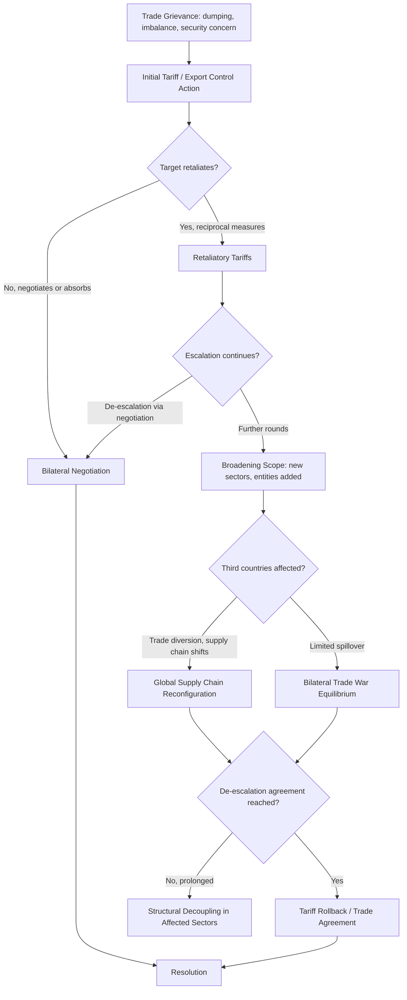

## Trade Wars, Tariffs, and Export Controls


### Purpose and Scope

Trade wars, tariff policy, and export controls constitute a distinct category of economic statecraft from sanctions — while sanctions typically target specific bad actors or behaviors, tariffs and export controls are more often used to reshape structural economic relationships, protect strategic industries, or restrict a rival's access to critical technology. This item covers the mechanics, strategic logic, and risk-analytical frameworks for assessing trade conflict escalation and its geopolitical spillover effects.

### Distinguishing Trade Wars, Tariffs, and Export Controls

**Key Points**

- **Tariffs**: taxes imposed on imported goods, used for revenue, protecting domestic industry, or as retaliatory/coercive leverage in a trade dispute. Distinct from sanctions in that tariffs are generally WTO-permissible tools (subject to WTO rules) rather than punitive measures outside normal trade law.
- **Trade war**: a sustained cycle of escalating retaliatory tariffs (or other trade barriers) between two or more parties, often beginning with a specific grievance and expanding in scope as each side retaliates.
- **Export controls**: restrictions on the export of specific goods, technology, or software, typically justified on national security grounds (dual-use technology, military applications) rather than general trade protection — increasingly central to great-power technology competition, particularly around semiconductors and AI-relevant hardware.
- **Non-tariff barriers**: quotas, licensing requirements, technical/regulatory standards, and customs procedures that restrict trade without formal tariffs — often harder to monitor and quantify than tariff rates but can be equally trade-restrictive.

### Strategic Logic and Historical Patterns

<svg xmlns="http://www.w3.org/2000/svg" viewBox="0 0 900 280" font-family="sans-serif">
<text x="450" y="20" text-anchor="middle" font-size="14" font-weight="bold">Trade Conflict Escalation Drivers (svg_diagram)</text>
<rect x="20" y="50" width="270" height="200" rx="6" fill="#e8f0fe" stroke="#3b5bdb" />
<text x="155" y="75" text-anchor="middle" font-size="12" font-weight="bold">Economic Rationales</text>
<text x="30" y="100" font-size="9">- Protect domestic industry</text>
<text x="30" y="113" font-size="9"> from import competition</text>
<text x="30" y="130" font-size="9">- Correct perceived trade</text>
<text x="30" y="143" font-size="9"> imbalances</text>
<text x="30" y="160" font-size="9">- Counter alleged dumping</text>
<text x="30" y="173" font-size="9"> or subsidy practices</text>
<text x="30" y="190" font-size="9">- Reshoring / supply chain</text>
<text x="30" y="203" font-size="9"> resilience goals</text>
<rect x="315" y="50" width="270" height="200" rx="6" fill="#fff3bf" stroke="#f08c00" />
<text x="450" y="75" text-anchor="middle" font-size="12" font-weight="bold">Security Rationales</text>
<text x="325" y="100" font-size="9">- Prevent technology</text>
<text x="325" y="113" font-size="9"> transfer to rival powers</text>
<text x="325" y="130" font-size="9">- Reduce dependence on</text>
<text x="325" y="143" font-size="9"> strategic rivals for</text>
<text x="325" y="156" font-size="9"> critical inputs</text>
<text x="325" y="173" font-size="9">- Protect defense-relevant</text>
<text x="325" y="186" font-size="9"> industrial base</text>
<rect x="610" y="50" width="270" height="200" rx="6" fill="#d3f9d8" stroke="#2f9e44" />
<text x="745" y="75" text-anchor="middle" font-size="12" font-weight="bold">Political Rationales</text>
<text x="620" y="100" font-size="9">- Domestic political</text>
<text x="620" y="113" font-size="9"> signaling to constituents</text>
<text x="620" y="130" font-size="9">- Retaliation/reciprocity</text>
<text x="620" y="143" font-size="9"> norms in bilateral</text>
<text x="620" y="156" font-size="9"> relations</text>
<text x="620" y="173" font-size="9">- Negotiating leverage for</text>
<text x="620" y="186" font-size="9"> broader agreements</text>
</svg>

[Inference] These three rationale categories (economic, security, political) commonly overlap in practice — a specific tariff or export control action is frequently justified using multiple rationales simultaneously, and analysts should not assume a stated rationale (e.g., "national security") fully captures the underlying strategic motivation, since security justifications can also serve protectionist economic interests.

### Export Controls: Structural Mechanics

Export controls typically operate through several complementary legal mechanisms (illustrated using the well-documented US system as a reference architecture, since it is among the most extensively used globally):

- **Commerce Control List (CCL)**: catalogs specific items requiring an export license based on technical parameters (e.g., semiconductor manufacturing equipment above certain performance thresholds)
- **Entity List**: designates specific foreign companies/organizations subject to licensing requirements or presumption of denial for exports, administered by the Bureau of Industry and Security (BIS)
- **Foreign Direct Product Rule (FDPR)**: extends export control jurisdiction extraterritorially to foreign-made products that incorporate US-origin technology or were produced using US-origin tools/software above a specified threshold — a key mechanism giving US export controls global reach even over non-US manufacturers
- **End-use and end-user controls**: restrict export based on the stated or suspected end use (military applications) or end user (military end-users) regardless of the item's general classification

[Inference] The Foreign Direct Product Rule's extraterritorial reach has been characterized in policy analysis and reporting as a significant point of friction with allied and rival trading partners alike, since it can require foreign companies with no direct US operations to comply with US licensing decisions — the current scope and enforcement intensity of specific FDPR applications should be verified against current BIS regulations given how frequently this area is updated.

### Quantifying Trade War Impact

Standard economic analysis of tariff impact uses partial equilibrium trade models estimating deadweight loss and trade diversion:

$$\Delta W = -\frac{1}{2} t^2 \cdot \frac{dQ}{dP} \cdot P$$

where $\Delta W$ approximates deadweight welfare loss from a tariff of rate $t$, given the price elasticity of import demand $\frac{dQ}{dP}$ — this is a simplified partial-equilibrium approximation; full general equilibrium trade models (commonly using GTAP or similar computable general equilibrium frameworks) are used for comprehensive multi-sector, multi-country impact estimation in applied trade policy analysis.

**Trade diversion effect**: tariffs on one trading partner often shift import demand to non-tariffed third countries rather than purely to domestic substitutes — a well-documented empirical pattern in trade war episodes, meaning tariff effectiveness at achieving stated reshoring/domestic-production goals is frequently partial, with meaningful diversion to alternative low-cost producers.

```python
def tariff_impact_estimate(pre_tariff_price: float, tariff_rate: float,
                             import_elasticity: float, import_volume: float) -> dict:
    """
    Simplified partial-equilibrium tariff impact estimate.
    Real trade policy analysis uses full CGE models (e.g., GTAP);
    this is an illustrative first-order approximation only.
    """
    price_increase = pre_tariff_price * tariff_rate
    new_price = pre_tariff_price + price_increase
    volume_change_pct = -import_elasticity * tariff_rate
    new_volume = import_volume * (1 + volume_change_pct)
    tariff_revenue = tariff_rate * pre_tariff_price * new_volume
    deadweight_loss_approx = 0.5 * tariff_rate**2 * abs(import_elasticity) * pre_tariff_price * import_volume

    return {
        "new_price": round(new_price, 2),
        "volume_change_pct": round(volume_change_pct * 100, 2),
        "new_import_volume": round(new_volume, 2),
        "tariff_revenue": round(tariff_revenue, 2),
        "deadweight_loss_approx": round(deadweight_loss_approx, 2)
    }

# Example: 25% tariff on a good with elasticity -1.5, base price $100, volume 10000 units
result = tariff_impact_estimate(pre_tariff_price=100, tariff_rate=0.25,
                                   import_elasticity=1.5, import_volume=10000)
print(result)
```

**Output**



```
{'new_price': 125.0, 'volume_change_pct': -37.5, 'new_import_volume': 6250.0, 'tariff_revenue': 156250.0, 'deadweight_loss_approx': 46875.0}
```

[Behavior may vary depending on the specific elasticity assumptions used; this is a simplified partial-equilibrium teaching model, not a substitute for full computable general equilibrium analysis used in professional trade policy assessment. Real-world tariff pass-through is frequently incomplete and empirically estimated rather than assumed at 100%.]

### Trade War Escalation Ladder



### Supply Chain and Third-Country Effects

Trade wars between major economies generate substantial spillover effects on non-participant countries, a key geoeconomic risk dimension:

- **Trade diversion beneficiaries**: countries with comparative advantage in affected sectors can capture displaced trade volume (frequently cited pattern from major bilateral trade tensions: manufacturing relocation to alternative low-cost production hubs)
- **"Connector" country risk**: countries serving as re-export or final-assembly points for goods ultimately destined for a tariffed market face scrutiny over rules-of-origin compliance and potential secondary tariff exposure if used as a circumvention channel
- **Global value chain restructuring**: firms respond to sustained trade war risk by diversifying supplier bases ("China+1" strategies and similar diversification patterns), a structural shift with multi-year implementation timelines that persists even if the immediate tariff dispute resolves

[Inference] The magnitude and durability of supply chain reconfiguration in response to any specific ongoing trade tension is an evolving empirical question best assessed via current trade flow data and corporate disclosure/reporting rather than assumed from historical episodes, since firm-level adaptation speed and government policy responses continue to change.

### Interaction With Sanctions and Broader Geoeconomic Toolkit

Trade wars and export controls increasingly overlap with sanctions-style tools in great-power competition, particularly regarding critical technology (semiconductors, AI-relevant hardware, critical minerals). The distinction between "trade policy" and "economic security policy" has become less clear in recent years, with export controls in particular taking on some sanctions-like characteristics (entity-specific targeting, extraterritorial reach via FDPR) while remaining formally distinct from sanctions regimes in legal basis and administering agency.

### Common Pitfalls

- **Treating tariff rate changes as the complete risk picture** — non-tariff barriers, export controls, and regulatory friction can materially affect trade flows independent of headline tariff rates, and a risk analysis focused solely on tariff schedules can miss substantial restriction.
- **Assuming full tariff pass-through to consumer prices** — empirical pass-through rates vary by market structure, exchange rate movements, and exporter margin absorption; assuming 100% pass-through (as in simplified models) can overstate consumer price impact and understate exporter/importer margin effects.
- **Ignoring retaliation asymmetry** — trading partners with different economic structures (e.g., commodity exporters vs. manufactured goods exporters) have different retaliation options and vulnerabilities; symmetric escalation assumptions can misjudge actual negotiating leverage.
- **Underestimating extraterritorial export control reach** — assuming export controls only affect direct trade with the restricting country misses mechanisms like the Foreign Direct Product Rule, which can affect third-country manufacturers with no direct trade relationship to the restricting jurisdiction.

### Related Topics

- Sanctions design, enforcement, and evasion (overlapping toolkit, distinct legal basis)
- Semiconductor and critical technology export control regimes
- Global value chain reconfiguration and "friend-shoring" strategies
- WTO dispute settlement mechanisms and trade law constraints
- Critical minerals dependency and supply chain security risk
- Computable general equilibrium (CGE) modeling for trade policy analysis
- Currency and exchange rate effects of sustained trade conflict