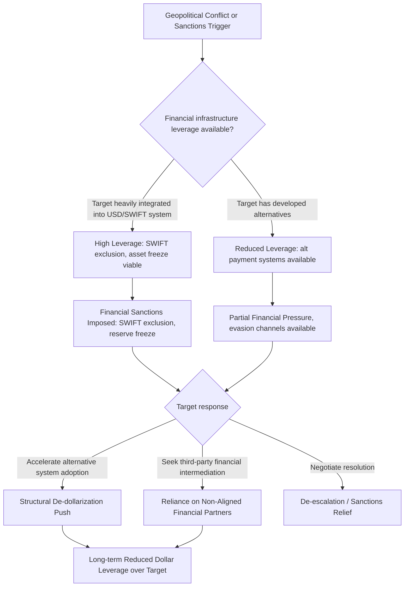

## Currency and Financial Warfare


### Purpose and Scope

Currency and financial warfare encompasses the deliberate use of monetary policy, currency manipulation, and financial system leverage as instruments of state power — distinct from sanctions (which target specific actors) and trade policy (which targets goods flows). This item covers the mechanisms by which currencies and financial infrastructure become tools and targets of geopolitical competition, including reserve currency dynamics, currency manipulation, financial system weaponization, and de-dollarization trends.

### Core Concepts and Distinctions

**Key Points**

- **Currency manipulation**: deliberate government action to influence exchange rates for competitive advantage (e.g., suppressing currency value to boost export competitiveness), distinct from ordinary monetary policy conducted for domestic economic stabilization purposes.
- **Financial system weaponization**: leveraging control over critical financial infrastructure (reserve currencies, payment systems, correspondent banking) to project power, most visible in the sanctions-enforcement context (covered separately) but with standalone strategic dimensions.
- **Reserve currency dynamics**: the structural power derived from a currency's role as the dominant medium for international trade invoicing, reserve holdings, and financial system clearing — currently dominated by the US dollar, a status sometimes termed "exorbitant privilege."
- **De-dollarization**: deliberate efforts by states to reduce dependence on the US dollar in trade settlement, reserve holdings, and financial infrastructure, motivated by both diversification prudence and explicit geopolitical hedging against dollar-based financial leverage.

### The Dollar's Structural Role in Financial Statecraft

<svg xmlns="http://www.w3.org/2000/svg" viewBox="0 0 900 300" font-family="sans-serif">
<text x="450" y="20" text-anchor="middle" font-size="14" font-weight="bold">Dollar Dominance and Financial Leverage Channels (svg_diagram)</text>
<rect x="20" y="50" width="270" height="220" rx="6" fill="#e8f0fe" stroke="#3b5bdb" />
<text x="155" y="75" text-anchor="middle" font-size="12" font-weight="bold">Reserve Currency Status</text>
<text x="30" y="100" font-size="9">- Majority of global FX</text>
<text x="30" y="113" font-size="9"> reserves held in USD</text>
<text x="30" y="130" font-size="9">- Most commodities</text>
<text x="30" y="143" font-size="9"> (oil, key minerals)</text>
<text x="30" y="156" font-size="9"> priced/traded in USD</text>
<text x="30" y="173" font-size="9">- US Treasury market</text>
<text x="30" y="186" font-size="9"> as global "safe asset"</text>
<text x="30" y="199" font-size="9"> benchmark</text>
<rect x="315" y="50" width="270" height="220" rx="6" fill="#fff3bf" stroke="#f08c00" />
<text x="450" y="75" text-anchor="middle" font-size="12" font-weight="bold">Payment Infrastructure</text>
<text x="325" y="100" font-size="9">- SWIFT messaging</text>
<text x="325" y="113" font-size="9"> system (Belgium-based,</text>
<text x="325" y="126" font-size="9"> globally dominant)</text>
<text x="325" y="143" font-size="9">- USD correspondent</text>
<text x="325" y="156" font-size="9"> banking network</text>
<text x="325" y="173" font-size="9">- CHIPS/Fedwire USD</text>
<text x="325" y="186" font-size="9"> clearing systems</text>
<rect x="610" y="50" width="270" height="220" rx="6" fill="#d3f9d8" stroke="#2f9e44" />
<text x="745" y="75" text-anchor="middle" font-size="12" font-weight="bold">Resulting Leverage</text>
<text x="620" y="100" font-size="9">- Extraterritorial reach</text>
<text x="620" y="113" font-size="9"> of US financial</text>
<text x="620" y="126" font-size="9"> sanctions (secondary</text>
<text x="620" y="139" font-size="9"> sanctions enforcement)</text>
<text x="620" y="156" font-size="9">- Asset freeze capability</text>
<text x="620" y="169" font-size="9"> over dollar-denominated</text>
<text x="620" y="182" font-size="9"> reserves</text>
<text x="620" y="199" font-size="9">- Monetary policy</text>
<text x="620" y="212" font-size="9"> spillover to dollar-</text>
<text x="620" y="225" font-size="9"> linked economies</text>
</svg>

[Inference] The structural dominance of the US dollar in global reserves, trade invoicing, and payment clearing is extensively documented in IMF COFER data and BIS reporting, though exact percentage figures shift year to year and should be checked against current IMF/BIS data for precise current values rather than assumed static; the broad structural pattern of dollar dominance, however, has been durable across recent decades.

### Currency Manipulation: Mechanisms and Detection

**Mechanisms of manipulation**:

- Central bank foreign exchange market intervention (buying/selling foreign currency to influence own currency's value)
- Capital controls restricting currency convertibility to manage exchange rate pressure
- Managed/pegged exchange rate regimes maintained below market-clearing levels to boost export competitiveness

**Detection frameworks**: the US Treasury Department publishes semi-annual reports assessing major trading partners against statutory currency manipulation criteria, historically including:

- Significant bilateral trade surplus with the reporting country
- Material current account surplus
- Persistent, one-sided FX intervention

[Inference] These specific criteria and their precise thresholds have been subject to periodic legislative and administrative revision, so an analyst should verify current Treasury Department methodology via its most recent published report rather than assuming static criteria, given this is an area of active policy evolution.

### Financial System Weaponization Case Patterns

Financial infrastructure control has been used as a coercive tool in several well-documented modern episodes:

- **SWIFT exclusion**: removing specific banks from SWIFT messaging significantly complicates cross-border settlement, used against Iran (2012, 2018) and against major Russian banks (2022) as part of broader sanctions packages.
- **Central bank reserve asset freezes**: freezing a foreign central bank's dollar/euro-denominated reserve assets held abroad — a significant escalation demonstrated at scale following Russia's 2022 invasion of Ukraine, when a substantial portion of the Russian central bank's foreign reserves were frozen by Western jurisdictions.
- **Correspondent banking de-risking**: private banks withdrawing correspondent relationships from jurisdictions perceived as high sanctions-compliance risk, sometimes producing broader financial exclusion effects than the specific targeted sanctions require.

[Inference] The 2022 Russian central bank reserve freeze is widely characterized in policy and financial-press analysis as a significant precedent that has accelerated other states' interest in reserve diversification away from dollar/euro-denominated assets, though the magnitude and pace of resulting diversification behavior by other central banks is an ongoing empirical question requiring current data (IMF COFER reserve composition reporting) rather than assumption.

### De-Dollarization Trends and Mechanisms

States pursuing reduced dollar dependence employ several parallel strategies:

- **Alternative payment messaging systems**: Russia's SPFS (System for Transfer of Financial Messages) and China's CIPS (Cross-Border Interbank Payment System) as SWIFT alternatives, though both currently process substantially smaller transaction volumes than SWIFT.
- **Bilateral local-currency trade settlement**: agreements to settle bilateral trade in the parties' own currencies rather than dollars, reducing dollar transaction exposure for that trade relationship specifically.
- **Reserve diversification**: central banks increasing gold and non-dollar currency reserve holdings, a trend some analysts link to geopolitical hedging behavior following the 2022 reserve freeze precedent.
- **Digital currency initiatives**: central bank digital currencies (CBDCs) and cross-border digital payment pilot projects explored partly with an eye toward reducing dependence on dollar-clearing infrastructure.

[Inference] While de-dollarization is a widely discussed trend in current geopolitical and financial analysis, credible assessments generally note the dollar's continued dominance in reserves, trade invoicing, and financial market depth remains structurally difficult to displace in the near term given network effects and the absence of an equivalently deep and liquid alternative reserve asset market — the pace and ultimate trajectory of de-dollarization is a genuinely contested and evolving empirical question best tracked via current IMF/BIS data rather than treated as a settled trend with a predictable endpoint.

### Quantitative Monitoring Framework

A practical monitoring approach tracks several proxy indicators over time:

$$\text{DeDollarizationIndex}_t = w_1 \cdot (1 - \text{USDReserveShare}_t) + w_2 \cdot \text{LocalCurrencyTradeShare}_t + w_3 \cdot \text{AltPaymentVolumeShare}_t$$

where each component is tracked using IMF COFER (Currency Composition of Official Foreign Exchange Reserves) data, bilateral trade settlement currency reporting, and CIPS/SPFS transaction volume disclosures respectively.

```python
def de_dollarization_index(usd_reserve_share: float,
                             local_currency_trade_share: float,
                             alt_payment_volume_share: float,
                             weights: tuple = (0.4, 0.3, 0.3)) -> float:
    """
    All inputs normalized 0-1 (as proportions).
    Higher output indicates greater diversification away from
    dollar-centric reserve and payment infrastructure.
    """
    w1, w2, w3 = weights
    assert abs(sum(weights) - 1.0) < 1e-6, "Weights must sum to 1"
    return round(w1 * (1 - usd_reserve_share) + w2 * local_currency_trade_share +
                 w3 * alt_payment_volume_share, 3)

# Example: illustrative inputs, NOT current actual IMF COFER figures —
# analysts should substitute current published data for real assessment
print(de_dollarization_index(usd_reserve_share=0.58,
                                local_currency_trade_share=0.15,
                                alt_payment_volume_share=0.05))
```

**Output**



```
0.24
```

[Behavior may vary depending on the specific input data used; the 0.58 USD reserve share figure in this example is illustrative for teaching the calculation structure and should be replaced with current IMF COFER data for actual analysis, as this figure changes over time and is reported quarterly.]

### Financial Coercion Escalation Pathway



### Interaction With Other Geoeconomic Tools

Currency and financial warfare frequently operates as the enforcement backbone for sanctions (covered separately) — the ability to freeze assets or exclude from SWIFT is what gives targeted financial sanctions their coercive force. It also interacts with trade war dynamics, since currency valuation affects export competitiveness and can itself become a point of trade dispute (accusations of competitive devaluation). Analysts should treat currency/financial tools as an integrated layer within the broader economic statecraft toolkit rather than a fully separate category.

### Common Pitfalls

- **Treating reserve currency dominance as static** — while dollar dominance has been durable, network effects can shift gradually, and analysts should track trend data (IMF COFER) rather than assume permanence or assume rapid displacement, since both extremes are commonly overstated in public discourse.
- **Conflating de-dollarization rhetoric with de-dollarization data** — political statements of intent to reduce dollar dependence are common; actual measurable shifts in reserve composition and trade settlement currency are the relevant evidence and often lag rhetoric substantially.
- **Underestimating alternative payment system capacity growth** — while CIPS and SPFS currently process much smaller volumes than SWIFT, capacity and adoption can change over a period of a few years, particularly under sustained sanctions pressure incentivizing alternative infrastructure investment; current transaction volume data should be checked rather than relied upon from older reporting.
- **Ignoring the asymmetric cost of financial exclusion** — being excluded from dollar-clearing infrastructure imposes substantially different costs depending on a country's existing trade structure and commodity export profile; a one-size-fits-all vulnerability assessment across different target economies is likely to be inaccurate.

### Related Topics

- Sanctions design, enforcement, and evasion (financial sanctions as the enforcement layer)
- IMF COFER reserve currency composition data and monitoring
- SWIFT, CIPS, and SPFS payment infrastructure comparison
- Central bank digital currency (CBDC) geopolitical implications
- Sovereign wealth fund and central bank reserve asset risk exposure
- Trade wars, tariffs, and export controls (currency valuation as a trade dispute dimension)
- Capital controls and currency crisis risk indicators