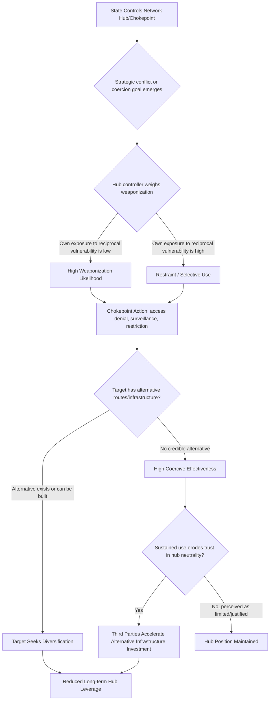

## Weaponized Interdependence and Chokepoint Control


### Purpose and Scope

Weaponized interdependence describes how states leverage centralized positions within global economic and information networks — rather than raw material or military power — to coerce or surveil other actors. This item covers the theoretical framework originated by Farrell and Newman, the categories of network chokepoints states exploit, and how this concept integrates with the sanctions, export control, and financial warfare tools covered elsewhere in this chapter.

### The Weaponized Interdependence Framework

**Key Points**

- The framework, developed by political scientists Henry Farrell and Abraham Newman, argues that global economic networks (financial, informational, physical) are not flat or evenly distributed — they have hub-and-spoke structures where certain nodes (specific financial centers, communication infrastructure, chokepoint geographies) sit at structurally privileged positions.
- States controlling these central nodes gain two distinct forms of power: **panopticon effects** (privileged access to information flowing through the network) and **chokepoint effects** (ability to restrict others' access to the network).
- This differs from classical economic interdependence theory, which generally assumed interdependence produced mutual vulnerability and therefore mutual restraint (the "commercial peace" hypothesis); weaponized interdependence argues structural asymmetry means some states can weaponize network position with comparatively limited exposure to reciprocal vulnerability.

[Inference] The Farrell-Newman "weaponized interdependence" framework (first prominently articulated in a 2019 International Security article) has become an influential lens in international relations and geoeconomics scholarship, but it remains an analytical framework subject to ongoing academic debate and refinement, not an uncontested empirical law — critics have raised questions about how generalizable the hub-exploitation dynamic is outside the specific US-centric financial/technological cases the framework was built around.

### Types of Chokepoints

<svg xmlns="http://www.w3.org/2000/svg" viewBox="0 0 900 320" font-family="sans-serif">
<text x="450" y="20" text-anchor="middle" font-size="14" font-weight="bold">Categories of Network Chokepoints (svg_diagram)</text>
<rect x="20" y="50" width="270" height="240" rx="6" fill="#e8f0fe" stroke="#3b5bdb" />
<text x="155" y="75" text-anchor="middle" font-size="12" font-weight="bold">Financial Chokepoints</text>
<text x="30" y="100" font-size="9">- SWIFT messaging system</text>
<text x="30" y="113" font-size="9">- USD correspondent</text>
<text x="30" y="126" font-size="9"> banking network</text>
<text x="30" y="143" font-size="9">- Dollar clearing (CHIPS/</text>
<text x="30" y="156" font-size="9"> Fedwire)</text>
<text x="30" y="173" font-size="9" font-style="italic">Covered in depth under</text>
<text x="30" y="186" font-size="9" font-style="italic">Currency and Financial</text>
<text x="30" y="199" font-size="9" font-style="italic">Warfare</text>
<rect x="315" y="50" width="270" height="240" rx="6" fill="#fff3bf" stroke="#f08c00" />
<text x="450" y="75" text-anchor="middle" font-size="12" font-weight="bold">Technology Chokepoints</text>
<text x="325" y="100" font-size="9">- Semiconductor</text>
<text x="325" y="113" font-size="9"> manufacturing equipment</text>
<text x="325" y="126" font-size="9"> (EUV lithography)</text>
<text x="325" y="143" font-size="9">- Critical software/EDA</text>
<text x="325" y="156" font-size="9"> tools for chip design</text>
<text x="325" y="173" font-size="9">- Cloud and hyperscale</text>
<text x="325" y="186" font-size="9"> computing infrastructure</text>
<text x="325" y="203" font-size="9">- Undersea internet cables</text>
<rect x="610" y="50" width="270" height="240" rx="6" fill="#d3f9d8" stroke="#2f9e44" />
<text x="745" y="75" text-anchor="middle" font-size="12" font-weight="bold">Physical/Geographic Chokepoints</text>
<text x="620" y="100" font-size="9">- Maritime straits (Strait</text>
<text x="620" y="113" font-size="9"> of Hormuz, Malacca,</text>
<text x="620" y="126" font-size="9"> Bab-el-Mandeb)</text>
<text x="620" y="143" font-size="9">- Canals (Suez, Panama)</text>
<text x="620" y="160" font-size="9">- Critical mineral</text>
<text x="620" y="173" font-size="9"> processing concentration</text>
<text x="620" y="186" font-size="9"> (rare earths refining)</text>
<text x="620" y="203" font-size="9">- Pipeline infrastructure</text>
</svg>

### Panopticon Effects: Information Chokepoints

Beyond restricting flow, hub control enables surveillance of flow — a distinct mechanism from denial-based chokepoint power:

- **Financial messaging surveillance**: hub operators (or states with jurisdiction over them) can potentially observe transaction metadata flowing through their infrastructure, providing intelligence value independent of any restriction action.
- **Telecommunications and internet backbone control**: states hosting major internet exchange points or undersea cable landing stations have structural surveillance advantages over data transiting their infrastructure.
- **Standard-setting body influence**: participation in and influence over international technical standards bodies can shape network architecture in ways that create durable information advantages for standard-setting participants.

[Inference] The panopticon/chokepoint distinction is a core conceptual contribution of the weaponized interdependence framework, but empirically verifying the *actual exercise* of panopticon surveillance capability (as opposed to its theoretical existence) is inherently difficult given the classified or proprietary nature of such activities — much of the public literature on this topic relies on disclosed cases (e.g., historical reporting on financial messaging surveillance programs) rather than comprehensive real-time verification.

### Physical Chokepoint Risk: Maritime and Infrastructure

Geographic chokepoints remain highly relevant despite the framework's origin in digital/financial network analysis:

- **Strait of Hormuz**: transit point for a substantial share of global seaborne oil trade; closure risk is a persistent geopolitical risk scenario tied to Iran-related tensions.
- **Strait of Malacca**: critical Indo-Pacific shipping lane connecting the Indian Ocean and South China Sea, relevant to broader US-China strategic competition given trade volume dependency.
- **Suez and Panama Canals**: canal disruptions (blockage, drought-driven capacity restrictions, security incidents) can generate substantial global shipping cost and delay spillovers, as demonstrated by notable disruption events in recent years.
- **Critical mineral processing concentration**: even where raw mineral extraction is geographically diverse, downstream refining/processing capacity for materials like rare earth elements has historically been geographically concentrated, creating a processing-stage chokepoint distinct from the extraction-stage supply question.

### Technology Chokepoints and the Semiconductor Case

The semiconductor supply chain is frequently cited as a paradigmatic modern weaponized interdependence case: a small number of firms and countries control critical nodes (advanced lithography equipment manufacturing, leading-edge fabrication capacity, chip design software) such that restricting access at any single node can constrain a target's broader technology development regardless of that target's own manufacturing capacity elsewhere in the chain.

[Inference] The semiconductor supply chain's chokepoint characteristics are extensively documented in current policy analysis and reporting given their centrality to ongoing US-China technology competition; specific current export control scope and enforcement details evolve frequently and should be verified via current BIS regulations and reporting rather than treated as static, since this is one of the most actively evolving areas of contemporary economic statecraft.

### Quantifying Chokepoint Dependency Risk

A practical risk framework scores dependency concentration using a Herfindahl-Hirschman-style concentration index applied to supply/infrastructure sources rather than market competitors:

$$\text{HHI}_{\text{chokepoint}} = \sum_{i=1}^{n} s_i^2$$

where $s_i$ is the market/infrastructure share of provider or route $i$ (expressed as a proportion). Higher HHI values indicate greater concentration and therefore greater chokepoint vulnerability if that single provider or route is disrupted or weaponized.

```python
def chokepoint_hhi(shares: list) -> float:
    """
    shares: list of proportions (should sum to ~1.0) representing
    market/route/infrastructure share held by each provider.
    Returns HHI on a 0-1 scale (or multiply by 10000 for
    conventional 0-10000 HHI scale).
    """
    total = sum(shares)
    normalized = [s / total for s in shares]
    return round(sum(s**2 for s in normalized), 4)

def concentration_risk_tier(hhi: float) -> str:
    if hhi < 0.15:
        return "Low concentration risk"
    elif hhi < 0.25:
        return "Moderate concentration risk"
    else:
        return "High concentration risk (chokepoint vulnerability)"

# Example: illustrative shipping route dependency —
# NOT actual current trade volume data, for structure demonstration only
route_shares = [0.65, 0.20, 0.10, 0.05]  # single dominant route + alternatives
hhi = chokepoint_hhi(route_shares)
print(hhi, "-", concentration_risk_tier(hhi))
```

**Output**



```
0.4750 - High concentration risk (chokepoint vulnerability)
```

[Behavior may vary depending on the specific input shares used; the 0.65/0.20/0.10/0.05 split here is illustrative for demonstrating the HHI calculation structure and does not represent actual current trade route volume data, which should be sourced from shipping/trade databases for real analysis.]

### Weaponization Decision Pathway



### Interaction With Other Geoeconomic Concepts in This Chapter

Weaponized interdependence provides the underlying structural theory for why sanctions enforcement (via SWIFT/dollar clearing chokepoints), export controls (via semiconductor equipment and FDPR chokepoints), and financial warfare (via reserve currency and correspondent banking chokepoints) are effective tools at all — each of those instruments operationalizes a specific chokepoint identified in this broader framework. Understanding weaponized interdependence as the connecting theory helps explain why diversification and alternative infrastructure-building (de-dollarization, alternative payment systems, "China+1" supply chain strategies, domestic semiconductor capacity investment) are the common long-term responses to chokepoint exposure across otherwise distinct policy domains.

### Common Pitfalls

- **Treating chokepoint power as permanent or costless to exercise** — repeated weaponization can accelerate target and third-party diversification investment, eroding the hub's long-term structural advantage even if short-term coercive effectiveness is high (a dynamic explicitly incorporated in the framework's own theorizing about reciprocal adaptation).
- **Focusing only on the most visible chokepoint category** — analysts sometimes concentrate exclusively on financial chokepoints (given extensive sanctions-related coverage) while underweighting technology or physical infrastructure chokepoints that may be more relevant to a specific risk question.
- **Ignoring alliance and jurisdictional dimensions** — many chokepoints are controlled not by a single state acting alone but through alliance structures or multinational corporate/regulatory arrangements (e.g., the Netherlands' role in EUV lithography equipment export policy alongside the US), and risk assessment should map the actual decision-making structure rather than assume single-state unilateral control.
- **Underestimating diversification timelines** — building credible alternative infrastructure (domestic semiconductor fabrication, alternative payment systems, new shipping routes) typically requires multi-year investment horizons; short-term risk assessments should not assume rapid diversification will neutralize chokepoint exposure within an unrealistically short window.

### Related Topics

- Sanctions design, enforcement, and evasion (chokepoint-enabled enforcement mechanism)
- Currency and financial warfare (financial chokepoint deep dive)
- Trade wars, tariffs, and export controls (technology chokepoint policy instruments)
- Semiconductor supply chain geopolitics and export control architecture
- Maritime chokepoint security and freedom of navigation risk
- Critical minerals supply chain concentration and processing bottlenecks
- Alliance-based technology and financial governance (multilateral export control regimes)