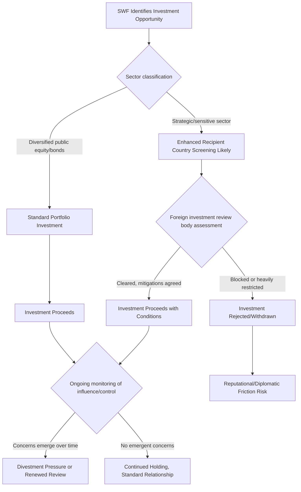

## Sovereign Wealth Funds as Geopolitical Instruments


### Purpose and Scope

Sovereign wealth funds (SWFs) are state-owned investment vehicles that manage national savings, typically derived from commodity export revenues or foreign exchange reserves, for long-term investment purposes. While often framed as purely financial actors, SWFs increasingly function as instruments of geopolitical influence — providing states with tools for strategic investment, economic leverage, and soft power projection that operate through market channels rather than traditional statecraft mechanisms. This item covers SWF typology, the analytical frameworks for assessing their strategic use, and the risk considerations they raise for recipient countries and global markets.

### SWF Typology and Funding Sources

**Key Points**

- **Commodity-based SWFs**: funded by revenue from natural resource exports (oil, gas, minerals), designed to convert finite resource wealth into diversified long-term financial assets and smooth fiscal revenue volatility — the Gulf state funds and Norway's Government Pension Fund Global are the paradigmatic examples.
- **Non-commodity/reserve-based SWFs**: funded from foreign exchange reserves accumulated through trade surpluses or reserve management strategy rather than commodity exports — China's state investment vehicles are the primary example.
- **Development/strategic SWFs**: explicitly mandated to pursue domestic economic development or strategic sector goals rather than pure long-term financial return maximization, blurring the line between sovereign investment and industrial policy.
- **Pension reserve funds**: designed specifically to pre-fund future public pension liabilities, a distinct purpose from general fiscal stabilization or resource wealth management.

### Major SWFs and Strategic Characteristics

<svg xmlns="http://www.w3.org/2000/svg" viewBox="0 0 900 300" font-family="sans-serif">
<text x="450" y="20" text-anchor="middle" font-size="14" font-weight="bold">SWF Landscape by Strategic Orientation (svg_diagram)</text>
<rect x="20" y="50" width="270" height="220" rx="6" fill="#e8f0fe" stroke="#3b5bdb" />
<text x="155" y="75" text-anchor="middle" font-size="12" font-weight="bold">Passive/Diversified</text>
<text x="30" y="100" font-size="9">Norway GPFG</text>
<text x="30" y="118" font-size="9">- Rules-based, highly</text>
<text x="30" y="131" font-size="9"> transparent mandate</text>
<text x="30" y="148" font-size="9">- Broad global equity/</text>
<text x="30" y="161" font-size="9"> bond diversification</text>
<text x="30" y="178" font-size="9">- Explicit ethical/ESG</text>
<text x="30" y="191" font-size="9"> exclusion criteria</text>
<text x="30" y="208" font-size="9">- Minimal direct</text>
<text x="30" y="221" font-size="9"> strategic sector targeting</text>
<rect x="315" y="50" width="270" height="220" rx="6" fill="#fff3bf" stroke="#f08c00" />
<text x="450" y="75" text-anchor="middle" font-size="12" font-weight="bold">Strategic/Influence-Oriented</text>
<text x="325" y="100" font-size="9">Gulf state funds (varies</text>
<text x="325" y="113" font-size="9">by fund and mandate)</text>
<text x="325" y="130" font-size="9">- Domestic economic</text>
<text x="325" y="143" font-size="9"> diversification goals</text>
<text x="325" y="160" font-size="9">- High-profile stakes in</text>
<text x="325" y="173" font-size="9"> technology, sports,</text>
<text x="325" y="186" font-size="9"> entertainment sectors</text>
<text x="325" y="203" font-size="9">- Soft power / prestige</text>
<text x="325" y="216" font-size="9"> investment component</text>
<rect x="610" y="50" width="270" height="220" rx="6" fill="#d3f9d8" stroke="#2f9e44" />
<text x="745" y="75" text-anchor="middle" font-size="12" font-weight="bold">State-Directed/Development</text>
<text x="620" y="100" font-size="9">Chinese state investment</text>
<text x="620" y="113" font-size="9">vehicles (varies by entity)</text>
<text x="620" y="130" font-size="9">- Closer alignment with</text>
<text x="620" y="143" font-size="9"> national industrial</text>
<text x="620" y="156" font-size="9"> policy objectives</text>
<text x="620" y="173" font-size="9">- Strategic sector and</text>
<text x="620" y="186" font-size="9"> technology acquisition</text>
<text x="620" y="203" font-size="9"> focus in some cases</text>
</svg>

[Inference] This three-category framing is a simplified analytical grouping for illustrative purposes; individual funds within each category vary considerably, and some funds combine characteristics across categories or have evolved their strategic orientation over time — specific fund mandates, governance structures, and current investment patterns should be verified against each fund's own disclosures and current independent analysis (e.g., Sovereign Wealth Fund Institute rankings and reporting) rather than assumed from general category placement.

### The Santiago Principles and Governance Transparency

In response to concerns about SWF strategic opacity following a wave of high-profile SWF investments in the mid-2000s, the International Working Group of Sovereign Wealth Funds developed the **Santiago Principles** (2008) — a voluntary framework of 24 generally accepted principles and practices covering legal framework, institutional governance, and investment/risk management, intended to promote transparency and reassure recipient countries that SWF investments are driven by economic and financial objectives rather than pursuit of geopolitical advantage.

**Key Points**

- Santiago Principles compliance is self-assessed and voluntary, with the International Forum of Sovereign Wealth Funds (IFSWF) tracking member adherence rather than external enforcement.
- Compliance and actual transparency vary substantially across funds; some (Norway's GPFG) publish highly detailed holdings and governance disclosures, while others provide limited public reporting on individual investment positions and decision-making processes.
- Adoption of the Principles is generally viewed as a reputational signal intended to reduce recipient-country political/regulatory friction (particularly around national security-sensitive investment screening) rather than a binding legal constraint on fund behavior.

### Geopolitical Use Cases and Analytical Frameworks

**Strategic sector acquisition**: SWF investment in technology, critical infrastructure, ports, and defense-adjacent sectors raises distinct national security screening questions compared to portfolio-diversification investment in liquid public equities — this is the primary driver behind expanded foreign investment screening regimes (e.g., CFIUS in the United States, and similar mechanisms in the EU and other jurisdictions).

**Soft power and prestige investment**: high-visibility investments in sports franchises, entertainment properties, and cultural institutions serve reputational and influence-building functions distinct from pure financial return objectives — a well-documented pattern particularly associated with several Gulf state funds' sports and entertainment sector investments in recent years.

**Crisis-period strategic investment**: SWFs have historically played a countercyclical role during financial crises, providing capital to distressed Western financial institutions (a notable pattern during the 2008 global financial crisis), which can create longer-term equity stakes and influence relationships that persist beyond the crisis period.

**Bilateral relationship leverage**: SWF investment commitments are sometimes explicitly linked to or used as signals within broader bilateral diplomatic and economic relationships, functioning as a form of economic statecraft that operates through ostensibly commercial investment channels.

[Inference] The extent to which any specific SWF investment reflects primarily commercial/financial motivation versus geopolitical strategic intent is frequently genuinely ambiguous and contested in individual cases — funds themselves generally characterize their mandates in financial-return terms, while some outside analysts and recipient-country policymakers interpret specific transactions as having a stronger geopolitical dimension; this is an area where motive attribution requires case-specific evidence rather than general assumption.

### Recipient Country Risk Assessment Framework

Analysts assessing SWF investment risk for a recipient country typically evaluate:

$$\text{SWFRiskScore} = f(\text{SectorSensitivity}, \text{OwnershipConcentration}, \text{HomeStateAlignment}, \text{TransparencyLevel})$$

- **Sector sensitivity**: critical infrastructure, defense-adjacent technology, and data-sensitive sectors carry higher screening priority than diversified public equity holdings.
- **Ownership concentration**: controlling or near-controlling stakes raise different governance/influence concerns than minority passive positions.
- **Home state geopolitical alignment**: the strategic relationship between the recipient country and the SWF's home state shapes both the political sensitivity of the investment and the plausibility of geopolitical motive.
- **Transparency level**: funds with limited public disclosure of decision-making processes and ultimate beneficial control structures generally warrant more intensive due diligence.

```python
def swf_investment_risk_score(sector_sensitivity: float,
                                 ownership_stake: float,
                                 home_state_alignment_risk: float,
                                 transparency_deficit: float,
                                 weights: tuple = (0.35, 0.25, 0.25, 0.15)) -> float:
    """
    All inputs normalized 0-1.
    sector_sensitivity: 0 (low, e.g. diversified public equity) to
                         1 (high, e.g. critical infrastructure/defense-adjacent)
    ownership_stake: proportion of controlling interest acquired
    home_state_alignment_risk: 0 (aligned/allied) to 1 (strategic rival)
    transparency_deficit: 0 (Santiago Principles compliant, high disclosure)
                            to 1 (opaque governance/ownership)
    """
    w1, w2, w3, w4 = weights
    assert abs(sum(weights) - 1.0) < 1e-6, "Weights must sum to 1"
    score = (w1 * sector_sensitivity + w2 * ownership_stake +
             w3 * home_state_alignment_risk + w4 * transparency_deficit)
    return round(score, 3)

# Example: SWF seeking a large stake in a domestic critical infrastructure firm,
# home state is a strategic rival, moderate transparency
print(swf_investment_risk_score(sector_sensitivity=0.9, ownership_stake=0.4,
                                   home_state_alignment_risk=0.8,
                                   transparency_deficit=0.5))
```

**Output**



```
0.62
```

[Behavior may vary depending on specific input weighting assumptions; this is an illustrative screening framework for teaching purposes, not a substitute for the specific statutory criteria used by actual foreign investment screening bodies such as CFIUS, which apply defined legal tests rather than a single weighted composite score.]

### SWF Strategic Engagement Pathway



### Interaction With Other Geoeconomic Concepts

SWFs intersect with several other economic statecraft tools covered in this chapter: they can serve as a channel for de-dollarization-adjacent reserve diversification strategy (covered under currency and financial warfare), their strategic technology-sector investments intersect with export control and national security screening regimes (covered under trade wars and export controls), and in extreme scenarios, SWF assets held abroad become subject to the same freeze/sanctions exposure risk discussed under sanctions enforcement — a consideration that has reportedly influenced some funds' geographic diversification and asset-location decisions in recent years.

### Common Pitfalls

- **Treating all SWF investment as strategically motivated** — the large majority of SWF assets globally are held in diversified, passive portfolio positions with limited plausible geopolitical function; applying uniform suspicion to all sovereign investment risks mischaracterizing routine financial activity as statecraft.
- **Ignoring governance heterogeneity within a single country's SWF ecosystem** — some countries operate multiple funds with different mandates, transparency levels, and strategic orientations simultaneously; treating "country X's SWF" as a monolithic actor can miss meaningful internal variation.
- **Underestimating the soft power dimension of ostensibly commercial investments** — high-profile sports, entertainment, and cultural investments can generate diplomatic and reputational value that is difficult to capture in purely financial risk-return analysis but is nonetheless a documented strategic consideration for some funds.
- **Assuming Santiago Principles adoption equates to verified transparency** — nominal adoption of the voluntary framework does not guarantee the depth of disclosure implied; recipient-country due diligence should assess actual disclosed practice rather than relying on stated framework membership alone.

### Related Topics

- Currency and financial warfare (SWF reserve diversification and de-dollarization linkage)
- Foreign investment screening regimes (CFIUS and international equivalents)
- Weaponized interdependence and chokepoint control (strategic sector investment as network access)
- Santiago Principles and SWF governance transparency assessment
- Critical infrastructure ownership risk and national security review frameworks
- Soft power projection through sports, entertainment, and cultural investment
- Resource curse dynamics and commodity-funded sovereign wealth accumulation