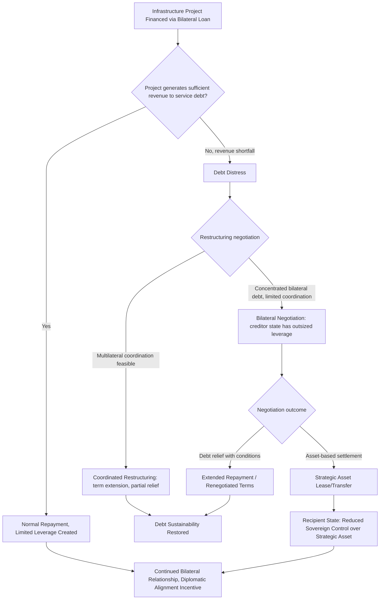

## Infrastructure Diplomacy and Debt-Related Leverage


### Purpose and Scope

Infrastructure diplomacy refers to the use of large-scale infrastructure financing and construction — ports, railways, energy grids, telecommunications networks — as an instrument of geopolitical influence, distinct from traditional development aid in its explicit linkage to strategic access, market positioning, and diplomatic alignment. This item covers the mechanics of infrastructure-based statecraft, the contested "debt-trap diplomacy" thesis, and the analytical frameworks for assessing debt sustainability and strategic leverage risk in recipient countries.

### Infrastructure Diplomacy as a Statecraft Category

**Key Points**

- Infrastructure financing differs from traditional foreign aid in that it typically involves loans (often at commercial or near-commercial rates) rather than grants, creating a debt relationship between financier and recipient state that persists for decades.
- The strategic value to the financing state can operate through multiple channels simultaneously: securing physical/logistical access (ports, transit routes), market access for the financing state's construction and engineering firms, resource extraction access, and diplomatic alignment leverage.
- China's Belt and Road Initiative (BRI), launched in 2013, is the most extensively studied contemporary case, though infrastructure diplomacy as a category predates BRI and is practiced by multiple state and multilateral actors (Japan's infrastructure financing in Southeast Asia, Gulf state investment in African and South Asian infrastructure, and Western-aligned initiatives such as the G7's Partnership for Global Infrastructure and Investment, launched partly in explicit response to BRI's scale).

### Mechanisms of Infrastructure-Based Leverage

<svg xmlns="http://www.w3.org/2000/svg" viewBox="0 0 900 300" font-family="sans-serif">
<text x="450" y="20" text-anchor="middle" font-size="14" font-weight="bold">Infrastructure Diplomacy Leverage Channels (svg_diagram)</text>
<rect x="20" y="50" width="270" height="220" rx="6" fill="#e8f0fe" stroke="#3b5bdb" />
<text x="155" y="75" text-anchor="middle" font-size="12" font-weight="bold">Physical Access Leverage</text>
<text x="30" y="100" font-size="9">- Port access/basing rights</text>
<text x="30" y="113" font-size="9"> (dual-use commercial/</text>
<text x="30" y="126" font-size="9"> military potential)</text>
<text x="30" y="143" font-size="9">- Transit route control</text>
<text x="30" y="156" font-size="9"> (rail corridors, pipelines)</text>
<text x="30" y="173" font-size="9">- Telecommunications</text>
<text x="30" y="186" font-size="9"> infrastructure (undersea</text>
<text x="30" y="199" font-size="9"> cables, 5G networks)</text>
<rect x="315" y="50" width="270" height="220" rx="6" fill="#fff3bf" stroke="#f08c00" />
<text x="450" y="75" text-anchor="middle" font-size="12" font-weight="bold">Financial/Debt Leverage</text>
<text x="325" y="100" font-size="9">- Bilateral debt</text>
<text x="325" y="113" font-size="9"> concentration to a</text>
<text x="325" y="126" font-size="9"> single creditor state</text>
<text x="325" y="143" font-size="9">- Non-transparent loan</text>
<text x="325" y="156" font-size="9"> terms complicating debt</text>
<text x="325" y="169" font-size="9"> restructuring negotiation</text>
<text x="325" y="186" font-size="9">- Collateralization of</text>
<text x="325" y="199" font-size="9"> strategic assets/revenue</text>
<rect x="610" y="50" width="270" height="220" rx="6" fill="#d3f9d8" stroke="#2f9e44" />
<text x="745" y="75" text-anchor="middle" font-size="12" font-weight="bold">Diplomatic Alignment Leverage</text>
<text x="620" y="100" font-size="9">- Voting alignment in</text>
<text x="620" y="113" font-size="9"> international bodies</text>
<text x="620" y="130" font-size="9">- Reduced criticism of</text>
<text x="620" y="143" font-size="9"> financier state policies</text>
<text x="620" y="160" font-size="9">- Preferential access for</text>
<text x="620" y="173" font-size="9"> financier state firms in</text>
<text x="620" y="186" font-size="9"> future contracts</text>
</svg>

### The "Debt-Trap Diplomacy" Debate

The term "debt-trap diplomacy," popularized in Western policy discourse particularly regarding Chinese infrastructure lending, posits that a creditor state deliberately extends financing likely to exceed a recipient's repayment capacity, anticipating eventual default that can then be leveraged for strategic asset seizure or political concessions. The Hambantota Port case in Sri Lanka (where a 99-year lease was granted to a Chinese state-owned company following debt difficulties) is the most frequently cited example in this debate.

[Inference] The debt-trap diplomacy thesis is genuinely and actively contested in the academic and policy literature. Several empirical studies examining Chinese lending practices across multiple recipient countries have found limited systematic evidence of deliberate "trap-setting" as the primary driver of loan terms, instead pointing to factors like recipient-country project selection and implementation problems, commercial risk-pricing by Chinese lenders, and case-specific negotiation dynamics; other analysts maintain that regardless of original intent, the structural leverage effects of debt concentration and asset collateralization function similarly to the trap thesis's predicted outcomes even absent a deliberate ex-ante strategy. This remains a live empirical and interpretive debate rather than a settled question, and an analyst should present both positions rather than treating either as definitively established.

### Debt Sustainability and Transparency Analysis Framework

Assessing infrastructure debt leverage risk in a recipient country typically involves:

**Debt concentration metrics**:

$$\text{CreditorConcentration} = \frac{\text{Debt owed to single largest bilateral creditor}}{\text{Total external debt}}$$

High concentration in a single bilateral creditor reduces a recipient's negotiating leverage in any future restructuring, since multilateral/Paris Club-style coordinated restructuring frameworks are harder to invoke when debt is concentrated outside traditional multilateral creditor coordination mechanisms.

**Debt service burden**: debt service as a percentage of government revenue or export earnings — the IMF and World Bank Debt Sustainability Framework (DSF) provides standardized thresholds for assessing external debt distress risk across low-income countries.

**Collateralization and non-transparent terms**: loans collateralized against specific revenue streams (resource export receipts) or including confidentiality clauses limiting public disclosure of loan terms — increasingly documented by researchers using leaked or FOIA-obtained loan contracts (notably work by AidData and related research institutions cataloging previously non-public loan terms).

[Inference] Research on non-transparent loan terms and collateralization clauses (notably AidData's contract database research) has substantially expanded public understanding of these practices in recent years, but comprehensive terms for many bilateral infrastructure loans remain non-public, meaning any debt transparency risk assessment should be understood as based on incomplete information for many specific cases, with the true extent of non-transparent terms likely underestimated in aggregate.

### Quantitative Risk Scoring Example

```python
def infrastructure_debt_risk_score(creditor_concentration: float,
                                      debt_service_ratio: float,
                                      collateralization_flag: bool,
                                      contract_transparency: float,
                                      weights: tuple = (0.3, 0.3, 0.2, 0.2)) -> float:
    """
    creditor_concentration: proportion of external debt held by
                             single largest bilateral creditor (0-1)
    debt_service_ratio: debt service as proportion of government
                         revenue (0-1, values above ~0.3-0.4 generally
                         considered high distress risk per IMF/WB DSF
                         conventions, though thresholds vary by country
                         income classification)
    collateralization_flag: True if loans are collateralized against
                             specific revenue streams/assets
    contract_transparency: 0 (fully non-disclosed terms) to
                            1 (fully public, standard terms)
    """
    w1, w2, w3, w4 = weights
    assert abs(sum(weights) - 1.0) < 1e-6, "Weights must sum to 1"
    collateral_risk = 1.0 if collateralization_flag else 0.0
    score = (w1 * creditor_concentration + w2 * debt_service_ratio +
             w3 * collateral_risk + w4 * (1 - contract_transparency))
    return round(score, 3)

# Example: high concentration, elevated debt service, collateralized loan,
# limited public disclosure of terms
print(infrastructure_debt_risk_score(creditor_concentration=0.55,
                                        debt_service_ratio=0.35,
                                        collateralization_flag=True,
                                        contract_transparency=0.3))
```

**Output**



```
0.545
```

[Behavior may vary depending on the specific weighting and threshold assumptions used; this is an illustrative composite scoring framework for teaching purposes, not a substitute for the IMF/World Bank Debt Sustainability Framework's specific country-income-tier thresholds and methodology, which should be consulted directly for actual debt distress risk classification.]

### Infrastructure Diplomacy Leverage Pathway



### Dual-Use Infrastructure and Security Dimensions

A specific analytical concern within infrastructure diplomacy involves nominally commercial infrastructure with plausible dual civilian-military application:

- **Port facilities**: commercial port infrastructure built or operated by a foreign state-linked entity raises questions about potential future naval access or basing use, independent of current stated commercial purpose.
- **Telecommunications infrastructure**: 5G network equipment and undersea cable infrastructure raise data security and potential surveillance access concerns, a significant factor in recent Western policy restrictions on specific foreign telecommunications vendors in critical infrastructure roles.
- **Space and satellite ground station infrastructure**: increasingly relevant dual-use category as space-based infrastructure competition intensifies.

[Inference] Assessing the genuine future military-access risk of a specific commercial infrastructure project requires case-specific analysis of contract terms, operational control arrangements, and the broader bilateral security relationship — the mere presence of foreign state-linked commercial operation does not by itself establish military access intent or capability, and this determination should not be made from category alone without case-specific evidence.

### Common Pitfalls

- **Treating all developing-country infrastructure debt to a single creditor state as evidence of deliberate strategic entrapment** — recipient-country agency, project selection quality, and macroeconomic shocks unrelated to the financing relationship (currency crises, commodity price shifts) are frequently significant independent contributors to debt distress, and attribution should consider these factors rather than defaulting to a single-cause geopolitical narrative.
- **Relying on incomplete public loan term data as if it were comprehensive** — given known gaps in loan contract transparency, absence of documented collateralization or unusual terms in publicly available data does not confirm their absence, and risk assessments should account for this data limitation explicitly.
- **Ignoring recipient-country agency and alternative financing options** — assuming recipient states are purely passive actors in infrastructure financing decisions overlooks documented cases of recipient governments actively renegotiating unfavorable terms, seeking competing bids from multiple financier states, or declining offered projects.
- **Conflating infrastructure diplomacy risk with a single financier state** — while China's BRI is the most extensively studied case given its scale, infrastructure-based leverage dynamics are a general category practiced by multiple state and multilateral actors, and single-country framing can miss comparable dynamics elsewhere.

### Related Topics

- Sovereign debt distress and IMF/World Bank Debt Sustainability Framework methodology
- Belt and Road Initiative case studies and comparative infrastructure financing analysis
- Dual-use port and telecommunications infrastructure security screening
- Weaponized interdependence and chokepoint control (physical infrastructure access as a chokepoint category)
- Sovereign wealth funds as geopolitical instruments (overlapping strategic investment channels)
- AidData contract transparency research and non-disclosed loan term analysis
- Paris Club and multilateral sovereign debt restructuring mechanisms