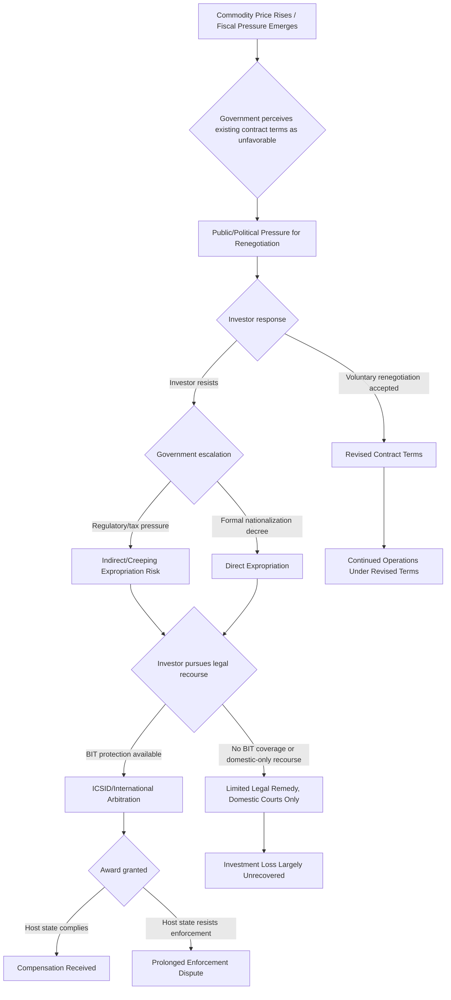

## Resource Nationalism and Expropriation Risk


### Purpose and Scope

Resource nationalism refers to a state's assertion of greater control, ownership, or revenue capture over natural resources within its territory, often at the expense of foreign investors' existing contractual or ownership positions. This item covers the spectrum of resource nationalism actions from regulatory tightening to outright expropriation, the historical and cyclical drivers behind it, and the frameworks investors and risk analysts use to assess and price this risk.

### The Resource Nationalism Spectrum

**Key Points**

- Resource nationalism is not binary (expropriation vs. no action) but exists on a spectrum of increasing state assertion over resource control and revenue.
- Actions can be entirely legal under domestic and international law (renegotiating royalty rates within contractual mechanisms) or can breach existing investment agreements and international law (uncompensated expropriation), with substantial variation in between.
- Resource nationalism tends to be cyclical, correlating with commodity price cycles — rising during price booms (when host governments perceive existing contracts as capturing insufficient value for the state) and sometimes intensifying during price busts as fiscally stressed governments seek additional revenue from existing operations.

### Spectrum of State Actions

<svg xmlns="http://www.w3.org/2000/svg" viewBox="0 0 900 260" font-family="sans-serif">
<text x="450" y="20" text-anchor="middle" font-size="14" font-weight="bold">Resource Nationalism Escalation Spectrum (svg_diagram)</text>
<line x1="60" y1="140" x2="840" y2="140" stroke="#333" stroke-width="2" marker-end="url(#arrow2)" />
<text x="450" y="170" text-anchor="middle" font-size="11">Increasing severity of state assertion →</text>
<circle cx="120" cy="140" r="7" fill="#2f9e44" />
<text x="120" y="100" text-anchor="middle" font-size="10">Royalty/tax</text>
<text x="120" y="113" text-anchor="middle" font-size="10">rate increases</text>
<circle cx="270" cy="140" r="7" fill="#82c91e" />
<text x="270" y="100" text-anchor="middle" font-size="10">Local content</text>
<text x="270" y="113" text-anchor="middle" font-size="10">requirements</text>
<circle cx="420" cy="140" r="7" fill="#fab005" />
<text x="420" y="100" text-anchor="middle" font-size="10">Mandatory state</text>
<text x="420" y="113" text-anchor="middle" font-size="10">equity participation</text>
<circle cx="570" cy="140" r="7" fill="#f08c00" />
<text x="570" y="100" text-anchor="middle" font-size="10">Contract renegotiation</text>
<text x="570" y="113" text-anchor="middle" font-size="10">under duress</text>
<circle cx="720" cy="140" r="7" fill="#e03131" />
<text x="720" y="100" text-anchor="middle" font-size="10">Nationalization /</text>
<text x="720" y="113" text-anchor="middle" font-size="10">expropriation</text>

<text x="120" y="185" text-anchor="middle" font-size="9">Generally within</text>

<text x="120" y="198" text-anchor="middle" font-size="9">sovereign fiscal</text>

<text x="120" y="211" text-anchor="middle" font-size="9">authority</text>

<text x="720" y="185" text-anchor="middle" font-size="9">May breach</text>

<text x="720" y="198" text-anchor="middle" font-size="9">investment treaty</text>

<text x="720" y="211" text-anchor="middle" font-size="9">protections</text>

</svg>

[Inference] This spectrum is a simplified illustrative ordering for analytical purposes; the actual legal and practical severity of any specific action depends heavily on the terms of the original investment contract, the specific bilateral investment treaty (if any) governing the relationship, and domestic legal process followed — a formally compensated nationalization conducted through proper legal channels differs substantially in legal risk profile from an uncompensated seizure, even though both might be colloquially termed "nationalization."

### Categories of Expropriation

International investment law commonly distinguishes:

- **Direct expropriation**: outright seizure or forced transfer of ownership/title, the most visible and legally unambiguous form.
- **Indirect ("creeping") expropriation**: a series of regulatory, tax, or administrative measures that cumulatively deprive an investor of the substantial value or control of their investment without a formal seizure of title — legally more contested and harder to establish in arbitration than direct expropriation, since states retain legitimate regulatory authority and the line between bona fide regulation and de facto expropriation is often disputed.

### Historical Drivers and Patterns

**Commodity price cycles**: resource nationalism activity has historically shown correlation with commodity price booms, when host governments observe rising windfall profits under existing contracts negotiated during lower-price periods and seek renegotiation to capture greater state revenue share.

**Resource nationalism waves**: several historically documented waves of expropriation activity are commonly cited in the literature — the wave of oil and mining nationalizations across Latin America and the Middle East in the 1960s-1970s (coinciding with decolonization and the 1970s oil price shocks), and a more recent wave of increased resource nationalism activity in the 2000s-2010s commodity boom period affecting Latin American and African extractive sectors.

**Political cycle drivers**: resource nationalism actions frequently cluster around elections or leadership transitions, where asserting greater national control over resource wealth can serve as a politically popular platform, particularly in states with strong historical narratives around foreign exploitation of national resources.

[Inference] While the general correlation between commodity price cycles and resource nationalism intensity is a widely observed pattern in the political economy literature (drawing on work by scholars studying resource politics), the precise triggering threshold or lag structure between price movements and nationalist policy action varies substantially by country and political context, and is not reducible to a single predictive formula.

### Legal Protections and Investor Recourse

**Bilateral Investment Treaties (BITs)**: agreements between two states providing legal protections for investors from one state investing in the other, typically including fair and equitable treatment standards, protection against uncompensated expropriation, and access to international arbitration.

**ICSID arbitration**: the International Centre for Settlement of Investment Disputes (part of the World Bank Group) provides a primary forum for investor-state dispute settlement (ISDS) claims, including expropriation claims, under BITs or investment contracts containing ICSID arbitration clauses.

**Political risk insurance**: instruments such as the Multilateral Investment Guarantee Agency (MIGA, part of the World Bank Group) and private political risk insurers (Lloyd's syndicates, specialized PRI providers) offer coverage specifically against expropriation, currency inconvertibility, and political violence risk for qualifying foreign investments.

**Key Points**

- BIT protections and ICSID arbitration access provide a legal remedy pathway but do not prevent expropriation from occurring — they primarily affect the cost/consequence calculus for a host state considering expropriation and provide investors a path to compensation after the fact, with award enforcement itself sometimes facing practical challenges if the host state resists compliance.
- Political risk insurance shifts the financial loss from expropriation onto the insurer, but coverage limits, waiting periods, and policy exclusions mean it does not eliminate the underlying operational and strategic disruption risk.
- Not all resource-rich states are parties to BITs with all relevant investor home countries, and treaty coverage gaps or treaty termination (some states have exited or renegotiated BIT networks in recent years) directly affect available legal recourse.

### Quantifying Expropriation Risk

A practical risk-scoring framework for extractive sector investment combines several observable indicators:

$$\text{ExpropriationRisk} = w_1 \cdot \text{ResourceNationalismHistory} + w_2 \cdot \text{CommodityPriceCycleStage} + w_3 \cdot \text{BITCoverageGap} + w_4 \cdot \text{PoliticalCycleProximity}$$

```python
def expropriation_risk_score(nationalism_history: float,
                                commodity_price_percentile: float,
                                bit_coverage_gap: bool,
                                election_within_2yrs: bool,
                                weights: tuple = (0.35, 0.25, 0.2, 0.2)) -> float:
    """
    nationalism_history: 0-1, based on country's historical frequency
                          of nationalist resource sector actions
    commodity_price_percentile: 0-1, current commodity price relative
                                 to historical distribution (higher =
                                 closer to boom conditions historically
                                 associated with elevated nationalism risk)
    bit_coverage_gap: True if no BIT exists between host and home state
    election_within_2yrs: True if a national election is scheduled
                           within 2 years
    """
    w1, w2, w3, w4 = weights
    assert abs(sum(weights) - 1.0) < 1e-6, "Weights must sum to 1"
    bit_risk = 1.0 if bit_coverage_gap else 0.0
    election_risk = 1.0 if election_within_2yrs else 0.0
    score = (w1 * nationalism_history + w2 * commodity_price_percentile +
             w3 * bit_risk + w4 * election_risk)
    return round(score, 3)

# Example: country with moderate nationalism history, commodity prices near
# cyclical highs, no BIT coverage, election within 2 years
print(expropriation_risk_score(nationalism_history=0.5,
                                  commodity_price_percentile=0.85,
                                  bit_coverage_gap=True,
                                  election_within_2yrs=True))
```

**Output**



```
0.7625
```

[Behavior may vary depending on specific input weighting assumptions; this is an illustrative composite scoring framework for teaching purposes, not a validated proprietary political risk model — commercial political risk insurers and specialized advisory firms use more extensive proprietary methodologies incorporating additional case-specific legal and political factors.]

### Resource Nationalism Escalation Pathway



### Sector-Specific Considerations

Resource nationalism risk is not uniform across extractive sectors:

- **Oil and gas**: historically the most frequent target of major nationalization waves given high visibility and strategic national importance, with state oil companies often taking on operations post-nationalization.
- **Mining (especially critical minerals)**: rising strategic salience of critical minerals (lithium, cobalt, rare earths) for the energy transition and technology sectors has drawn renewed policy attention to resource nationalism risk in this sector specifically, given increased downstream demand and geopolitical competition for supply access — current developments in this space should be monitored via current reporting given rapid recent policy evolution in several mineral-rich jurisdictions.
- **Agriculture and land**: land nationalization and foreign land ownership restrictions represent a related but distinct category, often driven by domestic political narratives around food security and land equity rather than primarily fiscal/commodity-cycle drivers.

### Common Pitfalls

- **Treating resource nationalism risk as static across the commodity cycle** — risk assessment conducted during a commodity price trough may understate risk exposure that materializes if prices later rise substantially, and vice versa; cyclical risk should be dynamically reassessed rather than fixed at initial investment.
- **Overestimating BIT protection as a complete risk mitigant** — treaty protection provides a legal remedy pathway, not prevention, and award enforcement against a resistant host state can be protracted and only partially successful in practice.
- **Underestimating indirect/creeping expropriation risk relative to direct nationalization** — direct expropriation is more visible and widely tracked, but gradual regulatory and tax pressure can produce comparable investor value destruction while being legally harder to characterize and remedy as expropriation.
- **Ignoring sector-specific and mineral-specific dynamics** — applying a generic country-level resource nationalism risk score without accounting for the specific strategic salience of a given resource (e.g., critical minerals versus a less strategically prioritized commodity) can miss meaningful variation in actual exposure.

### Related Topics

- Sovereign debt distress and its interaction with resource-revenue-dependent fiscal positions
- Bilateral Investment Treaties and ICSID arbitration mechanics
- Critical minerals supply chain concentration (linkage to weaponized interdependence)
- Political risk insurance markets and MIGA coverage mechanics
- Commodity price cycle analysis and forecasting methods
- State-owned enterprise expansion in extractive sectors post-nationalization
- Resource curse literature and rentier state political economy