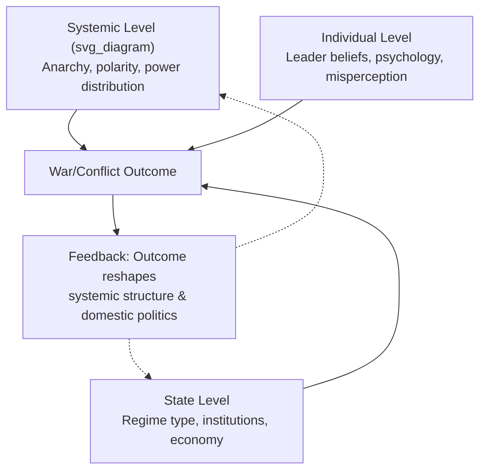

## Theories of Interstate War and Conflict Causation

### Overview

Theories of interstate war and conflict causation form the analytical core of security studies, providing the causal logics that geopolitical risk analysts use to forecast, explain, and price conflict risk. These theories operate at multiple levels of analysis (individual, state, system) and generate distinct, often competing, predictions about when and why states resort to organized violence against one another. For a practitioner, these frameworks are not academic abstractions — they are the diagnostic lenses used to interpret rising tensions (e.g., Taiwan Strait, South China Sea, Russia-NATO frontier, India-Pakistan) and to generate probabilistic judgments for clients, governments, or institutional risk desks.

---

### Levels of Analysis Framework

Kenneth Waltz's tripartite framework, articulated in *Man, the State, and War* (1959), remains the organizing scaffold for nearly all subsequent theorizing.

- **First image (individual level):** War originates in human nature, leader psychology, cognition, and misperception.
- **Second image (state/domestic level):** War originates in the internal characteristics of states — regime type, ideology, economic structure, domestic political coalitions.
- **Third image (systemic level):** War originates in the structure of the international system itself — anarchy, the absence of a supranational authority to enforce agreements.

**Key Points**

- No single level is claimed by most scholars to be sufficient; contemporary analysis is typically multi-causal, blending systemic constraints with domestic and individual triggers.
- Risk analysts typically map an emerging crisis onto all three levels simultaneously to avoid over-indexing on one causal story (e.g., attributing a crisis purely to a leader's psychology while ignoring structural incentives).

---

### Systemic-Level (Third Image) Theories

#### Structural Realism / Neorealism

Kenneth Waltz's *Theory of International Politics* (1979) argues that the anarchic structure of the international system — not human nature or state ideology — is the fundamental driver of conflict. States exist in a self-help system with no overarching authority to guarantee their survival, so they must provide for their own security.

- **Security dilemma:** John Herz's concept, later formalized by Robert Jervis, describes how one state's efforts to increase its own security (arms buildups, alliances, fortifications) are perceived as threatening by others, prompting reciprocal measures that leave all states no safer and often less secure. This is a foundational mechanism cited in nearly every contemporary great-power rivalry assessment (US-China, NATO-Russia).
- **Offense-defense balance:** Jervis's extension of security-dilemma theory holds that whether a technology or strategic posture favors the attacker or defender shapes the intensity of the dilemma. When offense is perceived as dominant, arms races and preemptive incentives intensify.

$$P(\text{conflict}) \propto \frac{\text{Offense Dominance}}{\text{Distinguishability of Offensive vs. Defensive Postures}}$$

This is a heuristic relationship, not a formally estimated equation; it is used descriptively in the literature to illustrate that conflict propensity rises when offense is dominant and when offensive/defensive postures are hard to distinguish (a factor cited in assessments of missile defense, hypersonic weapons, and cyber capabilities). [Inference: the equation form is an analytic simplification for pedagogical use, not a validated statistical model]

- **Balance of power theory:** States, particularly great powers, balance against concentrations of power to prevent hegemony, either through internal buildup (internal balancing) or alliance formation (external balancing). Failures of balancing, or bandwagoning (aligning with the stronger power), are proposed explanations for hegemonic wars.

#### Offensive vs. Defensive Realism

- **Offensive realism** (John Mearsheimer, *The Tragedy of Great Power Politics*, 2001): Anarchy compels great powers to maximize relative power and seek regional hegemony because survival is best guaranteed by dominance, not merely sufficiency. This generates a structurally pessimistic, conflict-prone reading of great-power competition — frequently invoked in analyses of US-China strategic rivalry.
- **Defensive realism** (Waltz; Stephen Van Evera): States seek security, not maximal power, and excessive power-seeking is often self-defeating because it triggers counter-balancing. Under defensive realism, war is more often the product of miscalculation, offense-dominant technology, or domestic pathologies than of structurally mandated expansionism.

#### Power Transition Theory and Hegemonic Stability

- **Power transition theory** (A.F.K. Organski; later formalized by Jacek Kugler and Douglas Lemke): War risk peaks when a rising challenger approaches parity with a dominant power, because the existing hierarchy of status and benefits becomes contested. This is the theoretical backbone of "Thucydides Trap" framing popularized by Graham Allison, applied heavily to US-China analysis.
- **Hegemonic stability theory** (Robert Gilpin, *War and Change in World Politics*, 1981): A single dominant hegemon underwrites systemic order and reduces the likelihood of major war; decline of the hegemon relative to challengers increases systemic instability and war risk as the costs of enforcing the existing order exceed the hegemon's capacity.
- **Long cycle theory** (George Modelski): Global political-economic leadership passes through cyclical phases (global war, world power, delegitimation, deconcentration), with global wars serving as the primary mechanism of hegemonic succession.

#### Polarity and System Structure

- **Bipolarity vs. multipolarity debate:** Waltz argued bipolar systems (Cold War US-USSR) are inherently more stable because only two major actors must manage the balance, reducing miscalculation. John Mearsheimer's analysis of the "stability of the Cold War" extends this logic.
- **Multipolar instability arguments** (Karl Deutsch and J. David Singer) counter that multipolarity diffuses attention and diminishes any single dyad's incentive for war, potentially increasing overall systemic stability through complexity, though at the cost of more numerous potential flashpoints.
- **Unipolarity debates** (William Wohlforth vs. critics): Whether a unipolar system (post-Cold War US primacy) is peace-inducing (no peer competitor to balance against) or conflict-prone (resentment, free-riding collapse, challenger emergence) remains contested. [Unverified: no scholarly consensus exists on unipolarity's net effect on systemic war frequency; this is an active empirical dispute]

---

### State-Level (Second Image) Theories

#### Democratic Peace Theory

One of the most robust empirical regularities in international relations: democracies rarely, if ever, fight wars against other democracies (dyadic version), though democracies fight non-democracies at similar rates to other regime pairings (monadic claims are weaker and contested).

**Causal mechanisms proposed:**

- **Normative/cultural mechanism** (Bruce Russett, Zeev Maoz): Shared democratic norms of peaceful conflict resolution, compromise, and respect for adversary legitimacy extend to interstate relations between democracies.
- **Institutional/structural mechanism** (Immanuel Kant's original *Perpetual Peace*, 1795; formalized by Bruce Bueno de Mesquita and Randolph Siverson): Domestic institutional constraints (legislatures, courts, elections, free press) raise the audience costs of war for democratic leaders and slow mobilization, making democratic dyads less likely to stumble into war and better able to credibly signal resolve short of war.
- **Informational/signaling mechanism** (James Fearon): Democratic transparency reduces private information about resolve and capability, mitigating the bargaining failures (see Rationalist theory below) that produce war.

**Key Points**

- Critiques: Christopher Layne's "Kant or Cant" argument and Sebastian Rosato's institutional critique both question whether the causal mechanisms hold up under case-study scrutiny, suggesting shared interests or alliance structures (particularly Cold War bipolarity) may be confounding the correlation.
- Practical application: risk models incorporating regime-type covariates (e.g., Polity5, V-Dem scores) as conflict-risk features draw directly on this literature. [Inference: specific weighting of regime-type variables in proprietary risk models varies by provider and is generally undisclosed]

#### Diversionary War Theory (Scapegoat Hypothesis)

Leaders facing domestic political weakness — economic crisis, corruption scandals, declining approval — may initiate or escalate external conflicts to rally nationalist sentiment ("rally 'round the flag" effect) and divert public attention from domestic failures.

- Empirical support is mixed and highly conditional; Jack Levy's reviews note the effect is most plausible for democracies with electorally accountable leaders (where the rally effect has electoral payoff) and least supported cross-nationally as a general law.
- Frequently invoked, with caution, in analyses of authoritarian leaders facing legitimacy crises (e.g., speculative commentary around Russia's 2014 Crimea annexation timing relative to domestic conditions). [Speculation: any single case attribution to diversionary logic is contested among specialists and rarely provable against alternative explanations]

#### Regime Type, Political Economy, and Bureaucratic Politics

- **Commercial/capitalist peace theory** (Erik Gartzke, Patrick McDonald): Deep economic interdependence and trade openness raise the opportunity costs of war, reducing conflict propensity between highly integrated economies. Contested by "trade expectations" theory (Dale Copeland), which argues that expectations of *future* trade decline (not current interdependence) can actually increase war risk if a rising power anticipates being cut off from markets.
- **Bureaucratic politics model** (Graham Allison, *Essence of Decision*, 1971): Foreign policy outcomes, including war decisions, emerge from bargaining among competing bureaucratic actors (military services, intelligence agencies, ministries) pursuing organizational interests rather than unified "national interest" calculation.
- **Military-industrial complex / organizational bias arguments** (Barry Posen, Jack Snyder): Military organizations possess offensive doctrinal biases and parochial interests that can push civilian leaders toward more aggressive postures than strategic logic alone would dictate.

---

### Individual-Level (First Image) Theories

#### Misperception and Cognitive Psychology

Robert Jervis's *Perception and Misperception in International Politics* (1976) remains foundational: leaders systematically misjudge adversary intentions through cognitive biases, including:

- **Motivated bias / wishful thinking:** Interpreting ambiguous information to fit desired conclusions.
- **Overconfidence in one's own signaling clarity:** Assuming adversaries read one's deterrent signals as intended, when in fact signals are frequently misread.
- **Attribution bias:** Explaining one's own actions as situational/defensive while explaining an adversary's identical actions as dispositional/aggressive.
- **Prospect theory applications** (Rose McDermott, Jack Levy): Leaders are loss-averse and evaluate options relative to a reference point rather than absolute expected utility; this predicts that leaders facing perceived losses may take on outsized risks (including war) to avoid or reverse losses, deviating from rational expected-utility predictions.
- **Groupthink** (Irving Janis): Small-group decision dynamics under stress can suppress dissent and produce poor-quality collective judgments, cited in analyses of decisions such as the 1961 Bay of Pigs.

#### Leader-Specific and Operational Code Approaches

- **Operational code analysis** (Nathan Leites; Alexander George): Systematic assessment of a leader's beliefs about the nature of political conflict and appropriate strategy, used to generate leader-specific predictive profiles (applied historically to Soviet Politburo analysis, and in contemporary form to authoritarian leader assessment).
- **Personality and belief-system approaches:** Attribute variance in crisis behavior to individual leader traits (risk tolerance, need for power, cognitive complexity), as in the work of Margaret Hermann's leadership trait analysis, used in some intelligence-community personality profiling methodologies.

---

### Rationalist and Bargaining Theories of War

James Fearon's "Rationalist Explanations for War" (1995) reframed the causation debate by asking: if war is costly and both sides are rational, why don't they simply agree to the ex ante bargain that reflects the expected outcome of war, and avoid the costs of fighting? Fearon identifies three mechanisms that can produce war even among rational actors:

1. **Private information and incentives to misrepresent:** States have incomplete information about each other's true capabilities and resolve, and incentives to bluff or conceal weakness, making credible communication difficult. War can result as a costly signal that reveals private information.
2. **Commitment problems:** Even when both sides agree on the likely outcome of war, one or both may be unable to credibly commit to abide by a bargain — because relative power will shift in the future (rising power dynamics), because first-mover advantages create preemption incentives, or because compliance cannot be enforced. Preventive war logic (striking a rising adversary before it becomes too strong) is a direct commitment-problem mechanism.
3. **Issue indivisibility:** Some goods at stake (e.g., a capital city, a sacred site) may resist compromise/partition, though most rationalist scholars view this as the weakest of the three mechanisms since side payments and issue-linkage can typically substitute for physical division.

**Bargaining model of war** (extension by Robert Powell, Dan Reiter): War is modeled as a bargaining failure within a continuous space of possible settlements; the "war outcome" simply becomes one point along a bargaining range, and the theoretical puzzle is explaining why negotiated settlement fails ex ante.

$$U_i(\text{settlement}) > U_i(\text{war}) - c_i \quad \forall i \in \{1,2\}$$

This inequality is the standard bargaining-range condition: if a settlement exists that both sides strictly prefer to war (given war's expected value net of costs $c_i$), a rational bargaining outcome should be found without fighting. Fearon's mechanisms explain why, in practice, such settlements are not always locatable or crediblereachable. [Inference: this is a stylized formalization commonly used in graduate IR theory courses; specific model parameterizations vary across the formal literature]

---

### Deterrence, Compellence, and Crisis Bargaining

- **Classical deterrence theory** (Thomas Schelling, *Arms and Influence*, 1966): Deterrence depends on the credibility, capability, and communication of a threat to punish unacceptable behavior. Schelling's distinction between **deterrence** (preventing an action) and **compellence** (forcing a change in behavior) remains a core analytic distinction in coercive-diplomacy assessment.
- **Extended deterrence:** The credibility problem of committing to defend third parties (e.g., US alliance commitments to Taiwan, NATO Article 5) is a persistent focus of nuclear-era security studies, tied closely to commitment-problem logic above.
- **Rational deterrence critiques** (Richard Ned Lebow, Janice Gross Stein): Argue that psychological and misperception dynamics frequently override the "rational" credibility calculations assumed by classical deterrence models, and that deterrence failures are often better explained by leader misjudgment than by insufficient capability signaling.
- **Nuclear deterrence and the stability-instability paradox** (Glenn Snyder): Nuclear parity may stabilize the strategic/systemic level (preventing large-scale war between nuclear powers) while destabilizing the tactical/sub-conventional level (encouraging proxy wars, limited conflicts, and gray-zone aggression), a framework heavily used in India-Pakistan and US-Russia risk analysis.

---

### Structural and Environmental Explanations

#### Resource and Environmental Theories

- **Resource scarcity/greed vs. grievance** (Paul Collier, Anke Hoeffler; though developed primarily for civil war, extended by some scholars to interstate resource competition): Contested natural resources (water, hydrocarbons, arable land) can generate or intensify interstate disputes, though the causal weight of resource scarcity alone (versus institutional and political mediating factors) is debated.
- **Climate security literature** (Halvard Buhaug and critics): Explores whether climate stress (drought, resource shortfall) causally elevates interstate/civil conflict risk; findings are heterogeneous and methodology-dependent. [Unverified: the climate-conflict causal link remains one of the most methodologically contested areas in quantitative conflict studies, with meta-analyses reaching divergent conclusions]

#### Geography and Proximity

- **Contiguity/proximity theories** (John Vasquez, Paul Diehl): Territorial contiguity is among the single strongest correlates of interstate militarized dispute in the quantitative literature — most interstate wars occur between neighbors or near-neighbors, driven by territorial disputes, border ambiguity, and opportunity for military engagement.
- **Rivalry and enduring rivalry literature** (William Thompson, Diehl and Goertz): A small number of "enduring rivalries" (dyads with repeated militarized disputes over time, e.g., India-Pakistan, historically France-Germany) account for a disproportionate share of interstate militarized conflict, suggesting that conflict is path-dependent and that historical rivalry status is itself a strong predictive covariate.

---

### Comparative Synthesis Table

| Theory Family | Level of Analysis | Core Causal Mechanism | Key Theorists | Primary Critique |
| --- | --- | --- | --- | --- |
| Structural/Neorealism | Systemic | Anarchy → security dilemma | Waltz, Jervis | Underspecifies variation in outcomes among similarly structured dyads |
| Offensive Realism | Systemic | Power maximization imperative | Mearsheimer | Overpredicts conflict frequency; downplays restraint |
| Power Transition | Systemic | Parity between rising/declining powers | Organski, Kugler | Difficult to operationalize "parity" threshold precisely |
| Democratic Peace | State | Institutional/normative constraints | Russett, Doyle | Possible confounding by alliance/interest overlap |
| Diversionary War | State | Domestic legitimacy crisis | Levy | Weak, conditional cross-national empirical support |
| Commercial Peace | State | Trade interdependence raises war costs | Gartzke | Trade *expectations* may reverse the effect (Copeland) |
| Misperception/Prospect Theory | Individual | Cognitive bias, loss aversion | Jervis, Levy | Difficult to falsify; post hoc application risk |
| Rationalist Bargaining | Cross-level | Private information, commitment problems | Fearon, Powell | Assumes rationality that psychological theories dispute |
| Deterrence Theory | Cross-level | Credibility of threatened punishment | Schelling | Rational-actor assumptions strained by misperception evidence |

---

### Application to Geopolitical Risk Analysis

**Example**

A risk analyst assessing escalation probability in a contested maritime dispute (e.g., South China Sea) would typically triangulate:

1. **Systemic layer:** Is a power transition underway (rising claimant vs. status quo power)? Is the offense-defense balance shifting (e.g., anti-access/area-denial systems, naval modernization)?
2. **State layer:** Is a claimant's regime facing domestic legitimacy pressure that could incentivize diversionary posturing? What is the depth of bilateral trade interdependence?
3. **Individual layer:** What do the leader's operational code and prior crisis behavior suggest about risk tolerance and threat perception?
4. **Bargaining layer:** Is there a credible commitment problem (e.g., fear that inaction today cedes an irreversible fait accompli)? Is there a locatable settlement space, or has private information/signaling failure closed it off?

This multi-theory triangulation is standard practice precisely because single-theory frameworks each capture only partial variance in observed conflict outcomes.

---

### Diagrammatic Summary: Causal Pathways to Interstate War

<svg xmlns="http://www.w3.org/2000/svg" viewBox="0 0 900 560" font-family="Arial, sans-serif">
<text x="450" y="30" font-size="20" font-weight="bold" text-anchor="middle" fill="#1a1a2e">Causal Pathways to Interstate War (svg_diagram)</text>

<rect x="30" y="70" width="240" height="110" rx="8" fill="#2b3a67" stroke="#1a1a2e" stroke-width="2" />
<text x="150" y="95" font-size="14" font-weight="bold" text-anchor="middle" fill="#ffffff">Systemic Level</text>
<text x="150" y="118" font-size="11" text-anchor="middle" fill="#e0e0e0">Anarchy / Polarity</text>
<text x="150" y="136" font-size="11" text-anchor="middle" fill="#e0e0e0">Power Transition</text>
<text x="150" y="154" font-size="11" text-anchor="middle" fill="#e0e0e0">Security Dilemma</text>
<text x="150" y="172" font-size="11" text-anchor="middle" fill="#e0e0e0">Offense-Defense Balance</text>

<rect x="330" y="70" width="240" height="110" rx="8" fill="#41507a" stroke="#1a1a2e" stroke-width="2" />
<text x="450" y="95" font-size="14" font-weight="bold" text-anchor="middle" fill="#ffffff">State Level</text>
<text x="450" y="118" font-size="11" text-anchor="middle" fill="#e0e0e0">Regime Type</text>
<text x="450" y="136" font-size="11" text-anchor="middle" fill="#e0e0e0">Domestic Legitimacy</text>
<text x="450" y="154" font-size="11" text-anchor="middle" fill="#e0e0e0">Trade Interdependence</text>
<text x="450" y="172" font-size="11" text-anchor="middle" fill="#e0e0e0">Bureaucratic Politics</text>

<rect x="630" y="70" width="240" height="110" rx="8" fill="#5a6a9a" stroke="#1a1a2e" stroke-width="2" />
<text x="750" y="95" font-size="14" font-weight="bold" text-anchor="middle" fill="#ffffff">Individual Level</text>
<text x="750" y="118" font-size="11" text-anchor="middle" fill="#e0e0e0">Misperception</text>
<text x="750" y="136" font-size="11" text-anchor="middle" fill="#e0e0e0">Prospect Theory / Loss Aversion</text>
<text x="750" y="154" font-size="11" text-anchor="middle" fill="#e0e0e0">Operational Code</text>
<text x="750" y="172" font-size="11" text-anchor="middle" fill="#e0e0e0">Groupthink</text>

<line x1="150" y1="180" x2="400" y2="260" stroke="#333" stroke-width="2" marker-end="url(#arrow)" />
<line x1="450" y1="180" x2="450" y2="260" stroke="#333" stroke-width="2" marker-end="url(#arrow)" />
<line x1="750" y1="180" x2="500" y2="260" stroke="#333" stroke-width="2" marker-end="url(#arrow)" />

<rect x="300" y="270" width="300" height="100" rx="8" fill="#8c1c1c" stroke="#1a1a2e" stroke-width="2" />
<text x="450" y="295" font-size="14" font-weight="bold" text-anchor="middle" fill="#ffffff">Crisis Bargaining Failure</text>
<text x="450" y="318" font-size="11" text-anchor="middle" fill="#f0d0d0">Private Info / Misrepresentation</text>
<text x="450" y="336" font-size="11" text-anchor="middle" fill="#f0d0d0">Commitment Problems</text>
<text x="450" y="354" font-size="11" text-anchor="middle" fill="#f0d0d0">Issue Indivisibility</text>

<line x1="450" y1="370" x2="450" y2="430" stroke="#333" stroke-width="2" marker-end="url(#arrow)" />

<rect x="330" y="440" width="240" height="70" rx="8" fill="#1a1a2e" stroke="#000" stroke-width="2" />
<text x="450" y="470" font-size="15" font-weight="bold" text-anchor="middle" fill="#ffffff">Interstate War</text>
<text x="450" y="492" font-size="11" text-anchor="middle" fill="#cccccc">or Militarized Dispute</text>

<path d="M 570 475 C 750 475 800 250 570 120" stroke="#666" stroke-width="1.5" fill="none" stroke-dasharray="5,4" marker-end="url(#arrow)" />
<text x="740" y="300" font-size="10" fill="#666" transform="rotate(90 740 300)">Feedback: reshapes structure</text>
</svg>

---

### Empirical Testing Traditions

- **Correlates of War (COW) Project:** The primary quantitative dataset infrastructure (founded by J. David Singer) underlying most large-N interstate war studies; provides standardized war onset, dyad-year, and militarized-interstate-dispute (MID) data used to test nearly all theories above.
- **Militarized Interstate Dispute (MID) data:** Enables testing of dispute escalation dynamics short of full war, critical for risk-analysis applications where the outcome of interest is escalation risk, not only war onset.
- **Selection effects critique** (James Fearon, Bruce Bueno de Mesquita): Because rational actors anticipate the likely outcome of a dispute, disputes that reach observable militarized conflict are already a selected, non-random sample — a methodological caution relevant to any analyst drawing inference from historical dispute datasets.

**Conclusion**

No single theory of interstate war causation commands consensus, and this is not a deficiency of the field so much as a reflection of the genuinely multi-causal nature of war as a social phenomenon. Effective geopolitical risk analysis draws on systemic theories to establish the structural backdrop of a rivalry (power distribution, polarity trends), state-level theories to assess domestic political drivers and constraints, individual-level theories to evaluate leader-specific risk factors, and rationalist bargaining theory to identify the specific mechanism (private information, commitment problems, or indivisibility) that could tip a crisis from negotiated management into armed conflict. Behavioral predictions derived from any of these frameworks should be treated as probabilistic and context-dependent rather than deterministic. [Inference: the practical synthesis approach described here reflects standard applied methodology in the field rather than a codified single theoretical school]

**Related Topics**

- Levels of analysis problem in International Relations (Waltz's three images, Singer's critique)
- Security dilemma and spiral models of conflict escalation
- Power transition theory and the "Thucydides Trap" debate
- Democratic peace theory: normative vs. institutional mechanisms
- Rationalist theories of war: Fearon's bargaining model
- Deterrence theory and extended deterrence credibility
- Enduring rivalries and territorial contiguity in militarized disputes
- Correlates of War (COW) project and quantitative conflict data infrastructure
- Prospect theory and behavioral decision-making in crisis bargaining
- Nuclear deterrence and the stability-instability paradox
- Diversionary war theory and domestic political incentives for conflict
- Commercial peace theory vs. trade expectations theory
- Civil war onset theories (greed vs. grievance) as a comparative contrast to interstate war causation
- Alliance formation theory (balancing vs. bandwagoning) as an extension of systemic theories