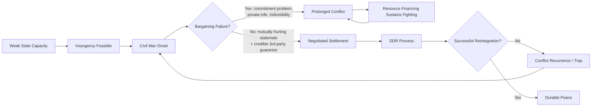

## Civil War and Insurgency Dynamics

### Overview

Civil war and insurgency dynamics constitute a distinct analytical domain within security studies, separate from interstate war theory because the causal mechanisms, actors, and data-generating processes differ substantially. Since the end of the Cold War, intrastate conflict has vastly outnumbered interstate war as the dominant form of organized political violence globally, making this literature central to contemporary geopolitical risk analysis — particularly for sovereign risk assessment, fragile-state monitoring, and humanitarian/operational risk forecasting in conflict-affected regions.

---

### Defining Civil War and Insurgency

- **Civil war (Correlates of War / UCDP conventions):** Sustained armed combat between a state's government and one or more organized non-state (or rival state-aligned) armed groups, conventionally requiring a minimum battle-death threshold (COW uses 1,000 battle deaths per year; UCDP's Armed Conflict dataset uses a lower 25 battle-deaths/year threshold for "armed conflict," with 1,000/year distinguishing "war" from lower-intensity conflict).
- **Insurgency:** A specific *strategy* of armed conflict, typically defined (following Bard O'Neill, David Galula) as a protracted political-military struggle by an organized group aiming to overthrow or fundamentally alter an existing political order, characterized by asymmetric capability relative to the state and reliance on irregular tactics.
- **Distinction from civil war generally:** Not all civil wars are insurgencies (e.g., conventional-force civil wars such as the American Civil War or Libya's 2011 conflict involve more symmetric, conventional engagements); insurgency specifically denotes the guerrilla/irregular-warfare mode.

**Key Points**

- Terminology is contested across datasets; UCDP, COW, and the PRIO/Uppsala Armed Conflict Dataset (UCDP/PRIO) use different operational thresholds, which materially affects cross-study comparability. [Unverified: exact onset dates and case inclusion can differ by dataset for borderline cases]

---

### Major Theoretical Explanations for Civil War Onset

#### Greed vs. Grievance Debate

- **Grievance-based explanations** (early tradition, Ted Gurr's *Why Men Rebel*, 1970): Civil war originates in relative deprivation, ethnic/religious discrimination, political exclusion, and inequality-driven grievance that motivates collective violent mobilization.
- **Greed-based/economic opportunity explanations** (Paul Collier and Anke Hoeffler, "Greed and Grievance in Civil War," 2004): Using large-N quantitative analysis, Collier and Hoeffler argued that measures of *opportunity* for rebellion (availability of lootable natural resources, low opportunity cost of recruiting young unemployed males, terrain favorable to insurgency) predict civil war onset better than measures of *grievance* (inequality, political repression, ethnic polarization).
- **Synthesis and critique:** James Fearon and David Laitin's "Ethnicity, Insurgency, and Civil War" (2003) reframed the debate: they found weak systematic association between ethnic/religious diversity and civil war onset, and instead argued that **state weakness/capacity** — specifically financially and administratively weak states with rough terrain and low per-capita income — is the strongest predictor, because weak states create the *opportunity structure* for insurgency regardless of underlying grievance levels.

$$P(\text{onset}) = f(\text{state capacity}, \text{terrain}, \text{per-capita income}, \text{population}, \text{ethnic/religious fractionalization})$$

In Fearon and Laitin's regression framework, state capacity and income proxies carry substantially more explanatory weight than fractionalization indices; this is a well-documented empirical finding within their dataset and specification, though replication studies have produced some variation in effect sizes across model specifications. [Inference: exact coefficient magnitudes are specification-dependent and should not be treated as universal constants]

#### Political Economy of Rebellion

- **Resource curse and conflict** (Collier, Michael Ross): Lootable resources (diamonds, alluvial gems, narcotics, certain minerals) are associated with elevated civil war risk and duration because they finance rebel organizations and create incentives for continued fighting rather than settlement (a "conflict trap" — see below). Non-lootable, capital-intensive resources (deep-shaft mining, offshore oil) show weaker or different associations because they are harder for insurgents to directly capture and monetize.
- **Horizontal inequality** (Frances Stewart): Group-based (rather than purely individual) inequality across politically salient identity lines (ethnic, religious, regional) is argued to be a stronger predictor of civil conflict onset than aggregate individual (vertical) inequality measures like the Gini coefficient.
- **Political exclusion and ethnic power relations** (Lars-Erik Cederman, Kristian Skrede Gleditsch — the Ethnic Power Relations dataset): Formalizes the link between a group's exclusion from central state power and its propensity to initiate armed conflict, refining the crude "ethnic diversity" hypothesis rejected by Fearon and Laitin into a more specific "exclusion from power" mechanism.

#### State Capacity, Terrain, and Feasibility

Building on Fearon-Laitin, a "feasibility" school of thought (associated with Nicholas Sambanis, Fearon) argues that civil war is best predicted not by motive (grievance or greed) but by the *feasibility* of sustaining an insurgency — a function of rough/mountainous terrain (providing insurgent sanctuary), low state administrative penetration, contraband financing opportunities, and access to a supportive diaspora or external state sponsor.

---

### Conflict Duration, Termination, and Recurrence

#### Duration Theories

- **Rational bargaining extension to civil war** (Barbara Walter, applying Fearon-style logic): Civil wars, like interstate wars, can be understood as bargaining failures; but civil wars are frequently *longer* than interstate wars because commitment problems are more severe — there is typically no external enforcer for a peace settlement, and disarming a rebel group with imperfect security guarantees exposes it to elimination.
- **Lootable resource financing and duration** (Collier, Hoeffler, Michael Ross): Access to easily monetizable resources allows both state and rebel actors to sustain military operations indefinitely, extending conflict duration by reducing the financial pressure to negotiate.
- **Ripeness theory** (I. William Zartman): Conflicts become "ripe for resolution" when both sides perceive a "mutually hurting stalemate" — a point at which continued fighting yields diminishing returns for all parties, creating incentive for negotiated settlement.

#### Barbara Walter's Credible Commitment Problem

Walter's *Committing to Peace* (2002) is a central citation: even when both a government and rebel group prefer a negotiated settlement to continued war, the settlement frequently fails because the rebel group cannot trust the government to honor power-sharing or security guarantees once it has disarmed — and the government cannot trust the rebels to demobilize fully. Walter's empirical finding is that the presence of a credible **third-party security guarantor** (peacekeeping force, external mediator with enforcement capacity) is one of the strongest predictors of durable settlement, precisely because it substitutes for the missing domestic enforcement mechanism.

#### Conflict Recurrence ("Conflict Trap")

- **Collier's "conflict trap" concept:** Countries that have experienced one civil war face substantially elevated risk of relapse into renewed conflict within the following decade, attributed to destroyed state capacity, a war-habituated economy (looting networks, arms markets, demobilized-but-unemployed combatant pools), and weakened social trust.
- **DDR programs (Disarmament, Demobilization, Reintegration):** A standard post-conflict policy toolkit aimed at reducing recurrence risk by removing combatants' weapons, formally dissolving military structures, and providing economic reintegration pathways; effectiveness is highly context-dependent and contested in the peacebuilding literature. [Inference: DDR program effectiveness varies significantly by implementation quality, funding continuity, and local labor-market absorption capacity, and no single meta-analysis provides a universally agreed effect size]

---

### Insurgency Strategy and Doctrine

#### Classical Insurgency Theory

- **Mao Zedong's protracted people's war model** (*On Guerrilla Warfare*, 1937): Three-phase model — strategic defensive (survival, base-building, population mobilization), strategic stalemate (parity, expanding guerrilla operations), strategic offensive (transition to conventional warfare to seize state power). Mao's dictum that guerrillas must move among the population "as fish swim in the sea" underlies the centrality of population support in classical insurgency theory.
- **David Galula's counterinsurgency-insurgency framework** (*Counterinsurgency Warfare: Theory and Practice*, 1964): Reframes insurgency as fundamentally a political-military contest for population control and legitimacy rather than a purely military contest; Galula's "80% political, 20% military" ratio (illustrative, not a precise empirical measurement) is widely cited in doctrine.
- **Che Guevara's foco theory:** A small, mobile guerrilla vanguard ("foco") can catalyze broader revolutionary conditions even absent prior mass political mobilization — contrasted with Mao's emphasis on prior political organization of the peasant base; the foco approach's historical track record (e.g., Guevara's own failed 1967 Bolivia campaign) is generally regarded as weaker than Maoist population-first approaches. [Inference: this comparative assessment reflects a widely shared but not universally quantified judgment in the insurgency-studies literature]

#### Population-Centric vs. Enemy-Centric Approaches

- **Population-centric COIN** (associated with Galula, and US Army/Marine Corps FM 3-24, 2006, principal authors including David Kilcullen and John Nagl): Prioritizes winning population support through governance, security provision, and economic development ("hearts and minds"), based on the theory that insurgencies cannot survive without a base of civilian support, intelligence, recruits, and shelter.
- **Enemy-centric COIN:** Prioritizes direct kinetic targeting of insurgent leadership and combat formations, informed by the view that insurgent capability degradation, not population sentiment, is the decisive variable; associated historically with more attrition-focused campaigns and criticized for potentially alienating civilian populations and generating grievance-driven recruitment.
- **Stathis Kalyvas's micro-level violence theory** (*The Logic of Violence in Civil War*, 2006): Challenges simple ideological/political explanations of civil war violence by arguing that the level of *territorial control* by a given actor determines the type of violence used — selective violence (targeted, informant-based) predominates where control is high; indiscriminate violence predominates where control is contested or low, because actors lack the intelligence needed to identify specific defectors/collaborators.

#### Insurgent Organizational Structure

- **Networked/decentralized insurgency** (Jacob Shapiro's *The Terrorist's Dilemma*, 2013, extending organizational-economics logic to violent non-state actors): Insurgent/terrorist organizations face a persistent trade-off between operational security (favoring decentralization, cell-based structures) and command control/discipline (favoring centralization); this trade-off shapes observable organizational choices and vulnerabilities.
- **Franchise/networked models** (contemporary jihadist movements, e.g., al-Qaeda affiliate structures, ISIS "provinces"): Central "core" organizations grant ideological/brand affiliation to geographically dispersed local groups with varying degrees of operational autonomy, complicating both attribution and counter-network targeting.

---

### External Dimensions: Intervention, Sponsorship, and Internationalization

- **External state sponsorship:** Provision of sanctuary, financing, weapons, or training by external states to either government or rebel side is strongly associated with both conflict duration and intensity (documented extensively in UCDP external-support data); classic Cold War-era proxy dynamics (e.g., Angola, Afghanistan) remain a template for contemporary cases (e.g., external support dynamics in Syria, Yemen, Libya).
- **Diaspora financing** (Fearon, Collier): Politically mobilized diaspora communities can provide significant financing and political advocacy for insurgent movements, documented in cases such as the Tamil diaspora's support for the LTTE.
- **Contagion and diffusion effects** (Kristian Gleditsch): Civil war risk in a given state is elevated by the presence of active civil wars in geographically proximate states, through mechanisms including refugee flows, cross-border insurgent sanctuary, arms diffusion, and demonstration effects.
- **UN and regional peacekeeping intervention:** Empirical peacekeeping-effectiveness literature (Michael Doyle, Nicholas Sambanis; Virginia Page Fortna's *Does Peacekeeping Work?*, 2008) finds that the presence of peacekeeping missions, particularly robust multidimensional missions, is associated with reduced probability of conflict recurrence, functioning in part as the third-party enforcement mechanism identified in Walter's credible-commitment framework.

---

### Comparative Table: Civil War Theoretical Schools

| School | Primary Causal Variable | Key Scholars | Representative Critique |
| --- | --- | --- | --- |
| Grievance | Inequality, political/ethnic exclusion | Gurr, Stewart, Cederman | Hard to explain why grievance doesn't always produce war |
| Greed/Opportunity | Lootable resources, low opportunity cost | Collier, Hoeffler | Possible endogeneity between resources and conflict |
| State Capacity/Feasibility | Weak administrative/military reach, terrain | Fearon, Laitin, Sambanis | May understate role of specific political grievances |
| Bargaining Failure | Commitment problems, private information | Walter, Fearon | Assumes rational unitary actors; understates factional splintering |
| Micro-Level Violence | Territorial control | Kalyvas | Requires granular sub-national data, hard to generalize globally |
| Organizational Economics | Security-control trade-off | Shapiro | Primarily developed from terrorist-organization case data |

---

### Data Infrastructure for Empirical Analysis

- **UCDP/PRIO Armed Conflict Dataset:** The most widely used dataset for civil conflict onset/duration analysis, using a 25-battle-death annual threshold; maintained by Uppsala University's Department of Peace and Conflict Research.
- **UCDP Georeferenced Event Dataset (GED):** Sub-national, event-level geocoded violence data, enabling spatial and micro-level analysis consistent with Kalyvas-style territorial control theories.
- **Non-State Actor dataset / Ethnic Power Relations (EPR) dataset:** Codes group-level political inclusion/exclusion, used to test horizontal-inequality and ethnic-exclusion hypotheses.
- **ACLED (Armed Conflict Location & Event Data Project):** Real-time, disaggregated event-level coding of political violence and protest, widely used in contemporary operational risk monitoring given its higher update frequency relative to academic annual datasets.

**Key Points**

- Practitioners doing real-time risk monitoring typically rely on ACLED or similar event-data feeds for currency, while using UCDP/COW-style datasets for long-run structural/base-rate calibration. [Inference: this division of practical use between real-time event data and structural base-rate datasets reflects common industry practice rather than a formal methodological standard]

---

### Application to Geopolitical Risk Analysis

**Example**

Assessing civil-conflict risk in a fragile state for a sovereign-risk or country-risk product typically involves layering:

1. **Structural risk factors** (Fearon-Laitin logic): GDP per capita, state administrative capacity/reach, terrain ruggedness, recent conflict history (conflict trap), and demographic youth-bulge/unemployment indicators.
2. **Grievance/exclusion indicators** (Cederman/EPR logic): Ethnic Power Relations-style coding of politically excluded groups, horizontal inequality proxies across regions or identity groups.
3. **Feasibility/financing indicators**: Presence of lootable natural resources, illicit economy scale (narcotics, smuggling routes), and known external state or diaspora sponsorship channels.
4. **Bargaining environment**: Whether existing or nascent armed actors face a credible-commitment problem with the state (absence of enforceable power-sharing mechanisms or third-party guarantors).
5. **Real-time monitoring**: ACLED-style event tracking for early-warning signals of escalation (rising incident frequency, geographic spread, government/rebel territorial control shifts).

This layered approach mirrors the academic literature's own evolution — from single-variable greed/grievance debates toward multi-factor, feasibility- and bargaining-centered synthesis models.

---

### Diagrammatic Summary: Insurgent-State Interaction Dynamics

<svg xmlns="http://www.w3.org/2000/svg" viewBox="0 0 900 480" font-family="Arial, sans-serif">
<text x="450" y="30" font-size="20" font-weight="bold" text-anchor="middle" fill="#1a1a2e">Insurgent-State Interaction Dynamics (svg_diagram)</text>

<rect x="40" y="70" width="220" height="90" rx="8" fill="#2b3a67" stroke="#1a1a2e" stroke-width="2" />
<text x="150" y="95" font-size="14" font-weight="bold" text-anchor="middle" fill="#ffffff">State Actor</text>
<text x="150" y="118" font-size="11" text-anchor="middle" fill="#e0e0e0">Governance / Security Provision</text>
<text x="150" y="136" font-size="11" text-anchor="middle" fill="#e0e0e0">Enemy-centric or Population-centric COIN</text>

<rect x="340" y="70" width="220" height="90" rx="8" fill="#5a6a9a" stroke="#1a1a2e" stroke-width="2" />
<text x="450" y="95" font-size="14" font-weight="bold" text-anchor="middle" fill="#ffffff">Civilian Population</text>
<text x="450" y="118" font-size="11" text-anchor="middle" fill="#e0e0e0">Support / Intelligence / Recruits</text>
<text x="450" y="136" font-size="11" text-anchor="middle" fill="#e0e0e0">Territorial Control Determines Violence Type</text>

<rect x="640" y="70" width="220" height="90" rx="8" fill="#8c1c1c" stroke="#1a1a2e" stroke-width="2" />
<text x="750" y="95" font-size="14" font-weight="bold" text-anchor="middle" fill="#ffffff">Insurgent Actor</text>
<text x="750" y="118" font-size="11" text-anchor="middle" fill="#e0e0e0">Political Mobilization / Guerrilla Tactics</text>
<text x="750" y="136" font-size="11" text-anchor="middle" fill="#e0e0e0">Networked or Centralized Structure</text>

<line x1="260" y1="115" x2="340" y2="115" stroke="#333" stroke-width="2" marker-end="url(#arrow2)" />
<line x1="560" y1="115" x2="640" y2="115" stroke="#333" stroke-width="2" marker-end="url(#arrow2)" />
<line x1="340" y1="140" x2="260" y2="140" stroke="#333" stroke-width="2" marker-end="url(#arrow2)" />
<line x1="640" y1="140" x2="560" y2="140" stroke="#333" stroke-width="2" marker-end="url(#arrow2)" />

<rect x="640" y="220" width="220" height="70" rx="8" fill="#41507a" stroke="#1a1a2e" stroke-width="2" />
<text x="750" y="245" font-size="13" font-weight="bold" text-anchor="middle" fill="#ffffff">External Sponsorship</text>
<text x="750" y="265" font-size="10" text-anchor="middle" fill="#e0e0e0">State patrons, diaspora financing,</text>
<text x="750" y="280" font-size="10" text-anchor="middle" fill="#e0e0e0">cross-border sanctuary</text>
<line x1="750" y1="220" x2="750" y2="160" stroke="#333" stroke-width="2" marker-end="url(#arrow2)" />

<rect x="300" y="330" width="300" height="90" rx="8" fill="#1a1a2e" stroke="#000" stroke-width="2" />
<text x="450" y="355" font-size="14" font-weight="bold" text-anchor="middle" fill="#ffffff">Bargaining Outcome</text>
<text x="450" y="378" font-size="11" text-anchor="middle" fill="#cccccc">Credible Commitment? Third-Party Guarantor?</text>
<text x="450" y="396" font-size="11" text-anchor="middle" fill="#cccccc">→ Settlement or Continued War</text>
<line x1="150" y1="160" x2="380" y2="330" stroke="#333" stroke-width="2" marker-end="url(#arrow2)" />
<line x1="750" y1="160" x2="520" y2="330" stroke="#333" stroke-width="2" marker-end="url(#arrow2)" />
</svg>

**Conclusion**

Civil war and insurgency research has evolved from a binary greed-versus-grievance debate into a multi-layered synthesis emphasizing state capacity and feasibility (Fearon-Laitin), credible-commitment bargaining dynamics (Walter), micro-level territorial control (Kalyvas), and organizational-security trade-offs (Shapiro). For geopolitical risk practitioners, no single variable is diagnostic; robust risk assessment requires combining structural base-rate indicators, real-time event monitoring, and case-specific attention to the presence or absence of credible enforcement mechanisms that would make a negotiated settlement durable. Given the heterogeneity of civil conflict cases and the contested nature of several core empirical findings, model-derived risk estimates should be treated as probabilistic inputs rather than deterministic forecasts. [Inference: this practitioner synthesis reflects generally accepted best practice in applied conflict-risk methodology, not a single codified academic standard]

**Related Topics**

- Fearon and Laitin's state-capacity/feasibility model of civil war onset
- Barbara Walter's credible commitment theory and third-party security guarantees
- Kalyvas's micro-level theory of territorial control and violence
- Resource curse and lootable-resource financing of armed conflict
- DDR (Disarmament, Demobilization, Reintegration) program design and effectiveness
- Population-centric vs. enemy-centric counterinsurgency doctrine (Galula, FM 3-24)
- Ethnic Power Relations (EPR) dataset and horizontal inequality theory
- Peacekeeping effectiveness literature (Fortna, Doyle, Sambanis)
- Conflict contagion and diffusion across borders (Gleditsch)
- Insurgent organizational structure and the security-control trade-off (Shapiro)
- Proxy warfare and external state sponsorship dynamics
- ACLED and UCDP data infrastructure for conflict monitoring
- Diaspora politics and transnational financing of insurgent movements
- Comparative case studies: Colombia (FARC), Sri Lanka (LTTE), Afghanistan, Syria