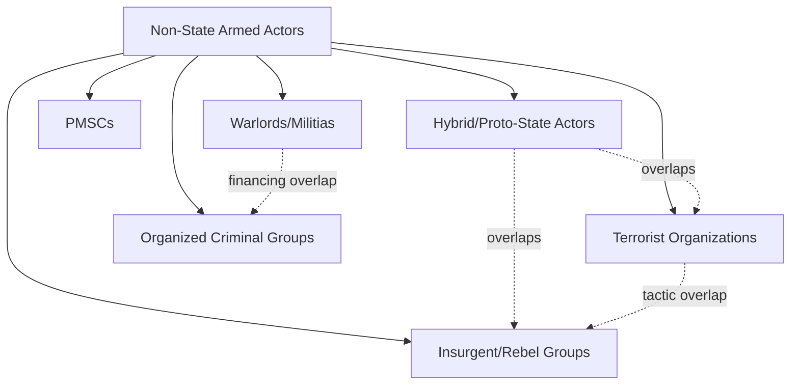

## Non-State Armed Actors and Transnational Terrorism

### Overview

Non-state armed actors (NSAAs) and transnational terrorism constitute a security studies domain distinct from, though overlapping with, interstate war and civil war/insurgency theory. The analytical focus shifts to actors that are not states, frequently operate across sovereign borders, and often deliberately reject the Westphalian assumption of territorially bounded, state-monopolized violence. For geopolitical risk analysis, this domain underpins terrorism risk indices, kidnap-for-ransom and maritime piracy exposure models, sanctions/AML risk screening, and country-risk overlays tied to ungoverned or contested territory.

---

### Typology of Non-State Armed Actors

A useful classification distinguishes NSAAs by structure, objective, and relationship to territorial control, following typologies developed by scholars such as Phil Williams, Klejda Mulaj, and the UCDP Non-State Actor coding scheme.

- **Insurgent/rebel organizations:** Seek to capture or fragment state authority within a defined territory (e.g., FARC in Colombia, Taliban pre-2021). Overlaps heavily with civil war literature.
- **Terrorist organizations:** Defined functionally (see definitional debate below) by the deliberate use of violence against non-combatants to generate psychological effects and communicate a political message to an audience broader than the immediate victims.
- **Warlord/militia structures:** Locally rooted armed groups exercising de facto territorial control, often financed through resource extraction, taxation of populations, or criminal rents, with weaker ideological coherence than insurgent or terrorist organizations (Kimberly Marten's *Warlords: Strong-Arm Brokers in Weak States*, 2012).
- **Organized criminal armed groups:** Drug-trafficking organizations, transnational criminal networks (e.g., Mexican cartels, some West African trafficking networks) that deploy armed violence instrumentally to protect illicit revenue streams rather than to pursue territorial political control per se, though the line between cartel violence and insurgency has blurred in cases like Mexico ("criminal insurgency" debate, John Sullivan).
- **Private military and security companies (PMSCs):** Commercially contracted armed actors operating with varying degrees of state affiliation and accountability (e.g., historically Executive Outcomes, more recently the Wagner Group/Africa Corps), raising distinct governance and attribution questions.
- **Hybrid/proto-state actors:** Groups exercising quasi-state governance functions (taxation, courts, service provision) alongside armed insurgency, such as ISIS at its territorial peak (2014–2017) or Hezbollah's dual role as a Lebanese political party/social-service provider and armed non-state actor.

**Key Points**

- These categories are analytical, not mutually exclusive; many contemporary armed groups (Hezbollah, the Taliban, some jihadist "provinces") combine insurgent, terrorist, and proto-state governance functions simultaneously.

---

### Definitional Debates: What Counts as Terrorism

There is no single, universally agreed legal or academic definition of terrorism; this is a well-documented and persistent feature of the field, not an oversight.

- **US State Department / legal-code definitions** typically emphasize premeditated, politically motivated violence against non-combatant targets by sub-national groups or clandestine agents.
- **Academic consensus definitions** (Alex Schmid's widely cited compilation and definitional synthesis work for UN and academic use) generally converge on core elements: (1) use or threat of violence, (2) deliberate targeting of or deliberate disregard for non-combatants, (3) intent to generate psychological/communicative effects beyond immediate victims, (4) sub-state or clandestine actor status.
- **"One man's terrorist is another man's freedom fighter" problem:** Definitional contestation is not merely semantic — it has direct legal and diplomatic consequences (designation regimes, extradition treaties, sanctions), and state practice in applying the terrorism label is widely documented as inconsistent and politically inflected. [Unverified: the degree of inconsistency varies by jurisdiction and specific case, and is itself a subject of ongoing academic and policy debate]
- **State terrorism debate:** Some scholars (Ruth Blakeley, Michael Stohl) argue that state violence against civilian populations, when it shares the core definitional elements above, should also be classified as terrorism — a position rejected by most standard legal/policy definitions, which reserve the term for sub-state actors.

---

### Theories of Terrorist Organization Behavior

#### Strategic Logic and Rational Choice Models

- **Robert Pape's strategic logic of suicide terrorism** (*Dying to Win*, 2005): Argues that suicide terrorism is a strategically rational tactic employed predominantly (in Pape's dataset) in response to perceived foreign military occupation, used to coerce a stronger occupying power to withdraw, rather than being primarily explained by religious ideology alone. This claim has been contested (e.g., by scholars emphasizing organizational and ideological variables more heavily), and remains an area of active empirical debate. [Unverified: Pape's occupation-centric thesis is influential but not universally accepted; competing explanations emphasizing organizational competition and religious/ideological variables retain significant support in the literature]
- **Coercive bargaining model of terrorism** (Andrew Kydd and Barbara Walter, "The Strategies of Terrorism," 2006): Frames terrorism as a signaling/bargaining strategy analogous to interstate coercive bargaining (Schelling logic), identifying five strategic logics: attrition (raising the costs of maintaining a policy), intimidation (demonstrating capacity to punish), provocation (goading a government into a disproportionate, radicalizing overreaction), spoiling (undermining moderate factions during peace negotiations), and outbidding (competing with rival factions for a constituency's support by demonstrating greater militancy).
- **Organizational competition/outbidding theory** (Mia Bloom's extension in *Dying to Kill*, 2005): Terrorist groups operating in a competitive marketplace for a constituency's support may escalate to more extreme tactics (including suicide attacks) to outbid rival factions and demonstrate superior commitment/effectiveness.

#### Radicalization and Recruitment

- **Individual-level radicalization models** (Clark McCauley and Sophia Moskalenko's "staircase"/pyramid model, *Friction*, 2011): Frame radicalization as a graduated process moving individuals from sympathizer through increasing commitment stages toward operational involvement, driven by a combination of grievance, group dynamics, and identity-seeking mechanisms, rather than a single "radicalization trigger."
- **Social network and small-group dynamics** (Marc Sageman's *Understanding Terror Networks*, 2004): Emphasizes that recruitment into jihadist networks frequently occurs through pre-existing social bonds (friendship, kinship, mosque or prison networks) rather than top-down organizational recruitment, framing terrorist networks as more decentralized and socially embedded than hierarchical-command models suggest.
- **Relative deprivation and identity-based grievance models:** Extend broader social-movement theory (grievance, perceived injustice, in-group/out-group identity threat) to explain individual susceptibility to radicalizing narratives, though critics note that most individuals experiencing comparable grievance conditions do not radicalize, implying the presence of additional necessary (but not individually sufficient) conditions. [Inference: the "necessary but not sufficient" framing reflects a widely noted empirical puzzle in radicalization studies rather than a resolved causal model]

#### Organizational Lifecycle and Decline

- **Audrey Kurth Cronin's "How Terrorism Ends"** (2009) framework identifies multiple pathways to organizational decline/termination: decapitation of leadership, negotiated settlement, achievement of goals (rare), organizational implosion/factional splintering, repression, reorientation toward electoral/political participation, and defeat through military force — with Cronin's comparative analysis suggesting decapitation alone is frequently insufficient to end an organization absent other structural pressures.
- **Jacob Shapiro's principal-agent/organizational-economics framework** (*The Terrorist's Dilemma*, 2013): Models terrorist organizations as bureaucracies facing an inherent trade-off between operational security (favoring decentralized, low-communication cell structures) and organizational control (favoring centralized command, record-keeping, and internal discipline) — a trade-off documented empirically through captured internal organizational records (e.g., al-Qaeda in Iraq documents).

---

### Financing Mechanisms

- **State sponsorship:** Historical and contemporary examples include Iranian support for Hezbollah, and various Cold War-era state-sponsored proxy financing arrangements; state sponsorship provides more durable/sophisticated capability but also creates state-accountability leverage points (sanctions, diplomatic pressure) for counter-financing strategy.
- **Illicit economy taxation and extraction:** Groups such as ISIS at territorial peak generated substantial revenue through oil smuggling, taxation of populations under control, extortion, and antiquities trafficking; the Taliban's historical and current reliance on opium-poppy taxation is extensively documented by UNODC and academic sources.
- **Kidnap-for-ransom (KFR):** A significant revenue stream for groups including al-Qaeda in the Islamic Maghreb (AQIM) and various Sahel-based actors; KFR risk is a direct input into commercial kidnap/ransom insurance underwriting and travel-security risk models.
- **Diaspora and charitable-front financing:** Politically mobilized diaspora networks and nominally charitable organizations have historically served as financing conduits (documented in various FATF and US Treasury designations), prompting the international Financial Action Task Force (FATF) framework for countering the financing of terrorism (CFT).
- **Criminal-terror nexus:** Increasing scholarly and policy attention (e.g., work by Louise Shelley, UNODC reporting) to convergence between organized criminal trafficking networks (narcotics, arms, human trafficking) and terrorist/insurgent financing, particularly in weak-governance regions such as the Sahel.

---

### Networks, Franchising, and Transnational Structure

- **Al-Qaeda's "core-and-affiliate" franchise model:** Following the loss of the Afghan sanctuary post-2001, al-Qaeda evolved toward a decentralized model of formally affiliated regional franchises (AQAP in Yemen, AQIM in the Maghreb, al-Shabaab's historical affiliation in Somalia) with varying degrees of operational autonomy from the "core" leadership, alongside looser "inspired" cells with no formal organizational linkage.
- **ISIS's "provinces" (wilayat) model:** At its territorial peak, ISIS extended a formalized provincial structure to affiliated groups across multiple regions (Libya, Sinai, West Africa/ISWAP, Khorasan/ISKP), combining centralized branding/media coordination with varying degrees of local operational autonomy; the Islamic State Khorasan Province (ISKP/ISIS-K) has demonstrated significant operational reach in Afghanistan/Central and South Asia in recent years.
- **Leaderless resistance / lone-actor terrorism** (a concept with origins in white-supremacist strategic writing, notably Louis Beam, later applied analytically to jihadist-inspired lone-actor attacks): Describes a decentralized model in which ideologically aligned individuals act without direct organizational command or communication, complicating both intelligence detection (absence of network signals) and attribution.
- **Networked terrorism/"netwar" concept** (John Arquilla and David Ronfeldt, RAND, 1990s–2000s): Argued that information-age technologies enable violent non-state actors to organize in flatter, more resilient network structures resistant to traditional hierarchical decapitation strategies, an early articulation of themes later central to social-media-era radicalization and online-network analysis.

---

### Counterterrorism Strategy Frameworks

- **Kinetic/military counterterrorism:** Direct action (raids, drone strikes, special operations targeting) aimed at leadership decapitation and capability degradation; effectiveness is contested in the literature — some studies find leadership decapitation disrupts operational tempo in the short term, while Cronin's broader historical analysis suggests decapitation alone rarely produces organizational collapse absent complementary pressures.
- **Countering Violent Extremism (CVE) / Prevention of Violent Extremism (PVE):** Policy frameworks (endorsed in UN Secretary-General's 2015 Plan of Action) emphasizing "soft" preventive measures — community engagement, counter-messaging, deradicalization/disengagement programming, addressing structural grievance drivers — as complements to kinetic approaches; empirical evaluation of CVE program effectiveness remains methodologically difficult and contested, given challenges in establishing counterfactuals and measuring successful non-radicalization. [Unverified: rigorous, methodologically robust impact evaluations of CVE programming remain relatively scarce in the published literature, a limitation widely acknowledged by practitioners and scholars]
- **Financial counterterrorism (CFT):** FATF-coordinated international standards for terrorist-financing detection, asset freezing, and financial-institution reporting obligations; UN Security Council sanctions regimes (e.g., the ISIL (Da'esh) and Al-Qaida Sanctions List) operationalize targeted financial and travel restrictions against designated individuals/entities.
- **Legal/prosecutorial counterterrorism:** Domestic criminal prosecution frameworks, material-support statutes, and international mechanisms; contested trade-offs exist between criminal-justice and military/detention paradigms (e.g., debates over Guantanamo detention versus civilian prosecution).
- **Deradicalization and disengagement programming:** Distinguished analytically (John Horgan) — *disengagement* refers to behavioral cessation of violent activity, while *deradicalization* refers to genuine ideological change; programs (e.g., Saudi Arabia's Munasaha program, various European rehabilitation initiatives) vary substantially in design and documented outcomes.

---

### Comparative Table: Strategic Logics of Terrorism (Kydd & Walter Framework)

| Strategic Logic | Target Audience | Mechanism | Illustrative Context |
| --- | --- | --- | --- |
| Attrition | Government/public of target state | Raise perceived cost of maintaining a policy | Sustained bombing campaigns against occupying forces |
| Intimidation | Local population | Demonstrate capacity to punish non-compliance | Enforcing compliance in contested territory |
| Provocation | Government of target state | Goad disproportionate government overreaction, radicalizing bystanders | Attacks designed to trigger harsh state crackdowns |
| Spoiling | Moderate factions within own constituency | Undermine competing peace/negotiation processes | Attacks timed to derail ongoing negotiations |
| Outbidding | Rival factions / own constituency | Demonstrate superior militancy/commitment | Competition among factions for popular support |

---

### Application to Geopolitical Risk Analysis

**Example**

A corporate security or sovereign-risk team assessing terrorism exposure in a given jurisdiction (e.g., Sahel operations, Red Sea shipping routes, or a Southeast Asian market with residual ISIS-affiliate activity) would typically integrate:

1. **Actor mapping:** Identify which NSAA typology applies (insurgent, terrorist, hybrid, criminal) since financing, tactics, and territorial behavior differ systematically by type.
2. **Financing and network analysis:** Assess whether the group relies on state sponsorship (creating diplomatic-leverage points), illicit-economy taxation (creating supply-chain/logistics exposure), or KFR (direct implication for personnel travel-security protocols).
3. **Strategic-logic diagnosis (Kydd-Walter):** Determine whether recent attack patterns suggest attrition, provocation, or outbidding logic, since this affects forecast of future targeting patterns (e.g., outbidding dynamics predict escalation risk during periods of factional competition).
4. **Territorial control assessment:** Following Kalyvas-style logic (see civil war dynamics), determine whether the group exercises consolidated territorial control (associated with more selective, predictable violence) or operates in contested space (associated with higher indiscriminate-violence risk).
5. **Sanctions/AML screening:** Cross-reference UN, OFAC, and FATF-aligned designation lists for compliance exposure in financial-services and trade-finance risk products.

---

### Diagrammatic Summary: Terrorist Organization Strategic Decision Space

<svg xmlns="http://www.w3.org/2000/svg" viewBox="0 0 900 500" font-family="Arial, sans-serif">
<text x="450" y="30" font-size="20" font-weight="bold" text-anchor="middle" fill="#1a1a2e">Terrorist Organization Strategic Decision Space (svg_diagram)</text>
<rect x="340" y="60" width="220" height="80" rx="8" fill="#1a1a2e" stroke="#000" stroke-width="2" />
<text x="450" y="90" font-size="14" font-weight="bold" text-anchor="middle" fill="#ffffff">Organizational Goals</text>
<text x="450" y="112" font-size="10" text-anchor="middle" fill="#cccccc">Political change, territorial control,</text>
<text x="450" y="126" font-size="10" text-anchor="middle" fill="#cccccc">constituency support</text>

<rect x="20" y="190" width="150" height="80" rx="6" fill="#2b3a67" stroke="#1a1a2e" stroke-width="2" />
<text x="95" y="215" font-size="12" font-weight="bold" text-anchor="middle" fill="#fff">Attrition</text>
<text x="95" y="235" font-size="9" text-anchor="middle" fill="#ddd">Raise cost of</text>
<text x="95" y="248" font-size="9" text-anchor="middle" fill="#ddd">status quo policy</text>
<rect x="190" y="190" width="150" height="80" rx="6" fill="#2b3a67" stroke="#1a1a2e" stroke-width="2" />
<text x="265" y="215" font-size="12" font-weight="bold" text-anchor="middle" fill="#fff">Intimidation</text>
<text x="265" y="235" font-size="9" text-anchor="middle" fill="#ddd">Enforce local</text>
<text x="265" y="248" font-size="9" text-anchor="middle" fill="#ddd">compliance</text>
<rect x="360" y="190" width="150" height="80" rx="6" fill="#2b3a67" stroke="#1a1a2e" stroke-width="2" />
<text x="435" y="215" font-size="12" font-weight="bold" text-anchor="middle" fill="#fff">Provocation</text>
<text x="435" y="235" font-size="9" text-anchor="middle" fill="#ddd">Trigger state</text>
<text x="435" y="248" font-size="9" text-anchor="middle" fill="#ddd">overreaction</text>
<rect x="530" y="190" width="150" height="80" rx="6" fill="#2b3a67" stroke="#1a1a2e" stroke-width="2" />
<text x="605" y="215" font-size="12" font-weight="bold" text-anchor="middle" fill="#fff">Spoiling</text>
<text x="605" y="235" font-size="9" text-anchor="middle" fill="#ddd">Undermine rival</text>
<text x="605" y="248" font-size="9" text-anchor="middle" fill="#ddd">peace process</text>
<rect x="700" y="190" width="150" height="80" rx="6" fill="#2b3a67" stroke="#1a1a2e" stroke-width="2" />
<text x="775" y="215" font-size="12" font-weight="bold" text-anchor="middle" fill="#fff">Outbidding</text>
<text x="775" y="235" font-size="9" text-anchor="middle" fill="#ddd">Demonstrate</text>
<text x="775" y="248" font-size="9" text-anchor="middle" fill="#ddd">superior militancy</text>
<line x1="440" y1="140" x2="95" y2="190" stroke="#333" stroke-width="1.5" marker-end="url(#arrow3)" />
<line x1="440" y1="140" x2="265" y2="190" stroke="#333" stroke-width="1.5" marker-end="url(#arrow3)" />
<line x1="450" y1="140" x2="435" y2="190" stroke="#333" stroke-width="1.5" marker-end="url(#arrow3)" />
<line x1="460" y1="140" x2="605" y2="190" stroke="#333" stroke-width="1.5" marker-end="url(#arrow3)" />
<line x1="460" y1="140" x2="775" y2="190" stroke="#333" stroke-width="1.5" marker-end="url(#arrow3)" />
<rect x="300" y="330" width="300" height="90" rx="8" fill="#8c1c1c" stroke="#1a1a2e" stroke-width="2" />
<text x="450" y="358" font-size="13" font-weight="bold" text-anchor="middle" fill="#fff">Counterterrorism Response</text>
<text x="450" y="378" font-size="10" text-anchor="middle" fill="#f0d0d0">Kinetic / CVE / Financial (CFT) / Legal</text>
<text x="450" y="394" font-size="10" text-anchor="middle" fill="#f0d0d0">Determines organizational decline pathway</text>
<line x1="265" y1="270" x2="400" y2="330" stroke="#333" stroke-width="1.5" marker-end="url(#arrow3)" />
<line x1="605" y1="270" x2="500" y2="330" stroke="#333" stroke-width="1.5" marker-end="url(#arrow3)" />
</svg>

**Conclusion**

Non-state armed actors and transnational terrorism represent a heterogeneous analytical category spanning insurgents, terrorist organizations, warlords, criminal armed groups, and hybrid proto-state actors — categories that frequently overlap in practice. The dominant theoretical frameworks (Kydd-Walter's strategic-bargaining logic, Cronin's organizational-decline pathways, Shapiro's security-control organizational trade-off, and Sageman's network-embeddedness recruitment model) converge on treating terrorist violence as instrumentally purposive rather than simply irrational or purely ideological, while acknowledging substantial contested ground regarding radicalization drivers and counterterrorism-program effectiveness. For risk practitioners, accurate actor typology and financing-mechanism identification are prerequisites for translating this academic literature into operational threat and exposure assessments. [Inference: this practitioner-oriented synthesis reflects general applied risk-analysis practice rather than a single agreed disciplinary standard]

**Related Topics**

- Kydd and Walter's strategic logics of terrorism (attrition, intimidation, provocation, spoiling, outbidding)
- Cronin's pathways to terrorist organizational decline
- Al-Qaeda and ISIS franchise/network structural models
- Radicalization theory: McCauley-Moskalenko staircase model and Sageman's network approach
- Counter-financing of terrorism (CFT) and FATF standards
- Criminal-terror nexus and narco-insurgency dynamics
- Private military and security companies (PMSCs) and the Wagner Group/Africa Corps case
- Countering Violent Extremism (CVE) program design and evaluation challenges
- Kidnap-for-ransom (KFR) risk modeling and commercial insurance underwriting
- Hezbollah and Taliban as hybrid governance-insurgent-terrorist actors
- Lone-actor terrorism and leaderless resistance models
- UN sanctions regimes and terrorist-entity designation processes
- Deradicalization vs. disengagement program typologies (Horgan)