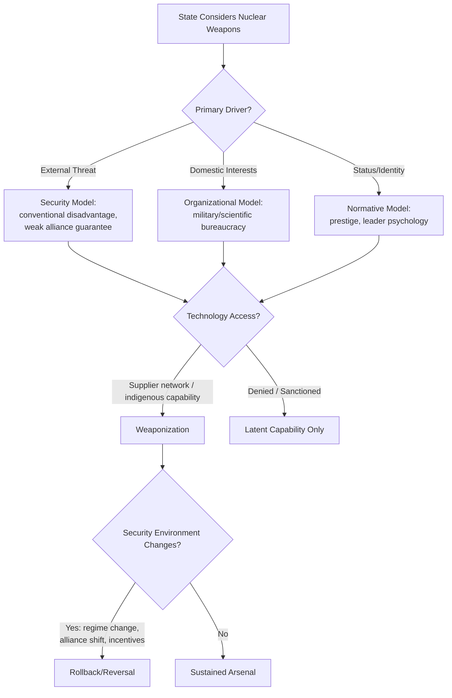

## Nuclear Proliferation and Deterrence Theory

### Overview

Nuclear proliferation and deterrence theory addresses two intertwined but analytically distinct questions: why states acquire (or forgo) nuclear weapons, and how the existence of nuclear arsenals shapes strategic interaction, crisis behavior, and the probability of war. This domain sits at the intersection of security studies, strategic theory, and arms control policy, and is central to contemporary geopolitical risk analysis of nuclear-armed and nuclear-aspirant states (North Korea, Iran, India-Pakistan, and great-power strategic stability among the US, Russia, and China).

---

### Theories of Nuclear Proliferation

#### Security-Model Explanations

- **Security/threat-based proliferation theory** (Scott Sagan's "three models" framework, and earlier work by Kenneth Waltz): States pursue nuclear weapons primarily in response to acute external security threats — a conventional-military disadvantage relative to an adversary, or the absence of a credible extended-deterrence guarantee from an ally. Classic cases cited: Pakistan's nuclearization following the 1971 war and India's 1974 test; Israel's presumed arsenal amid regional threat perception.
- **Neorealist "n-th country" proliferation logic:** Kenneth Waltz argued (controversially) that nuclear proliferation could, in some circumstances, be stabilizing because it replicates the Cold War's mutual-deterrence logic at a regional level — a position often summarized as "more may be better," directly contested by Scott Sagan (see organizational-model critique below). [Unverified: this remains one of the most actively contested normative and empirical debates in the proliferation literature, with no scholarly consensus]

#### Domestic/Organizational-Model Explanations

- **Domestic politics model** (Sagan): Nuclear programs can be driven by domestic bureaucratic, military, and scientific-establishment interests (parochial budgetary and prestige incentives) independent of, or in addition to, external security logic — nuclear weapons programs as products of interested domestic coalitions rather than purely unitary-rational state responses to threat.
- **Organizational-safety critique of "n-th country stability":** Sagan's core counter to Waltz argues that military organizations managing nuclear arsenals are subject to standard organizational pathologies (normal accidents theory, drawing on Charles Perrow and Scott Sagan's *The Limits of Safety*, 1993) — parochial interests, limited civilian oversight, routine-based rather than optimized crisis procedures — making new nuclear states more accident- and miscalculation-prone than idealized rational-deterrence models assume.

#### Normative/Identity-Model Explanations

- **Prestige and identity-based proliferation theory** (Scott Sagan's third model; also associated with work by Jacques Hymans on leader psychology): Nuclear weapons acquisition can function as a marker of great-power status or modern-state identity independent of strict military necessity — frequently cited regarding France's and India's programs, where prestige/status considerations are argued to have been at least as salient as narrow threat-response calculation.
- **Jacques Hymans's leader psychology model** (*The Psychology of Nuclear Proliferation*, 2006): Argues that a specific leader psychological profile — combining "oppositional nationalism" with self-perceived national vulnerability — is a strong predictor of a state's decision to pursue weaponization, as opposed to merely developing latent technical capability.

#### Supply-Side and Technology-Diffusion Models

- **Nuclear supplier network and technology diffusion** (Matthew Kroenig, Matthew Fuhrmann): Emphasizes the role of external sensitive-technology transfer (from established nuclear states or black-market networks such as the A.Q. Khan network supplying Pakistan, Libya, North Korea, and reportedly Iran) as a necessary enabling condition for proliferation, independent of a state's underlying motivation.
- **Nonproliferation regime effectiveness debate:** The Treaty on the Non-Proliferation of Nuclear Weapons (NPT, 1968) and associated International Atomic Energy Agency (IAEA) safeguards/verification architecture are argued by some scholars (Fuhrmann) to meaningfully raise the cost and slow the pace of proliferation, while critics note persistent non-signatory and treaty-violation cases (Israel, India, Pakistan never joined as non-nuclear-weapons states; North Korea withdrew in 2003).

#### Reversal and Rollback ("Nuclear Reversal")

- **Denuclearization/rollback cases:** South Africa's voluntary dismantlement (early 1990s), post-Soviet Ukraine, Belarus, and Kazakhstan's transfer/relinquishment of inherited Soviet arsenals (Budapest Memorandum, 1994), and Libya's 2003 program abandonment are the principal empirical cases studied for reversal dynamics, generally attributed to a combination of changed security environment, regime transition, and negotiated security/economic incentives. [Inference: the relative weighting of security-environment change versus negotiated incentive in each specific reversal case remains debated among specialists]

---

### Classical Deterrence Theory

#### Foundational Concepts

- **Deterrence vs. compellence** (Thomas Schelling, *Arms and Influence*, 1966): Deterrence aims to prevent an adversary from taking an action by threatening unacceptable consequences; compellence aims to force an adversary to take or stop an action already underway — nuclear deterrence theory is primarily concerned with the former.
- **Credibility, capability, and communication:** Classical deterrence theory (Schelling; Glenn Snyder's *Deterrence and Defense*, 1961) holds that effective deterrence requires (1) sufficient retaliatory capability to inflict unacceptable costs, (2) resolve/credibility that the threat will actually be carried out, and (3) clear communication of both to the adversary.
- **Mutual Assured Destruction (MAD):** The condition in which two nuclear-armed adversaries each possess secure second-strike capability sufficient to inflict devastating retaliatory damage regardless of who strikes first, theoretically removing rational incentive for either side to initiate nuclear use — the dominant framing of US-Soviet strategic stability from the mid-1960s onward.
- **Second-strike survivability:** The core technical requirement underlying MAD's stability logic — arsenals must be survivable against a first strike (via mobility, concealment, hardening, or dispersal — submarine-launched ballistic missiles being the paradigmatic survivable leg) for deterrence to hold without incentivizing preemption.

#### Deterrence Stability Concepts

- **Crisis stability:** A strategic relationship is "crisis stable" when neither side has incentive to strike first during an acute crisis because retaliatory capability is assured to survive; instability arises when first-strike advantages exist (vulnerable, non-survivable forces) creating "use it or lose it" pressures.
- **Arms race stability:** A relationship is "arms-race stable" when neither side gains meaningful strategic advantage from unilateral arms buildup, reducing incentive for competitive expansion; instability arises when marginal additions to one side's arsenal meaningfully degrade the other's retaliatory assurance.
- **Extended deterrence:** The credibility problem of a nuclear power's commitment to use (or threaten to use) its arsenal in defense of a third-party ally — the central strategic puzzle underlying US alliance commitments to NATO members and to South Korea/Japan, since a defender's willingness to risk nuclear retaliation on behalf of an ally's territory (rather than its own) is inherently less certain and less credible. Schelling's concept of "the threat that leaves something to chance" addresses how deliberately incomplete control over escalation can paradoxically enhance credibility.

#### Escalation Theory

- **Herman Kahn's escalation ladder** (*On Escalation*, 1965): A conceptual framework depicting graduated rungs of crisis and conflict intensity from sub-crisis maneuvering through limited conventional war, tactical nuclear use, and up to general strategic nuclear exchange — used analytically (not as a literal predictive model) to think through where and how escalation control might be exercised or lost.
- **Stability-instability paradox** (Glenn Snyder, 1965; extensively applied to South Asia by scholars including S. Paul Kapur): The proposition that stable mutual deterrence at the strategic/nuclear level may paradoxically increase the likelihood of limited, sub-conventional, or proxy conflict, because both sides calculate that nuclear risk effectively caps escalation, freeing them to engage in lower-level provocations without fear of triggering all-out war. This framework is centrally invoked in India-Pakistan crisis analysis (e.g., Kargil 1999, post-2008 Mumbai attacks dynamics, 2019 Balakot crisis).
- **Inadvertent/accidental escalation risk:** A distinct literature (Barry Posen; more recently work on cyber-nuclear entanglement by James Acton) examines how conventional-nuclear entanglement (dual-use delivery systems, shared early-warning/command infrastructure, cyber vulnerabilities to nuclear command-and-control) could generate escalation to nuclear use through misperception or system compromise rather than deliberate strategic choice.

---

### Critiques and Alternatives to Rational Deterrence

- **Psychological/misperception critiques** (Richard Ned Lebow and Janice Gross Stein's extensive critique of rational deterrence theory): Argue that Cold War crisis case studies (Cuban Missile Crisis and others) reveal significant deviations from rational-actor assumptions — leaders frequently misjudged adversary intentions, made decisions under severe cognitive and organizational stress, and were driven substantially by domestic political and psychological pressures rather than clean cost-benefit deterrence calculation.
- **Organizational/normal accidents critique** (Sagan, *The Limits of Safety*): Documents multiple historical near-miss incidents involving nuclear command-and-control systems, arguing that the complexity and tight coupling of nuclear weapons organizations make them susceptible to exactly the kind of normal-accident failure modes that idealized rational-deterrence theory assumes away.
- **Constructivist critiques:** Scholars such as Nina Tannenwald (*The Nuclear Taboo*, 2007) argue that non-use of nuclear weapons since 1945 is better explained by the emergence of a powerful normative taboo against nuclear use — a socially constructed prohibition — than by pure rational cost-benefit deterrence calculation alone, since purely material deterrence logic would in principle permit tactical nuclear use in some observed crisis scenarios that never in fact escalated to nuclear use.

---

### Arms Control and Strategic Stability Architecture

- **Bilateral US-Russia arms control legacy:** SALT I/II, the Anti-Ballistic Missile (ABM) Treaty (1972, US withdrawal 2002), START I/II, New START (2010, extended to 2026) constitute the primary historical and still-partially-active bilateral framework limiting deployed strategic warheads and delivery systems; the Intermediate-Range Nuclear Forces (INF) Treaty (1987) was terminated by US withdrawal in 2019 citing Russian noncompliance.
- **Multilateral nonproliferation architecture:** The NPT (1968) rests on a three-pillar bargain — nonproliferation by non-nuclear-weapon states, peaceful nuclear energy cooperation, and a good-faith disarmament commitment by nuclear-weapon states (Article VI) — a bargain whose perceived fairness and durability remains contested, particularly by non-nuclear states citing insufficient disarmament progress.
- **IAEA safeguards and verification:** Technical inspection and material-accounting regime underpinning NPT compliance verification; the Additional Protocol (post-1990s, strengthened after Iraq and North Korea revelations) expands IAEA access rights, though adoption remains uneven across member states.
- **Iran nuclear framework (JCPOA, 2015):** The Joint Comprehensive Plan of Action imposed enrichment, stockpile, and verification constraints on Iran's program in exchange for sanctions relief; the US withdrew in 2018, and the deal's subsequent status has evolved substantially — analysts should verify current program status and any renewed negotiation framework via current reporting given the pace of change in this specific case. [Unverified: Iran's enrichment level, stockpile size, and diplomatic status are subject to frequent change and require current verification for any time-sensitive risk assessment]
- **North Korea's proliferation trajectory:** Withdrew from the NPT in 2003, conducted its first nuclear test in 2006, and has since expanded warhead and delivery-system capability including intercontinental-range systems; North Korea is generally treated in the current literature as a de facto (though not NPT-recognized) nuclear-weapons state, though the precise current size and sophistication of its arsenal involves significant estimation uncertainty. [Unverified: publicly available estimates of North Korea's warhead inventory and delivery-system reliability vary across intelligence and academic sources and should be checked against current authoritative reporting for time-sensitive analysis]

---

### Comparative Table: Deterrence Stability Concepts

| Concept | Core Logic | Key Theorist(s) | Risk-Analysis Application |
| --- | --- | --- | --- |
| Mutual Assured Destruction | Secure second-strike removes rational incentive to strike first | Schelling, McNamara-era doctrine | Baseline stability assumption for major nuclear dyads |
| Crisis Stability | No first-strike incentive during acute crisis | Snyder, Schelling | Assessing vulnerability of adversary's retaliatory forces |
| Stability-Instability Paradox | Strategic deterrence enables sub-conventional conflict | Snyder, Kapur | Central to India-Pakistan and proxy-conflict analysis |
| Extended Deterrence Credibility | Ally defense commitment credibility under nuclear risk | Schelling, contemporary NATO/Indo-Pacific literature | Alliance-commitment risk in Taiwan, Baltic states scenarios |
| Nuclear Taboo | Normative prohibition supplements material deterrence | Tannenwald | Assessing likelihood of any tactical nuclear use threshold-crossing |
| Organizational Accident Risk | Command-and-control complexity creates accident potential | Sagan, Perrow | Assessing miscalculation/accident risk in newer nuclear states |

---

### Application to Geopolitical Risk Analysis

**Example**

Assessing nuclear-related escalation risk in a contemporary flashpoint (e.g., an India-Pakistan crisis, or a Taiwan Strait contingency involving a nuclear-armed US ally-guarantor) typically requires layering:

1. **Proliferation-driver diagnosis:** For an aspirant state, assess whether program drivers are primarily security-based (suggesting rollback is possible if the threat environment changes) or prestige/identity-based (suggesting greater program durability regardless of external inducements).
2. **Deterrence-stability assessment:** Evaluate whether the relevant dyad exhibits crisis stability (survivable retaliatory forces on both sides) or crisis instability (vulnerable forces creating "use it or lose it" pressure).
3. **Stability-instability paradox application:** For dyads with established mutual deterrence (India-Pakistan), assess elevated risk of limited/sub-conventional provocation precisely because strategic-level deterrence is assumed to hold — the analytical inference runs opposite to naive assumptions that "nuclear stability" implies low overall conflict risk.
4. **Command-and-control risk overlay:** For newer or less institutionally mature nuclear states, weight accident/miscalculation risk (Sagan's organizational critique) more heavily than for established, procedurally mature nuclear powers.
5. **Extended-deterrence credibility assessment:** For alliance-contingency scenarios (Taiwan, NATO's eastern flank), assess the credibility gap inherent in extended-deterrence commitments as a distinct escalation-risk variable separate from the primary dyad's bilateral deterrence relationship.

---

### Diagrammatic Summary: Nuclear Deterrence Stability Logic

<svg xmlns="http://www.w3.org/2000/svg" viewBox="0 0 900 480" font-family="Arial, sans-serif">
<text x="450" y="30" font-size="20" font-weight="bold" text-anchor="middle" fill="#1a1a2e">Nuclear Deterrence Stability Logic (svg_diagram)</text>
<rect x="60" y="70" width="240" height="100" rx="8" fill="#2b3a67" stroke="#1a1a2e" stroke-width="2" />
<text x="180" y="95" font-size="13" font-weight="bold" text-anchor="middle" fill="#fff">Secure Second-Strike</text>
<text x="180" y="118" font-size="10" text-anchor="middle" fill="#ddd">Survivable retaliatory forces</text>
<text x="180" y="134" font-size="10" text-anchor="middle" fill="#ddd">(SSBNs, mobile ICBMs, dispersal)</text>
<text x="180" y="150" font-size="10" text-anchor="middle" fill="#ddd">→ Crisis Stability</text>
<rect x="330" y="70" width="240" height="100" rx="8" fill="#41507a" stroke="#1a1a2e" stroke-width="2" />
<text x="450" y="95" font-size="13" font-weight="bold" text-anchor="middle" fill="#fff">Mutual Assured Destruction</text>
<text x="450" y="118" font-size="10" text-anchor="middle" fill="#ddd">No rational first-strike incentive</text>
<text x="450" y="134" font-size="10" text-anchor="middle" fill="#ddd">Strategic-level war deterred</text>
<text x="450" y="150" font-size="10" text-anchor="middle" fill="#ddd">Supplemented by nuclear taboo</text>
<rect x="600" y="70" width="240" height="100" rx="8" fill="#5a6a9a" stroke="#1a1a2e" stroke-width="2" />
<text x="720" y="95" font-size="13" font-weight="bold" text-anchor="middle" fill="#fff">Stability-Instability Paradox</text>
<text x="720" y="118" font-size="10" text-anchor="middle" fill="#ddd">Strategic deterrence holds, BUT</text>
<text x="720" y="134" font-size="10" text-anchor="middle" fill="#ddd">enables sub-conventional/proxy</text>
<text x="720" y="150" font-size="10" text-anchor="middle" fill="#ddd">conflict below nuclear threshold</text>
<line x1="180" y1="170" x2="180" y2="230" stroke="#333" stroke-width="2" marker-end="url(#arrow4)" />
<line x1="450" y1="170" x2="450" y2="230" stroke="#333" stroke-width="2" marker-end="url(#arrow4)" />
<line x1="720" y1="170" x2="720" y2="230" stroke="#333" stroke-width="2" marker-end="url(#arrow4)" />
<rect x="150" y="240" width="600" height="90" rx="8" fill="#1a1a2e" stroke="#000" stroke-width="2" />
<text x="450" y="268" font-size="14" font-weight="bold" text-anchor="middle" fill="#fff">Risk Factors That Undermine Stability</text>
<text x="450" y="290" font-size="10" text-anchor="middle" fill="#ccc">Vulnerable forces / "use it or lose it" pressure / conventional-nuclear entanglement /</text>
<text x="450" y="306" font-size="10" text-anchor="middle" fill="#ccc">command-control complexity (organizational accident risk) / extended-deterrence credibility gaps</text>
<line x1="450" y1="330" x2="450" y2="390" stroke="#333" stroke-width="2" marker-end="url(#arrow4)" />
<rect x="330" y="400" width="240" height="60" rx="8" fill="#8c1c1c" stroke="#1a1a2e" stroke-width="2" />
<text x="450" y="425" font-size="13" font-weight="bold" text-anchor="middle" fill="#fff">Escalation / Crisis Risk</text>
<text x="450" y="445" font-size="10" text-anchor="middle" fill="#f0d0d0">Deliberate or inadvertent</text>
</svg>

**Conclusion**

Nuclear proliferation theory explains the *acquisition* decision through competing security, organizational, and normative/identity lenses, while deterrence theory explains the *strategic consequences* of nuclear possession through concepts of mutual assured destruction, crisis stability, and the stability-instability paradox. Contemporary scholarship increasingly integrates psychological, organizational, and constructivist critiques alongside classical rational-deterrence logic, recognizing that both proliferation decisions and deterrence stability are shaped by domestic politics, organizational pathology, and normative constraint as much as by pure strategic calculation. For risk practitioners, the stability-instability paradox is a particularly important — and counterintuitive — analytical tool, since it implies that successful strategic deterrence between nuclear rivals does not equate to low overall conflict risk, but may instead relocate conflict to lower-intensity, harder-to-forecast domains. [Inference: this integrative practitioner framing reflects a synthesis of multiple distinct academic literatures rather than a single unified theory endorsed by all cited scholars]

**Related Topics**

- Sagan's three models of nuclear proliferation (security, domestic, normative)
- Waltz-Sagan debate on proliferation and stability ("more may be better" controversy)
- Stability-instability paradox and South Asian nuclear crisis dynamics
- Extended deterrence credibility in NATO and Indo-Pacific alliance contexts
- Tannenwald's nuclear taboo and constructivist approaches to non-use
- Command-and-control vulnerabilities and organizational accident risk (Sagan, Perrow)
- NPT architecture, IAEA safeguards, and the Additional Protocol
- A.Q. Khan network and nuclear supply-side proliferation dynamics
- Iran's JCPOA trajectory and post-2018 diplomatic status
- North Korea's nuclear and missile program development
- Conventional-nuclear entanglement and inadvertent escalation risk
- Nuclear reversal and rollback case studies (South Africa, Libya, post-Soviet states)
- Escalation ladder theory (Kahn) and limited nuclear war scenarios
- Arms control treaty architecture: New START, INF Treaty termination, future negotiation prospects