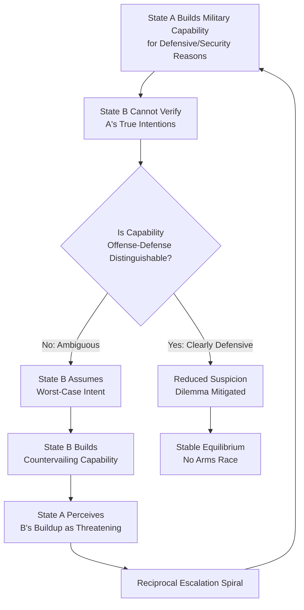

## Security Dilemmas and Arms Race Dynamics

### Overview

The security dilemma is one of the foundational analytical concepts in security studies, explaining how conflict and arms competition can arise between states even absent any inherently aggressive intent on either side, purely as a structural consequence of anarchy and uncertainty. Arms race dynamics represent the most extensively studied behavioral manifestation of the security dilemma, and both concepts are central to interpreting contemporary great-power competition (US-China military modernization, NATO-Russia force posture, missile-defense and hypersonic-weapons competition) in applied geopolitical risk analysis.

---

### The Security Dilemma: Core Concept

#### Origins and Definition

- **John Herz's original formulation** ("Idealist Internationalism and the Security Dilemma," 1950): Coined the term to describe how, under international anarchy, states seeking to increase their own security through military buildup inevitably appear threatening to other states, who respond with their own buildups — producing a spiral of tension and insecurity that leaves all parties no safer, and often less secure, than before they began.
- **Robert Jervis's formalization** ("Cooperation Under the Security Dilemma," *World Politics*, 1978): Provided the definitive modern theoretical elaboration, distinguishing the security dilemma from simple conflicts of interest — the defining feature is that both states may be *purely security-seeking* (not revisionist or expansionist) and conflict still emerges because neither can be certain of the other's intentions, and defensive measures are frequently indistinguishable from offensive preparations.
- **Structural (not psychological) origin:** Distinct from misperception-based theories of conflict (though the two interact), the security dilemma's core logic operates even under conditions of *accurate* mutual perception — the problem is not that states misjudge each other's intentions, but that they cannot be certain of them, and military capability itself is frequently ambiguous as to purpose.

#### Two Variables: Offense-Defense Balance and Differentiation

Jervis identifies two key variables that determine the *severity* of the security dilemma in any given strategic relationship:

1. **Offense-defense balance:** Whether prevailing military technology and doctrine favor the attacker or the defender. When offense is dominant (successful attack is comparatively easy and defense is comparatively hard), the security dilemma is most severe, because even purely defensive states have strong incentive to strike first or to acquire offensively-capable forces as insurance.
2. **Offense-defense differentiability:** Whether offensive and defensive weapons/postures are distinguishable from one another. When they are *not* distinguishable (a given weapon system or force posture could serve equally well for attack or defense), other states cannot infer intent from capability alone, deepening mutual suspicion regardless of actual purpose.

$$\text{Security Dilemma Severity} \propto \frac{\text{Offense Dominance}}{\text{Offense-Defense Distinguishability}}$$

This is Jervis's core analytic relationship expressed schematically: dilemma severity rises as offense dominance increases and falls as offense-defense distinguishability increases. The four resulting quadrants (Jervis's 2x2 typology) are foundational to subsequent security-studies pedagogy:

|  | Offense-Defense Distinguishable | Offense-Defense Indistinguishable |
| --- | --- | --- |
| **Defense Dominant** | Doubly stable: no arms race, status quo secure | Security dilemma exists but is not intense |
| **Offense Dominant** | Dilemma exists; arms races likely, but status-quo powers can signal intent via distinguishable postures | Doubly dangerous: intense security dilemma, high war probability, arms races likely severe |

**Key Points**

- Jervis's own illustrative historical application treats WWI-era military technology (dense rail networks favoring rapid offensive mobilization, indistinguishable mobilization-vs-attack postures) as an approximation of the "doubly dangerous" quadrant, contributing to the war-causation literature on 1914; this is a widely cited illustrative case in the literature rather than an uncontested causal claim, since 1914 causation remains multiply theorized. [Inference: treating 1914 as a clean illustration of the doubly-dangerous quadrant is a common pedagogical simplification; professional historians of July 1914 identify numerous additional causal factors]

---

### Spiral Model vs. Deterrence Model

A central strategic-theory debate concerns which interpretive model best fits a given adversarial relationship, since the two models generate opposite policy prescriptions.

- **Spiral model** (associated with Jervis, and earlier articulated implicitly in the security-dilemma literature): Interprets escalating tension as a self-reinforcing action-reaction dynamic driven by mutual fear and misperception rather than genuine aggressive intent; the appropriate policy response under this model is reassurance, restraint, and confidence-building measures, since matching an adversary's buildup will simply deepen the spiral.
- **Deterrence model** (associated with the broader classical-deterrence tradition, Schelling): Interprets an adversary's buildup as evidence of genuine revisionist or aggressive intent that must be met with resolve and matching capability, since appeasement or unilateral restraint under this model would be read as weakness and invite exploitation (the "Munich analogy" logic).
- **Diagnostic difficulty:** Jervis explicitly notes that policymakers frequently cannot be certain, in real time, which model correctly characterizes a given adversary — a status-quo power misapplying the deterrence model against a genuinely security-seeking adversary can *cause* the very spiral the spiral model predicts, while a status-quo power misapplying the spiral model against a genuinely revisionist adversary risks appeasement-driven exploitation. This diagnostic uncertainty is treated in the literature as a persistent, largely irreducible feature of crisis decision-making rather than a solvable measurement problem. [Unverified: no reliable ex ante indicator consistently distinguishes spiral-model from deterrence-model cases across the historical record; this remains a genuinely contested judgment call in real-world crisis assessment]

---

### Arms Race Theory

#### Definitions and Typology

- **Arms race (standard definition, following Colin Gray and Barry Buzan):** A progressive, competitive peacetime increase in military capability by two or more states, driven substantially by each side's response to the other's buildup rather than purely by independent internal factors.
- **Quantitative vs. qualitative arms races:** Quantitative races involve growth in the *number* of weapons systems/platforms; qualitative races involve competitive *technological* improvement (accuracy, survivability, stealth, range) without necessarily expanding raw numbers — contemporary US-China and US-Russia strategic competition is generally characterized as substantially qualitative (hypersonic weapons, missile defense, cyber/space capabilities, AI-enabled systems) relative to the largely quantitative US-Soviet Cold War buildup.

#### The Richardson Arms Race Model

Lewis Fry Richardson's mathematical model (1930s–1960s, most fully articulated in *Arms and Insecurity*, 1960) remains the canonical formal representation of reciprocal arms competition, expressed as a pair of coupled differential equations:

$$\frac{dx}{dt} = ky - \alpha x + g$$

$$\frac{dy}{dt} = lx - \beta y + h$$

Where $x$ and $y$ represent the armament levels of State A and State B respectively; $k$ and $l$ are "reaction coefficients" capturing how strongly each state responds to the other's armament level (the core action-reaction/security-dilemma mechanism); $\alpha$ and $\beta$ are "fatigue" or cost coefficients representing the economic/domestic constraint on indefinitely sustaining high armament levels; and $g$ and $h$ are "grievance" terms representing each state's armament drive independent of the rival's level (capturing non-reactive, domestically- or ambition-driven military spending).

**Key Points**

- Richardson's model produces distinct equilibrium behaviors depending on parameter values — a stable equilibrium (arms levels converge and stabilize), an unstable runaway race (arms levels diverge without bound, theoretically approximating historical cases such as the pre-WWI Anglo-German naval race), or various intermediate dynamics.
- The model's empirical fit to historical arms-race data has been extensively tested and is generally regarded in the field as a valuable *heuristic* and pedagogical tool for isolating the reactive versus autonomous drivers of military spending, rather than as a precise predictive instrument for any specific contemporary case. [Inference: this characterization — heuristic value without strong point-prediction reliability — reflects a widely shared assessment among quantitative security-studies scholars, though it is not a formally quantified consensus]

#### Alternative and Competing Explanations for Military Buildup

- **Technological determinism/innovation-driven buildup:** Some buildups are argued to be driven primarily by autonomous technological opportunity (a breakthrough capability becomes available) rather than reactive competition with a rival — relevant to assessing whether a given contemporary capability race (e.g., AI-enabled autonomous systems, hypersonics) is genuinely reactive/dyadic or substantially independently technology-driven.
- **Bureaucratic/organizational-interest models** (extending Allison's bureaucratic-politics logic to procurement): Military-industrial-bureaucratic coalitions may sustain or expand weapons programs for organizational/budgetary reasons that persist independent of the external threat environment — a domestic-politics-level complement to the systemic Richardson-style reactive model.
- **Prestige/status-driven buildup:** Some military capability acquisition (e.g., aircraft carrier programs, space-launch capability) is argued by some scholars to serve symbolic great-power-status functions in addition to, or instead of, strict military-utility calculation, echoing the identity/prestige literature also found in nuclear-proliferation theory.

---

### Arms Races and War: The Causal Question

A long-running empirical and theoretical debate asks whether arms races *cause* war, are merely *correlated* with underlying tensions that independently cause war, or in some cases actually help *prevent* war by clarifying relative capability and inducing caution.

- **Arms races as war-causing** (Samuel Huntington's early work; some readings of the pre-WWI naval race literature): Argues that competitive buildups generate mutual fear, create windows of relative advantage that tempt preventive strikes, and generally raise war probability through the spiral mechanism described above.
- **Arms races as symptom, not cause** (critique associated with various quantitative IR scholars, e.g. work building on Michael Wallace's and later replication studies of the "arms races and war" question): Argues that arms races frequently reflect *pre-existing* political rivalry and tension (the underlying dispute) rather than independently causing conflict — the correlation between arms races and war onset may substantially reflect this shared antecedent cause rather than a direct causal arrow from arms racing to war.
- **Michael Wallace's quantitative findings** (1979, subsequently contested and partially challenged in replication attempts by Paul Diehl and others): An influential and controversial early quantitative study argued that the presence of an arms race prior to a militarized dispute substantially increased the probability that the dispute would escalate to full-scale war, though subsequent methodological critiques (data-coding disputes, selection-effects concerns) have qualified confidence in the specific magnitude of this finding. [Unverified: the Wallace arms-race/war-escalation finding remains one of the most methodologically contested claims in the quantitative conflict literature, with meaningful disagreement over robustness across replication studies]
- **Deterrent/stabilizing function of some buildups:** Under the classical deterrence-model logic (as opposed to the spiral model), certain buildups — particularly those restoring rough parity or survivable second-strike capability — are argued to *reduce* rather than increase war probability, by removing an adversary's temptation to exploit a capability gap.

---

### Mitigating the Security Dilemma: Cooperative and Confidence-Building Approaches

- **Confidence and Security-Building Measures (CSBMs):** Institutionalized transparency mechanisms (prior notification of military exercises, observation rights, data exchanges) developed extensively within the Cold War-era Conference on Security and Cooperation in Europe (CSCE, later OSCE) framework, designed directly to address the offense-defense *distinguishability* variable in Jervis's model by making military activity more legible and less ambiguous to potential adversaries.
- **Arms control as dilemma-mitigation:** Formal arms-limitation agreements (SALT, START, CFE Treaty on conventional forces in Europe) function analytically as attempts to reduce both the *offense dominance* and *distinguishability* problems simultaneously — by capping force levels (reducing offense-dominant capability) and mandating verification/transparency (improving distinguishability).
- **Defensive defense/non-offensive defense concepts** (associated with Cold War-era strategic thought, e.g., work by Bjørn Møller and others): A doctrinal and force-structure design approach explicitly intended to configure military forces to be maximally effective for territorial defense while minimizing offensive/power-projection capability, directly targeting the distinguishability variable at the force-structure design level rather than through arms-control negotiation.
- **Institutionalist/liberal counter to pure structural pessimism** (Robert Keohane, Charles Glaser's "rational theory of international politics" refinement of defensive realism): Argues that under certain conditions — particularly high offense-defense distinguishability and low offense dominance — even purely self-interested, security-seeking states can achieve stable cooperative equilibria without a benevolent hegemon or supranational authority, softening the deterministic pessimism sometimes attributed to pure security-dilemma logic.

---

### Comparative Table: Security Dilemma Severity and Policy Implications

| Offense-Defense Condition | Dilemma Severity | Arms Race Likelihood | Recommended Policy Logic |
| --- | --- | --- | --- |
| Defense-dominant, distinguishable | Low | Low | Minimal intervention needed; natural stability |
| Defense-dominant, indistinguishable | Moderate | Moderate | CSBMs, transparency measures to aid distinguishability |
| Offense-dominant, distinguishable | Moderate-High | High | Arms control targeting offense-dominant systems specifically |
| Offense-dominant, indistinguishable | Very High ("doubly dangerous") | Very High | Comprehensive arms control + CSBMs + crisis-communication channels |

---

### Application to Geopolitical Risk Analysis

**Example**

Assessing whether a contemporary military competition (e.g., US-China Indo-Pacific force posture, or NATO-Russia force posture along the eastern flank) constitutes a genuine security-dilemma-driven spiral versus a deterrence-appropriate response to revisionist intent requires:

1. **Offense-defense balance assessment:** Evaluate whether contested-domain capabilities (long-range precision strike, hypersonic glide vehicles, counter-space weapons, cyber capabilities against critical infrastructure) are offense-dominant, since this shapes baseline dilemma severity independent of stated intent.
2. **Distinguishability assessment:** Assess whether specific systems (dual-use missile platforms capable of both conventional and nuclear payloads, ambiguous force postures near contested borders) are distinguishable as defensive versus offensive — dual-capable systems are a persistent, well-documented distinguishability problem in contemporary US-Russia and US-China strategic assessments.
3. **Spiral-vs-deterrence diagnostic:** Weigh available intelligence and behavioral indicators (rhetoric, doctrine publications, actual force employment in prior crises) to judge whether the adversary's buildup more plausibly reflects security-seeking response to perceived threat or genuinely revisionist ambition — while maintaining explicit humility about the inherent diagnostic uncertainty Jervis identifies.
4. **Richardson-style reactive vs. autonomous driver decomposition:** Distinguish, where data permits, how much of an observed buildup is genuinely reactive to the rival's capability (supporting spiral-model intervention via reassurance/CSBMs) versus autonomously driven by domestic bureaucratic, technological, or prestige factors (for which arms-control-style reciprocal measures may have limited leverage).
5. **CSBM and arms-control opportunity mapping:** Identify concrete institutional mechanisms (hotlines, prior-notification regimes, verification protocols) that could reduce the distinguishability problem in the specific contested domain, as a practical risk-mitigation recommendation distinct from purely military-balance assessment.

---

### Diagrammatic Summary: Jervis's Offense-Defense Typology

<svg xmlns="http://www.w3.org/2000/svg" viewBox="0 0 900 520" font-family="Arial, sans-serif">
<text x="450" y="30" font-size="20" font-weight="bold" text-anchor="middle" fill="#1a1a2e">Jervis's Offense-Defense Typology (svg_diagram)</text>

<line x1="150" y1="450" x2="750" y2="450" stroke="#333" stroke-width="2" />
<line x1="150" y1="450" x2="150" y2="80" stroke="#333" stroke-width="2" />
<text x="450" y="490" font-size="13" font-weight="bold" text-anchor="middle" fill="#1a1a2e">Offense-Defense Distinguishability →</text>
<text x="90" y="265" font-size="13" font-weight="bold" text-anchor="middle" fill="#1a1a2e" transform="rotate(-90 90 265)">Offense Dominance →</text>

<text x="230" y="470" font-size="11" text-anchor="middle" fill="#555">Low</text>

<text x="670" y="470" font-size="11" text-anchor="middle" fill="#555">High</text>

<text x="130" y="430" font-size="11" text-anchor="end" fill="#555">Low</text>

<text x="130" y="110" font-size="11" text-anchor="end" fill="#555">High</text>

<rect x="150" y="260" width="300" height="190" fill="#2b3a67" opacity="0.85" />
<text x="300" y="330" font-size="13" font-weight="bold" text-anchor="middle" fill="#fff">Doubly Stable</text>
<text x="300" y="350" font-size="10" text-anchor="middle" fill="#ddd">No arms race</text>
<text x="300" y="365" font-size="10" text-anchor="middle" fill="#ddd">Status quo secure</text>

<rect x="450" y="260" width="300" height="190" fill="#41507a" opacity="0.85" />
<text x="600" y="330" font-size="13" font-weight="bold" text-anchor="middle" fill="#fff">Moderate Dilemma</text>
<text x="600" y="350" font-size="10" text-anchor="middle" fill="#ddd">Dilemma exists</text>
<text x="600" y="365" font-size="10" text-anchor="middle" fill="#ddd">but not intense</text>

<rect x="150" y="80" width="300" height="180" fill="#5a6a9a" opacity="0.85" />
<text x="300" y="150" font-size="13" font-weight="bold" text-anchor="middle" fill="#fff">Moderate-High Risk</text>
<text x="300" y="170" font-size="10" text-anchor="middle" fill="#ddd">Arms races likely</text>
<text x="300" y="185" font-size="10" text-anchor="middle" fill="#ddd">Intent still signalable</text>

<rect x="450" y="80" width="300" height="180" fill="#8c1c1c" opacity="0.9" />
<text x="600" y="150" font-size="13" font-weight="bold" text-anchor="middle" fill="#fff">Doubly Dangerous</text>
<text x="600" y="170" font-size="10" text-anchor="middle" fill="#f0d0d0">Intense dilemma</text>
<text x="600" y="185" font-size="10" text-anchor="middle" fill="#f0d0d0">High war probability</text>
<text x="600" y="200" font-size="10" text-anchor="middle" fill="#f0d0d0">Severe arms races likely</text>
</svg>

**Conclusion**

The security dilemma provides a structural, intention-independent explanation for why arms competition and mutual suspicion can arise between purely security-seeking states, with Jervis's offense-defense balance and distinguishability variables determining severity. Richardson's mathematical model formalizes the reactive dynamics of arms racing, while the empirical relationship between arms races and war onset remains genuinely contested, with the Wallace-Diehl debate illustrating the methodological difficulty of isolating causal arrows from a correlated, multiply-determined phenomenon. For geopolitical risk practitioners, correctly diagnosing whether a given great-power military competition reflects spiral-model dynamics (amenable to reassurance and CSBMs) or deterrence-model dynamics (requiring resolve and capability-matching) is analytically consequential and irreducibly uncertain in real time — a diagnostic humility Jervis himself explicitly built into the original theory. [Inference: this final integrative framing reflects standard applied security-studies practice rather than a single formally validated decision procedure]

**Related Topics**

- Jervis's spiral model vs. deterrence model of international conflict
- Richardson's mathematical arms-race model and its empirical applications
- Offense-defense theory and military technology assessment
- Confidence and Security-Building Measures (CSBMs) and the OSCE framework
- Wallace-Diehl debate on arms races and war escalation
- Defensive defense/non-offensive defense doctrinal concepts
- Charles Glaser's rational theory of international politics
- Pre-WWI Anglo-German naval race as historical case study
- US-China and US-Russia contemporary qualitative arms competition (hypersonics, missile defense, cyber/space)
- Bureaucratic/organizational-interest models of military procurement
- Arms control verification architecture and distinguishability mechanisms
- Dual-use and dual-capable weapons systems as contemporary distinguishability problems