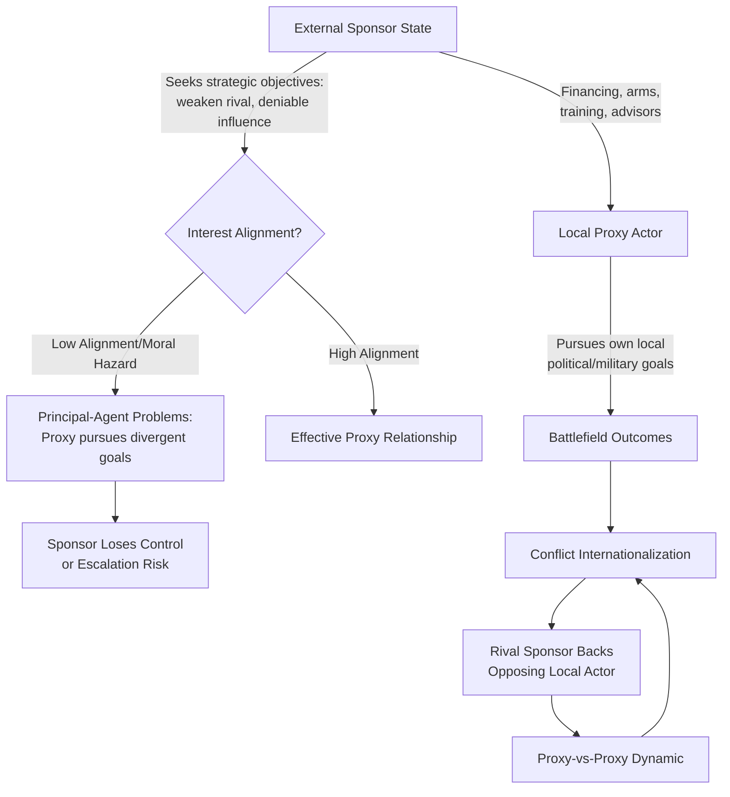

## Proxy Warfare and Third-Party Intervention

### Overview

Proxy warfare and third-party intervention constitute a distinct analytical category bridging interstate conflict theory, civil war dynamics, and non-state actor studies: they examine how external states pursue strategic objectives by supporting local armed actors rather than deploying their own forces directly, and how outside powers intervene in conflicts they did not originate. This domain is central to interpreting contemporary conflict landscapes — Syria, Yemen, Libya, Ukraine, and Sudan all feature dense proxy and intervention dynamics — and is a core input for geopolitical risk analysts assessing conflict internationalization, escalation risk, and sanctions/attribution exposure.

---

### Defining Proxy Warfare

- **Core definition** (Andrew Mumford, *Proxy Warfare*, 2013; Tyrone Groh, *Proxy War*, 2019): A proxy war involves an external "principal" state or actor supporting a local "agent" (armed group, faction, or client state) to pursue the principal's strategic objectives, while limiting the principal's direct, overt military exposure and formal responsibility for the resulting violence.
- **Principal-agent framing:** The dominant contemporary theoretical lens (drawing on Tyrone Groh's application of principal-agent theory from organizational economics) treats the sponsor-proxy relationship as inherently characterized by incomplete information, moral hazard, and divergent interests — the proxy has its own local objectives that may only partially overlap with the sponsor's strategic goals, creating persistent control and reliability problems for the sponsor.
- **Distinction from direct intervention:** Proxy warfare is defined specifically by the *substitution* of local forces for the sponsor's own combat forces; direct third-party intervention (discussed below) involves overt deployment of an external state's own military forces into an existing conflict, a related but analytically distinct phenomenon.
- **Deniability spectrum:** Sponsorship exists along a continuum from fully covert (unacknowledged, plausibly deniable support) through gray-zone ("hybrid") support (acknowledged informally but not officially) to fully overt state-to-state military assistance (formally acknowledged arms transfers, training missions, advisory support) — contemporary cases frequently occupy multiple points on this spectrum simultaneously or shift position over time.

**Key Points**

- The principal-agent framing distinguishes proxy warfare analytically from simple "puppet" framing (which assumes the sponsor exercises near-total control); most documented historical and contemporary cases show substantial proxy agency and interest-divergence from the sponsor, making outcomes considerably less predictable than a simple command-and-control model would suggest.

---

### Rationale for Sponsoring States

#### Strategic Cost-Minimization

- **Casualty and financial cost avoidance:** The most frequently cited rationale — proxy support allows a sponsoring state to pursue strategic objectives (weakening a rival, degrading an adversary's regional position, denying territory to a competitor) while avoiding the domestic political costs of sponsor-state casualties and the direct financial burden of full military deployment.
- **Plausible deniability and escalation control:** Covert or semi-covert proxy support allows sponsors to avoid direct attribution, reducing risk of retaliatory escalation against the sponsor itself and providing diplomatic cover for continued engagement even amid international criticism.
- **Domestic political insulation:** Democracies in particular (per audience-cost logic drawn from democratic-peace and diversionary-war literatures) may prefer proxy engagement specifically because direct intervention risking sponsor-state casualties carries higher domestic political liability than materiel/financial support to local actors.

#### Cold War Template and Contemporary Continuities

- **Cold War superpower proxy competition:** The canonical historical template — US and Soviet support for opposing sides in conflicts including Angola, Afghanistan (Soviet invasion, US/Pakistani support to the mujahideen), Nicaragua (Contras), and numerous other Third World conflicts, driven by bipolar systemic competition without direct superpower-to-superpower combat (consistent with the broader nuclear-deterrence-era logic of avoiding direct confrontation between nuclear powers).
- **Contemporary regional-power proxy competition:** Present-day cases increasingly involve regional rather than purely superpower sponsorship — Iran-Saudi Arabia competition via proxies in Yemen (Houthi movement) and historically in Syria/Iraq/Lebanon (Iran's "Axis of Resistance" network including Hezbollah, various Iraqi militias, and Houthi forces); Gulf state competition in Libya; Turkey-UAE/Russia dynamics in Libya and Syria.
- **Great-power renewed proxy competition:** Russia's use of the Wagner Group/Africa Corps model across Sub-Saharan Africa (Mali, Central African Republic, Sudan) represents a contemporary variant combining private-military-contractor deniability structures with state-directed strategic objectives; Russian and Western material support to opposing sides in various African and Middle Eastern conflicts reflects renewed great-power proxy dynamics distinct from, but structurally reminiscent of, Cold War patterns.

---

### Types of Proxy and Sponsor Support

- **Materiel support:** Direct provision of weapons systems, ammunition, and military equipment — the most basic and historically common form, ranging from small-arms transfers to sophisticated systems (e.g., documented Western provision of advanced anti-tank and air-defense systems to Ukraine, though this case sits closer to direct alliance-based intervention than classic covert proxy support given its overt, acknowledged nature).
- **Financial support:** Direct or indirect funding of a proxy's military payroll, logistics, and operational costs, frequently channeled through intermediary financial structures to preserve deniability.
- **Training and advisory support:** Special-operations or intelligence-service training missions, embedded advisors, and operational planning assistance — historically exemplified by CIA/Pakistani ISI support structures for the Afghan mujahideen, and contemporary US/coalition advisory missions to various partner forces.
- **Intelligence sharing:** Provision of targeting intelligence, satellite imagery, and signals intelligence to a proxy force, substantially enhancing operational effectiveness without direct combat participation.
- **Sanctuary and basing:** Provision of cross-border safe haven, logistics basing, or transit rights — historically significant for insurgent/proxy sustainment (e.g., Pakistani sanctuary for Afghan Taliban forces post-2001, documented extensively in the counterinsurgency literature).
- **Private military contractor deployment:** Use of nominally private, state-linked contractor forces (Wagner Group/Africa Corps, historically various other PMSCs) to provide direct combat or security functions while preserving formal state deniability — a structurally distinct but functionally related category to classic proxy support, since the contracted force is not a genuinely independent local actor but an extension of the sponsor's own capability under a deniability structure.

---

### Principal-Agent Problems in Proxy Relationships

Tyrone Groh's framework identifies several recurring pathologies:

- **Moral hazard:** A proxy receiving external support may take on greater risk or escalate more aggressively than it would absent that support, because the sponsor absorbs some of the costs — potentially destabilizing beyond the sponsor's intended scope.
- **Adverse selection:** Sponsors often have imperfect information about a proxy's true capabilities, reliability, and ideological alignment prior to establishing the relationship, risking selection of an unreliable or extremist-leaning partner (a frequently cited concern in Syrian conflict-era Western vetting of opposition factions).
- **Agency slippage/loss of control:** Proxies may pursue their own political, ideological, or territorial objectives that diverge from — or actively undermine — the sponsor's strategic intent, particularly as the relationship matures and the proxy develops independent capability and legitimacy; documented extensively in the mujahideen-to-post-Soviet-Afghanistan trajectory and in various Syrian opposition-faction cases.
- **Reputational entanglement:** Proxy actions (including documented human-rights abuses or war crimes) can generate reputational and diplomatic costs for the sponsor even under deniable arrangements, particularly as investigative journalism, open-source intelligence, and international legal mechanisms increasingly complicate deniability.
- **Termination difficulty:** Once a proxy relationship is established and the proxy has developed independent military and political capacity, sponsors may find it difficult to disengage or redirect the proxy even when strategic interests shift, since a proxy can outlast, resist, or act contrary to the sponsor's evolving preferences.

---

### Direct Third-Party Military Intervention

Distinct from proxy support, direct intervention involves overt deployment of an external state's own forces into an ongoing conflict.

#### Typology of Intervention

- **Unilateral intervention:** A single external state deploys forces, typically justified through bilateral treaty obligation, invited intervention (at the request of an incumbent government), or unilateral strategic-interest calculation.
- **Coalition/multilateral intervention:** Multiple external states jointly intervene, often but not always with international-organization authorization (UN Security Council resolution, regional-organization mandate) — e.g., the 2011 NATO-led intervention in Libya under UNSCR 1973.
- **Peacekeeping/peace-enforcement intervention:** UN or regional-organization-mandated forces deployed with either consent-based (traditional peacekeeping, Chapter VI) or enforcement (Chapter VII) mandates, distinguished analytically from combat-oriented intervention by the intervening force's formal impartiality mandate (though impartiality in practice is frequently contested).
- **Humanitarian intervention:** Intervention justified primarily on grounds of preventing mass atrocity or humanitarian catastrophe, closely linked to the Responsibility to Protect (R2P) normative framework endorsed by the UN World Summit in 2005, though application has been inconsistent and politically contested (contrast frequently drawn between the 2011 Libya intervention and non-intervention in other comparable humanitarian-crisis contexts).

#### Theories of Intervention Decision-Making

- **Strategic-interest models:** Intervention decisions are explained primarily by the intervening state's calculated strategic interest (resource access, alliance credibility, regional balance-of-power considerations) rather than by humanitarian or normative motivation, a standard realist reading of intervention patterns.
- **Domestic political models:** Extending diversionary-war and audience-cost logic, intervention decisions in democracies are argued to be shaped substantially by domestic public opinion, media coverage (the contested "CNN effect" hypothesis regarding media-driven humanitarian intervention pressure), and legislative/electoral constraints.
- **Alliance-credibility models:** Extended-deterrence and alliance-commitment logic (drawn from interstate-conflict theory) explains intervention as driven by the need to maintain credibility with other allies observing whether commitments are honored, independent of the intrinsic strategic value of the specific conflict at hand.
- **Bandwagoning-on-intervention/coalition dynamics:** Multilateral interventions can be shaped by burden-sharing incentives and alliance-cohesion considerations distinct from any single member's independent strategic calculus.

---

### Conflict Internationalization and Escalation Dynamics

- **Internationalization pathway** (extending Kristian Gleditsch's contagion/diffusion work, discussed in civil war dynamics): Civil conflicts frequently transition from purely internal to internationalized civil wars (per UCDP's "internationalized armed conflict" coding category) as external states provide troops, proxy support, or direct intervention — Syria's trajectory from 2011 domestic uprising to a multi-sponsor internationalized conflict (Iran, Russia, Turkey, Gulf states, US, and various proxy networks) is a frequently cited contemporary case.
- **Proxy-vs-proxy escalation risk:** When rival external sponsors back opposing local factions within the same conflict, the risk of inadvertent direct sponsor-sponsor confrontation rises, particularly where sponsor forces (advisors, PMSC personnel, air assets) operate in physical proximity — documented tension points include US-Russian deconfliction arrangements in Syria and periodic direct clashes between US and Russian-linked (Wagner) forces.
- **Escalation ladder from proxy to direct conflict:** A recurring analytical concern (echoing Herman Kahn's escalation-ladder logic from nuclear deterrence theory, applied to conventional proxy contexts) is whether sustained proxy competition creates cumulative risk of direct sponsor-sponsor war, particularly in cases involving nuclear-armed sponsors (US-Russia in Syria/Ukraine-adjacent contexts) where deterrence logic and vertical escalation stakes are especially high.
- **Attribution and accountability challenges:** Deniable and gray-zone sponsorship structures complicate legal accountability, sanctions targeting, and international-law application (state-responsibility doctrine under international law generally requires demonstrating a sufficient degree of state control over a non-state actor for legal attribution — the International Court of Justice's "effective control" standard from the *Nicaragua* case, contrasted with the lower "overall control" standard applied by the International Criminal Tribunal for the former Yugoslavia in the *Tadić* case — creating persistent legal-threshold ambiguity relevant to sanctions design).

---

### Comparative Table: Proxy Warfare vs. Direct Intervention

| Dimension | Proxy Warfare | Direct Intervention |
| --- | --- | --- |
| Forces Deployed | Local/client forces; sponsor provides support only | Sponsor's own military forces |
| Deniability | High (variable across covert-to-overt spectrum) | Low to none (overtly acknowledged) |
| Sponsor Casualty Risk | Low (borne primarily by proxy) | Direct exposure to sponsor forces |
| Control Reliability | Lower (principal-agent problems) | Higher (direct command authority) |
| Domestic Political Cost | Lower | Higher (especially under casualties) |
| Escalation Risk to Sponsor | Present but attenuated by deniability | Direct and immediate |
| Legal Attribution | Contested (control-threshold doctrines) | Clear (acknowledged state action) |

---

### Application to Geopolitical Risk Analysis

**Example**

Assessing conflict-internationalization and escalation risk for a client operating in or near an active proxy-contested conflict zone (e.g., Sahel operations amid Wagner/Africa Corps presence, or Red Sea shipping amid Iran-linked Houthi activity) typically requires:

1. **Sponsor-proxy mapping:** Identify all external sponsors active in the conflict, their preferred local proxies, and the degree of interest-alignment or divergence between sponsor and proxy (informing predictability of proxy behavior).
2. **Deniability-spectrum placement:** Assess where each sponsorship relationship sits on the covert-to-overt spectrum, since this affects both attribution-based sanctions/compliance exposure and the sponsor's own escalation calculus (more covert relationships may permit riskier proxy behavior with less sponsor accountability pressure).
3. **Principal-agent risk assessment:** Evaluate moral-hazard and agency-slippage risk — proxies with substantial independent capability and ideological autonomy from their sponsor present higher unpredictability risk than tightly controlled or resource-dependent proxies.
4. **Proxy-vs-proxy collision risk:** Where multiple rival sponsors back opposing factions in physical proximity, assess direct-confrontation escalation risk, particularly where nuclear-armed or otherwise strategically significant sponsors are involved.
5. **Legal/sanctions attribution assessment:** For compliance and AML/sanctions-screening purposes, assess whether sponsor-proxy control relationships meet relevant legal-attribution thresholds under applicable sanctions regimes, recognizing that "effective control" versus "overall control" legal standards produce materially different attribution outcomes for otherwise identical factual relationships.

---

### Diagrammatic Summary: Proxy Warfare Escalation Pathways

<svg xmlns="http://www.w3.org/2000/svg" viewBox="0 0 900 500" font-family="Arial, sans-serif">
<text x="450" y="30" font-size="20" font-weight="bold" text-anchor="middle" fill="#1a1a2e">Proxy Warfare Escalation Pathways (svg_diagram)</text>
<rect x="30" y="70" width="200" height="80" rx="8" fill="#2b3a67" stroke="#1a1a2e" stroke-width="2" />
<text x="130" y="95" font-size="12" font-weight="bold" text-anchor="middle" fill="#fff">Sponsor A</text>
<text x="130" y="116" font-size="10" text-anchor="middle" fill="#ddd">Materiel, financing,</text>
<text x="130" y="130" font-size="10" text-anchor="middle" fill="#ddd">training, intel</text>
<rect x="670" y="70" width="200" height="80" rx="8" fill="#8c1c1c" stroke="#1a1a2e" stroke-width="2" />
<text x="770" y="95" font-size="12" font-weight="bold" text-anchor="middle" fill="#fff">Sponsor B</text>
<text x="770" y="116" font-size="10" text-anchor="middle" fill="#f0d0d0">Materiel, financing,</text>
<text x="770" y="130" font-size="10" text-anchor="middle" fill="#f0d0d0">training, intel</text>
<rect x="130" y="200" width="200" height="80" rx="8" fill="#41507a" stroke="#1a1a2e" stroke-width="2" />
<text x="230" y="225" font-size="12" font-weight="bold" text-anchor="middle" fill="#fff">Proxy Faction 1</text>
<text x="230" y="246" font-size="10" text-anchor="middle" fill="#ddd">Own local objectives</text>
<text x="230" y="260" font-size="10" text-anchor="middle" fill="#ddd">May diverge from Sponsor A</text>
<rect x="570" y="200" width="200" height="80" rx="8" fill="#5a6a9a" stroke="#1a1a2e" stroke-width="2" />
<text x="670" y="225" font-size="12" font-weight="bold" text-anchor="middle" fill="#fff">Proxy Faction 2</text>
<text x="670" y="246" font-size="10" text-anchor="middle" fill="#ddd">Own local objectives</text>
<text x="670" y="260" font-size="10" text-anchor="middle" fill="#ddd">May diverge from Sponsor B</text>
<line x1="130" y1="150" x2="230" y2="200" stroke="#333" stroke-width="2" marker-end="url(#arrow5)" />
<line x1="770" y1="150" x2="670" y2="200" stroke="#333" stroke-width="2" marker-end="url(#arrow5)" />
<rect x="300" y="310" width="300" height="80" rx="8" fill="#1a1a2e" stroke="#000" stroke-width="2" />
<text x="450" y="335" font-size="13" font-weight="bold" text-anchor="middle" fill="#fff">Direct Battlefield Contact</text>
<text x="450" y="356" font-size="10" text-anchor="middle" fill="#ccc">Internationalized civil conflict</text>
<text x="450" y="372" font-size="10" text-anchor="middle" fill="#ccc">Proxy-vs-proxy engagement</text>
<line x1="230" y1="280" x2="400" y2="310" stroke="#333" stroke-width="2" marker-end="url(#arrow5)" />
<line x1="670" y1="280" x2="500" y2="310" stroke="#333" stroke-width="2" marker-end="url(#arrow5)" />
<rect x="330" y="420" width="240" height="60" rx="8" fill="#8c1c1c" stroke="#1a1a2e" stroke-width="2" />
<text x="450" y="445" font-size="12" font-weight="bold" text-anchor="middle" fill="#fff">Sponsor-Sponsor</text>
<text x="450" y="463" font-size="11" text-anchor="middle" fill="#f0d0d0">Direct Escalation Risk</text>
<line x1="450" y1="390" x2="450" y2="420" stroke="#333" stroke-width="2" stroke-dasharray="5,4" marker-end="url(#arrow5)" />
</svg>

**Conclusion**

Proxy warfare and direct third-party intervention represent complementary strategies through which external states pursue objectives in conflicts beyond their own borders while managing cost, deniability, and escalation risk. The principal-agent framework (Groh) explains why proxy relationships are frequently less controllable and more unpredictable than simple client-state framing suggests, while intervention-decision theories (strategic-interest, domestic-political, alliance-credibility models) explain the more overt calculus behind direct deployment. For geopolitical risk practitioners, the deniability spectrum, sponsor-proxy interest-alignment, and proxy-vs-proxy collision risk constitute the core diagnostic variables for assessing both the trajectory of an internationalized conflict and the compliance/attribution exposure created by ambiguous sponsorship structures. [Inference: this synthesis reflects standard integration of the principal-agent and intervention-decision literatures as commonly applied in contemporary conflict-risk practice, rather than a single unified academic framework]

**Related Topics**

- Tyrone Groh's principal-agent framework applied to proxy relationships
- Cold War superpower proxy competition case studies (Angola, Afghanistan, Nicaragua)
- Iran's "Axis of Resistance" network and regional proxy competition
- Wagner Group/Africa Corps model and private-military-contractor deniability structures
- Responsibility to Protect (R2P) doctrine and humanitarian intervention debates
- UCDP internationalized armed conflict coding and Syria's conflict trajectory
- International legal attribution standards: "effective control" (Nicaragua case) vs. "overall control" (Tadić case)
- Escalation risk between rival nuclear-armed sponsors in proxy contexts
- Sanctions and compliance screening for state-sponsorship attribution
- Diversionary war and audience-cost theory applied to intervention decision-making
- Conflict contagion and diffusion theory (Gleditsch) as a complement to internationalization dynamics
- Comparative case studies: Syria, Yemen, Libya, Ukraine, Sudan