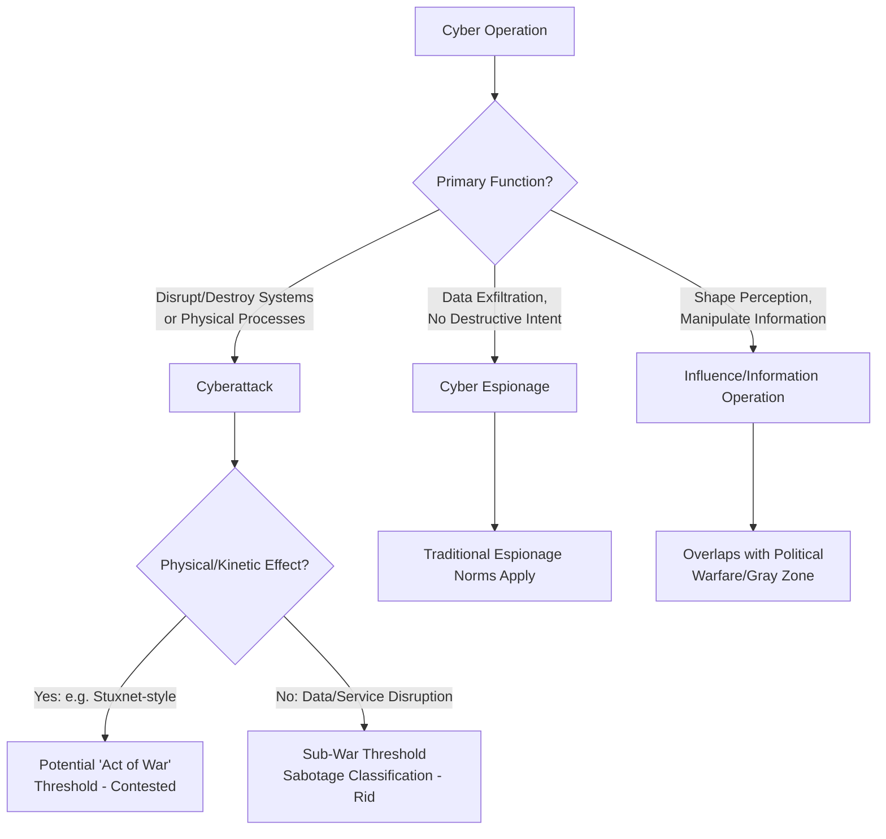

## Cyber Conflict and Digital-Domain Warfare

### Overview

Cyber conflict and digital-domain warfare represent a distinct and rapidly evolving dimension of security studies, addressing how state and non-state actors use offensive and defensive cyber capabilities to pursue strategic objectives short of, alongside, or as a substitute for kinetic conflict. This domain challenges several core assumptions of classical security-studies theory — attribution, deterrence, escalation control, and the offense-defense balance all operate differently in cyberspace than in the physical domains from which most conflict theory originated. For geopolitical risk analysts, cyber conflict assessment is now integral to critical-infrastructure risk, financial-sector exposure, election-security monitoring, and great-power competition analysis (US-China, US-Russia, Iran, North Korea).

---

### Defining the Domain

- **Cyber conflict (working definition, following Thomas Rid and Brandon Valeriano):** State or state-sponsored use of computer network operations to achieve political, military, or economic objectives against an adversary's information systems, ranging from espionage and disruption to potentially destructive attack.
- **Thomas Rid's contested claim: "Cyber War Will Not Take Place"** (2013): A highly influential and deliberately provocative argument that cyber operations to date have overwhelmingly manifested as espionage, sabotage, or subversion rather than as "war" in the Clausewitzian sense (violent, instrumental, and politically attributed) — Rid argues most cyber incidents lack the lethal, kinetic, and clearly attributed character required to meet a rigorous definition of "war," and are better classified as sophisticated extensions of long-standing sabotage and espionage tradecraft. This remains a genuinely contested claim; critics (including some within the strategic-studies community) argue Rid's definitional standard is too restrictive and that cyber operations can constitute an act of war under broader definitions, particularly where physical/kinetic effects result. [Unverified: whether any cyber incident to date meets a rigorous "act of war" threshold under international law remains legally and academically contested]
- **Distinguishing cyber espionage, cyberattack, and information/influence operations:** The literature (Valeriano, Jarvis, and Maness's *Cyber War versus Cyber Realities*, 2015; Erik Gartzke and Jon Lindsay) generally distinguishes between (1) cyber espionage (unauthorized data exfiltration, no destructive intent), (2) cyberattack (deliberate disruption or destruction of systems/data/physical processes), and (3) information/influence operations (manipulation of information environment to shape perception, distinct from network intrusion though frequently combined with it in practice).

**Key Points**

- Empirical work by Valeriano and Maness using the Dyadic Cyber Incident and Dispute (DCID) dataset finds that observed state-on-state cyber incidents have historically been characterized by *restraint* — low-intensity, largely non-escalatory — contrasting with early "cyber doom" predictions of rapid escalation to destructive or existential cyber conflict; this empirical finding is influential but reflects data through a specific historical window and should be checked against current incident trends given the pace of capability development. [Inference: the "restraint" finding characterized the pre-2020s incident landscape documented in DCID-based research; whether this pattern holds amid more recent developments (e.g., ransomware-as-a-service proliferation, AI-enabled operations) is an open empirical question requiring current data]

---

### Attribution Theory and Challenges

Attribution — determining with confidence which actor conducted a given cyber operation — is a foundational and distinctive problem in cyber conflict, differing structurally from attribution challenges in kinetic conflict.

- **Technical attribution challenges:** Attackers can route operations through compromised third-party infrastructure, employ false-flag indicators mimicking other actors' known tools/techniques, and exploit the inherent difficulty of definitively linking digital infrastructure to a specific human operator or sponsoring state.
- **Thomas Rid and Ben Buchanan's "Q Model" of attribution** ("Attributing Cyber Attacks," 2015): Frames attribution as an iterative, multi-layered analytic process combining technical forensics (malware analysis, infrastructure tracing), operational-pattern analysis (tactics, techniques, and procedures consistent with known threat-actor groups), and strategic/political context analysis (who plausibly benefits, consistent with known strategic objectives) — attribution confidence is thus better understood as probabilistic and multi-source rather than a binary technical determination.
- **Attribution as political, not merely technical, act:** Governments frequently possess higher-confidence attribution (via signals intelligence and human intelligence sources) than they disclose publicly, and the decision to publicly attribute (and at what confidence level, with what evidentiary disclosure) is itself a strategic/diplomatic choice independent of technical certainty — public attribution serves signaling, deterrence, and coalition-building functions beyond simple truth disclosure.
- **Attribution and deterrence interdependency:** Because effective deterrence requires that a punished actor (and observing third parties) understand why punishment occurred, weak or unstated attribution undermines deterrent signaling even where technical confidence is high — a persistent tension in cyber-deterrence practice.

---

### Cyber Deterrence Theory

Classical nuclear-era deterrence theory (Schelling-style credibility/capability/communication logic) translates imperfectly into the cyber domain, generating a distinct sub-literature.

- **Why cyber deterrence is harder than nuclear deterrence** (widely discussed limitation, e.g., in work by Joseph Nye and Martin Libicki): (1) attribution uncertainty undermines credible retaliatory threats; (2) the extremely low cost and technical barrier to entry for many cyber operations undermines "unacceptable cost" retaliatory logic that worked for nuclear deterrence; (3) the enormous diversity of potential targets (critical infrastructure, financial systems, military networks, electoral systems) makes comprehensive defense infeasible, undermining deterrence-by-denial; (4) the absence of an equivalent to the nuclear taboo or clear escalation thresholds makes signaling resolve and restraint simultaneously difficult.
- **Deterrence by denial vs. deterrence by punishment (cyber application):** Deterrence-by-denial (hardening systems to make attacks costly/unlikely to succeed) is generally regarded in the policy literature as more tractable in cyberspace than deterrence-by-punishment (credible retaliatory threat), given attribution and proportionality challenges — though most practitioners argue an effective cyber-deterrence posture requires both.
- **"Persistent engagement" / "defend forward" doctrine** (US Cyber Command strategic concept, articulated publicly from approximately 2018 onward, associated with the 2018 DoD Cyber Strategy): A significant doctrinal shift away from primarily reactive/defensive posture toward continuous, proactive engagement with adversary networks below the threshold of armed conflict, intended to disrupt adversary capability and impose costs continuously rather than relying primarily on episodic retaliatory deterrence.
- **Norm-based deterrence/entanglement approaches:** Efforts to establish international behavioral norms (e.g., UN Group of Governmental Experts (GGE) processes, the Open-Ended Working Group (OEWG) on ICT security) aim to establish shared expectations about acceptable versus unacceptable cyber conduct (e.g., prohibitions on attacking critical civilian infrastructure), functioning as a normative supplement to weak technical deterrence, analogous in logic (though weaker in current institutionalization) to the nuclear taboo discussed in nuclear deterrence theory.

---

### Offense-Defense Balance in Cyberspace

- **Offense-dominance debate:** A substantial portion of the early cyber-strategy literature (echoing broader security-dilemma logic) argued that cyberspace is inherently offense-dominant — attackers need find only one exploitable vulnerability while defenders must secure an entire, complex attack surface, and offensive tool development is generally cheaper than comprehensive defensive hardening.
- **Jon Lindsay and Erik Gartzke's revisionist critique:** Challenges the simple offense-dominance narrative, arguing that sophisticated, strategically significant cyberattacks (as opposed to low-level nuisance intrusions) actually require substantial organizational capacity, intelligence preparation, and operational sophistication comparable to conventional military capability — meaning cyber "offense dominance" may be overstated for the subset of operations with genuine strategic significance, even as low-level offense remains comparatively cheap.
- **Security-dilemma dynamics in cyberspace:** The core Jervis-style security-dilemma logic (see Security Dilemmas and Arms Race Dynamics) applies with particular force in cyberspace because offensive and defensive cyber capabilities are frequently based on identical underlying technical knowledge and tools (a vulnerability discovered for defensive patching purposes is simultaneously exploitable for offense), creating an unusually severe distinguishability problem.

---

### Case Studies and Precedents

- **Stuxnet (discovered 2010):** Widely attributed (though never formally acknowledged) to a US-Israeli operation targeting Iranian uranium-enrichment centrifuges at Natanz; frequently cited as the first publicly documented cyberattack causing physical/kinetic damage to industrial infrastructure, and a central case in debates over whether cyber operations can cross an "act of war" threshold.
- **Russia-Georgia 2008 and Estonia 2007:** Early cases of cyber operations (primarily distributed denial-of-service attacks) accompanying or preceding kinetic conflict (Georgia) or occurring amid diplomatic dispute (Estonia), frequently cited as early evidence of cyber-kinetic integration in Russian military doctrine ("hybrid warfare").
- **Russia-Ukraine cyber dimension (2014–present):** Extensive documented cyber operations targeting Ukrainian critical infrastructure (including the 2015 and 2016 attacks on Ukraine's power grid, attributed to Russian state-linked actors) and the NotPetya malware incident (2017, attributed to Russian military intelligence, which caused substantial unintended global collateral damage well beyond its apparent Ukraine-focused initial target) — NotPetya is frequently cited as a case illustrating the difficulty of controlling cyber-weapon proliferation and collateral effects once deployed.
- **SolarWinds supply-chain compromise (discovered 2020):** A sophisticated Russian state-linked espionage operation compromising software supply-chain infrastructure to gain access to numerous US government and private-sector networks, illustrating supply-chain compromise as a distinct and severe attack vector.
- **North Korean financially motivated state cyber operations:** Documented use of cyber operations (including the Lazarus Group) for direct revenue generation (bank heists, cryptocurrency theft) to fund state programs including weapons development — a distinctive case of cyber capability serving direct financial rather than purely military/espionage objectives, reflecting North Korea's unique sanctions-evasion incentive structure. [Unverified: specific current-year attribution and dollar figures for North Korean cyber theft require verification against current reporting given the pace of new incidents]
- **China's cyber-espionage posture:** Extensively documented large-scale intellectual-property and strategic-espionage operations (e.g., historically documented APT groups); Chinese cyber activity is generally characterized in Western threat-intelligence reporting as predominantly espionage/IP-theft-oriented rather than destructive-attack-oriented, though this characterization should be checked against current threat-intelligence reporting given the evolving nature of state cyber programs. [Unverified: characterizations of state-level cyber-program intent and posture are based on threat-intelligence assessment rather than direct access to adversary strategic planning, and carry inherent estimation uncertainty]

---

### Ransomware and the Criminal-State Nexus

- **Ransomware-as-a-service (RaaS) ecosystem:** The proliferation of commercialized ransomware toolkits and affiliate-based criminal business models (e.g., historically groups such as Conti, LockBit, and various successor/rebranded operations) has created a distinct criminal cyber-threat landscape increasingly relevant to critical-infrastructure and corporate risk assessment, extending well beyond traditional state-sponsored cyber-conflict frameworks.
- **State tolerance/sponsorship ambiguity:** Some ransomware operations are assessed by Western governments to operate with tacit tolerance or even informal sponsorship from certain states (frequently cited in relation to Russia-based criminal ransomware infrastructure), blurring the line between purely criminal and state-linked cyber threat categories in a manner structurally analogous to the proxy-warfare deniability spectrum (see Proxy Warfare and Third-Party Intervention).
- **Critical-infrastructure ransomware incidents:** High-profile cases (e.g., the 2021 Colonial Pipeline ransomware incident in the US, which caused significant fuel-supply disruption) have elevated ransomware from a primarily corporate/financial risk category to a matter of national critical-infrastructure security policy attention.

---

### International Law and Norm-Development

- **Tallinn Manual process:** An influential (though non-binding) academic-expert effort (Tallinn Manual 1.0, 2013, and Tallinn Manual 2.0, 2017, coordinated through the NATO Cooperative Cyber Defence Centre of Excellence) to articulate how existing international law (jus ad bellum, international humanitarian law) applies to cyber operations, addressing questions including when a cyber operation constitutes a "use of force" or "armed attack" under the UN Charter framework.
- **UN GGE and OEWG processes:** Ongoing (and only partially successful) multilateral diplomatic processes attempting to establish agreed norms of responsible state behavior in cyberspace, including agreed (though non-binding and inconsistently observed) norms against attacking critical civilian infrastructure and undermining the availability/integrity of essential public services.
- **Persistent legal ambiguity:** No binding international treaty specifically governs cyber conflict (unlike, for example, the Geneva Conventions for kinetic conflict), and significant unresolved legal questions remain regarding thresholds for armed-attack classification, proportional response rights, and attribution evidentiary standards required for lawful countermeasures. [Unverified: the absence of binding cyber-specific treaty law is a well-documented current gap, though ongoing diplomatic processes could change this status, and current status should be verified for any legally consequential application]

---

### Comparative Table: Cyber Conflict vs. Classical Deterrence Assumptions

| Classical Deterrence Assumption | Cyber Domain Reality |
| --- | --- |
| Attribution is generally clear/rapid | Attribution is technically and politically complex, often delayed |
| Retaliatory capability is visible/credible | Cyber capabilities are often deliberately concealed; credibility harder to signal |
| Offense-defense distinguishable | Often technically identical tools/knowledge serve both purposes |
| High barrier to entry limits actor pool | Comparatively low barrier enables broad range of state and non-state actors |
| Clear escalation thresholds (e.g., nuclear taboo) | Thresholds for "armed attack" classification remain legally contested |
| Retaliation proportionality is calculable | Proportionality assessment complicated by uncertain attribution confidence and cross-domain response options |

---

### Application to Geopolitical Risk Analysis

**Example**

Assessing cyber-conflict risk exposure for a critical-infrastructure operator or financial institution typically requires:

1. **Threat-actor typology mapping:** Distinguish between state-sponsored espionage actors (lower disruption risk, higher IP-theft/data-exfiltration risk), state-linked destructive-capability actors (lower probability, higher-impact tail risk, particularly relevant amid geopolitical crisis escalation), and criminal ransomware actors (higher baseline probability, primarily financially motivated).
2. **Attribution-confidence-weighted response planning:** Recognize that initial incident attribution will likely be probabilistic and delayed, requiring risk and response frameworks that do not depend on immediate high-confidence attribution for initial defensive/business-continuity action.
3. **Geopolitical-crisis correlation assessment:** Assess whether elevated bilateral tension with a cyber-capable state (Russia, China, Iran, North Korea) correlates historically with increased cyber-activity targeting the relevant sector or region, informing threat-level escalation during acute geopolitical crisis windows.
4. **Criminal-state nexus assessment:** For ransomware exposure specifically, assess jurisdictional factors (state tolerance patterns) that may affect both baseline incident probability and post-incident law-enforcement/diplomatic recourse options.
5. **Supply-chain and third-party exposure mapping:** Given the SolarWinds precedent, assess exposure through software supply-chain and managed-service-provider relationships, not solely through direct network perimeter risk.

---

### Diagrammatic Summary: Cyber Conflict Escalation and Attribution Chain

<svg xmlns="http://www.w3.org/2000/svg" viewBox="0 0 900 500" font-family="Arial, sans-serif">
<text x="450" y="30" font-size="20" font-weight="bold" text-anchor="middle" fill="#1a1a2e">Cyber Conflict Escalation and Attribution Chain (svg_diagram)</text>
<rect x="40" y="70" width="220" height="90" rx="8" fill="#2b3a67" stroke="#1a1a2e" stroke-width="2" />
<text x="150" y="95" font-size="13" font-weight="bold" text-anchor="middle" fill="#fff">Cyber Incident Occurs</text>
<text x="150" y="118" font-size="10" text-anchor="middle" fill="#ddd">Network intrusion, disruption,</text>
<text x="150" y="132" font-size="10" text-anchor="middle" fill="#ddd">or destructive effect</text>
<line x1="260" y1="115" x2="340" y2="115" stroke="#333" stroke-width="2" marker-end="url(#arrow6)" />
<rect x="340" y="70" width="220" height="90" rx="8" fill="#41507a" stroke="#1a1a2e" stroke-width="2" />
<text x="450" y="95" font-size="13" font-weight="bold" text-anchor="middle" fill="#fff">Multi-Layer Attribution</text>
<text x="450" y="118" font-size="10" text-anchor="middle" fill="#ddd">Technical forensics + TTP pattern</text>
<text x="450" y="132" font-size="10" text-anchor="middle" fill="#ddd">+ strategic context (Q Model)</text>
<line x1="560" y1="115" x2="640" y2="115" stroke="#333" stroke-width="2" marker-end="url(#arrow6)" />
<rect x="640" y="70" width="220" height="90" rx="8" fill="#5a6a9a" stroke="#1a1a2e" stroke-width="2" />
<text x="750" y="95" font-size="13" font-weight="bold" text-anchor="middle" fill="#fff">Attribution Confidence</text>
<text x="750" y="118" font-size="10" text-anchor="middle" fill="#ddd">Probabilistic, often delayed</text>
<text x="750" y="132" font-size="10" text-anchor="middle" fill="#ddd">Political disclosure decision</text>
<line x1="450" y1="160" x2="450" y2="220" stroke="#333" stroke-width="2" marker-end="url(#arrow6)" />
<rect x="300" y="230" width="300" height="90" rx="8" fill="#1a1a2e" stroke="#000" stroke-width="2" />
<text x="450" y="258" font-size="13" font-weight="bold" text-anchor="middle" fill="#fff">Response Decision</text>
<text x="450" y="280" font-size="10" text-anchor="middle" fill="#ccc">Deterrence-by-denial / retaliation /</text>
<text x="450" y="296" font-size="10" text-anchor="middle" fill="#ccc">"defend forward" / diplomatic-legal action</text>
<line x1="450" y1="320" x2="450" y2="380" stroke="#333" stroke-width="2" marker-end="url(#arrow6)" />
<rect x="200" y="390" width="220" height="80" rx="8" fill="#8c1c1c" stroke="#1a1a2e" stroke-width="2" />
<text x="310" y="415" font-size="12" font-weight="bold" text-anchor="middle" fill="#fff">Sub-Threshold Continuation</text>
<text x="310" y="435" font-size="10" text-anchor="middle" fill="#f0d0d0">Persistent, low-intensity</text>
<text x="310" y="450" font-size="10" text-anchor="middle" fill="#f0d0d0">competition (typical pattern)</text>
<rect x="480" y="390" width="220" height="80" rx="8" fill="#8c1c1c" stroke="#1a1a2e" stroke-width="2" />
<text x="590" y="415" font-size="12" font-weight="bold" text-anchor="middle" fill="#fff">Cross-Domain Escalation</text>
<text x="590" y="435" font-size="10" text-anchor="middle" fill="#f0d0d0">Kinetic response or</text>
<text x="590" y="450" font-size="10" text-anchor="middle" fill="#f0d0d0">broader conflict spillover</text>
<line x1="400" y1="380" x2="310" y2="390" stroke="#333" stroke-width="1.5" marker-end="url(#arrow6)" />
<line x1="500" y1="380" x2="590" y2="390" stroke="#333" stroke-width="1.5" marker-end="url(#arrow6)" />
</svg>

**Conclusion**

Cyber conflict theory adapts and stress-tests core security-studies concepts — deterrence, attribution, offense-defense balance, and escalation control — for a domain in which technical, legal, and strategic uncertainty is structurally higher than in the physical-domain conflict theories from which these concepts originated. Rid's restrictive "cyber war" definitional critique, Lindsay and Gartzke's revisionist challenge to naive offense-dominance claims, and the empirically documented pattern of restraint in state-on-state cyber incidents collectively suggest that cyber conflict has, to date, functioned predominantly as a sub-threshold competitive domain rather than a decisive independent war-fighting domain — though this characterization should be continuously reassessed as capabilities, normative frameworks, and the criminal-state nexus continue to evolve rapidly. [Inference: this overall characterization synthesizes multiple distinct scholarly positions and reflects the field's general state as of recent published literature; given the pace of technical and doctrinal change in this domain, current authoritative sources should be consulted for any time-sensitive application]

**Related Topics**

- Thomas Rid's "Cyber War Will Not Take Place" thesis and subsequent debate
- Attribution theory and the Rid-Buchanan "Q Model"
- US Cyber Command's "persistent engagement" and "defend forward" doctrine
- Tallinn Manual process and international law applicability to cyber operations
- Stuxnet, NotPetya, and SolarWinds as foundational case studies
- Ransomware-as-a-service ecosystem and the criminal-state nexus
- Offense-defense balance debates in cyberspace (Lindsay-Gartzke critique)
- UN GGE/OEWG norm-development processes for responsible state behavior in cyberspace
- North Korean state-sponsored financially motivated cyber operations
- Critical-infrastructure cyber risk and the Colonial Pipeline precedent
- Hybrid warfare and cyber-kinetic integration in Russian military doctrine
- Supply-chain compromise as a distinct cyberattack vector
- Information/influence operations as a related but distinct category from network intrusion