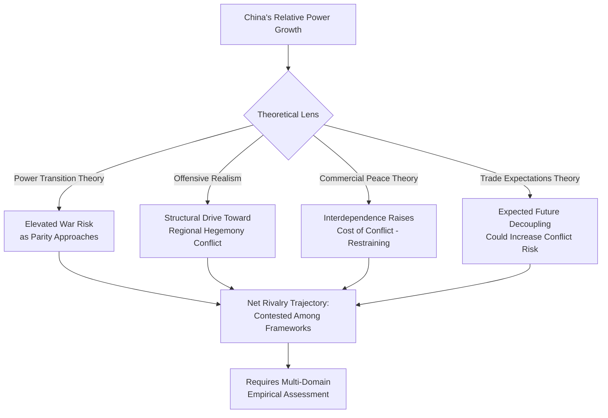

## US-China Strategic Rivalry

### Overview

The US-China strategic rivalry is the defining great-power competition of the contemporary international system, characterized by simultaneous economic interdependence and intensifying security, technological, and ideological competition. It serves as the primary empirical testing ground for power-transition theory, offensive/defensive realism, and economic-interdependence theories discussed elsewhere in this security-studies curriculum, while generating a distinct policy and analytical literature of its own. For geopolitical risk analysts, this rivalry is the single most consequential variable shaping global supply-chain risk, technology-sector regulation, alliance-structure evolution, and Taiwan Strait/South China Sea escalation scenarios.

---

### Theoretical Framing: Applying Systemic Theory

#### Power Transition and the "Thucydides Trap"

- **Power transition theory application** (Organski, Kugler; see Theories of Interstate War): China's sustained relative-power growth toward parity with the US across economic, and increasingly military and technological, dimensions is the central structural feature driving rivalry-intensity predictions in this framework — the theory predicts elevated war risk specifically during the parity-approach phase rather than during periods of clear hegemonic dominance or clear subordination.
- **Graham Allison's "Thucydides Trap" framing** (*Destined for War*, 2017): Popularized the historical-pattern argument (drawing on Thucydides's account of Sparta's anxiety toward a rising Athens) that rising-power/ruling-power dyads have historically produced war in a majority of Allison's historical case sample; this framing has been influential in policy discourse but is also contested — critics (including some historians and IR scholars) argue the historical case selection is contestable and that structural parity alone is not deterministic of war outcome, since numerous mediating variables (nuclear deterrence, economic interdependence, domestic constraints) differ substantially between historical cases and the contemporary US-China dyad. [Unverified: the predictive validity of the Thucydides Trap framing for the specific US-China case remains an actively contested question among IR scholars and historians, not a settled empirical finding]

#### Offensive Realism and Regional Hegemony

- **Mearsheimer's offensive-realist prediction:** John Mearsheimer has argued extensively (including in updated editions of *The Tragedy of Great Power Politics*) that China's continued economic growth will drive it, per offensive-realist logic, to seek regional hegemony in Asia analogous to historical US regional hegemony in the Western Hemisphere, generating structurally-driven confrontation with the US as the latter seeks to prevent any peer competitor from achieving comparable regional dominance — Mearsheimer frames this as largely independent of either side's specific leadership or stated intentions, a structurally deterministic reading that remains contested by scholars emphasizing agency, institutional constraint, and interdependence.

#### Complex Interdependence and Commercial Peace Counter-Framings

- **Commercial/capitalist peace counter-argument** (Gartzke and related economic-interdependence literature; see Theories of Interstate War): The exceptionally deep economic interdependence between the US and China (trade volume, supply-chain integration, capital-market linkage) is argued by some scholars to raise the mutual cost of conflict sufficiently to constitute a meaningful restraining force independent of, and potentially counteracting, the structural pressures identified by power-transition and offensive-realist frameworks.
- **Dale Copeland's "trade expectations" counter-critique:** Applying his trade-expectations theory (see Theories of Interstate War) specifically to this dyad, Copeland has argued that if China's leadership comes to expect *future* economic decoupling or exclusion from Western-led markets and technology ecosystems (rather than continued deep interdependence), this could paradoxically increase rather than decrease conflict propensity — a framework directly relevant to interpreting the contemporary decoupling/de-risking policy trend (see below).

---

### Domains of Competition

#### Military and Security Domain

- **Taiwan Strait as central flashpoint:** The most acute potential military-confrontation scenario, involving the unresolved status of Taiwan, China's stated reunification objective (with explicit non-renunciation of force as an option under longstanding PRC policy), and the US's strategic-ambiguity policy combined with the Taiwan Relations Act's arms-sale and informal-defense-support framework — this scenario directly engages the extended-deterrence credibility problems discussed in nuclear proliferation and deterrence theory.
- **South China Sea territorial and maritime disputes:** China's expansive maritime claims (historically articulated via the "nine-dash line"), extensive island-building and militarization of contested features, and disputes with the Philippines, Vietnam, Malaysia, and other Southeast Asian claimants, with the US conducting regular "freedom of navigation" operations contesting Chinese claims — a persistent contiguity/territorial-dispute risk factor consistent with the geography-based conflict literature (see Theories of Interstate War).
- **Military modernization and the offense-defense/arms-race dimension:** China's sustained military modernization — including anti-access/area-denial (A2/AD) capability development, naval expansion (including aircraft carrier programs), hypersonic-weapons development, and space/counter-space capability — is widely analyzed through the arms-race and security-dilemma frameworks (see Security Dilemmas and Arms Race Dynamics), with substantial debate over whether specific capabilities are offense-dominant and how distinguishable they are from defensive posture.
- **Nuclear dimension:** China's nuclear arsenal has been undergoing substantial expansion and modernization according to US Department of Defense annual China Military Power reports and independent analyses (e.g., by the Federation of American Scientists), moving from a historically minimal deterrent posture toward a larger and more diversified force; exact current warhead figures and delivery-system status change over time and should be verified against current authoritative reporting for any time-sensitive analysis. [Unverified: precise current Chinese nuclear-arsenal size, growth trajectory, and doctrinal posture involve substantial estimation uncertainty and require verification against current official and independent assessments]

#### Economic and Technological Domain

- **Decoupling and "de-risking" policy trend:** A significant shift in US (and to varying degrees allied) policy from decades of deepening economic engagement toward selective decoupling in strategically sensitive sectors — export controls on advanced semiconductors and semiconductor-manufacturing equipment, restrictions on outbound investment in sensitive technologies, and supply-chain "friend-shoring"/"de-risking" initiatives aimed at reducing critical-sector dependency on China.
- **Semiconductor and advanced-technology competition:** A central and rapidly evolving front, encompassing US export-control restrictions on advanced chip and chip-equipment sales to China (progressively tightened through successive Commerce Department rule updates), China's parallel indigenous semiconductor self-sufficiency drive, and broader competition over artificial intelligence, quantum computing, and biotechnology leadership — given the pace of policy and technical change in this specific area, current-state details should be verified via current reporting rather than relied upon from general background knowledge. [Unverified: specific current export-control rule scope, Chinese semiconductor-capability progress, and related policy details change frequently and require current verification]
- **Belt and Road Initiative (BRI) and developing-world influence competition:** China's large-scale infrastructure-financing and investment initiative, launched 2013, has been analyzed as both a genuine development-finance program and a strategic influence-projection tool, generating debate (and some documented cases of "debt-trap" dynamics, though this characterization is contested) over its net effect on recipient-country sovereignty and alignment; competing US/G7 initiatives (e.g., the Partnership for Global Infrastructure and Investment) represent an explicit counter-influence response.
- **Currency, financial-system, and de-dollarization dimension:** Ongoing but historically limited progress toward internationalization of the Chinese renminbi and various bilateral efforts (including BRICS-associated initiatives) toward reducing dollar-dependency in bilateral trade settlement, generally assessed by most financial-economics analysts as a slow-moving, structurally constrained trend rather than an imminent transformation of the dollar's reserve-currency status. [Inference: this characterization of de-dollarization as slow-moving rather than imminent reflects a widely shared assessment among international-finance economists, though the pace of this trend is subject to ongoing reassessment as policy and market developments unfold]

#### Alliance and Institutional Domain

- **US alliance-network strengthening:** Renewed and expanded US alliance and partnership activity in the Indo-Pacific, including AUKUS (Australia-UK-US, announced 2021, centered on nuclear-powered submarine technology transfer and broader advanced-capability cooperation), the Quad (US-Japan-India-Australia strategic dialogue), and bilateral alliance modernization with Japan, South Korea, and the Philippines — collectively read through balance-of-power/external-balancing theory (see Theories of Interstate War) as a coalition-based response to China's relative-power growth.
- **China's institutional and partnership alternatives:** Chinese-led or Chinese-influenced institutional alternatives including the Shanghai Cooperation Organisation, expanded BRICS membership, and various bilateral "comprehensive strategic partnership" frameworks (notably with Russia), assessed by many analysts as a partial counter-balancing coalition-building effort, though the depth of institutionalization and genuine alignment (as opposed to transactional convenience) among these partnerships is a subject of ongoing analytical debate. [Inference: assessments of the depth versus transactional nature of China-led partnership structures vary among specialists and are not resolved by consensus]
- **Multilateral institutional competition:** Contestation within and around existing multilateral institutions (UN Security Council dynamics, World Trade Organization reform debates, World Bank/IMF governance-share disputes, and China's creation of parallel institutions such as the Asian Infrastructure Investment Bank) reflects broader competition over the rules and governance architecture of the international economic system.

#### Ideological and Normative Domain

- **Governance-model competition framing:** Some US policy discourse (particularly prominent in Biden-administration framing, and continuing in various forms across administrations) has characterized the rivalry partly in terms of competition between democratic and authoritarian governance models, though scholars note this framing is contested both empirically (many US partners are not fully democratic) and strategically (risk of alienating non-aligned states who reject a binary framing).
- **Human rights and normative friction points:** Documented US and allied government positions on Xinjiang (Uyghur population policies), Hong Kong autonomy erosion following the 2020 National Security Law, and broader human-rights concerns constitute a persistent normative friction dimension distinct from, but interacting with, the security and economic competition dimensions.

---

### Crisis Stability and Escalation Risk Assessment

- **Taiwan Strait crisis-stability analysis:** Applying deterrence-theory concepts (see Nuclear Proliferation and Deterrence Theory), analysts assess Taiwan Strait escalation risk through variables including US strategic-ambiguity credibility, China's assessment of US resolve and capability to intervene, the offense-defense balance in the specific military-technology context (long-range precision strike, A2/AD capability), and the extended-deterrence credibility problem inherent in any US commitment to an unrecognized state's defense.
- **Stability-instability paradox application:** Some analysts apply the stability-instability paradox framework (Snyder; see Nuclear Proliferation and Deterrence Theory) to suggest that mutual nuclear deterrence between the US and China creates space for intensified competition and provocation in sub-nuclear domains (gray-zone maritime activity, cyber operations, economic coercion) precisely because both sides calculate that nuclear risk caps the ultimate escalation ceiling.
- **Miscalculation and crisis-management infrastructure:** Given the security-dilemma and misperception risks discussed elsewhere in this curriculum, the adequacy of US-China crisis-communication channels (military-to-military hotlines, crisis-management mechanisms) is a frequently cited concern among risk analysts, particularly given periodic historical suspensions of military-to-military dialogue during diplomatic disputes.
- **Gray-zone and sub-threshold competition:** Extensive documented Chinese use of gray-zone tactics (coast guard and maritime militia activity in disputed waters, economic coercion against states taking positions Beijing opposes, cyber-espionage activity) represents competition deliberately calibrated to remain below thresholds likely to trigger direct US or allied military response — analytically consistent with the sub-threshold cyber-conflict patterns and proxy-warfare deniability-spectrum logic discussed elsewhere in this curriculum.

---

### Comparative Table: Theoretical Predictions for Rivalry Trajectory

| Theoretical Framework | Predicted Trajectory | Key Mediating Variable | Degree of Consensus |
| --- | --- | --- | --- |
| Power Transition Theory | Elevated war risk during parity approach | Precise measurement of "parity" threshold | Contested |
| Offensive Realism (Mearsheimer) | Structurally-driven confrontation over regional hegemony | Whether China's aims are genuinely hegemonic vs. defensive | Contested |
| Commercial/Capitalist Peace | Interdependence restrains conflict | Whether decoupling trend erodes this restraint over time | Contested |
| Trade Expectations Theory (Copeland) | Expected future decoupling could increase risk | Pace and depth of actual decoupling | Contested |
| Democratic Peace / Regime-Type Literature | Not directly applicable (dyad is not democracy-democracy) | N/A — informs broader ideological framing only | N/A |
| Nuclear Deterrence / Stability-Instability Paradox | Strategic-level war deterred; sub-threshold competition intensifies | Crisis-management infrastructure adequacy | Widely accepted as partial explanation |

---

### Application to Geopolitical Risk Analysis

**Example**

A sovereign-risk or corporate-strategy team assessing exposure to US-China rivalry escalation would typically integrate:

1. **Scenario-specific flashpoint monitoring:** Taiwan Strait and South China Sea developments tracked against both military-capability indicators (A2/AD development, naval posture changes) and diplomatic-signaling indicators (strategic-ambiguity statements, cross-strait leadership rhetoric).
2. **Supply-chain and technology-exposure mapping:** Assessment of firm- or sector-level exposure to semiconductor export-control regimes, given the rapid pace of policy change in this specific domain and its direct commercial-risk relevance.
3. **Alliance-structure trend tracking:** Monitoring AUKUS, Quad, and bilateral alliance-modernization developments as indicators of the external-balancing coalition's cohesion and capability trajectory.
4. **Gray-zone incident frequency tracking:** Using event-level data (analogous to ACLED-style monitoring discussed in civil war dynamics) to track South China Sea maritime-incident frequency and coast-guard/militia activity as a leading indicator of tension trajectory.
5. **Crisis-management infrastructure assessment:** Tracking the operational status of US-China military-to-military communication channels as an indicator of miscalculation risk during acute crisis periods.

---

### Diagrammatic Summary: US-China Rivalry Domain Map

<svg xmlns="http://www.w3.org/2000/svg" viewBox="0 0 900 520" font-family="Arial, sans-serif">
<text x="450" y="30" font-size="20" font-weight="bold" text-anchor="middle" fill="#1a1a2e">US-China Rivalry Domain Map (svg_diagram)</text>
<circle cx="450" cy="270" r="80" fill="#1a1a2e" stroke="#000" stroke-width="2" />
<text x="450" y="262" font-size="13" font-weight="bold" text-anchor="middle" fill="#fff">Strategic</text>
<text x="450" y="280" font-size="13" font-weight="bold" text-anchor="middle" fill="#fff">Rivalry Core</text>
<text x="450" y="298" font-size="9" text-anchor="middle" fill="#ccc">Power Transition Dynamics</text>

<rect x="40" y="70" width="220" height="90" rx="8" fill="#8c1c1c" stroke="#1a1a2e" stroke-width="2" />
<text x="150" y="95" font-size="12" font-weight="bold" text-anchor="middle" fill="#fff">Military/Security</text>
<text x="150" y="115" font-size="9" text-anchor="middle" fill="#f0d0d0">Taiwan Strait, South China Sea,</text>
<text x="150" y="130" font-size="9" text-anchor="middle" fill="#f0d0d0">A2/AD, nuclear modernization</text>
<line x1="200" y1="160" x2="400" y2="230" stroke="#333" stroke-width="1.5" marker-end="url(#arrow7)" />

<rect x="640" y="70" width="220" height="90" rx="8" fill="#2b3a67" stroke="#1a1a2e" stroke-width="2" />
<text x="750" y="95" font-size="12" font-weight="bold" text-anchor="middle" fill="#fff">Economic/Technology</text>
<text x="750" y="115" font-size="9" text-anchor="middle" fill="#ddd">Decoupling, semiconductor</text>
<text x="750" y="130" font-size="9" text-anchor="middle" fill="#ddd">export controls, BRI</text>
<line x1="700" y1="160" x2="500" y2="230" stroke="#333" stroke-width="1.5" marker-end="url(#arrow7)" />

<rect x="40" y="380" width="220" height="90" rx="8" fill="#41507a" stroke="#1a1a2e" stroke-width="2" />
<text x="150" y="405" font-size="12" font-weight="bold" text-anchor="middle" fill="#fff">Alliance/Institutional</text>
<text x="150" y="425" font-size="9" text-anchor="middle" fill="#ddd">AUKUS, Quad, SCO,</text>
<text x="150" y="440" font-size="9" text-anchor="middle" fill="#ddd">BRICS expansion</text>
<line x1="200" y1="380" x2="400" y2="310" stroke="#333" stroke-width="1.5" marker-end="url(#arrow7)" />

<rect x="640" y="380" width="220" height="90" rx="8" fill="#5a6a9a" stroke="#1a1a2e" stroke-width="2" />
<text x="750" y="405" font-size="12" font-weight="bold" text-anchor="middle" fill="#fff">Ideological/Normative</text>
<text x="750" y="425" font-size="9" text-anchor="middle" fill="#ddd">Governance-model framing,</text>
<text x="750" y="440" font-size="9" text-anchor="middle" fill="#ddd">human rights friction</text>
<line x1="700" y1="380" x2="500" y2="310" stroke="#333" stroke-width="1.5" marker-end="url(#arrow7)" />
</svg>

**Conclusion**

The US-China strategic rivalry exemplifies the empirical application of nearly every major systemic theory of interstate conflict discussed in this curriculum — power transition, offensive and defensive realism, commercial peace, and trade-expectations theory all generate distinct and partially competing predictions about the rivalry's trajectory, with no single framework commanding scholarly consensus. The rivalry's multi-domain character (military, economic/technological, institutional, ideological) means that risk assessment cannot rely on any single-domain indicator, and the interaction between deep economic interdependence (a historically unusual feature among rival great powers) and intensifying security competition remains the central analytical puzzle shaping both academic and policy debate. Given the rapid pace of policy change in specific sub-domains (export controls, alliance structures, military-capability development), analysts should treat domain-specific factual details as requiring continuous verification against current reporting rather than static background knowledge. [Inference: this overall synthesis reflects an integration of multiple distinct and sometimes conflicting scholarly and policy literatures, rather than a single settled academic consensus on the rivalry's ultimate trajectory]

**Related Topics**

- Power transition theory and the Thucydides Trap debate (Allison, critics)
- Taiwan Strait crisis-stability analysis and extended-deterrence credibility
- Semiconductor export controls and technology-decoupling policy trends
- AUKUS, the Quad, and Indo-Pacific alliance modernization
- South China Sea territorial disputes and gray-zone maritime tactics
- Belt and Road Initiative and developing-world influence competition
- Trade expectations theory (Copeland) applied to US-China decoupling
- Stability-instability paradox applied to sub-threshold US-China competition
- China's nuclear modernization trajectory and arsenal expansion
- Multilateral institutional competition (WTO, AIIB, BRICS expansion)
- Gray-zone and hybrid competition tactics as sub-threshold conflict strategy
- Crisis-management and military-to-military communication infrastructure