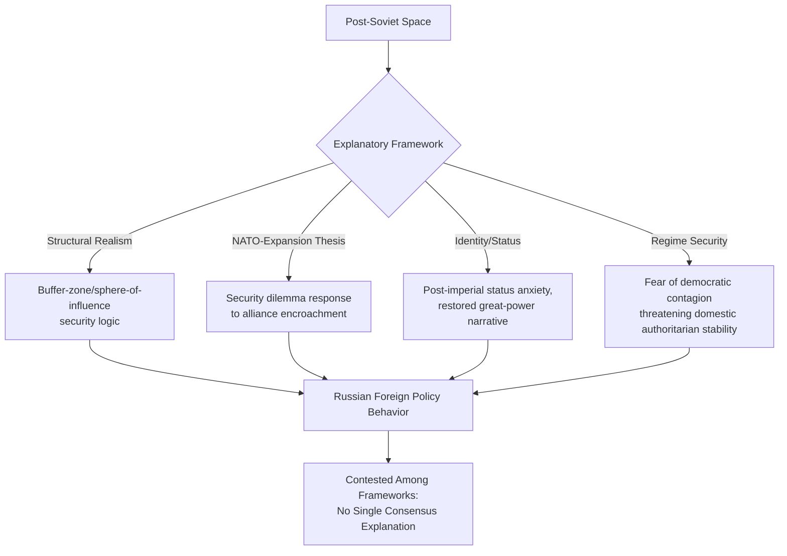

## Russia and Post-Soviet Geopolitical Dynamics

### Overview

Russia and post-Soviet geopolitical dynamics encompass the security, institutional, and identity-driven processes that have shaped the space of the former Soviet Union since 1991 — Russia's efforts to maintain or reassert influence over this space, the security dilemmas generated by NATO and EU enlargement, and the resulting cascade of conflicts (Chechnya, Georgia, Ukraine, and various "frozen conflicts"). This domain is essential for geopolitical risk analysis given the ongoing, large-scale war in Ukraine, energy-security dependencies across Europe, and the broader implications for European security architecture and great-power competition.

---

### Theoretical Framing: Explaining Post-Soviet Russian Behavior

#### Structural Realist Explanations

- **Sphere-of-influence/buffer-zone logic** (applying classical balance-of-power and security-dilemma theory — see Theories of Interstate War and Security Dilemmas and Arms Race Dynamics): A structural-realist reading holds that Russia, as a great power bordering a historically contested buffer region with no natural geographic defensive barriers on its western frontier, has a structurally-rooted interest in preventing rival-alliance military infrastructure from approaching its borders, independent of any specific ideological or regime-type character of Moscow's government.
- **John Mearsheimer's NATO-expansion causation argument:** Mearsheimer has prominently argued (in various publications, including work following the 2014 Crimea annexation and again after the 2022 full-scale invasion) that continued NATO enlargement toward Russia's borders, and specifically the prospect of Ukrainian NATO membership, constitutes the primary structural cause of the resulting conflict, framing Russian behavior as a security-dilemma-driven response to Western encroachment rather than as unprovoked revisionist aggression. This argument remains highly contested — critics argue it downplays Ukrainian agency and self-determination, understates the significance of Russian revisionist/imperial ambition independent of NATO's specific posture, and that alliance enlargement decisions were driven substantially by the stated preferences of Central and Eastern European states themselves rather than purely by Western structural design. [Unverified: the relative causal weight of NATO-enlargement dynamics versus Russian revisionist intent independent of Western alliance behavior remains one of the most contested empirical and normative debates in contemporary security studies, without scholarly consensus]

#### Domestic/Regime-Type and Identity-Based Explanations

- **Diversionary war theory application** (see Theories of Interstate War): Some analysts have applied diversionary-war logic to specific episodes (e.g., debates over whether domestic legitimacy considerations factored into the timing of the 2014 Crimea annexation amid contemporaneous domestic political conditions), though as with other diversionary-war case applications, single-case attribution is contested and difficult to establish against competing explanations. [Speculation: any specific diversionary-motive attribution for a particular Russian action remains a contested interpretive claim among specialists, not an established causal finding]
- **Great-power identity and post-imperial status anxiety** (associated with constructivist scholarship, e.g., work by Ted Hopf, and analyses emphasizing Russian elite discourse around the 1991 Soviet collapse as a genuine geopolitical trauma): Argues that Russian foreign policy behavior is shaped substantially by elite and popular narratives of restored great-power status and resistance to a perceived post-Cold War settlement viewed in Moscow as humiliating or unjust, a normative/identity-based explanation complementing rather than replacing structural-security accounts.
- **Regime-security and authoritarian-stability motivations:** A distinct literature (e.g., work on "linkage and leverage" by Steven Levitsky and Lucan Way, and broader authoritarian-regime-security analysis) argues that Russian opposition to democratic political change in neighboring post-Soviet states (Georgia's 2003 Rose Revolution, Ukraine's 2004 Orange Revolution and 2014 Euromaidan) reflects genuine regime-security concern that democratic contagion in culturally and politically proximate neighboring states could threaten domestic authoritarian stability in Russia itself, independent of narrower NATO-related security calculation.

---

### Historical Trajectory of Post-Soviet Conflict

#### 1990s: Fragmentation and Early Conflicts

- **Soviet dissolution (1991):** The USSR's collapse created 15 independent states, with Russia inheriting the Soviet UN Security Council seat and the bulk of the nuclear arsenal (with Ukraine, Belarus, and Kazakhstan transferring their inherited Soviet nuclear weapons to Russia under the Budapest Memorandum framework, 1994 — see Nuclear Proliferation and Deterrence Theory), fundamentally reshaping the systemic polarity structure discussed in interstate-war theory.
- **First and Second Chechen Wars (1994–1996, 1999–2009):** Russia's suppression of Chechen separatism, involving extensive documented human-rights concerns and substantial civilian and combatant casualties, is frequently analyzed through civil-war/insurgency frameworks (see Civil War and Insurgency Dynamics) as an internal counterinsurgency campaign with significant implications for Vladimir Putin's political rise and consolidation.
- **"Frozen conflicts" emergence:** Several unresolved separatist conflicts emerged in the immediate post-Soviet period with substantial Russian involvement or sponsorship — Transnistria (Moldova), Abkhazia and South Ossetia (Georgia), and Nagorno-Karabakh (Armenia-Azerbaijan, though the latter's trajectory has diverged substantially following Azerbaijan's 2020 and 2023 military campaigns) — these conflicts are frequently analyzed through the proxy-warfare and third-party-intervention frameworks (see Proxy Warfare and Third-Party Intervention) given documented patterns of Russian material and political support to separatist entities.

#### 2000s–2014: Color Revolutions and Escalating Confrontation

- **Color revolutions and Russian reaction:** Georgia's 2003 Rose Revolution and Ukraine's 2004 Orange Revolution, both involving domestic democratic mobilization against perceived electoral fraud with pro-Western orientation, generated substantial Russian concern and are frequently cited as inflection points in deteriorating Russia-West relations, consistent with the regime-security explanatory framework above.
- **2008 Russo-Georgian War:** A short but consequential conflict following escalating tension over Georgia's NATO-aspirant orientation and the status of South Ossetia and Abkhazia, resulting in de facto Russian-recognized independence for both separatist territories and widely analyzed as an early demonstration of Russian willingness to use direct military force to prevent further NATO enlargement into the post-Soviet space, alongside documented cyber-operations components (see Cyber Conflict and Digital-Domain Warfare) accompanying the kinetic conflict.
- **2014 Euromaidan, Crimea annexation, and Donbas conflict onset:** Ukraine's 2014 Euromaidan protests and the ousting of President Yanukovych were followed by Russia's annexation of Crimea (via a contested referendum widely regarded as illegitimate under international law by Western governments and most international bodies) and the onset of a Russian-backed separatist conflict in the Donetsk and Luhansk regions of eastern Ukraine — this conflict is extensively documented as internationalized/proxy-supported (per UCDP coding conventions) given substantial evidence of direct Russian military involvement alongside nominally separatist forces, consistent with the deniability-spectrum concept discussed in proxy-warfare theory.
- **Minsk Agreements (2014, 2015):** Negotiated ceasefire and political-settlement frameworks for the Donbas conflict that were never fully implemented, illustrating the credible-commitment problems discussed in civil-war bargaining theory (see Civil War and Insurgency Dynamics) — neither side trusted the other to implement the agreed political and security provisions, and low-intensity conflict continued through the following years.

#### 2022–Present: Full-Scale Invasion

- **February 2022 full-scale invasion:** Russia's large-scale invasion of Ukraine, launched 24 February 2022, represents a fundamental escalation from the preceding proxy/hybrid-conflict pattern to direct, large-scale conventional interstate war — the largest European interstate conflict since World War II by most conventional measures, and a direct test case for the interstate-war causation theories discussed at the start of this curriculum (structural NATO-related security-dilemma readings, identity/status-driven readings, and contested rational-actor bargaining-failure readings all remain actively applied to explain this specific decision).
- **Ongoing conflict status:** As of September 2026, the war remains active and unresolved after more than four and a half years, with recent reporting documenting a Ukrainian counteroffensive that began in February 2026 in eastern and southern Ukraine, alongside continued Russian offensive operations. Data tracking indicates Russian forces have continued to make incremental net territorial gains in Ukraine through successive four-week periods into September 2026, though the pace of these gains has varied significantly month to month. The conflict continues to feature deep strikes on both sides, including Ukrainian drone attacks on Russian port and rail infrastructure and Russian strikes on Kyiv and other Ukrainian population centers. Given the fluid and rapidly evolving nature of frontline positions, casualty estimates, and diplomatic developments, analysts should treat any specific territorial or casualty figures as provisional and verify against current reporting rather than relying on any single snapshot. [Unverified: precise current frontline geography, casualty totals, and the status of any diplomatic negotiation track change frequently and require verification against current authoritative reporting for any time-sensitive risk application] [2026 Ukrainian counteroffensive +3](https://en.wikipedia.org/wiki/2026_Ukrainian_counteroffensive)
- **Western sanctions and support architecture:** The conflict has generated the most extensive Western sanctions regime imposed on a major economy in the post-Cold War era, alongside substantial and sustained Western military, financial, and humanitarian assistance to Ukraine — both dimensions represent significant and evolving variables for sovereign-risk, trade-finance, and compliance risk analysis given their scale and the pace of policy adjustment.
- **North Korean and Belarusian involvement:** Documented North Korean provision of troops, munitions, and materiel support to Russia, and Belarus's role as a staging territory and basing location for Russian operations, illustrate the proxy-warfare and alliance-dynamics concepts discussed elsewhere in this curriculum, extending the conflict's internationalization dimension beyond a purely bilateral Russia-Ukraine frame.

---

### NATO and EU Enlargement Dynamics

- **NATO's post-Cold War enlargement waves:** Successive NATO enlargement rounds (1999, 2004, 2009, and subsequent accessions) progressively extended alliance membership into Central and Eastern Europe and, most recently, to previously non-aligned Nordic states (Finland's 2023 accession, Sweden's 2024 accession, both direct responses to the 2022 invasion) — this enlargement trajectory is central to the contested NATO-expansion causal debate discussed above.
- **Bucharest Summit 2008 and the Georgia/Ukraine membership question:** NATO's 2008 Bucharest declaration affirming that Georgia and Ukraine "will become" NATO members (without a concrete accession timeline) is frequently cited by both NATO-expansion-thesis proponents and critics as a consequential ambiguous signal — critics of the NATO-expansion thesis note the declaration explicitly avoided the concrete Membership Action Plan status that might have constituted a more binding commitment, while proponents argue the declaration's aspirational language was nonetheless sufficient to trigger Russian security concern.
- **EU Eastern Partnership and Association Agreement dynamics:** The EU's Eastern Partnership initiative and Association Agreement offers to Georgia, Moldova, and Ukraine (the latter's 2013 rejection under Russian pressure being a direct precipitating factor in the Euromaidan protests) represent a parallel institutional-integration dimension distinct from, but closely linked to, the NATO-membership question, with Moldova and Ukraine both subsequently granted EU candidate status following the 2022 invasion.

---

### Energy Security and Economic Dimensions

- **European gas-dependency legacy:** Pre-2022 Western European (particularly German) dependency on Russian pipeline natural gas (via infrastructure including the Nord Stream pipelines) constituted a major structural vulnerability extensively analyzed through economic-interdependence and energy-security-risk frameworks; this dependency has been substantially, though not completely, restructured following the 2022 invasion through diversification toward LNG imports and alternative suppliers, with the Nord Stream pipelines themselves suffering significant, still-disputed-attribution sabotage damage in September 2022.
- **Sanctions architecture and circumvention:** The extensive Western sanctions regime targeting Russian financial institutions, energy exports (including price-cap mechanisms on Russian oil), and technology access has generated a substantial secondary literature on sanctions-evasion networks (including "shadow fleet" tanker operations) and third-country circumvention channels, relevant to compliance and trade-finance risk assessment.
- **Russian pivot toward China and non-Western markets:** Substantially increased Russian energy-export reorientation toward China and India, alongside deepening bilateral economic and strategic coordination with China, represents a significant restructuring of Russia's international economic position with implications for the broader great-power-competition dynamics discussed in the US-China rivalry entry in this curriculum — though the depth of genuine strategic alignment versus transactional convenience in the Russia-China relationship remains a subject of ongoing analytical debate. [Inference: assessments of the Russia-China relationship's depth and durability vary among specialists and are not resolved by consensus, particularly given the historically uneven and occasionally competitive character of the bilateral relationship]

---

### Comparative Table: Explanatory Frameworks for Russian Post-Soviet Behavior

| Framework | Core Claim | Key Proponents | Primary Critique |
| --- | --- | --- | --- |
| Structural Realism/NATO-Expansion Thesis | Security-dilemma response to alliance encroachment | Mearsheimer | Downplays Ukrainian/regional agency; understates independent revisionist intent |
| Great-Power Identity/Status | Restored-status narrative drives assertive behavior | Constructivist scholars (Hopf and others) | Difficult to disentangle from material-security motivations |
| Regime-Security/Authoritarian Stability | Fear of democratic contagion in near-abroad | Levitsky, Way (linkage-leverage framework) | May understate territorial/strategic motivations specific to Ukraine |
| Revisionist/Imperial Restoration | Genuine irredentist ambition independent of Western behavior | Various critics of the NATO-expansion thesis | Contested by structural realists as insufficiently attentive to systemic pressure |

---

### Application to Geopolitical Risk Analysis

**Example**

Assessing sovereign, sanctions, and market risk tied to the ongoing Russia-Ukraine conflict and broader post-Soviet dynamics typically requires:

1. **Frontline and escalation-trajectory monitoring:** Given the conflict's continued active status as of September 2026, current territorial-control data (from sources such as ISW or DeepState-derived OSINT tracking) and diplomatic-track developments should be checked regularly rather than assumed static.
2. **Sanctions and compliance-exposure mapping:** Tracking the evolving scope of Western sanctions, price-cap mechanisms, and shadow-fleet/circumvention-network designations for trade-finance and AML compliance purposes.
3. **Energy-security dependency reassessment:** Evaluating the pace and durability of European energy diversification away from Russian supply, and any residual or re-emerging dependency risk.
4. **Frozen-conflict monitoring:** Tracking the status of other post-Soviet frozen or active conflicts (Transnistria, South Ossetia/Abkhazia, Nagorno-Karabakh's post-2023 trajectory) as potential secondary escalation risks within the broader post-Soviet security architecture.
5. **NATO/EU eastern-flank posture tracking:** Monitoring alliance force posture, membership-aspirant country developments (Georgia, Moldova), and Baltic-state security assurances as indicators of the broader regional security-architecture trajectory.

---

### Diagrammatic Summary: Post-Soviet Conflict Escalation Trajectory

<svg xmlns="http://www.w3.org/2000/svg" viewBox="0 0 900 480" font-family="Arial, sans-serif">
<text x="450" y="30" font-size="20" font-weight="bold" text-anchor="middle" fill="#1a1a2e">Post-Soviet Conflict Escalation Trajectory (svg_diagram)</text>
<rect x="20" y="80" width="180" height="80" rx="8" fill="#2b3a67" stroke="#1a1a2e" stroke-width="2" />
<text x="110" y="105" font-size="11" font-weight="bold" text-anchor="middle" fill="#fff">1991 Dissolution</text>
<text x="110" y="125" font-size="9" text-anchor="middle" fill="#ddd">Fragmentation,</text>
<text x="110" y="138" font-size="9" text-anchor="middle" fill="#ddd">frozen conflicts emerge</text>
<rect x="220" y="80" width="180" height="80" rx="8" fill="#41507a" stroke="#1a1a2e" stroke-width="2" />
<text x="310" y="105" font-size="11" font-weight="bold" text-anchor="middle" fill="#fff">2003–2004 Color Revolutions</text>
<text x="310" y="125" font-size="9" text-anchor="middle" fill="#ddd">Regime-security concern</text>
<text x="310" y="138" font-size="9" text-anchor="middle" fill="#ddd">intensifies</text>
<rect x="420" y="80" width="180" height="80" rx="8" fill="#5a6a9a" stroke="#1a1a2e" stroke-width="2" />
<text x="510" y="105" font-size="11" font-weight="bold" text-anchor="middle" fill="#fff">2008 Russo-Georgian War</text>
<text x="510" y="125" font-size="9" text-anchor="middle" fill="#ddd">First direct military</text>
<text x="510" y="138" font-size="9" text-anchor="middle" fill="#ddd">demonstration</text>
<rect x="620" y="80" width="240" height="80" rx="8" fill="#8c1c1c" stroke="#1a1a2e" stroke-width="2" />
<text x="740" y="105" font-size="11" font-weight="bold" text-anchor="middle" fill="#fff">2014 Crimea/Donbas</text>
<text x="740" y="125" font-size="9" text-anchor="middle" fill="#f0d0d0">Proxy/hybrid conflict,</text>
<text x="740" y="138" font-size="9" text-anchor="middle" fill="#f0d0d0">deniability-spectrum sponsorship</text>
<line x1="200" y1="120" x2="220" y2="120" stroke="#333" stroke-width="2" marker-end="url(#arrow8)" />
<line x1="400" y1="120" x2="420" y2="120" stroke="#333" stroke-width="2" marker-end="url(#arrow8)" />
<line x1="600" y1="120" x2="620" y2="120" stroke="#333" stroke-width="2" marker-end="url(#arrow8)" />
<line x1="740" y1="160" x2="450" y2="230" stroke="#333" stroke-width="2" marker-end="url(#arrow8)" />
<rect x="270" y="240" width="360" height="100" rx="8" fill="#1a1a2e" stroke="#000" stroke-width="2" />
<text x="450" y="268" font-size="14" font-weight="bold" text-anchor="middle" fill="#fff">2022 Full-Scale Invasion</text>
<text x="450" y="290" font-size="10" text-anchor="middle" fill="#ccc">Largest European interstate war since WWII</text>
<text x="450" y="306" font-size="10" text-anchor="middle" fill="#ccc">Ongoing as of Sept. 2026 (4.5+ years)</text>
<text x="450" y="322" font-size="10" text-anchor="middle" fill="#ccc">Internationalized: NK troops, Belarus basing</text>
<line x1="450" y1="340" x2="450" y2="400" stroke="#333" stroke-width="2" marker-end="url(#arrow8)" />
<rect x="300" y="410" width="300" height="60" rx="8" fill="#8c1c1c" stroke="#1a1a2e" stroke-width="2" />
<text x="450" y="435" font-size="12" font-weight="bold" text-anchor="middle" fill="#fff">Ongoing Consequences</text>
<text x="450" y="453" font-size="9" text-anchor="middle" fill="#f0d0d0">Sanctions, energy realignment, NATO enlargement</text>
</svg>

**Conclusion**

Russia and post-Soviet geopolitical dynamics illustrate the practical application of structural-realist, identity/status-based, and regime-security explanatory frameworks to a three-decade trajectory of escalating confrontation, culminating in the largest European interstate war since World War II. The contested NATO-expansion causal debate remains genuinely unresolved among scholars and carries significant normative as well as empirical stakes, and the ongoing, active nature of the Russia-Ukraine conflict as of September 2026 means that any risk assessment in this domain must be grounded in continuously updated current reporting rather than static historical background — frontline positions, sanctions architecture, and diplomatic status are all subject to material change on short timescales. [Inference: this synthesis reflects an integration of multiple distinct and actively contested scholarly and policy positions, and should not be read as reflecting a single resolved academic consensus on causation or likely resolution]

**Related Topics**

- Mearsheimer's NATO-expansion thesis and its critics
- 2008 Russo-Georgian War as precedent for direct military demonstration
- Minsk Agreements and credible-commitment problems in conflict settlement
- Frozen conflicts: Transnistria, South Ossetia/Abkhazia, Nagorno-Karabakh
- Western sanctions architecture and shadow-fleet circumvention networks
- European energy-security diversification post-2022
- NATO enlargement waves and the Bucharest Summit 2008 declaration
- Russia-China strategic alignment and its depth/durability debate
- North Korean and Belarusian involvement in the Russia-Ukraine war
- Chechen wars as counterinsurgency case study
- EU Eastern Partnership and candidate-status dynamics (Ukraine, Moldova, Georgia)
- Color revolutions and regime-security-driven foreign policy responses