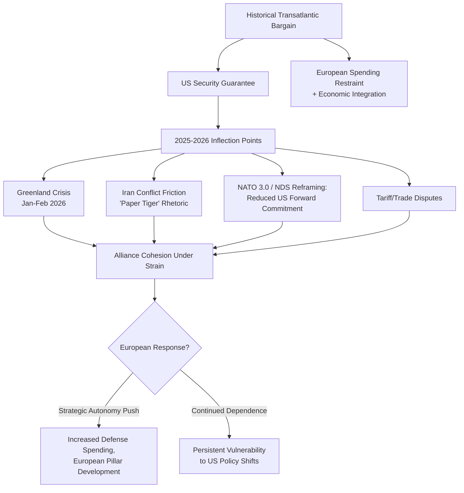

## The Evolving Transatlantic Relationship

### Overview

The transatlantic relationship — the security, economic, and institutional partnership between the United States and Europe, primarily institutionalized through NATO and complemented by EU-US economic ties — has undergone the most significant strain and restructuring since the end of the Cold War during 2025–2026. What was long treated as the most stable and predictable element of the post-1945 international order has become a subject of genuine uncertainty regarding US commitment, European strategic autonomy, and the underlying bargain that structured seven decades of alliance cohesion. This domain is critical for geopolitical risk analysis given direct implications for European defense-sector investment, sovereign-risk assessment across NATO's eastern flank, and the broader systemic-polarity questions discussed in interstate-war theory.

**Key Points**

- This is an unusually fast-moving topic even by the standards of this curriculum; the specific developments and characterizations below reflect reporting through mid-2026 and should be verified against current sources for any time-sensitive application. [Unverified: given the pace of change documented in this domain through 2026, specific policy positions and alliance-cohesion assessments are likely to continue evolving and require ongoing verification]

---

### The Historical Bargain and Its Erosion

#### The Cold War and Post-Cold War Transatlantic Bargain

- **Original bargain logic:** For roughly three decades after 1945, and continuing in modified form through the post-Cold War period, the transatlantic relationship rested on an implicit bargain in which the United States provided the primary security guarantee for Western (and later, post-1991, an expanded) Europe, while European states concentrated defense spending restraint alongside economic and political integration (the European Communities/European Union project) — a bargain widely characterized in recent policy commentary as now fundamentally in question.
- **Extended deterrence as the bargain's core mechanism:** The credibility of the US nuclear and conventional security guarantee to European allies (see Nuclear Proliferation and Deterrence Theory for the general extended-deterrence credibility problem) has always carried an inherent credibility gap, but this gap has become a subject of acute, explicit policy debate rather than a background theoretical concern during 2025–2026.
- **Post-Cold War burden-sharing debate:** Persistent, longstanding US criticism of insufficient European defense spending (predating the current period by decades) evolved during 2025–2026 into a fundamentally different and more severe framing — commentary and policy documents increasingly argue the underlying problem "runs deeper than European states not spending enough on defense," with proposed solutions extending well beyond traditional burden-sharing adjustments.

#### 2025–2026 Inflection Points

- **"NATO 3.0" and the National Defense Strategy reframing:** US policy documents and administration rhetoric during this period have sought to revise two long-standing foundational principles of US European policy: first, the premise that the United States possesses vital interests in Europe (with the current administration arguing these interests are diminishing); and second, the premise that the US should maintain a robust forward conventional defense posture in Europe (with policy seeking to minimize or eliminate this forward-defense commitment). [Unverified: the precise final scope and implementation of "NATO 3.0" and associated force-posture changes were still being negotiated and clarified through mid-2026 reporting, and current status should be verified]
- **The Greenland crisis (January–February 2026):** US threats regarding the acquisition of Greenland — an autonomous territory of NATO ally Denmark — including reported tariff threats against Denmark, Norway, France, Germany, the UK, the Netherlands, and Finland for opposing these efforts, constituted a genuine and widely documented crisis within the Alliance, described by multiple analysts as having severely shocked European governments regarding the scope of potential US-alliance rupture.
- **Iran conflict-related transatlantic friction ("Operation Epic Fury"):** Documented tension arose from US military action against Iran during 2026, with the US president reportedly criticizing European allies sharply for perceived equivocation in supporting the operation, at one point characterizing NATO as a "paper tiger." Following Iran's subsequent closure of the Strait of Hormuz, reporting indicates the US president threatened to withdraw from NATO over European allies' reluctance to deploy naval vessels to forcibly reopen the strait. [Unverified: this represents a rapidly evolving and high-stakes situation; current status of both the underlying Iran conflict and any NATO-withdrawal threat should be verified against current reporting]
- **Tariff and trade friction:** Reported US tariff threats tied to the Greenland dispute, alongside broader US-EU trade negotiation dynamics (including a reported January 2026 EU approval of a free-trade agreement framework after an extended multi-decade negotiation process, details of which require current verification), illustrate the intertwining of economic and security friction points in the contemporary relationship. [Unverified: specific tariff rates, trade-agreement terms, and their implementation status require current verification given reported ongoing volatility]

---

### European Response: Strategic Autonomy and the "European Pillar"

- **Renewed European defense-spending commitments:** Reporting indicates substantially increased European defense-spending trajectories in response to the accumulated pressure of the above developments, with German Chancellor Friedrich Merz reportedly defending Germany's defense-spending record amid criticism, though specific spending targets and timelines require verification against current NATO and national-government reporting. [Unverified: precise current European defense-spending figures and target trajectories require verification given the rapid pace of policy adjustment]
- **"European Pillar of NATO" concept:** A substantial policy and analytical literature (e.g., work from the Istituto Affari Internazionali and other European think tanks) has developed around the concept of a more autonomous European defense pillar within or alongside NATO, designed to reduce dependency on US forward-deployed forces and capability while maintaining interoperability — directly paralleling the "defensive defense" and force-restructuring concepts discussed in security-dilemma theory, but applied here to intra-alliance restructuring rather than adversary relations.
- **Divergent European leader positioning:** Reporting from mid-2026 indicates notable shifts in individual European leaders' positioning relative to the US administration — leaders previously characterized as close to the current US administration (including Italian Prime Minister Giorgia Meloni) were reported to have "significantly distanced" themselves, while UK Prime Minister Keir Starmer was reported focusing on coordination with other European leaders to provide a "counterbalance" to US positions — illustrating the fluid and leader-specific character of the current alignment landscape. [Unverified: specific leader-level political positioning is highly fluid and should be verified against current reporting rather than treated as a fixed alignment]
- **"Middle powers must act together" framing:** Canadian Prime Minister Mark Carney's reported January 2026 characterization of "a rupture in the world order" and call for middle powers to "act together" reflects a broader emergent discourse among traditionally US-aligned states about hedging against potential US strategic disengagement, extending the transatlantic question to include Canada and other non-European US allies.
- **Structural tension in the "buy American" expectation:** Analysts note a documented structural tension: the US has encouraged European allies to increase defense spending while reportedly expecting this spending to flow substantially toward American defense-industry procurement, creating a potential friction point if European defense-industrial-base development (a core strategic-autonomy objective) reduces European orders for US equipment over time.

---

### Countervailing Evidence: Continuity Amid Disruption

- **Contested characterization of US disengagement:** Some analysis pushes back against a straightforward "US abandonment" narrative, noting that Trump's second term has in some respects "defied expectations of isolationism," with continued (and in some cases expanded) US military intervention activity globally (including in Venezuela and Iran per 2026 reporting) — suggesting the relevant dynamic may be better characterized as a renegotiation of the transatlantic bargain's terms rather than a simple US withdrawal from global engagement.
- **US domestic public-opinion data:** Reported polling (a June 2026 Chicago Council on Global Affairs survey) found that a substantial majority (79 percent) of self-described MAGA-aligned Republicans agreed the US should maintain a stronger role in world affairs, including support for Ukraine — cited by some analysts as evidence that the administration's most disengagement-oriented rhetoric may not fully reflect even its own political base's underlying preferences, complicating simple narratives of a durable, ideologically-driven US retrenchment. [Unverified: single-poll findings on a politically salient and fast-moving topic should be weighted cautiously and checked against subsequent polling for consistency]
- **Legislative constraints on force reduction:** Reported provisions in the 2026 National Defense Authorization Act (NDAA) barring reductions in US troop levels in Europe below a specified floor (reported at 76,000) without formal Secretary of Defense certification, allied consultation, and further specified procedural steps illustrate continued institutional/legislative constraint on executive-branch discretion to unilaterally restructure the US European force posture, suggesting some structural continuity checks remain in place even amid executive-level disengagement rhetoric. [Unverified: specific NDAA provisions and troop-floor figures require verification against the enacted legislative text and any subsequent amendment]

---

### The 2026 NATO Summit (Ankara)

- **Venue significance:** The 2026 NATO summit's location in Ankara, Turkey — with commentary noting this as notable given Turkey's contested democratic credentials but current strategic value as a reportedly reliable US partner within the alliance — is itself read by some analysts as symbolically significant regarding shifting alliance internal dynamics.
- **Summit friction points:** Reported disagreements over the Iran conflict and defense-procurement policy (the "buy American" tension noted above) threatened to overshadow the summit's ostensible focus on the Russia threat, according to contemporary analysis, suggesting intra-alliance friction has in some respects begun to compete with external-threat response as the alliance's central organizing challenge. [Unverified: the summit's substantive outcomes and any formal declarations require verification against official NATO summit documentation]

---

### Comparative Table: Competing Characterizations of the Transatlantic Trajectory

| Characterization | Core Claim | Supporting Evidence Cited | Countervailing Consideration |
| --- | --- | --- | --- |
| Fundamental Rupture | US is genuinely disengaging from European security commitment | Greenland crisis, NATO 3.0/NDS reframing, "paper tiger" rhetoric | Continued/expanded US global military activity elsewhere |
| Bargain Renegotiation | Relationship persists but on substantially revised terms | European defense-spending increases, European Pillar concept development | Terms of renegotiation remain unsettled and contested |
| Rhetoric-Reality Gap | Executive rhetoric outpaces actual policy/legislative change | NDAA troop-floor legislative constraints, base-level polling support for engagement | Rhetoric itself carries real alliance-cohesion and market-confidence effects independent of formal policy |
| Structural/Long-Term Realignment | Shift reflects deeper structural change (China focus, fiscal constraint) beyond current administration | "NATO 3.0" framing citing Sino-Russian axis prioritization | Difficult to distinguish durable structural shift from administration-specific policy choice at this stage |

---

### Application to Geopolitical Risk Analysis

**Example**

Assessing risk exposure tied to transatlantic-relationship uncertainty for a European sovereign-risk, defense-sector investment, or currency/market-risk product would typically require:

1. **Alliance-cohesion indicator tracking:** Monitoring NATO summit outcomes, formal declarations, and troop-posture/legislative developments (e.g., NDAA provisions) as concrete indicators distinguishable from rhetorical statements.
2. **European defense-industrial-base investment mapping:** Tracking European defense-spending trajectories and the degree to which increased spending flows toward domestic/European versus US defense-industrial procurement, as an indicator of genuine strategic-autonomy progress versus continued dependency.
3. **Extended-deterrence credibility reassessment:** Applying the extended-deterrence credibility framework (see Nuclear Proliferation and Deterrence Theory) with explicit attention to the qualitatively new level of public, explicit questioning of US commitment relative to the implicit credibility gap that has always existed theoretically.
4. **Leader-level and election-cycle political-risk tracking:** Given the documented fluidity of individual European leaders' positioning, tracking upcoming European and US electoral calendars as potential inflection points for further alignment shifts.
5. **Scenario-differentiated planning:** Given the genuinely contested characterizations above (rupture vs. renegotiation vs. rhetoric-reality gap vs. structural realignment), maintaining differentiated risk scenarios rather than committing to a single narrative, given the substantial current uncertainty documented across multiple credible analytical sources.

---

### Diagrammatic Summary: Transatlantic Relationship Stress Points

<svg xmlns="http://www.w3.org/2000/svg" viewBox="0 0 900 500" font-family="Arial, sans-serif">
<text x="450" y="30" font-size="20" font-weight="bold" text-anchor="middle" fill="#1a1a2e">Transatlantic Relationship Stress Points (svg_diagram)</text>
<rect x="330" y="60" width="240" height="80" rx="8" fill="#1a1a2e" stroke="#000" stroke-width="2" />
<text x="450" y="88" font-size="13" font-weight="bold" text-anchor="middle" fill="#fff">Historical Bargain</text>
<text x="450" y="108" font-size="10" text-anchor="middle" fill="#ccc">US security guarantee ↔</text>
<text x="450" y="122" font-size="10" text-anchor="middle" fill="#ccc">European integration focus</text>
<line x1="380" y1="140" x2="180" y2="200" stroke="#333" stroke-width="1.5" marker-end="url(#arrow9)" />
<line x1="450" y1="140" x2="450" y2="200" stroke="#333" stroke-width="1.5" marker-end="url(#arrow9)" />
<line x1="520" y1="140" x2="720" y2="200" stroke="#333" stroke-width="1.5" marker-end="url(#arrow9)" />
<rect x="40" y="210" width="240" height="80" rx="8" fill="#8c1c1c" stroke="#1a1a2e" stroke-width="2" />
<text x="160" y="235" font-size="12" font-weight="bold" text-anchor="middle" fill="#fff">Greenland Crisis</text>
<text x="160" y="255" font-size="9" text-anchor="middle" fill="#f0d0d0">Jan-Feb 2026</text>
<text x="160" y="270" font-size="9" text-anchor="middle" fill="#f0d0d0">Tariff threats vs. allies</text>
<rect x="330" y="210" width="240" height="80" rx="8" fill="#8c1c1c" stroke="#1a1a2e" stroke-width="2" />
<text x="450" y="235" font-size="12" font-weight="bold" text-anchor="middle" fill="#fff">NATO 3.0 / NDS</text>
<text x="450" y="255" font-size="9" text-anchor="middle" fill="#f0d0d0">Reduced forward-defense</text>
<text x="450" y="270" font-size="9" text-anchor="middle" fill="#f0d0d0">commitment framing</text>
<rect x="620" y="210" width="240" height="80" rx="8" fill="#8c1c1c" stroke="#1a1a2e" stroke-width="2" />
<text x="740" y="235" font-size="12" font-weight="bold" text-anchor="middle" fill="#fff">Iran Conflict Friction</text>
<text x="740" y="255" font-size="9" text-anchor="middle" fill="#f0d0d0">"Paper tiger" rhetoric,</text>
<text x="740" y="270" font-size="9" text-anchor="middle" fill="#f0d0d0">NATO withdrawal threat</text>
<line x1="160" y1="290" x2="350" y2="360" stroke="#333" stroke-width="1.5" marker-end="url(#arrow9)" />
<line x1="450" y1="290" x2="450" y2="360" stroke="#333" stroke-width="1.5" marker-end="url(#arrow9)" />
<line x1="740" y1="290" x2="550" y2="360" stroke="#333" stroke-width="1.5" marker-end="url(#arrow9)" />
<rect x="250" y="370" width="400" height="90" rx="8" fill="#41507a" stroke="#1a1a2e" stroke-width="2" />
<text x="450" y="398" font-size="13" font-weight="bold" text-anchor="middle" fill="#fff">European Response</text>
<text x="450" y="420" font-size="10" text-anchor="middle" fill="#ddd">Increased defense spending, "European Pillar"</text>
<text x="450" y="436" font-size="10" text-anchor="middle" fill="#ddd">concept, leader-level realignment, hedging</text>
</svg>

**Conclusion**

The transatlantic relationship entered a period of unusually acute and explicit strain during 2025–2026, encompassing the Greenland crisis, "NATO 3.0" doctrinal reframing, Iran-conflict-related friction including a reported NATO-withdrawal threat, and pointed rhetorical criticism of individual allies — developments that go substantially beyond the decades-long burden-sharing debate that previously characterized transatlantic friction. Whether this constitutes a fundamental rupture, a renegotiation of alliance terms, a rhetoric-reality gap bounded by legislative and institutional constraint, or a durable structural realignment driven by US prioritization of China-focused competition remains genuinely and actively contested among credible analysts, with countervailing evidence (continued US global military engagement, base-level polling support for international engagement, legislative troop-floor protections) complicating any single confident narrative. Given the extraordinary pace of change documented in this domain through mid-2026, this represents one of the clearest cases in this curriculum where specific factual claims require continuous verification against current reporting rather than reliance on any fixed characterization. [Inference: this synthesis reflects a necessarily provisional integration of rapidly evolving, sometimes conflicting reporting and analysis current only through mid-2026 sources, and should be treated as a snapshot requiring active updating rather than a stable reference characterization]

**Related Topics**

- "NATO 3.0" and the National Defense Strategy reframing of US European commitment
- The Greenland crisis and its implications for alliance cohesion
- European strategic autonomy and the "European Pillar of NATO" concept
- Extended deterrence credibility reassessment amid explicit US commitment questioning
- US-EU trade and tariff friction dynamics
- 2026 NATO Ankara summit outcomes and intra-alliance friction points
- Comparative alignment shifts among European leaders (Meloni, Merz, Starmer)
- Legislative constraints on US force posture (2026 NDAA troop-floor provisions)
- Sino-Russian axis framing and its role in US transatlantic policy rationale
- Canada and "middle powers" hedging discourse (Carney's "rupture" framing)
- US domestic public-opinion dynamics on international engagement (MAGA-aligned polling)
- Defense-industrial-base competition: European autonomy vs. US procurement expectations